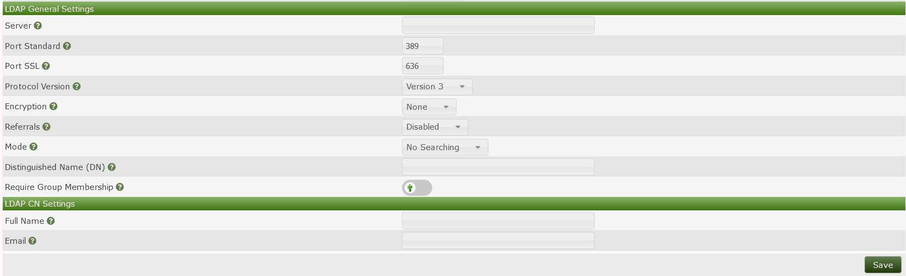

# LDAP Authentication

Cacti supports using LDAP authentication to access the Cacti GUI.
There are several different ways to use LDAP, which will be described in the
following sections.

## Be Aware

When changing LDAP settings in Cacti, such as LDAP General Settings, LDAP Group
Settings, and LDAP Specific Search Settings, you may notice that changes
do not take effect immediately. You may need to close and reopen your
web browser for some changes to take effect.

!! It would be good if someone could elaborate here on why this happens. !!

## Defining some terms

Before proceeding, please ensure you are familiar with the following terms:

1. _LDAP_ - A communication language, or protocol.  It is a defined structure
 of how to ask questions of, and receive responses from, a directory.
 It also defines what questions there exist to be asked, and what responses
 there exist to be returned.  LDAP is not a directory; it is a way to query
 a directory.

2. _Directory_ - A database of objects, accompanied with other attributes.
 Commonly, these objects are user identities, accompanied with passwords.
 Sometimes, the objects are groups, accompanied by a list of members.
 Usually the objects are stored in some type of hierarchical structure
 for organizational and management purposes.

3. _DN_ - Short for _distinguished name_, a string that represents a
 unique object in the directory.  There can not be two DNs alike
 in a directory.  In Microsoft's _Active Directory_, this is a string
 like 'CN=Joseph,OU=Accounting,OU=Users,DC=corp,DC=example,DC=com'.

4. _Search_ - A type of LDAP request, in which the client sends
 some criteria to the server in an attempt to receive back a
 list of directory objects that meet the search criteria.

5. _Bind_ - A type of LDAP request, in which the client sends the server a
 username and a password in an attempt to confirm whether the password is
 correct for that user.

6. _sAMAccountName_ - An attribute found in Microsoft's _Active Directory_
 directory, and is what we casually know as a _username_.  The _sAMAccountName_
 does not uniquely represent an object in the Active Directory,
 whereas the _DN_ does.

## Configuring LDAP

### LDAP General Settings



#### Mode

There are three basic routines that Cacti can execute when handling an
LDAP authentication.

1. _No Searching_ - In this routine, Cacti simply binds to the LDAP server
 using the credentials that were entered during login.  Cacti performs a
 transformation upon the username before binding, that which is specified
 in the _Distinguished Name (DN)_ field.  This transformation is useful,
 for example, to add a fully-qualified domain name suffix, or to add a NetBIOS
 domain name prefix.  For example:

 ```{username}@example.com```

 or

 ```domain\{username}```

2. _Anonymous Searching_ - In this routine, Cacti connects to LDAP with no
 authentication and attempts to perform a search for the _username_, in an
 attempt to retrieve the specific DN associated with the username.  Once
 the specific DN of the username is found, Cacti binds to LDAP using the DN of
 the user and the password that was entered during login.  Please note, by
 default, Microsoft's Active Directory does not permit anonymous searches, and
 will refuse the search request.

3. _Specific Searching_ - In this routine, Cacti binds to LDAP using a service
 account that was provided beforehand, then performs a search for the
 _username_, in an attempt to retrieve the specific DN associated with the
 username.  Once the specific DN of the username is found, Cacti binds to LDAP
 using the DN of the user and the password that was entered during login.

#### Encryption

1. _None_ - This is plain-text, normally on port tcp/389.  Passwords are
 transmitted over the network in clear text between Cacti and the directory.

2. _SSL_ - Commonly known as LDAPS, this is just like LDAP, but encrypted. This
 normally runs on port tcp/636. Please note, this is not enabled by default for
 Microsoft's Active Directory because it requires an encryption key and
 certificate to be installed on the AD controller(s).

3. _TLS_ - This is plain LDAP, but a START_TLS command is sent by the client to
 the server to initiate encryption.  Normally runs on port tcp/389 and can be
 entered into during a regular LDAP session.

Please note that some directories will limit the request types to which they
respond when there is no encryption on the LDAP communication.

#### Referrals

An LDAP Referral is a field returned in an LDAP response message.  The referral
provides a list of alternate sources from which directory information can be
obtained.  In the case of a replicated directory such as Microsoft's Active
Directory, the referral may contain an LDAP URL which could resolve to any
participating LDAP server, whether correctly configured or not.

### LDAP Group Settings

Cacti can enforce that a user be a member of a specific directory group to be
granted access to Cacti.  This is useful when your directory contains a mix of
users who should and should not be granted access to Cacti.  For Cacti to
require that the user be apart of a group, Cacti will send a _compare_ request
to the directory server asking the server if a specific group has any
parameters that contain a specific username.  As an example, a compare requests
asks the following type of question:

Does there exist a group named
`CN=cacti-admins,OU=Admin_Groups,OU=Groups,DC=corp,DC=company,DC=com`, attached
to which there is an attribute named `member`, where the value of the attribute
is `CN=Joseph,OU=Admins,DC=example,DC=com`?

The following three settings determine the content of the compare request.

1. _Group Distinguished Name (DN)_ - The DN of the group into which the
 directory server should search for attributes.  For example:

```
CN=cacti-admins,OU=Admin_Groups,OU=Groups,DC=corp,DC=company,DC=com
```

2. _Group Member Attribute_ - The name of the attribute into which the
 directory server should search for the user.  For example:

```bash
member
```

3. _Group Member Type_ - The format of the text string which should represent
 the user.

### Specific Search Settings

1. _Search Base_ - The portion of the directory hierarchy inside which the
 server should perform the search.  When the directory contains many objects,
 the time and resources required to search the directory are greater.  The
 _search base_ setting is useful to reduce the portion of the directory that is
 searched, thus increasing speed and reducing processor load on the directory
 server.  This setting is also useful if you want to restrict access to Cacti to
 users who exist in a particular location in the director heierarchy.

2. _Search Filter_ - The criteria for which the directory server should search.
 Any parameters that the server is capable of understanding are permitted here.
 Cacti will perform a substitution for the phrase `{username}` in the search
 filter, and will replace it with the username.  This field must be in
 acceptable LDAP syntax.  A useful example of a search filter would be:

```bash
(sAMAccountName={username})
```

But more complex filers are also permitted, such as:

```bash
(&(sAMAccountName={username})(memberOf=CN=cacti-admins,OU=Admin_Groups,OU=Groups
,DC=corp,DC=company,DC=com))
```

3. _Search Distinguished Name (DN)_ - The username of the service account with
 which Cacti will bind to the directory.

4. _Search Password_ - The password of the service account with which Cacti
 will bind to the directory.

### LDAP CN Settings

#### Mapping an LDAP user to a Cacti user

Cacti stores many personal preferences and settings into its database that make
it easier to use Cacti.  For example, the GUI Theme, the Default View Mode, and
the User Language are a few of these user settings.  These settings are not
stored in the LDAP directory, so they are not returned in the LDAP response.
Therefore, Cacti will create a local user identity for each LDAP user who logs
in.  When Cacti creates a local user, it can automatically populate the
following two parameters from the LDAP directory.  If Cacti sees a local user
already exists, it will not attempt to update the user with values from the
directory.

1. _Full Name_ - The LDAP attribute name which contains a user's full name.
 Some common examples are 'displayname' or 'cn'.

2. _Email_ - The LDAP attribute name which contains a user's email address.
 One common example is 'mail'.

## A few notes

### Certificate verification

When using LDAPS, a key and certificate must be installed on the directory
server.  When the client attaches to the server, it must make a decision to
trust or reject the certificate that the server provided.  The client will
attempt to find the issuer of the certificate in a local repository of trusted
certificate signers.  If you install onto the directory server a certificate
signed by an internal authority or a self-signed certificate, you will need to
add the certificate of the issuer to the local repository on the Cacti server.
If you do not, the client will surely reject the certificate, causing
authentication to fail.  To install a trusted certificate into the local
repository, consult the documentation for the Operating System platform upon
which you installed Cacti.

### Search Result Reference (Referrals)

In Microsoft's Active Directory, LDAP response messages may contain a referral
to other directory servers.  If you are using LDAPS and have installed a
certificate on some LDAP servers and not others, LDAP lookups will fail
intermittently because LDAPS negotiations will succeed with some directory
servers while failing with other directory servers.  If you are experiencing
intermittent LDAP failures, ensure that the Cacti server has network access to
all directory servers, and that all directory servers are properly configured.

## Common Scenarios

These following scenarios are designed to help you see the different ways to
harness the power of LDAP and build a working LDAP configuration in your
environment.

### A small office where everyone has access to Cacti

In this scenario, a small LDAP directory contains users who are all granted
access to Cacti (there are no users denied from Cacti).  Some may be
administrators, while others are read-only users.

To handle this scenario, start by creating a new local user in Cacti with
read-only permissions.  Name the user 'MyLdapTemplate'.  Next, in Cacti's
Authentication settings, set the `User Template` field to 'MyLdapTemplate'.
Set the `Mode` to 'No Searching'.  Set the `Distinguished Name (DN)` field to
'{username}@example.com', where 'example.com' is the name of your domain.  When
any user logs in to Cacti, their password will be checked against the LDAP
directory and they'll be granted access to Cacti with read-only access (from
the LDAP template user).  Once a new user logs in, Cacti will create a local
user where the user's `Realm` is 'LDAP'.  You may then optionally promote that
user to an administrator by visiting the `Users` page, locating the account for
the LDAP user, and granting additional permissions to that user.

### A large office where you only want a subset of users to access Cacti

In this scenario, a large LDAP directory contains a mix of users who should,
and should not, be granted access to Cacti.

There are two ways to handle this scenario.  You may either manually authorize
users within Cacti, or you may use a group in the directory to define the
authorized users.

To handle this scenario by manually authorizing users within Cacti, navigate to
the Authentication settings, and set the `User Template` field to 'No User'.
Set the `Mode` to 'No Searching'.  Set the `Distinguished Name (DN)` field to
'{username}@example.com', where 'example.com' is the name of your domain.
Next, navigate to the `Users` page and create a new user where the username
matches the username in the directory.  Set the user's `Realm` to 'LDAP'.
Grant your desired permissions to the user.  When that user logs in to Cacti,
their password will be checked against the LDAP directory and they'll be
granted access to Cacti based upon their local account.

To handle the large office scenario by using group membership, start by
creating a user in the directory that can be used for searching the directory
(this is sometimes referred to as a Service Account).  Under normal
circumstances, this directory user does not need elevated permissions.  Next,
create a group in the directory that contains all the users who should be
granted access to Cacti.  Next, in Cacti, create a new local user named
'MyLdapTemplate', with administrator permissions.  In Cacti's Authentication
settings, set the `User Template` field to 'MyLdapTemplate'.  Set the `Mode` to
'Specific Searching'.  Leave the `Distinguished Name (DN)` field blank.  Set
the `Require Group Membership` field to enabled.  Set the `Group Distinguished
Name (DN)` to the name of the group.  Set `Group Member Attribute` to 'member'.
 Set `Group Member Type` to 'Distinguished Name'.  Set `Search Base` to the DN
of the hierarchical structure in the directory which contains all the users,
such as 'OU=Users,DC=example,DC=com'.  Set `Search Filter` to
'sAMAccountName={username}'.  Set `Search Distinguished Name (DN)` to the
username of the service account you created in the directory.  Set `Search
Password` to the password for the service account.  Optionally, set `Full Name`
to the directory attribute that contains the user's name, such as 'cn', and
also set `Email` to the directory attribute that contains the user's email
address, such as 'mail'.

---
<copy>Copyright (c) 2004-2022 The Cacti Group</copy>
