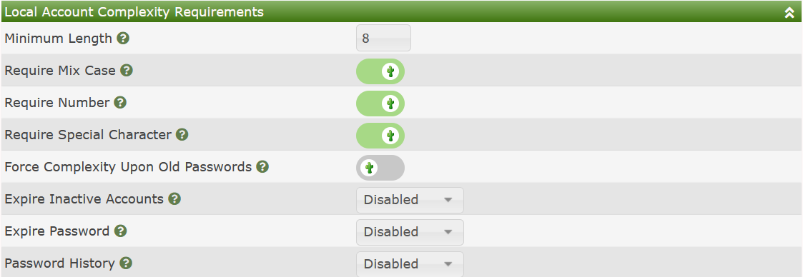
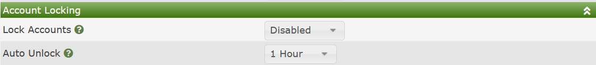

# Local Authentication

##Overview

Cacti's Built-in Authentication is sufficient for most small work-group Cacti
installs.  All users and their passwords are stored on the local Cacti
database, and are stored in a method where they are not easily compromised.

##Local Account Complexity Requirements

Additionally, Cacti has the ability to remember password history, force 
complexity rules, minimum lengths, force change frequency, etc. on new 
passwords.  These settings are configurable as well.  The image below
shows the local complexity settings available in Cacti.

Those options include:

- **Minimum Length** - The minimum length password that is acceptable
- **Require Mix Case** - Require that the password have mixed case
- **Require Number** - The password must includes a number.
- **Require Special Character** - The password must include a Special
  Character.
- **Force Complexity Upon Old Passwords** - If set, and a user attempts
  to login with a password that does not meet the current complexity
  requirements, they will be forced to change their password.
- **Expire Inactive Accounts** - Disable inactive accounts after
  a certain number of days of inactivity.
- **Password History** - Maintain a list of previous passwords, and
  do not allow a user to use one of those prior passwords during
  their password changes.

##Account Locking

If a user attempts to use an incorrect password more than a certain
number of times without a successful login, Cacti can automatically
lock out the user from that account for a certain amount of time.
This technique prevents hackers from continually attempting to
break a users password from the Cacti interface.  The images
below shows the two settings associated with this Cacti feature.

The settings are fairly self explanatory, so additional detail is no
provided here.

---
Copyright (c) 2004-2021 The Cacti Group
