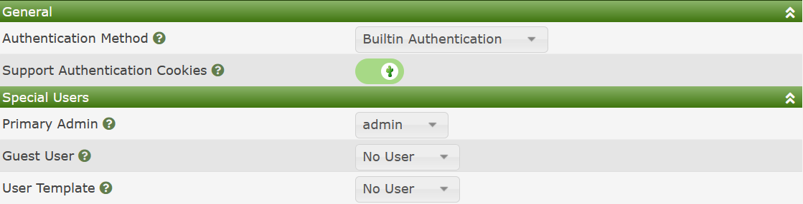

# Authentication

## Overview

Cacti provides four Authentication methods that can be leveraged to provide
Authentication services.  When combined with the variety of Apache and NGINX 
Modules, Cacti can support just about every Authentication method available
today in the industry.  Those Authentication method include:

- **Built-in Authentication** - When using the method, Cacti will store both
  the user account, and it's password on the Cacti server.  When using this
  method, Cacti will encrypt the users password using a strong password
  encryption method and it will be rehashed periodically automatically.
  Also, when using this method, Cacti complies with C3 password requirements.
- **Web Basic Authentication** - With this method, the Web Server itself
  controls the Authentication.  Using this method, Cacti can support protocols
  such as SAML2 via OpenITC, NIS, LDAP, local password, TACAC+, etc.
- **LDAP/AD Authentication** - Cacti supports direct communications with LDAP
  and Active Directory servers as well.  When using this method, Cacti
  can limit what User Group may access Cacti based upon more detailed
  settings.
- **Multiple LDAP/AD Domains** - When you have multiple security levels
  and/or LDAP and AD Domains that you wish to support, for example
  maybe you have Admins, Power Users, and General Users groups defined
  and you wish to restrict who can login as who, this Authentication
  method allows you to setup that type of security system.

For most of these `Authentication Methods`, there are some common settings
showing in the image below.

Those options include:

- **Authentication Method** - One of the options below.
- **Support Authentication Cookies** - Provide Remember me that will keep a user
  logged in from a single browser instance for up-to 90 days without
  requesting that they re-validate their passwords.
- **Primary Admin** - This is the Primary Cacti Admin account.  This user
  account will receive all Cacti Administrative notification like when
  the Cacti system is experiencing issues.
- **Guest User** - If you select a **Guest User**, people within an organization
  will be able to access certain Cacti pages without first authenticating.
  This setting is good for the pages like the **Graph Page** where you may
  with to embed live Cacti **Graphs** in other corporate websites.
- **User Template**, when creating new accounts, either LDAP, Web Basic,
  or new Cacti local accounts, Cacti will pull the users default Authorization
  from this Template User account.  For some Cacti **Authentication Methods**,
  you can have more than one Template User, for example: 
  **Multiple LDAP/AD Domains**.

In the sections below, we will go over these various 
**Authentication Methods** and their settings.

[Built-in Authentication](Settings-Auth-Local.md)

[Web Basic Authentication](Settings-Auth-Basic.md)

[LDAP/AD Authentication](Settings-Auth-LDAP.md)

[Multiple LDAP/AD Authentication](Settings-Domains.md)

---
<copy>Copyright (c) 2004-2021 The Cacti Group</copy>
