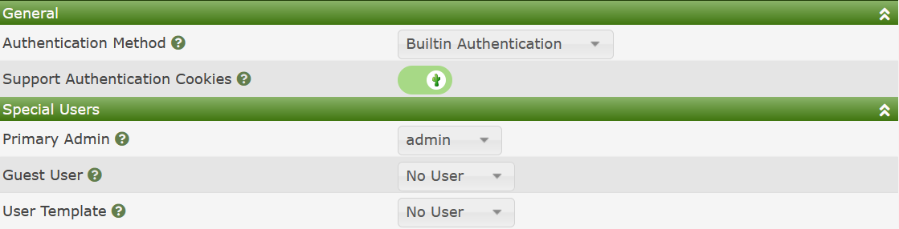

# Authentication

## Overview

Cacti provides four Authentication methods.  Combined with the Apache and
nginx authentication modules, Cacti can support most of the Authentication
methods in common use.  Those Authentication methods are:

- **Built-in Authentication** - With this method, Cacti stores both the user
  account and its password on the Cacti server.  The password is hashed with
  PHP's `password_hash()` using the default algorithm, and it is rehashed on
  login whenever that default algorithm or its cost changes.  This method
  also supports the local complexity, history and expiry policies described
  in [Local Authentication](Settings-Auth-Local.md).
- **Web Basic Authentication** - With this method, the web server itself
  controls the Authentication.  Cacti then accepts whatever the web server
  authenticated, so the web server can front Cacti with SAML 2.0, Kerberos,
  NIS, LDAP, a local password file, TACACS+ or another scheme.
- **LDAP Authentication** - Cacti supports direct communication with LDAP
  and Active Directory servers as well.  When using this method, Cacti
  can limit what User Group may access Cacti based upon more detailed
  settings.
- **Multiple LDAP/AD Domains** - When you have multiple security levels
  and/or LDAP and AD Domains that you wish to support, for example
  maybe you have Admins, Power Users, and General Users groups defined
  and you wish to restrict who can log in as whom, this Authentication
  method lets you set up that type of security system.

For most of these `Authentication Methods`, there are some common settings
shown in the image below.

Those options include:

- **Authentication Method** - One of the options below.
- **Support Authentication Cookies** - Offers a `Keep me signed in` checkbox
  on the login page.  The authentication cookie keeps the user signed in on
  that browser and expires after 90 days without use.  The client must use
  HTTPS for the cookie to be issued.
- **Primary Admin** - This is the Primary Cacti Admin account.  This user
  account receives Cacti administrative notifications, such as when the
  Cacti system is experiencing issues.
- **Guest User** - If you select a **Guest User**, people within an organization
  will be able to access certain Cacti pages without first authenticating.
  This setting is good for pages like the **Graph Page** where you may
  wish to embed live Cacti **Graphs** in other corporate websites.
- **User Template** - When creating new accounts, whether LDAP, Web Basic,
  or new Cacti local accounts, Cacti takes the user's default authorization
  from this Template User account.  For some Cacti **Authentication Methods**
  you can have more than one Template User, for example
  **Multiple LDAP/AD Domains**.

In the sections below, we will go over these various
**Authentication Methods** and their settings.

[Built-in Authentication](Settings-Auth-Local.md)

[Web Basic Authentication](Settings-Auth-Basic.md)

[LDAP Authentication](Settings-Auth-LDAP.md)

[Multiple LDAP/AD Domains](Settings-Domains.md)

---
Copyright (c) 2004-2026 The Cacti Group
