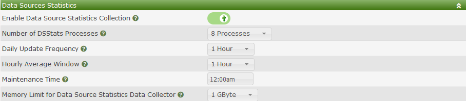

# Data Settings

The Cacti Data settings includes settings for gathering statistical data
about Cacti's **Data Sources** and about settings around how Cacti
stores it's **Round Robin Archives** Time Series Databases (TSDB),
otherwise known as RRDfiles.

There are presently to sub-sections for these settings.

## Data Source Statistics

Cacti has the ability to store peak and average data for all your 
**Data Sources**.  You can then use that data to easily build
dashboards using third party plugins including plugins like
Superlinks from Howard Jones.

Below you will find an image of the default settings.

Those settings include:

- **Enable Data Source Statistics Collection** - This is setting
  will either enable or disable the statistics collection.

- **Daily Update Frequency** - This setting determines how often
  daily averages and peaks should be calculated.  You can set
  it to run hourly, upto every 6 hours, or after Cacti's boost
  process completes.

- **Hourly Average Window** - This is a floating time window where
  Cacti holds onto all samples for determining the hourly averages
  for your **Data Sources**.  You have to watch this cache as by
  default it's stored in a memory table.  You can run out of space.

- **Maintenance Time** - This is the time in the day that Cacti
  will calculate Monthly and Yearly numbers and perform table
  maintenance.

- **Memory Limit for Data Source Statistics Data Collector** - This
  setting controls the peak memory that the statistics poller
  will be allowed to use.  Most systems can work fine using the
  default 1GByte setting.

## Data Storage Settings

These settings determine how you store your RRDfiles.  This
sub-section has two layouts as showing in the images below.

The settings above include:

- **Location** - Either Local or RRDtool Proxy Server.  The example
  above shows the local storage option.

- **Structured RRD Paths** - In very large systems having a flat
  directory structure has severe performance consequences.  However,
  with the Structured Paths option, Cacti will separate RRDfiles by
  Device ID and use the Data Source ID as the RRDfile name.

> **NOTE**: If you are migrating from non-structured to structured
> paths setup, you must run the CLI script to move those files
> per the updated specification right after making this change.

The RRD Proxy settings below are more involved.

> **NOTE**: It should be noted that although the RRD Proxy is
> in production at large commercial sites, it continues to not
> support replication.  The author claims that it's 95%
> complete, but to date, has not completed the last 5%.

The settings above include:

- **Proxy Server** - The IP or DNS name of the primary RRDfile proxy
  server.

- **Proxy Port Number** - The port number to connect to in order to
  communicate with the RRD Proxy.

- **RSA Fingerprint** - The fingerprint of the current public RSA
  key the proxy is using.  This is required to establish a trusted
  connection to the RRD Proxy service.

> **WARNING**: None of the settings below are implemented.

- **Load Balancing** - Whether calls to the RRD Proxy should be
  load balanced.

- **Proxy Server** - The secondary Proxy server IP or DNS name.

- **Proxy Port Numer** - The port number on the secondary RRD Proxy
  to talk to.

- **RSA Fingerprint** - The fingerprint of the current public RSA
  key the proxy is using.  This is required to establish a trusted
  connection to the RRD Proxy service.

---
Copyright (c) 2004-2021 The Cacti Group
