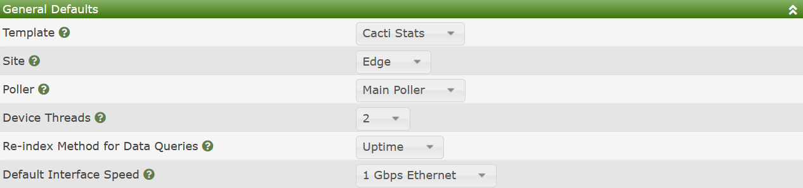
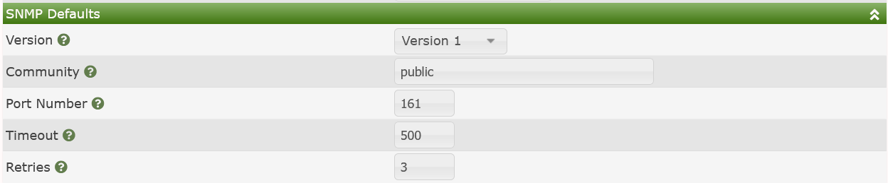
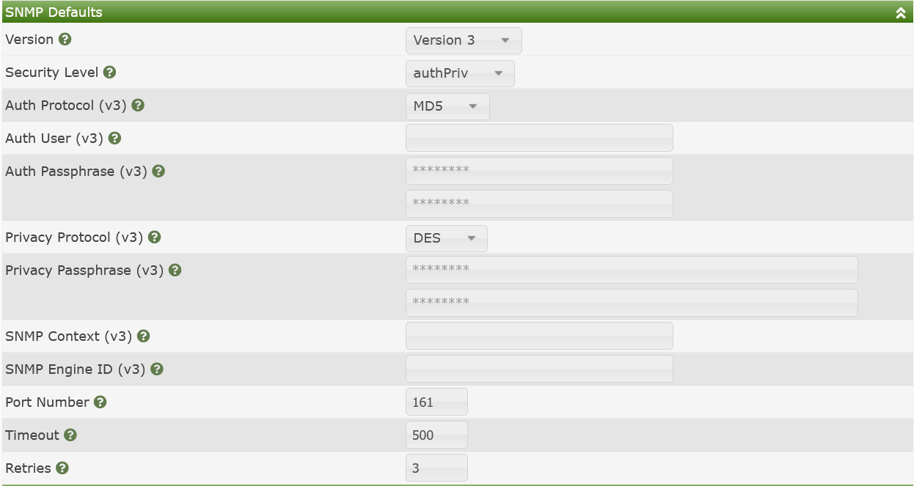
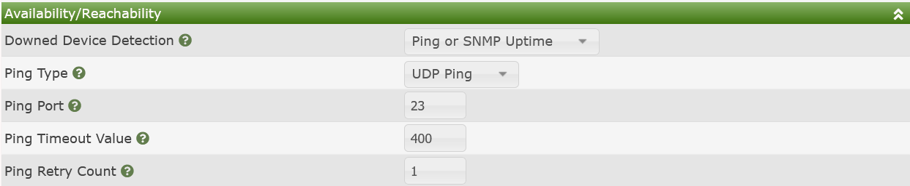

# Device Default Settings

Cacti has multiple ways to create **Devices**. Those methods include:

- **Manual** - Create Devices one at a time through the User Interface
- **CLI** - Through Cacti's Command Line Interfaces (CLI's)
- **Automation** - Through Cacti's Network Discovery

When using any of these methods, Cacti needs a way to apply a default for a new
**Device** if the user does not specify on, be it any of the three methods
above. That is what this settings sub-tab if for.

## General Defaults

In the image below, you can see the **General Defaults**. These settings cover a
number of **Device** attributes.

Those settings include:

- **Template** - The default **Device Template**. You might select `Net-SNMP`
  device if you are monitoring all Linux devices for example.

- **Site** - The default physical location of the **Device**

- **Poller** - The default **Data Collector** to assign new **Devices** to

- **Device Threads** - The default number of Device Threads to assign to a new
  **Device**

- **Re-index Method for Data Queries** - The default **Re-index" method for new
  **Device Data Queries**

- **Default Interface Speed** - If the **Device** does not include `ifHighSpeed`
  what should the maximum speed of the interface be set to.

> **NOTE**: **Device Threads** is only applicable when using the spine binary

## SNMP Defaults

Similar to the `General Defaults`, the `SNMP Defaults` control what SNMP
settings to use for new \*_Devices_ if the user does not specify any. The image
below shows the settings when using first SNMP v2 and then SNMP v3. If you are
using SNMP v1 or v2, you will have much less required settings.

Those settings include:

- **Version** - The default SNMP version to query using (v1, v2, v3)

- **Community** - The default SNMP password to access the device (SNMP v1, v2)

- **Port Number** - The default SNMP port number to poll (SNMP v1, v2, v3)

- **Timeout** - The default SNMP Timeout (SNMP v1, v2, v3)

- **Retries** - The default number of times to retry a query if SNMP times out
  (SNMP v1, v2, v3)

- **Security Level** - The default Security Level (SNMP v3)

- **Auth Protocol** - The default Authentication Portocol to use (SNMP v3)

- **Auth User** - The default Authentication User to use (SNMP v3)

- **Auth Password** - The default Authentication password to use (SNMP v3)

- **Privacy Protocol** - The default Privacy Protocol to use (SNMP v3)

- **Privacy Pass-phrase** - The default Privacy Pass-phrase to use (SNMP v3)

- **SNMP Context** - The default SNMP Context to use (SNMP v3)

- **SNMP Engine ID** - The default SNMP Engine ID to use (SNMP v3)

## Availability / Reachability

Cacti's `Availability / Reachability` define how to perform initial checks prior
to polling to see if the **Device** is alive or not. Attempting to gather large
amounts of data from a **Device** that is down, is counter-productive.

Availability / Reachability is generally performned using a `ping`. These
`pings` come in many formats, and Cacti supports all of the reasonable ones. In
the image below, you can see the settings for one of the combination cases.
Depending on your `ping` method, you may receive less options.

Those options include:

- **Downed Device Detection** - The method by which Cacti should `ping` the
  **Device**, SNMP `pings` involve querying a specific OID. Options include:

  - **None** - Only used for devices having their data collected through a
    back-end agent
  - **Ping and SNMP uptime** - Perform a TCP/UDP/ICMP ping and then check uptime
    through SNMP. Both methods must work for the device to be **Up**
  - **Ping or SNMP Uptime** - If either method works, consider the **Device Up**
  - **SNMP Uptime** - Only check the SNMP sysUptimeInstance of the **Device**
  - **SNMP Desc** - Only check the SNMP sysDescription of the **Device**
  - **SNMP getNext** - Only perform a basic `getnext` query for the **Device**
  - **Ping** - Either TCP, UDP, or ICMP pings

- **Ping Type** - When using an options that leverages **Ping** above, which
  method

- **Ping Port** - When using TCP or UDP ping, the port to ping

- **Ping Timeout Value** - The ping timeout value in Milliseconds

- **Ping Retry Count** - The number of times to retry the ping if it fails

## Up / Down Settings

The Up / Down Settings define how many polling cycles that a Device must not
respond to be considered truly `Down`, and when at device is returning from
`Down`, how many polling cycles to keep a device in `Recovering` state before
returning it to `Up`. The image below shows the two settings for the **Device**.
There is really no reason to explain these two settings in any additional
detail.

---

Copyright (c) 2004-2023 The Cacti Group
