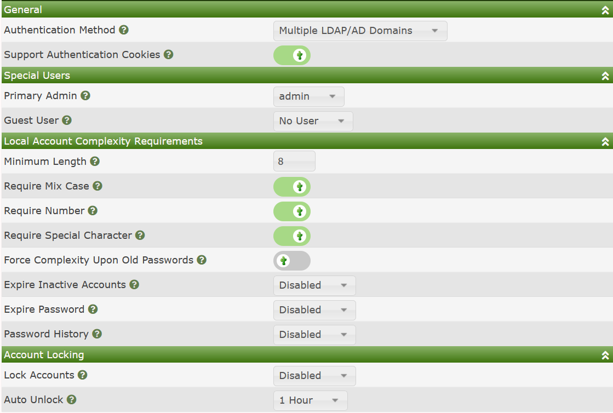

# Multiple LDAP/AD Domains

## Summary

This Authentication method enables the Cacti Administrator to
have multiple login level templates for their accounts.  This
could be used to grant users say for the following three login
levels controlled by an LDAP or AD User Group:

- **Admins** - People with full control of Cacti
- **Super Users** - Higher level of access, but below **Admins**
- **Normal Users** - For normal entry level users with limited
  access.

To use the Multiple Domains setup, you must first setup at least one
[User Domains](User-Domains.md) from the Cacti console.  Once
the **Multiple LDAP/AD Domains** are setup, all users will
have to provide domain credentials as well as select from which
domain they wish to authenticate from, though when enabling
this settings, **Built-in** accounts will still be able to
login, however, they will have to provide the `Local` option
from the drop-down on the login page.

## Settings

When you select the **Multiple LDAP/AD Domains** the Authentication
sub-tab will look like the image below.

The reason that it shows settings for `Built-in` accounts is that
you can still login as a local account when you choose this setting.

---
Copyright (c) 2004-2023 The Cacti Group
