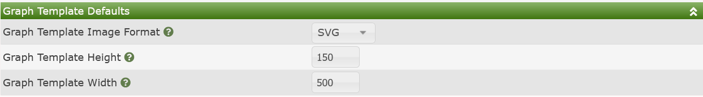

# General Settings

General Settings in Cacti consist of the following categories:

- **Log Settings** - This is where you setup Cacti's logging
- **Internationalization (i18n)** - Settings around how Cacti handles languages
  other than English
- **Other Settings** - Other not object settings in Cacti
- **Site Security** - Web Site Security settings such as `Content-Security-Policy`,
  use of external JavaScript API's for plugins like Google Maps, forcing https, etc.
- **Automation** - Miscellaneous settings around Cacti's Automation
- **Graph Template Defaults** - Defaults for **Graph Templates**

Each of these settings will be documented below.

## Log Settings

Cacti has the ability to log at various levels for various files.  It has the ability
to log to both the standard cacti.log file, as well as sending some notifications
to Syslog for forwarding to centralized logging servers.  The image below
show what this settings sub-tab section looks like:

Those settings include:

- **Log Destination** - You have the following options:

   - **Logfile Only** - Only send log data to the Cacti log file
   - **Logfile and Syslog** - Send log data to both the Cacti log file and the
     System log facility
   - **Syslog Only** - Send select log data to just the System log facility

  This setting is quite self explanatory, when it comes to what type of messages
  are sent to the System log facility, see the `Syslog/Eventlog Item Selection`
  section below.

- **General Log Level** - This is the level of logging that Cacti will use.
Options include:

   - **NONE** - Don't perform any logging, not recommended.
   - **LOW** - Statistics and Errors
   - **MEDIUM** - Statistics, Errors and Results
   - **HIGH** - Statistics, Errors, Results and Major I/O Events
   - **DEBUG** - Statistics, Errors, Results, I/O and Program Flow
   - **DEVEL** - Developer level messages, mainly **SQL Queries**

  Select the log level that works best for your logging needs.  Be advised that
  **DEBUG** generates a large amount of log data.  **DEVEL** should only log
  **SQL Queries**.

- **Log Input Validation Issues** - This is a Developer option to log the use of
  request variables that have not been validated through Cacti's validation
  functions.

- **Data Source Tracing** - This is a debug options for logging of program
  flow around the creation of **Data Sources**.

- **Selective File Debug** - A Multi-select setting that allows you to place
  any Cacti file to be placed into debug mode.  This prevents the cacti.log
  file from being flooded with messages as is common in a general debug
  context.

- **Selective Plugin Debug** - For Plugins, the same level of debug that is
  available for core Cacti files are available for Plugin files as well.

- **Device Debug** - This is a comma delimited list of Cacti `device_id` that
  debugging of **Data Collection** services will be enabled for.

- **Syslog/Eventlog Item Selection** - In order to not saturate the
  System logging facility, Cacti will only forward some events as defined
  by the various check-boxes.

## Internationalization (i18n)

The image below shows system level Internationalization settings for Cacti, commonly
referred to as i18n.

Those settings include:

- **Language Support** - Whether or not to allow selecting other languages for
  Cacti

- **Language** - The default language to use at login time, or by default
  when the user has not specified a language.

- **Auto Language Detection** - Whether or not Cacti should read the language
  from the browser and use that language by default.

- **Date Display Format** - The default Date/Time display format.

- **Date Separator** - The default Data/Time separator character.

## Other Settings

These are additional settings for Cacti that fall into various categories, but that
done have enough entries to justify a separate section.  The image below shows that
sub-section.

Those settings include:

- **Has Graphs/Data Sources Checked** - If from the Console, you enter
  a pages that has the various **Has** options, if checked here, the default
  will be to check that setting.

- **RRDtool Version** - Selecting the correct RRDtool Version will unlock features
  expected in modern graphing frameworks that leverage SVG (Canvas) rendering.

- **Graph Permission Method** - This defined if a user needs to have access to
  both a **Device** and **Graph Template** to view a **Devices** **Graphs**,
  otherwise known as **Restrictive** or that to view a **Devices** **Graphs**
  the user only needs either the **Device** or **Graph Template** permission.

- **Graph/Data Source Creation Method** - If you wish to only create **Graphs**
  from **Graph Templates** choose the **Simple** method.  The **Advanced**
  method should only be used by people who wish to define individual **Graphs**
  with their own settings.

- **Show Form/Setting Help Inline** - If this option is checked, you will be
  able to read all form/setting help inline.  Otherwise, you will receive a
  pop-up to access form help.

- **Delete Verification** - For simple object removal, things that can be removed
  by clicking and 'X' on the page, whether or not you wish to confirm those
  deletes.

- **Data Source Preservation Preset** - Whether or not you wish to preserve
  **Data Sources** by default, or remove them when deleting **Graphs**. In
  all cases, Cacti will not allow the removal of a **Data Source** if there
  are **Graphs** using the **Data Source**.  However, some **Data Sources**
  are managed externally to Cacti, and removing those **Data Sources** by
  default may not be desired.

- **Graph Auto Unlock** - If when editing a Graph you wish to always unlock
  it by default, select this option.  Not that this does have performance
  implications that may make the User Interface slower on vary large systems
  where devices have tens of thousands of **Data Sources**.

- **Hide Cacti Dashboard** - This is an option used by some plugin developers
  who replace the default Cacti `Console` with their own contents, for example
  the Intropage plugin.

- **Enable Drag-N-Drop** - Certain Cacti pages allow Drag-N-Drop.  If you
  with to use it, check that option.

## Site Security

The image below shows Site Security settings for Cacti.

Those settings include:

- **Force Connections over HTTPS** - Even if the web site allows http, redirect
  their browsers to HTTPS.

- **Content-Security Allow Unsafe JavaScript eval() calls** - Allow plugins to use
  the JavaScript `eval()` function call, which is historically unsafe.  However,
  some older plugins require it.

- **Content-Security Alternate Sources** - If for some reason your Cacti site
  requires content from a CDN or a third party site, you can include a space
  delimited list of URLs that will be able to be traversed for Cacti content.

## Automation Settings

The image below shows general Automation Settings for Cacti.

Those settings include:

- **Enable Automatic Graph Creation** - If a Cacti **Device** has Non **Data Query**
  **Graph Templates** associated with it, create those **Graphs** automatically when
  adding a new **Device**.  Additionally, if you have **Graph Rules** apply those
  at **Device** creation time and save time.

- **Enable Automatic Tree Item Creation** - If you have Cacti **Tree Rules** apply
  then at **Device** creation and save time.

- **Automation Notification To Email** - When Network Automation finishes, send
  a notification to this Email address.

- **Automation Notification From Name** - The `From Name` on the Automation Email.

- **Automation From Email** - The `From Email` such as noreply@cacti.net that
  will be used for Automation notifications.

## Graph Template Defaults

This is where Cacti obtains defaults for **Graph Templates**.

- **Graph Template Image Format** - When creating a new **Graph Template**
  what `Image Format` should be used.  There is either:

   - **SVG** - Scalable Vector Graphs (preferred, though larger size)
   - **PNG** - Petri Net Graphs (backup, smaller but loose resolution when scaled)

- **Graph Template Height** - The height in pixels of the Graph Canvas for new
  **Graph Templates**

- **Graph Template Width** - The width in pixels of the Graph Canvas for new
  **Graph Templates**

---
Copyright (c) 2004-2021 The Cacti Group
