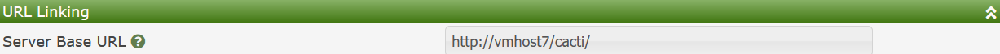
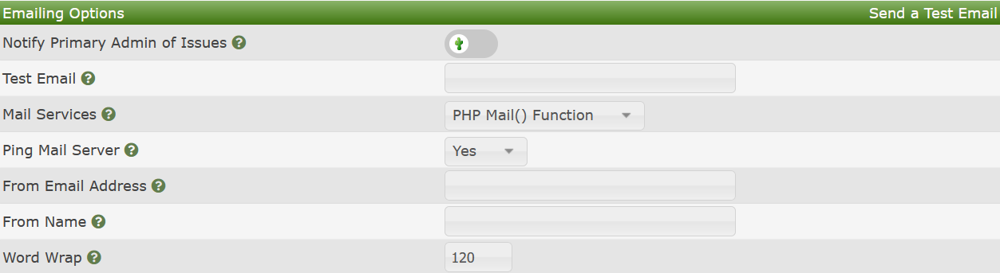
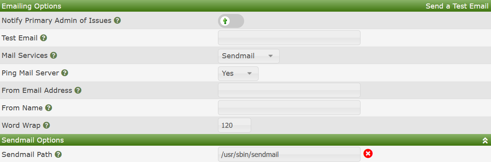
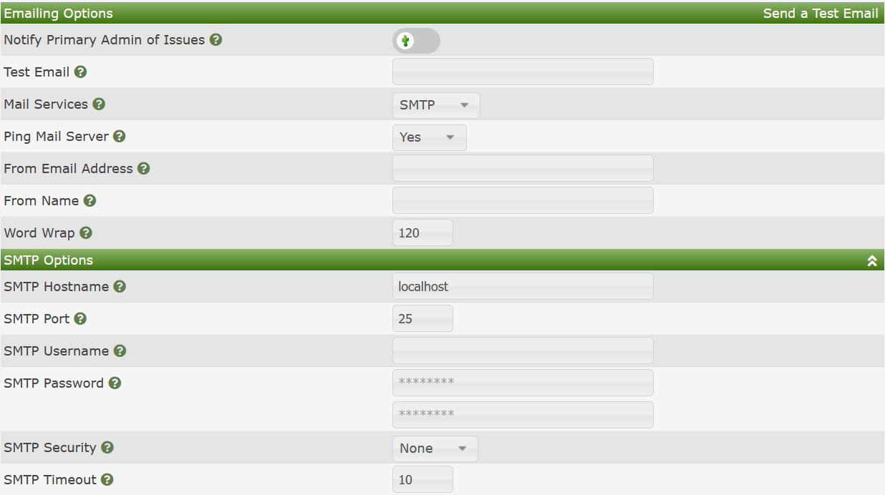
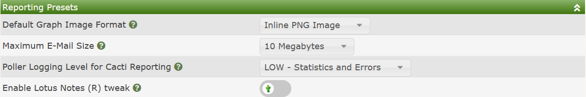
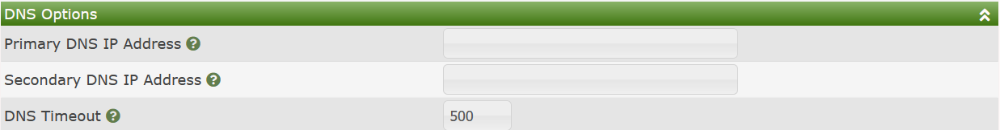

# Mail/Reporting/DNS Settings

This area of Cacti is where you configure core notification settings as
well as settings to using alternate DNS' servers associated with certain
Cacti plugins.

## URL Linking

The URL Linking settings provide the Cacti administrator a URL prefix
that will point properly to the main Cacti site for both core Cacti
functions and Plugins to create URL for their use.  Generally this
URL should include the full DNS name of the Cacti server, and the
correct protocol, for example HTTPS.  The image below show an example
of how this might be setup.

## Mail Settings

Not only Cacti, but several plugins today are still leveraging Email
for end user and administrative notification.  Cacti uses the very
popular PHP-Mailer 3rd party component to facilitate Email 
notification service.  In this section, you will pick the method
that you wish to provide Email notification an it's settings.  Cacti
actually provides three methods.  They include:

- **PHP Mail Function** - PHP has a built-in mail facility where
  PHP will communicate with the localhost mail facilities to send
  mail.  This is useful if your Cacti system is setup as an
  anonymous forwarder to a corporate mail system.
- **Sendmail Binary** - This method relies on the `sendmail` binary
  to properly communicate with your corporate mail systems.  Like
  the **PHP Mail Function**, it requires that your localhost be
  properly setup to send mail through a forwarding setup.
- **Simple Mail Transfer Protocol (SMTP)** - This is the most configurable
  option where Cacti can send Emails directly to the Email server.

In the sections below, we will document each of these options in more
details.

## Emailing Options

In this section, you specify some general settings around Emailing
in general as shown in the image below.

Those settings include:

- **Notify Primary Admin of Issues** - When certain anomalous Cacti
  events table place that justify the notification of the Cacti
  administrator, by checking this option, you will receive those
  notifications.
- **Test Email** - When setting up Cacti for the first time, or when
  your Email settings change, you can send out a test Email to
  confirm that the Email setup is working.  The Email that you put on
  this line will receive the test Email.
- **Mail Services** - This is where you pick one of the three options
  above for providing Mail Services.
- **Ping Mail Server** - When using the SMTP Mail Services provider,
  Cacti can first ping the Email Server to ensure that it's operational
  before sending Emails.  If the Email Server does not respond, Cacti
  will issue a warning and continue operations.
- **From Email Address** - The is the Default From Email address that
  will be used by Cacti and it's plugins, unless the plugin allows
  overriding the option.  The common entry would be something of the
  form noreply@mydomain.com unless you have a desire to receive responses
  from recipients.
- **From Name** - This setting allows you to provide a name to the
  given Email address.  Something of the form `Cacti Administrator` would
  be common practice here.
- **Word Wrap** - If not using HTML based Emailing, this will force a
  word wrap on text data at the length specified.

The next sections will document the various **Mail Services**

### PHP Mail Function

There are no settings for this function.  It leverages the Cacti servers
mail configuration to send mail notification.

### Sendmail Binary

The **Sendmail Binary** is similar to the **PHP Mail Function** with the exception
that you can specify the `sendmail` binary path.  Cacti actually requires
that you include this path.

### Simple Mail Transfer Protocol (SMTP)

As mentioned before, the SMTP Mail Services provider provides the most options
and will be very familiar and easy to use for Cacti Administrators that
may not be as familiar with how to configure the Operating System to properly
forward mail to their internal Email servers.  Popular mail services like
Google, Microsoft, etc. are all supported.  This is primarily due to the use
of the 3rd Party PHP-Mailer plugin within Cacti.  The image below shows the
various settings for the **Simple Mail Transfer Protocol (SMTP)** option.

Those options include:

- **SMTP Hostname** - The hostname or DNS name of the SMTP Server
- **SMTP Port** - The TCP Port to use to communicate with the SMTP Server
- **SMTP Username** - The username to use for SMTP communications if your
  SMTP Server requires authentication.
- **SMTP Password** - The password to use for SMTP communications if you
  SMTP Server requires authentication.
- **SMTP Security** - The security protocol to use for SMTP communications.
  The options include: None, SSL, and TLS.  The most popular being TLS
  today due to all the security issues with the other protocols.
- **SMTP Timeout** - How long to wait before abandoning connection attempts
  to the SMTP Server.

## Reporting Presets

Cacti Reporting can generate very large Email attachments.  Therefore
the **Reporting Presets** allow you to control the traffic associated
with reporting.  From here, you can also set presets for the image type
and logging.  You can see the settings from the image below.

Since these settings are strait forward, no further explanation is
given here.

## DNS Options

The DNS Options allow you to specify a primary and secondary DNS to use
for Plugin DNS operations.  Many plugins allow you to even use their
own DNS Options.  For plugins that require Alternate/Non-System DNS
settings, see their documentation as to how DNS is setup and used.

The image below shows the two settings.

---
<copy>Copyright (c) 2004-2023 The Cacti Group</copy>
