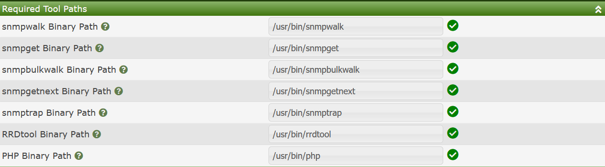
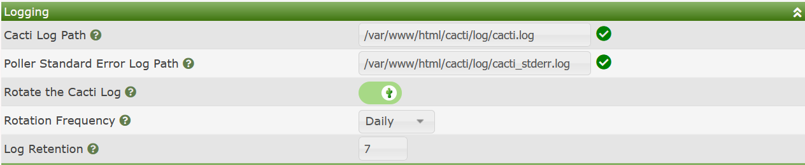
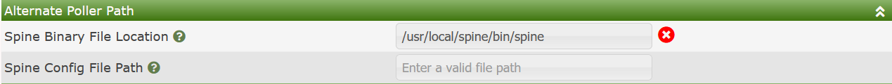
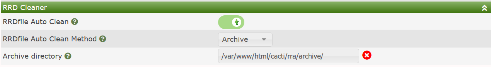

# Path Settings

Cacti's Path Settings include mainly the locations of core binaries that
Cacti must call in order to operate correctly.  Generally, these binaries
are included in the Web Servers path, but being able to override these
settings is important, especially for debugging issues.  Cacti's Paths
sub-tab is broken into the following sub-sections:

- **Required Tool Paths** - Paths that are essential for Cacti's operation
- **Logging** - Settings associated with Cacti's logging facilities
  including log rotation
- **Alternate Poller Path** - Locations for Cacti's spine binary and spine
  config file if not in the established default locations
- **RRD Cleaner** - Setting for Cacti's RRDfile disposal of removed RRDfile
  when Data Sources are removed.

When using Cacti's **Remote Data Collectors** or **Remote Pollers** the
settings that refer for a `File Path`, or `Directory Path` will be local
to the **Data Collector**.  Therefore, you can have one set of paths for
your Main Cacti site, and another set of paths for your Remote Poller,
say in the case that they are on Windows.

## Required Tools Paths

The image below shows Cacti's **Required Tool Paths** settings.

Those settings include:

**snmpwalk Binary Path** - This is the path to the `snmpwalk` binary.

**snmpget Binary Path** - This is the path to the `snmpget` binary.

**snmpbulkwalk Binary Path** - This is the path to the `snmpwalk` binary.  This binary
path is essential if you use SNMPv2 of SNMPv3 versions where **Data Queries** perform
bulkwalks by default to increase performance.

**snmpgetnext Binary Path** - This is the path to the `snmpgetnext` binary.

**snmptrap Binary Path** - This is the path to the `snmptrap` binary.  This binary
is important for SNMP Notification and Trap generation.

**RRDtool Binary Path** - The location of the RRDtool binary that matches your
RRDtool version.

**PHP Binary Path** - The location of the PHP Binary, generally, this setting is
always `/usr/php`, but can change for some users.

## Logging

The next set of settings define where Cacti's Standard Output and Standard
Error files are to be placed, and how they should be rotated, and for how
long they should be retained.  You can see those settings from the image below.

Those settings include:

**Cacti Log Path** - The location of Cacti's Standard Output (stdout) log file.

**Poller Standard Error Log Path** - For Cacti's **Data Collector** functions only,
the location of the Standard Error (stderr) log file.

**Rotate the Cacti Log**  - Determines if Cacti or the package maintainer rotates
the Cacti log.

**Rotation Frequency** - Should the Log files be rotated `Daily` or `Weekly`
or `Monthly`

**Log Retention** - How many generations of Log files should be maintained.
Older files will be removed automatically.

> **NOTE**: Some package maintainers control log rotation and therefore the log
> rotation settings may be missing from certain version of Cacti if you install
> through a packaing tool such as `apt-get`, `yum` or `dnf`

## Alternate Poller Path

The sub-section hold information on how to find Cacti's `spine` binary if it's
installed.  Since `spine` is written in ANSI C, it is not provided as a part of
the Cacti install and must be compiled by the Cacti Administrator.  The benefit
of the `spine` binary is that it's mufti-threaded and extremely scalable.
It's possible to poll enterprises with excess of 30,000 devices using spine on
a reasonably large system.  The image below show's this sub-section.

Those settings include:

- **Spine Binary File Location** - The path to the spine binary.

- **Spine Config File Path** - This setting is optional.  If blank, Cacti will
  search the following locations for a `spine.conf` file.

  - **pwd** - The same directory as spine
  - **../etc/** - One sibling `etc` directory of the `spine` binary directory.
  - **/etc/** - The systems /etc/ directory.

## RRD Cleaner

This setting defines how Cacti manages RRDfiles from **Data Sources** that have
been removed.  By default, Cacti does not manage these files, and leaves it to
the Cacti Administrator to pro-actively manage them.  The RRD Cleaner settings
can be seen in the image below.  Note that unless you enable
`RRDfile Auto Clean`, you will not see the other settings by default.

Those settings include:

- **RRDfile Auto Clean** - Denotes that you wish Cacti to manage RRDfiles from
  removed **Data Sources** potentially automatically.

- **RRDfile Auto Clean Method** - This is the method to perform cleanup.
  Options include:

  - **Delete** - Simply remote the files once the **Data Source** is removed
  - **Archive** - Archive the RRDfile to an Archive directory once it's removed.

- **Archive directory** - The Archive directory to move old RRDfile to.

---
<copy>Copyright (c) 2004-2022 The Cacti Group</copy>
