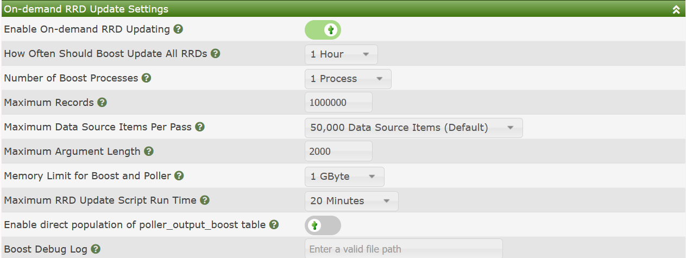
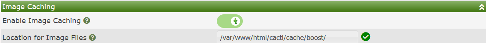

# Performance Settings (Boost)

The Performance Settings sub-tab in Cacti contains settings that
can help improve the life of your Cacti server and significantly
increase the live and lower the I/O wait of your Cacti system
through caching of RRDfile disk writes.

It will also reduce the number of CPU cores require to render
Cacti **Graphs** due to it's image cache mechanism.

We will explain how these settings work briely in the next
two sections.  However, there is a more detailed guide in
the [Advanced Topics](Boost.md).  Please refer to that guide
as well.

## On-demand RRD Update Settings

These are settings to place RRDfile updates into a database
table and cache them.  Then, on a periodic basis dump those
updates to disk at once.  This will reduce the overall wear
and tear of your disks, and reduce the time periods where
disk I/O will be higher.  You can see the available settings
in the image below.

The settings include:

- **Enable On-demand RRD Updating** - This check-box will enable
  on-demand updating and caching of unwritten updates.  If you
  disable it, the poller must first clear the cache before it
  can be fully disabled.  So, disabling is not immediate after
  it has been activated for some time.

- **How Often Should Boost Update All RRDs** - As it says, what
  is the desired frequency of performing updates.  The idea with
  boost is to reduce the amount of disk I/O, so if your poller
  frequency/interval is say 5 minutes, you may want to cache
  a few hours of updates.

- **Number of Boost Processes** - For systems with shared disk
  where I/O performance is impacted by file system
  overhead or latency, the concurrent boost process
  setting comes in handy.  Cacti will spawn the number
  of collectors specified by this setting.

- **Maximum Records** - This is a threshold in cache records
  that if that number is exceeded, the cache will immediately
  begin to be cleared.  This setting works together with the
  **How Often** setting.

- **Maximum Data Sources Items Per Pass** - Cacti will count
  the number of distinct data sources in your system, and then
  divide it by this amount, and then make X number of passes
  through the data.  If you have 1M **Data Sources** and 100M
  records in the cache, and set the setting to 100k, Cacti
  will make 10 passes through the **Data Sources** each pass
  processing approximately 10M cache entries.

- **Maximum Argument Length** - This is the longest RRDtool
  update command to use.  Most Linux systems allow for a very
  long command line.  It's advisable to use something less
  than 32k though as some versions of RRDtool have problems
  with longer command lines.

- **Memory Limit for Boost and Poller** - In a modern Cacti
  system, unless you have more than a million **Data Sources**
  the default of 1GB is likely enough.

- **Maximum RRD Update Script Run Time** - This is the longest
  to allow the cache clearing script to run before notifying
  the primary Cacti admin.  The process will be allowed to
  continue to run, but will issue a WARNING.

- **Enable direct population of poller_output_boost table** -
  Originally a `spine` only setting, this setting is now
  supported in both `spine` and `cmd.php`.  Instead of having
  to move records inside of the **Data Collector** Cacti
  simply makes two writes, one into the main output table
  and another into the boost table.  Cacti has to write
  to the primary output table as some plugins require that
  data to be there immediately for fault management.

- **Boost Debug Log** - If non-blank and points to a
  location that is writable, Cacti will log the RRDtool
  syntax used to update the RRDfiles.

## Image Caching

The Image Caching setting on the Performance sub-tab
basically defined where to store time sensitive
images caches of your various Cacti **Graphs**.  These
Cached images only live for a few minutes, but can
be consumed by multiple users simultaneously.

The image of the settings is shown below.  They are
fairly self explanatory.

---
Copyright (c) 2004-2021 The Cacti Group
