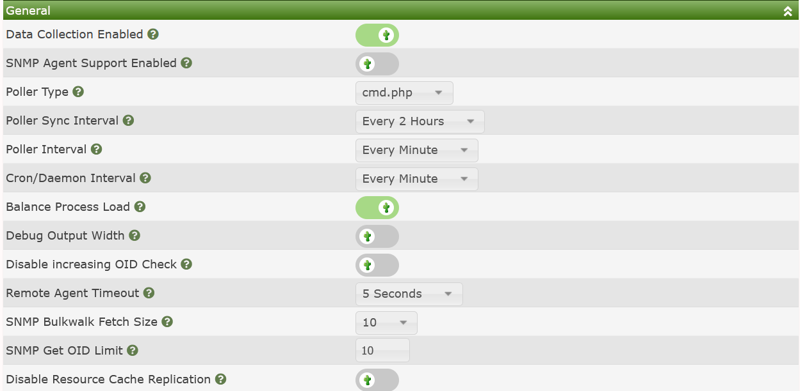
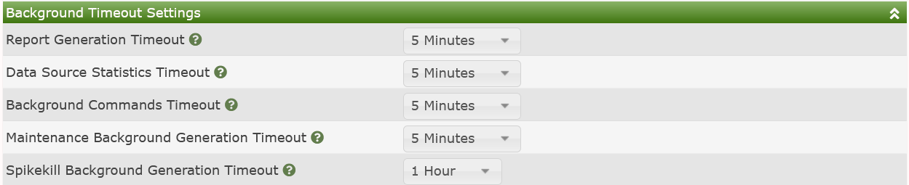

# Poller Settings

The Poller sub-tab of the Cacti settings are where you go to control
many aspects of **Data Collection** in Cacti, you control various base
collection frequencies, communication timeouts, and other settings that
impact how Cacti's **Data Collection** works.

## Genral Settings

The **General Settings** are a broad collection of settings into
multiple categories.  The image below shows Cacti's **General Settings**
sub-section.

Those settings include:

- **Data Collection Enabled** - This is a setting that essentially will
  override and disable all Cacti **Data Collection** from all of Cacti's
  **Data Collectors**.  It's really intended to allow you to put Cacti
  in maintenance mode with a single click.

- **SNMP Agent Support Enabled** - The SNMP Agent has a measurable amount
  of overhead on larger systems.  Therefore, if you are not using it, you
  should disable it.  However, the SNMP Agent is a marvelous addition to
  any Cacti system that's participating in a multi-level Operations
  Framework.

- **Poller Type** - This is where you define either Cacti's built in poller
  `cmd.php`, or use the more robust poller `spine`.  You will not see the
  `spine` drop-down option unless it has first been installed, and the
  `spine` binary path defined from
  `Console > Configuration > Settings > Paths` settings sub-tab.

- **Poller Sync Interval** - When creating a Cacti **Data Collector**
  this is the default `Full Sync` interval it will use.  In the current
  Cacti design, a `Full Sync` should only be required when attempting
  to replicate local authentication or authorization data to
  **Remote Data Collectors**, of if you have made changes that would
  otherwise impact the behavior of a **Remote Data Collector** when it
  was offline.

- **Poller Interval** - This setting must align with the highest frequency
  **Data Source Profile** polling interval.

> **NOTE**: This only applies to the **Data Source Profiles** that are in
> use.  If you only plan on polling every minute and therefore only using
> the `1 Minute` **Data Source Profile**, then your **Poller Interval**
> should be `1 Minute` as well.

- **Cron/Daemon Interval** - This is the frequency at which either the Cacti
  daemon (cactid.php), or the systems crontab/task-manager should relaunch
  every **Data Collectors** Poller process.

- **Balance Process Load** - This setting will sort the devices such that
  each concurrent Cacti process is polling the same number of **Data Sources**.
  Otherwise, Cacti will simply order the hosts by their `device ids`.

- **Debug Output Width** - This is a diagnostic settings that you would only
  enable from time to time if you wish to check if the output from your
  **Data Collector** scripts exceeded the output width in the various
  Poller tables.  Since checking this have a very negative impact on
  polling performance, it's disabled by default.

- **Disable Decreasing OID Check** - This setting is for performing
  **Data Query** `Re-index` activities for tables whose OID's are not
  structured in an orderly way where the suffix for the OID increases
  in a known way.  Though, in most cases enabling this setting will
  not be harmless.  There may be some cases where it would slow the
  `Re-index` process.

- **Remote Agent Timeout** - When Cacti either needs information from
  a **Data Collector**, like `ping` latency from the collector to one
  of the **Devices** it's monitoring, or when a **Remote Data Collector**
  needs information from the main Cacti server, this is the timeout
  for receiving a handshake from that server.  It's use to keep the
  Website from locking up in the case a **Data Collector** is not
  responding due to being down.

- **SNMP Bulkwalk Fetch Size** - This controls how many OID's are
  returned per UDP turn when obtaining `snmpwalk` data from an
  SNMP enabled **Device**.

> **NOTE**: This only works with SNMP v2 and v3.  It is not supported
> on older SNMP v1 **Devices**.

- **SNMP Get OID Limit** - The default maximum number of SNMP Get
  OIDs to issue per `snmpget` request.  For **Devices**, this setting
  is controlled at the **Device** level.  You should only use this
  setting when using Cacti's SNMP API natively in your scripts
  and Plugins.

- **Disable Resource Cache Replication** - By default Cacti will
  continually replicate it's Website content with it's
  **Remote Data Collectors**.  So, essentially, they are self
  upgradable.  However there are some cases where customers wish
  to upgrade the Central system before allowing the remotes
  to self upgrade.  In those cases, you would enable this feature.

## Background Timeout Settings

The settings below limit how long Cacti background processes will be
allowed to run before timing out and being killed the system and
notifying the Cacti administrator.  These background timeouts are
required to keep Cacti performing a peak performance by not allowing
certain tasks to re-spawn while they are still running causing
system overload.  Below is the image of those settings.

Those settings include:

- **Report Generation Timeout** - Some reports can take several minutes
  to complete.  Adjust accordingly based upon your system size and
  the number of reports across all users.

- **Data Source Statistics Timeout** - Depending on the size of your
  Cacti system, some **Data Source Statistics** tasks can take quite
  a bit of time.  This setting is for the periodic collection and
  not the Daily process.

- **Background Commands Timeout** - Cacti will schedule some commands
  to be run offline during normal operations.  This timeout affects
  those commands.  Some activities include some aspects of re-indexing,
  removing old RRDfiles, etc.

- **Maintenance Background Generation Timeout** - Cacti performs daily
  maintenance at midnight every day.  This maintenance can include:
  rotating logs, purging old logs, calculating **Data Source**
  statistics, etc.  This setting controls it maximum allowed runtime.

- **Spikekill Background Generation Timeout** - If you are using Cacti's
  prophylactic spike-killer process on your Data Queries, this will control
  it's maximum allowed run-time.

## Data Collector Defaults

Cacti's **Data Collectors** include both concurrent process and thread
settings.  They are maintained at the **Data Collector** level due to the
fact that not all **Data Collectors** are created equally.  You may have
one **Data Collector** that's collecting data from 1,000 hosts, and another
that is collecting from 10.  Maybe one is a Raspberry Pi and the other
a two socket EPYC chip.  You would not want the same settings for each.

These settings are only the defaults, when you fist create a
**Data Collector**, once you save them, the setting stays with the
individual **Data Collector**.  Below, you can see an image of those
settings.

Those settings include:

- **Data Collector Processes** - The default number of concurrent
  processes the **Data Collector** will spawn every cron or daemon
  cycle.

- **Threads per Process** - The default number of `spine` threads
  per Concurrent Poller Process above.

> **NOTE**: The Thread setting only applies if you are using the
> `spine` poller.  It does not apply to the `cmd.php` poller.

## Additional Spine Parameters

These settings are Global Spine poller settings.  They apply to all
**Data Collectors**.  An image of these settings can be seen below:

Those settings include:

- **Invalid Data Logging** - By default spine will only log the number
  of errors it experienced for a **Device**.  If you wish more
  granularity you can change this settings to either `Summary`
  or `Detailed` logging.

- **Number of PHP Script Servers** - Another level of Spine parallelism
  is it's ability to create a pool of memory resident PHP
  interpreters for running PHP scripts, making spine very powerful.
  Every concurrent process will have this many memory resident
  PHP interpreters pooled fro running scripts.

- **Script and Script Server Timeout Value** - This is the timeout
  to stop run-on script from blocking poller performance.  If a script
  exceeds this timeout, it will generate a log message.

---
<copy>Copyright (c) 2004-2023 The Cacti Group</copy>
