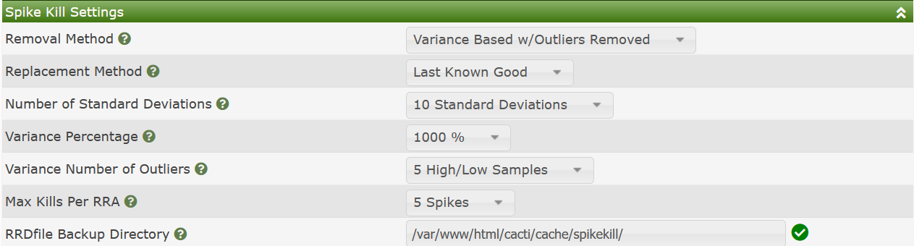
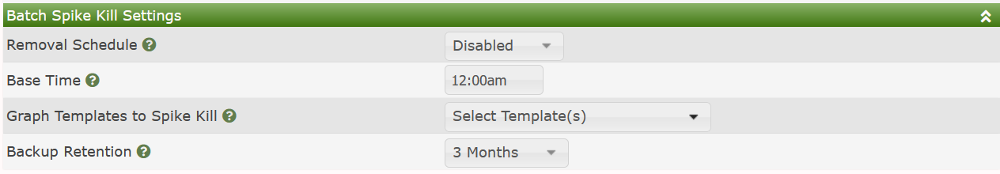

# Spike Kill Settings

Certain types of RRDtool based **Data Sources** can from time
to time generate what are look like to the casual observer
spikes.  These spikes can make your Cacti **Graphs** unreadable.

Spike happen when you either have set no maximum value on your
Cacti **Data Template** by using a 'U' as the Maximum Value,
or when certain `COUNTER` based RRDfiles have their counter data
overflow, and start counting again from zero.  When this happens
recent versions of RRDtool, like version 1.7, handle these
overflows quite well, but for some older RRDtool versions, these
changes can result in these spikes.

There are also cases where for some reason the Cacti system goes
offline, and therefore your Cacti Graphs will develop what are
referred to as gaps.

## Spike Kill Settings

Cacti provides two gap filling options
from the user interface.  In the image below, you can see
the default Settings for Cacti's Spike Killer GUI.

Those settings include:

- **Removal Method** - Cacti supports both Variance and Standard
  Deviation methods.  When calculating those values, you have the
  ability to filter out outliers such that they don't negatively
  impact those calculations.
- **Replacement Method** - When filling the Gap, what data point
  should be used.  There is `Last Known Good`, which would be
  the last good known value, `Average`, which uses the Average
  value for the RRDfile data source, and `NaN's` which will cause
  the **Graph** to gap, but the spikes will be removed.
- **Number of Standard Deviations** - This is the number of
  `Standard Deviations` above the Average that are required
  before the value is considered a spike.  It only applies to
  the `Standard Deviation` spike removal method.
- **Variance Percentage** - When using the `Variance` spike
  detection method, the percentage above variance before
  considering a value a spike.
- **Variance Number of Outliers** - The number of high values
  to ignore when calculating the Variance.
- **Max Kills Per RRA** - The maximum number of spike to remove
  from any given RRDfile Data Source.
- **RRDfile Backup Directory** - If you wish to backup RRDfiles
  that have been altered by Spike Kill, they will be placed in
  this directory.

##Batch Spike Kill Settings

Cacti also allows administrators to kill Cacti spikes on a periodic
basis using a batch process.  From this batch process, you select
the time of day, the **Graph Templates** to perform Spike Kill operations
on, and the backup retention for RRDfiles that have spikes removed from
them.  The image below shows those settings.

Of note is that first of all, the only **Graph Templates** that are
shown are **Graph Templates** that include `COUNTER` type **Data Sources**.
It is also worth noting that only **Data Query** type **Graph Templates**
are supported as of the current Cacti version.

---
Copyright (c) 2004-2021 The Cacti Group
