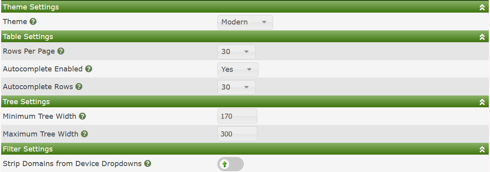
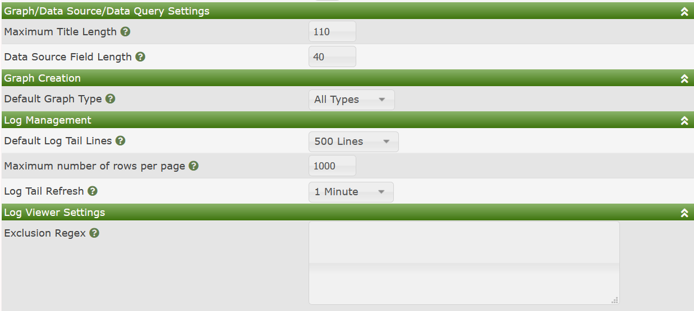
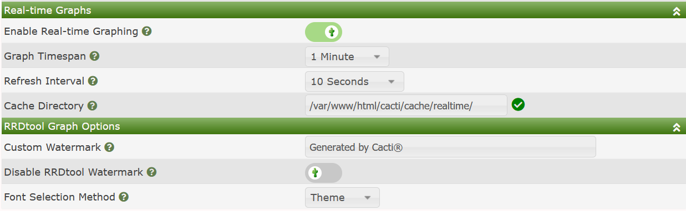
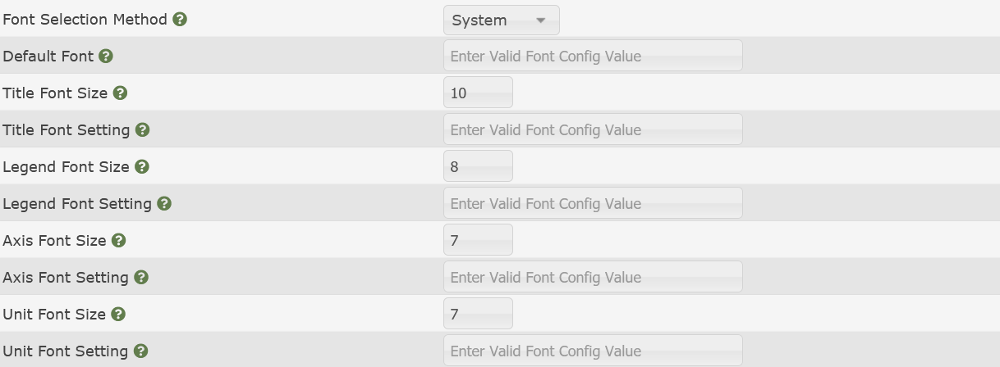

# Visual Settings

# Overview

Cacti's Visual settings page is where you can go to globally control
the behavior of Cacti's GUI.  Settings like the default Theme, the
maximum allowed size of a Graph Title, auto-complete settings, as well
as a myriad of other settings can be found here.

The Visual page is broken down into several sub-sections.  We will
cover them and the meaning of the various settings here.

> **NOTE**: This is a popular page for Plugin developers to augment.
> Therefore, if you have installed Plugins, your Settings page may
> look different than the default page.

## Theme, Table, Tree, and Filter Settings

The image below shows the default layout for these sub-sections.

Those settings include:

- **Theme** - The default theme that users logging into Cacti receive
- **Rows Per Page** - For all standard Cacti tables, the number of rows to
  show per page.
- **Auto-complete Enabled** - Many drop-downs do not scale well with thousands
  of items.  In those cases, Cacti has enabled a drop-down auto-complete feature
  most large installs should leverage it.  However, if you are a small install
  you can choose to disable auto-complete.
- **Auto-complete Rows** - The maximum rows to show in an auto-complete response.
- **Minimum Tree Width** - The minimum width of the Tree panel in Cacti
- **Maximum Tree Width** - The maximum width of the Tree panel in Cacti.  Above
  this width, tree items will scroll into the panel.
- **Strip Domains from Device Drop-downs** - Strip domain names from Device
  drop-downs to save horizontal filter space.

## Graph, Data Source, Data Query, Log Settings

The image below shows the default layout for these sub-sections.

Those settings include:

- **Maximum Title Length** - The maximum length of a Graph or Data Source title.
  Titles above this length will be clipped.
- **Data Source Field Length** - When applying |query_*| replacement values, the
  maximum supported length of those variables.  Variables longer than this will
  be clipped.
- **Default Graph Type** - When on the **New Graphs** page, which **Graph Type**
  filter should be the default.  With **Device Templates** with many
  **Data Queries** or **Graph Templates**, this page can become very long.
  Allowing you to select your preferred **Graph Type** makes navigating the
  page easier.
- **Default Log Tail Lines** - When viewing the Cacti Log, how many lines should
  appear per page.
- **Maximum number of rows per page** - The maximum number of regular expression
  search matches to display, when searching.
- **Log Tail Refresh** - The frequency that the log pages should auto-refresh.
- **Exclusion Reg-ex** - This setting allows you to exclude certain log messages
  by regular expression from normal users.  Expressions that include login
  log entries are common here to mask the login accounts of users.

## Realtime and RRDtool Graph Options

The image below shows the default layout for these sub-sections.

Those settings include:

- **Enable Real-time Graphing** - Allow Realtime graphs to be used in Cacti.
- **Graph Time-span** - The default system level `Graph Timespan` use use
  when a user opens a Realtime **Graph** for the first time.
- **Refresh Interval** - The default system level `Refresh Interval` for
  the Realtime interface when a user first opens a Realtime **Graph**.
- **Cacti Directory** - Where should Cacti cache Realtime PNG's and
  RRDfiles.
- **Custom Watermark** - A watermark that will appear on every Cacti
  **Graph**
- **Disable RRDtool Watermark** - Every RRDtool Graph includes a vertical
  watermark.  This option allows you to disable that.
- Font Selection Method** - This allows the system administrator to
  control, at a global level, how various text elements on RRDtool
  **Graphs** appear.  The settings include: Theme, or System.  When
  choosing `System`, your settings page will expand where you will
  then have additional control.

> **NOTE**: The RRDtool Watermark control requires a recent version of
> RRDtool, such as the 1.7 release.  If you attempt to use this setting
> and your **Graphs** break, then upgrade RRDtool.

## Font Selection Options

The image below shows the available Font Selection options when you
override the Theme settings.

The sizes are in pixels, and the Font Settings can either be a
True Type Font file path, or a valid Pango font-config value.
For more information on Pango font-config values, see your
operating systems documentation.  However, you can normally
see all the fonts installed on your Linux system by issuing
the following command `fc-list`.

---
<copy>Copyright (c) 2004-2023 The Cacti Group</copy>
