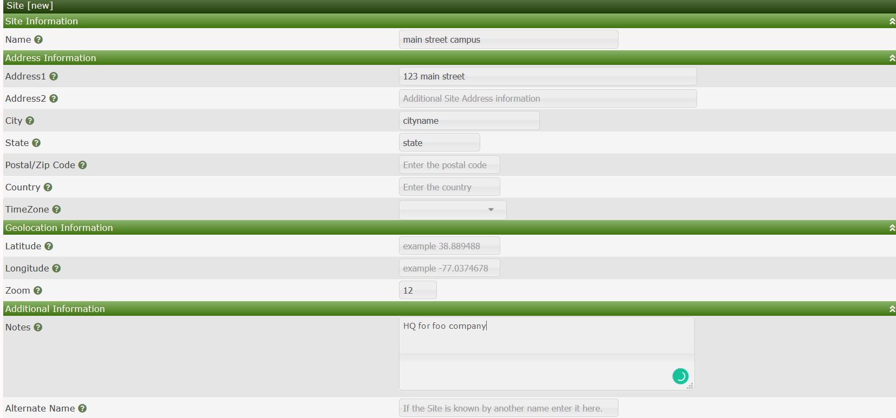
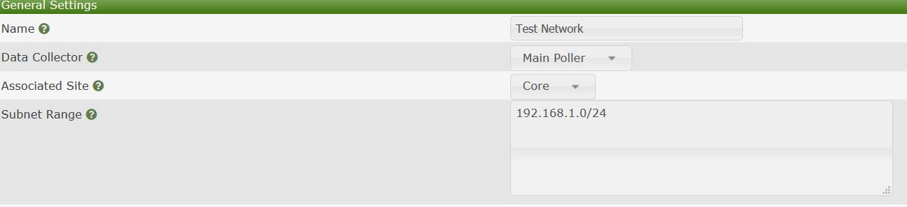

# Site Management

This section will describe **Site** management in Cacti.

Sites in cacti can be used to seperate differnt parts of your company with the respective location devices
i.e you can have a site called 123 main street in which you can associate all of the devices in that location to the site
this could also be a customer site or data ceneter location

.

Below is an example of some of the attribute data you can enter for the site/location
Enter the appropriate information for the site and click create on the below right side

.

Once you have created a site while you are creating a device manually you can now associate the device to the site

.

you can also associate the discovered devices via automation to a particular site.

.

---
Copyright (c) 2004-2019 The Cacti Group
