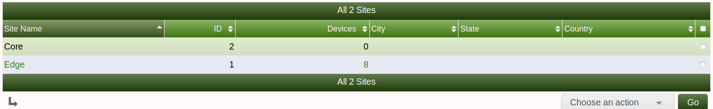
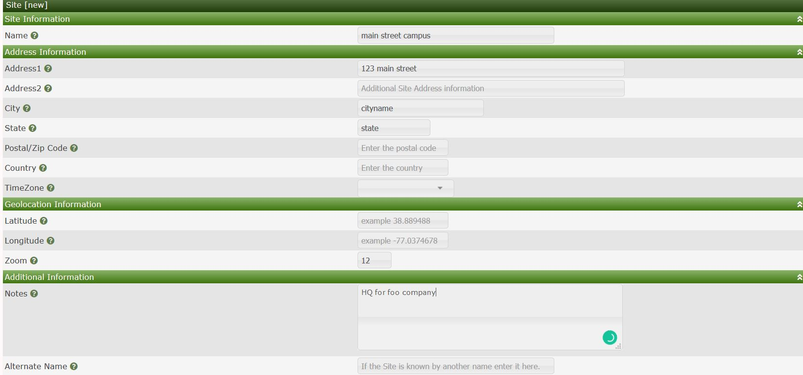
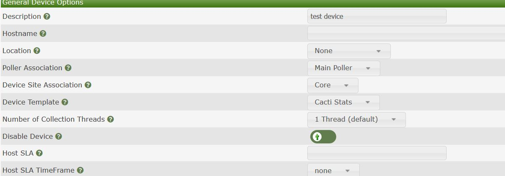
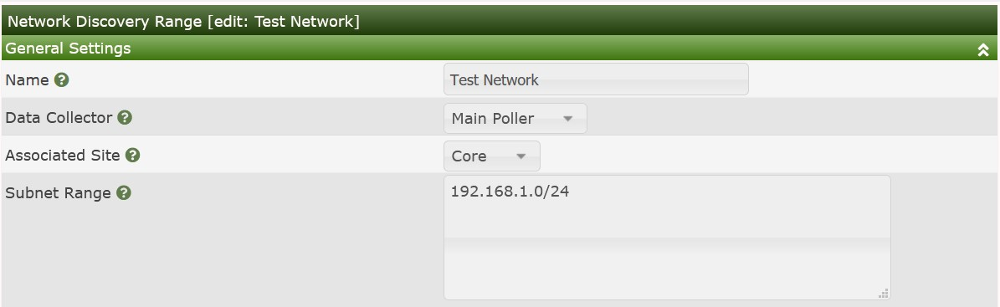

# Site Management

This section will describe **Site** management in Cacti.

Sites in Cacti can be used to separate different parts of your company
with the respective location devices. For example, you can have a site
called **123 main street** in which you can associate all of the devices
that are in the physical location to the Cacti site.  This could also
be a customer site or data center location

.

Below is an example of some of the attribute data you can enter for the
site/location

Enter the appropriate information for the site and click **Create** in the
lower right corner:

Once a site has been created, you can associate devices with it when adding
or editing a device:

You can also associate the discovered devices via automation to a
particular site.

.

---
Copyright (c) 2004-2026 The Cacti Group
