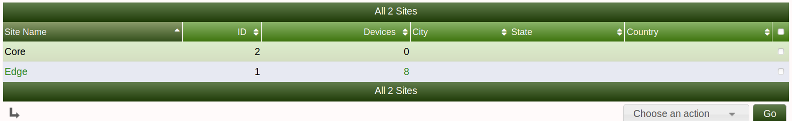

# Site Management

This section will describe **Site** management in Cacti.

Sites in Cacti can be used to seperate differnt parts of your company
with the respective location devices. For example, you can have a site
called **123 main street** in which you can associate all of the devices
that are in tha physical location to the Cacti site.  This could also
be a customer site or data center location

.

Below is an example of some of the attribute data you can enter for the
site/location

Enter the appropriate information for the site and click create on the
below right side

.

Once you have created a site while you are creating a device manually
you can now associate the device to the site

.

You can also associate the discovered devices via automation to a
particular site.

.

---
<copy>Copyright (c) 2004-2022 The Cacti Group</copy>
