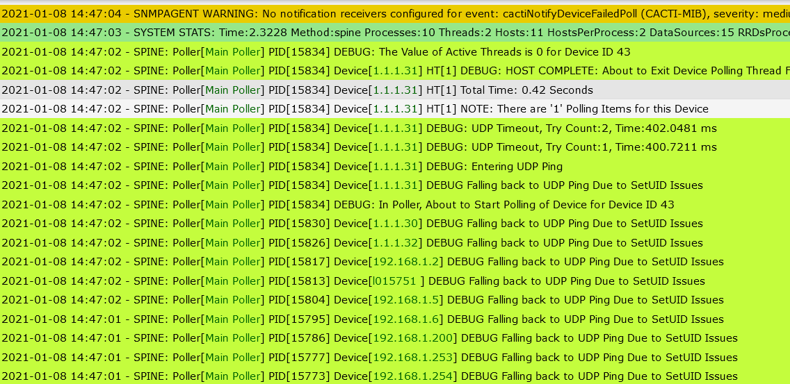

# Spine

Spine is the fast replacement for `cmd.php`. It is written in C to ensure
ultimate performance for device polling and is multi-threaded. Expect a
decrease in polling time of an order of magnitude. Polling times far
less than 60 seconds for about 20,000 data sources are achievable e.g.
on a dual XEON system supplied with 4 GB RAM and standard local disks.

When using Spine, don't change crontab or systemd settings! Always use
poller.php with crontab or cactid.php for systemd!

To activate Spine instead of cmd.php, please visit
`Console > Configuration > Settings > Poller` and select spine and save
as the `Poller Type`. If it's not showing as an available `Poller Type`
this means either it has not been installed, or it's path has not
been defined on the `Paths` tab within Settings.

Once saved, poller.php will use Spine on all subsequent polling cycles.
Before making this change, ensure that Spine runs properly from the
command line using the following test:

```console
cd /usr/local/spine/bin
./spine -R -V 3 -S
```

You should receive quite a bit of output depending on the size of your
system.  To increase the number of Threads and concurrent processes,
you must modify the setting when editing your Data Collector under
`Console > Data Collection > Data Collectors`.

While Spine is really fast, choosing the correct setup will ensure that all
processor resources are used. Required settings for Maximum Concurrent Poller
Processes are 1-2 times the number of CPU cores available for Spine.

When using spine, you must be senstivive to the numer of connections that
are available for MySQL or MariaDB.  Under
`Console > Utilities > System Utilities > General` Cacti will provide a
recommended `max_connection` for MySQL/MariaDB.

###### Table 15-1. Spine Parameters maintained at the System Level

Name | Description
--- | ---
Script and Script Server Timeout Value | The maximum time that Spine will wait on a script to complete, in units of seconds. If a Script Server Script is terminated due to timeout conditions, the value entered into the RRDfile will be NaN

###### Table 15-2. Spine Parameters maintained at the Data Collector Level

Name | Description
--- | ---
Maximum Threads per Process | The maximum threads allowed per process. Using a higher number when using Spine will improve performance. Required settings are 10-15. Values above 50 are most often insane and may degrade performance vs. improve it.
Number of PHP Script Servers | The number of concurrent script server processes to run per Spine process. Settings between 1 and 10 are accepted. Script Servers will pre-load a PHP environment. Then, the Script Server Scripts are included into that environment to save the overhead of reloading PHP and re-interpreting the binary for each call.

###### Table 15-3. Spine Parameters maintained at the Device Level

Name | Description
--- | ---
The Maximum SNMP OIDs Per SNMP Get Request | The maximum number of SNMP get OIDs to issue per SNMP request. Increasing this value increases poller performance over slow links. The maximum value is 60 OIDs, but that value is highly dependent on the MTU for your links to the remote devices.  In some cases, using a **Remote Data Collector** is much more effective for polling remote **Davices**. Additionally, some **Device Types** do not handle large SNMP OID get requests.  It's best to experiment until you find the correct setting.
Device Threads | The maximum number spine threads used to gather information from a **Device**.  When using this setting at the **Device** level, you have to ensure that you have enough threads allocated to a process so as to not block other **Devices** being polled from the same spine binary.

### Installing Spine

As Spine is written in C is must be compiled on the local system that it is to
be installed on  below is an example of compiling on centos and Ubuntu

### Ubuntu

Install the required system packages

```console
apt-get install -y build-essential dos2unix dh-autoreconf libtool help2man libssl-dev libmysql++-dev librrds-perl libsnmp-dev
```

Next, download the version of spine you are looking for Typically this should
match the version of Cacti you are using. In this case we will download Version
1.2.3 of Spine

```console
wget <https://github.com/Cacti/spine/archive/release/1.2.3.zip>
unzip 1.2.3
cd spine-release-1.2.3
```

Once you are in the spine directory its time to compile the poller by issuing
the following commands:

```console
./bootstrap
./configure
make
make install
chown root:root /usr/local/spine/bin/spine
chmod u+s /usr/local/spine/bin/spine
```

Once that has completed, you will need to configure spine's config file

```console
vi /usr/local/spine/etc/spine.conf
```

Below is an example of a configuration however yours should match your cacti
database username and password

```console
DB_Host       localhost
DB_Database   cacti
DB_User       spine
DB_Pass       spine
DB_Port       3306
#DB_UseSSL    0
#RDB_SSL_Key
#RDB_SSL_Cert
#RDB_SSL_CA
```

### CentOS

Install required system packages

```console
yum install -y gcc mysql-devel net-snmp-devel autoconf automake libtool dos2unix help2man
```

Then compile using the following commands

```console
./bootstrap
./configure
make
make install
chown root:root /usr/local/spine/bin/spine
chmod u+s /usr/local/spine/bin/spine
```

### Testing/Debugging spine via command line

spine offer a a few different ways at the command line to test its functionality.
Here are a few examples of some tests you can run by executing spine.

#### Test Spine without writing results to database

This test allows you to run spine and display the results to the console.
This will not commit any of the data to the database by specifying the -R
option.

```shell
/usr/local/spine/bin# ./spine -R -V 5
SPINE: Using spine config file [../etc/spine.conf]
2021-01-08 14:26:25 - SPINE: Poller[1] PID[13482] DEBUG: The path_php_server variable is /var/www/html/cacti/script_server.php
2021-01-08 14:26:25 - SPINE: Poller[1] PID[13482] DEBUG: The path_cactilog variable is /var/www/html/cacti/log/cacti.log
2021-01-08 14:26:25 - SPINE: Poller[1] PID[13482] DEBUG: The log_destination variable is 1 (FILE)
2021-01-08 14:26:25 - SPINE: Poller[1] PID[13482] DEBUG: The path_php variable is /usr/bin/php
2021-01-08 14:26:25 - SPINE: Poller[1] PID[13482] DEBUG: The availability_method variable is 2
2021-01-08 14:26:25 - SPINE: Poller[1] PID[13482] DEBUG: The ping_recovery_count variable is 3
2021-01-08 14:26:25 - SPINE: Poller[1] PID[13482] DEBUG: The ping_failure_count variable is 2
2021-01-08 14:26:25 - SPINE: Poller[1] PID[13482] DEBUG: The ping_method variable is 2
2021-01-08 14:26:25 - SPINE: Poller[1] PID[13482] DEBUG: The ping_retries variable is 1
2021-01-08 14:31:40 - SPINE: Poller[1] PID[13804] POLLER: Active Threads is 1, Pending is 1
2021-01-08 14:31:40 - SPINE: Poller[1] PID[13804] Device[38] DEBUG: Entering ICMP Ping
2021-01-08 14:31:40 - SPINE: Poller[1] PID[13804] Device[38] DEBUG: Attempting to ping 192.168.1.5, seq 9 (Retry 0 of 1)
2021-01-08 14:31:40 - SPINE: Poller[1] PID[13804] Device[38] DEBUG: Attempting to ping 192.168.1.5, seq 9 (Retry 0 of 1)
2021-01-08 14:31:40 - SPINE: Poller[1] PID[13804] Device[38] DEBUG: ICMP Device Alive, Try Count:1, Time:0.4990 ms
2021-01-08 14:31:40 - SPINE: Poller[1] PID[13804] Device[38] PING: Result ICMP: Device is Alive
2021-01-08 14:31:40 - SPINE: Poller[1] PID[13804] Device[38] HT[1] Device has no information for recache.
2021-01-08 14:31:40 - SPINE: Poller[1] PID[13804] Device[38] HT[1] NOTE: There are '1' Polling Items for this Device
2021-01-08 14:31:40 - SPINE: Poller[1] PID[13804] Device[38] DEBUG: The NIFTY POPEN returned the following File Descriptor 5
2021-01-08 14:31:40 - SPINE: Poller[1] PID[13804] Device[38] HT[1] DS[64] TT[9.95] SCRIPT: perl /var/www/html/cacti/scripts/ping.pl '192.168.1.5', output: 0.047
2021-01-08 14:31:40 - SPINE: Poller[1] PID[13804] Device[38] HT[1] Total Time: 0.018 Seconds
2021-01-08 14:31:40 - SPINE: Poller[1] PID[13804] Device[38] HT[1] DEBUG: HOST COMPLETE: About to Exit Device Polling Thread Function
2021-01-08 14:31:40 - SPINE: Poller[1] PID[13804] DEBUG: The Value of Active Threads is 0 for Device ID 38
2021-01-08 14:31:40 - SPINE: Poller[1] PID[13804] POLLER: Active Threads is 0, Pending is 0
```

#### Running spine for a specifc host

If you want to run spine for a specifc host you are able to do that with the
following command:

```shell
/usr/local/spine/bin# ./spine -R -f 42 -l 42 -V 5
SPINE: Using spine config file [../etc/spine.conf]
2021-01-08 14:34:14 - SPINE: Poller[1] PID[14296] DEBUG: The path_php_server variable is /var/www/html/cacti/script_server.php
2021-01-08 14:34:14 - SPINE: Poller[1] PID[14296] DEBUG: The path_cactilog variable is /var/www/html/cacti/log/cacti.log
2021-01-08 14:34:14 - SPINE: Poller[1] PID[14296] DEBUG: The log_destination variable is 1 (FILE)
2021-01-08 14:34:14 - SPINE: Poller[1] PID[14296] DEBUG: The path_php variable is /usr/bin/php
2021-01-08 14:34:14 - SPINE: Poller[1] PID[14296] DEBUG: The Value of Active Threads is 1 for Device ID 0
2021-01-08 14:34:14 - SPINE: Poller[1] PID[14296] POLLER: Active Threads is 1, Pending is 0
2021-01-08 14:34:14 - SPINE: Poller[1] PID[14296] SPINE: Active Threads is 1, Pending is 1
2021-01-08 14:34:14 - SPINE: Poller[1] PID[14296] DEBUG: In Poller, About to Start Polling of Device for Device ID 42
2021-01-08 14:34:14 - SPINE: Poller[1] PID[14296] Device[42] IPv4 address 1.1.1.30 (1.1.1.30)
2021-01-08 14:34:14 - SPINE: Poller[1] PID[14296] Device[42] DEBUG: Entering ICMP Ping
2021-01-08 14:34:14 - SPINE: Poller[1] PID[14296] Device[42] DEBUG: Attempting to ping 1.1.1.30, seq 0 (Retry 0 of 1)
2021-01-08 14:34:14 - SPINE: Poller[1] PID[14296] Device[42] DEBUG: ICMP Device Alive, Try Count:1, Time:26.5849 ms
2021-01-08 14:34:14 - SPINE: Poller[1] PID[14296] Device[42] PING: Result ICMP: Device is Alive
2021-01-08 14:34:14 - SPINE: Poller[1] PID[14296] Device[42] HT[1] Device has no information for recache.
2021-01-08 14:34:14 - SPINE: Poller[1] PID[14296] Device[42] HT[1] NOTE: There are '1' Polling Items for this Device
2021-01-08 14:34:14 - SPINE: Poller[1] PID[14296] Device[42] DEBUG: The NIFTY POPEN returned the following File Descriptor 7
2021-01-08 14:34:14 - SPINE: Poller[1] PID[14296] Device[42] HT[1] DS[68] TT[42.86] SCRIPT: perl /var/www/html/cacti/scripts/ping.pl '1.1.1.30', output: 26.9
2021-01-08 14:34:14 - SPINE: Poller[1] PID[14296] Device[42] HT[1] Total Time: 0.077 Seconds
2021-01-08 14:34:14 - SPINE: Poller[1] PID[14296] Device[42] HT[1] DEBUG: HOST COMPLETE: About to Exit Device Polling Thread Function
```

#### Spine debug via GUI

You are also able to view spine debug information via the log file
also spine allows you to raise the level of detail it provides in the log
if you want to debug a specific device and see the spine output click enable
device debug.

Below is an example output of Spine debug info via the log file



To enable more detailed spine logging go to
`Console > Configuration > Settings > Poller`

You can choose from Detailed,Summary or No logging for Invalid data

Detailed Logging will be similar to cmd.php in that you will get a report
for each data source that is having an issue

Summary provides a count of how many data sources are having an issue per device


### Common Spine related errors

```shell
2021/01/08 14:38:44 - SPINE: Poller[1] PID[14838] FATAL: Unable to read configuration file! (Spine init)
```

Ensure that you have spine.conf in /usr/local/spine/etc on first install
`spine.conf` may be `spine.conf.dist`.

```shell
DEBUG Falling back to UDP Ping Due to SetUID Issues
```

This is a permissions issue with spine ensure you have give spine the proper permissions

```shell
chmod u+s /usr/local/spine/bin/spine
```

---
<copy>Copyright (c) 2004-2022 The Cacti Group</copy>
