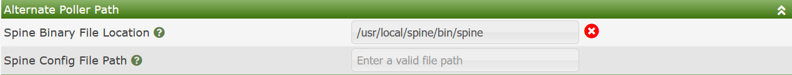

# Spine

Spine is the high-speed, multi-threaded poller replacement for `cmd.php`. Written in C,
it provides dramatic performance improvements for data collection. Where `cmd.php`
can take several minutes to poll large installations, Spine routinely polls tens of
thousands of data sources in well under 60 seconds on modern multi-core hardware.

Spine does not replace your cron or systemd scheduling entries. The scheduler entry point
remains `poller.php`. When Spine is selected as the poller engine, `poller.php` launches
Spine processes to perform the data collection across all configured devices.

---

## Spine Architecture and Operating Principles

1. **Multi-Threaded Polling**: Spine executes a thread-per-device polling model within
   multiple concurrent processes, allowing hundreds of metrics to be collected simultaneously.
2. **Persistent PHP Script Server**: For custom scripts, Spine starts and maintains
   long-running PHP script server processes (`script_server.php`). This eliminates the
   heavy overhead of repeatedly spawning the PHP binary for every individual script item.
3. **Privilege Separation (SUID Root)**: To perform raw ICMP pings without invoking external
   ping utilities, Spine requires raw socket access. Spine achieves this by shipping with the
   SUID root bit enabled (`chmod u+s`). At runtime, Spine strictly limits elevated privileges:
   it elevates effective UID only during raw socket creation (serialized by an internal lock)
   and immediately drops back to the calling user (such as `apache` or `www-data`).
4. **Direct Database Communication**: Spine queries the Cacti database directly via the
   MySQL/MariaDB client library to retrieve polling targets and writes collected data directly
   into the poller cache and RRD files.

---

## Installing Spine

Because Spine is written in C, it must be compiled against your local database and Net-SNMP
client development libraries.

### Prerequisites by Distribution

#### Enterprise Linux 8 & 9 (RHEL, Rocky Linux, AlmaLinux)

Spine requires development headers found in the CodeReady Builder (`crb`) repository on EL 9,
or `powertools` on EL 8:

1. Enable the repository:

   ```console
   # On EL 9 (RHEL 9, Rocky Linux 9, AlmaLinux 9):
   dnf config-manager --set-enabled crb

   # On EL 8 (RHEL 8, Rocky Linux 8, AlmaLinux 8):
   dnf config-manager --set-enabled powertools
   ```

2. Install compiler tools and development libraries:

   ```console
   dnf install -y gcc autoconf automake libtool dos2unix help2man \
     openssl-devel mariadb-devel net-snmp-devel
   ```

#### Ubuntu and Debian

On Ubuntu (22.04 LTS / 24.04 LTS) and Debian (11 / 12):

```console
apt-get update
apt-get install -y build-essential autoconf automake libtool dos2unix help2man \
  libssl-dev default-libmysqlclient-dev librrd-dev libsnmp-dev
```

#### FreeBSD

On FreeBSD, Spine can be installed directly from pre-built packages or compiled from Ports:

```console
# Using binary packages:
pkg install spine

# Or via FreeBSD Ports:
cd /usr/ports/net-mgmt/spine
make install clean
```

---

### Downloading and Compiling Spine

> **Important**: The version of Spine MUST match your Cacti version (e.g., Spine 1.2.31 for Cacti 1.2.31).

1. Download the release archive matching your Cacti version (replace `X.Y.Z` with your version):

   ```console
   cd /tmp
   wget https://github.com/Cacti/spine/archive/refs/tags/release/X.Y.Z.tar.gz -O cacti-spine-X.Y.Z.tar.gz
   tar -zxvf cacti-spine-X.Y.Z.tar.gz
   cd spine-release-X.Y.Z
   ```

2. Bootstrap, configure, and compile:

   ```console
   ./bootstrap
   ./configure
   make
   make install
   ```

   By default, Spine is installed to `/usr/local/spine`.

3. Set binary permissions (SUID Root):

   Spine must be owned by `root` with the setuid bit set so it can open raw ICMP sockets:

   ```console
   chown root:root /usr/local/spine/bin/spine
   chmod u+s /usr/local/spine/bin/spine
   ```

---

## Configuring `spine.conf`

Spine reads its database connection parameters from `spine.conf`.

1. Create the configuration file from the template:

   ```console
   cp /usr/local/spine/etc/spine.conf.dist /usr/local/spine/etc/spine.conf
   ```

2. Secure the file permissions:

   Because `spine.conf` contains the database password in plaintext, restrict permissions
   so only `root` and the web server / poller group can read it:

   ```console
   # On RHEL / Rocky / AlmaLinux (web group: apache):
   chown root:apache /usr/local/spine/etc/spine.conf
   chmod 0640 /usr/local/spine/etc/spine.conf

   # On Ubuntu / Debian (web group: www-data):
   chown root:www-data /usr/local/spine/etc/spine.conf
   chmod 0640 /usr/local/spine/etc/spine.conf
   ```

3. Edit `/usr/local/spine/etc/spine.conf` and update the database settings to match your
   Cacti `config.php`:

   ```ini
   DB_Host       localhost
   DB_Database   cacti
   DB_User       cactiuser
   DB_Pass       cactiuser_password
   DB_Port       3306
   #DB_UseSSL    0
   #RDB_SSL_Key
   #RDB_SSL_Cert
   #RDB_SSL_CA
   ```

---

## Testing Spine from the Command Line

Before activating Spine in the Cacti web interface, verify that it can connect to the database,
query devices, and send ICMP pings without error.

### 1. Read-Only Global Test

Run Spine in read-only test mode (`-R`) with summary statistics (`-S`) and verbosity level 3 (`-V 3`).
In this mode, Spine polls devices but does not write results into the database:

```console
/usr/local/spine/bin/spine -R -V 3 -S
```

Verify that the output shows Spine reading `/usr/local/spine/etc/spine.conf` and completes with:
`SPINE: Execution Time: ... Total Hosts: ...`

### 2. Device-Specific Test

To test a single device without polling your entire infrastructure, pass the host ID range using
`-f <host_id> -l <host_id>`:

```console
/usr/local/spine/bin/spine -R -f 1 -l 1 -V 5
```

Check the verbose output for ICMP ping success, SNMP retrieval, and script execution without errors.

---

## Enabling Spine in the Cacti Web UI

Once command-line verification passes, activate Spine in Cacti:

### Step 1: Set the Binary Path

1. Log in to Cacti as an administrator.
2. Navigate to **Console > Configuration > Settings > Paths**.
3. Under **Spine Poller File Path** (or **Spine Binary File Location**), enter:
   `/usr/local/spine/bin/spine`
4. Optionally, set **Spine Config File Path** to `/usr/local/spine/etc/spine.conf` (if left blank,
   Spine automatically searches its sibling `../etc` directory).
5. Verify that Cacti indicates `[OK: FILE FOUND]`.
6. Click **Save**.



### Step 2: Switch the Poller Engine

1. Navigate to **Console > Configuration > Settings > Poller**.
2. Change the **Poller Type** dropdown from `cmd.php` to `spine`.
3. Click **Save**.

The next scheduled polling cycle by `poller.php` will immediately invoke Spine.

---

## Tuning Spine for Optimal Performance

Spine parameters are configured at three distinct levels:

### 1. System-Level Settings

Configured under **Console > Configuration > Settings > Poller**:

| Parameter | Recommended Value | Description |
| :--- | :--- | :--- |
| **Script and Script Server Timeout** | 25 seconds | Maximum duration Spine waits for an external script or Script Server call before timing out and returning `NaN`. Must be less than your polling interval. |

### 2. Data Collector-Level Settings

Configured under **Console > Data Collection > Data Collectors** (select your collector):

| Parameter | Recommended Value | Description |
| :--- | :--- | :--- |
| **Maximum Concurrent Poller Processes** | 1–2 per CPU core | Number of Spine processes launched concurrently. For a 4-core system, 4 to 8 processes is typical. |
| **Maximum Threads per Process** | 10–20 threads | Number of concurrent threads per process. Do not set higher than 50, as excessive context switching degrades performance. |
| **Number of PHP Script Servers** | 2–5 per process | Number of persistent `script_server.php` workers maintained per Spine process to handle script data queries. |

### 3. Device-Level Overrides

Configured on individual devices under **Console > Management > Devices**:

| Parameter | Default | Description |
| :--- | :--- | :--- |
| **Device Threads** | 1 | Number of concurrent threads dedicated to polling this specific device. Increase for high-density switches or routers with hundreds of interfaces. |
| **Maximum OIDs Per Get Request** | 10–60 | Number of SNMP OIDs bundled into a single SNMP GET request. Higher values increase throughput over high-latency links, provided the device agent supports it. |

---

## Database Connection Sizing (`max_connections`)

Each concurrent Spine process, thread, and script server requires database connections. Ensure your
MySQL/MariaDB `max_connections` limit is sized adequately:

Total Connections >= (Data Collectors * Processes * (Threads + Script Servers + 2)) + 50

If this setting is too low, Spine will fail with `FATAL: Connection to MySQL database failed`.

Edit `/etc/my.cnf.d/server.cnf` (or `/etc/mysql/mariadb.conf.d/50-server.cnf`) and set:

```ini
[mysqld]
max_connections = 500
```

Restart the database server after changing `max_connections`.

---

## Security Policies (SELinux & AppArmor)

### SELinux (RHEL, Rocky Linux, AlmaLinux)

If SELinux is enforcing, allow the web server and poller to establish outgoing network connections:

```console
setsebool -P httpd_can_network_connect 1
setsebool -P httpd_can_network_connect_db 1
```

Ensure the Spine binary has the appropriate system binary context (`bin_t`):

```console
semanage fcontext -a -t bin_t "/usr/local/spine/bin/spine"
restorecon -v /usr/local/spine/bin/spine
```

### AppArmor (Ubuntu / Debian)

If using a confined profile for Apache or PHP-FPM, allow execution of the Spine binary:

```console
# Add to /etc/apparmor.d/local/usr.sbin.apache2:
/usr/local/spine/bin/spine rix,
/usr/local/spine/etc/spine.conf r,
```

Reload AppArmor:

```console
apparmor_parser -r /etc/apparmor.d/usr.sbin.apache2
```

---

## Troubleshooting Spine

### Common Errors and Solutions

#### 1. `FATAL: Unable to read configuration file! (Spine init)`

* **Cause**: Spine cannot locate or read `spine.conf`.
* **Fix**: Ensure `/usr/local/spine/etc/spine.conf` exists and is readable by the user executing
  the poller (e.g. `apache` or `www-data`):
  ```console
  ls -la /usr/local/spine/etc/spine.conf
  chmod 640 /usr/local/spine/etc/spine.conf
  ```

#### 2. `DEBUG: Falling back to UDP Ping Due to SetUID Issues`

* **Cause**: Spine is missing the SUID root permission required to open raw ICMP sockets.
* **Fix**: Restore SUID permissions on the binary:
  ```console
  chown root:root /usr/local/spine/bin/spine
  chmod u+s /usr/local/spine/bin/spine
  ```

#### 3. `FATAL: Connection to MySQL database failed`

* **Cause**: Incorrect database credentials in `spine.conf`, database host unreachable, or
  MySQL/MariaDB `max_connections` reached.
* **Fix**: Test database connectivity manually with `mysql -u cactiuser -p -h localhost cacti`
  and increase `max_connections` in your MySQL configuration.

#### 4. Verification in Cacti Log

To confirm Spine is functioning in production, open **Console > Utilities > System Utilities > View Cacti Log**.
Look for the poller completion summary line:

```text
SYSTEM STATS: Time:12.3456 Method:spine Processes:4 Threads:40 Hosts:250 HostsPerProcess:63 DataSources:12400 RRDsProcessed:6200
```

If the log displays `Method:spine`, Spine is running successfully.

---
Copyright (c) 2004-2026 The Cacti Group
