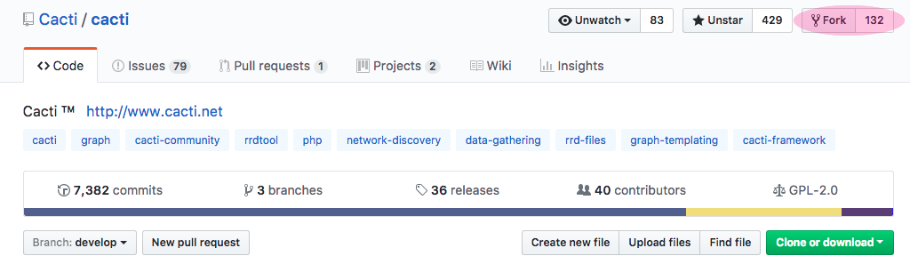

# Patch Creation

## Overview

In order to create a patch for inclusion into the cacti project, you need to
create a pull request which holds the changes to be made.  Please note, it is
better if your request also includes a change to `docs/CHANGELOG` with a brief
description of your change (this is included with the distributed project).

The basic steps to creating a pull request are to fork cacti (by clicking on
"Fork") into your own repo on GitHub. You can use just the main develop branch
of your forked repo as long as all future changes can also appear in the same
pull request (until it is merged).  However, it is cleaner to create a separate
branch from your local develop which includes the changes for the specific fix
leaving the develop branch alone.

## Conventions used

The following terms are defined here for an understanding when they are used
later.

* **repo** is a repository of files/code/images

* **fork** is the creation of a new **repo** based on an existing **repo**

* **origin** is the **repo** that you have created on GitHub

* **upstream** is the **repo** that you have forked from on GitHub

* **branch** is similar to a **fork** but within an existing **repo** contains a
  separate area of work * **commit** is a collection of changes that are stored
  together

* **git** is a command that should be installed locally on the developers
  machine

* **Issue-1153** is an example branch whose name is based of the number of the
  issue created on GitHub

_Note: During this page, any reference to Issue-1153 is the branch name that
should be replaced by your own branch name._

## Creating your developer details

The first time you come to use `git` if you try to commit, it will use your
local settings to mark the commit with a username and email address.  However,
if these are not defined, then it will use username@machinename as the email
address and username as the name.  These details will be stored against the
commit that you make so it is always advisably to set them.  To change these,
use

```shell
git config --global user.name "yourname"
git config --global user.email "email@example.com"
```

## Creating your local clone

1. Fork cacti on github.com using the Fork button that appears top right of the
   code area.

   

2. Clone the source to your local machine, you can use one of the following two
   lines.  The second allows you to clone into a directory of your own naming,
   whilst the first takes the repo's name.

   ```shell
   git clone https://github.com/<myuser>/cacti
   git clone https://github.com/<myuser>/cacti <dirname>
   ```

3. If you have previously cloned your repo locally, you should always ensure you
   are back on your own develop branch so that you are not branching from another
   branch (unless you really want !).  The double minus at the end ensures that all
   files are replaced with the current branch version.

   ```shell
   git checkout origin/develop --
   ```

4. Next, you should create a branch for the work you want to do and there are
   two ways to do this.  If you want to create a new branch (I tend to call it
   Issue-# where # is the issue number) using command line

   ```shell
   git checkout -b Issue-1153
   git push --set-upstream origin Issue-1153
   ```

5. If you want to create a new branch on your forked repo on github, do so by
   clicking on the branch (normally Develop) on the GitHub code page, then type in
   the new name of a branch before hitting return.  GitHub will then create and
   switch to that branch but your local repo will know nothing of this yet.

   

To checkout the newly created branch, you need to pull down the latest GitHub
information using `git fetch` before perform the checkout.  It will as follows:

```shell
git fetch
git checkout Issue-1153
```

At this point, you will have a local repo (which is a replica of your forked
cacti repo) downloaded and available to edit with the changes you wish to make.
At any time, whilst making changes or once all done, you can see the files that
have changed using `git status` and if you want to see the actual differences
then you would use `git diff`.

## Commit your changes

To commit any changes that you have made, you must first commit them to your
local repo. This does not affect the online GitHub repo that you have forked
from cacti's repo.  Neither of these are touched at this time.

1. Add any change file to the commitment list using either `git stage` or `git
   add` (they are both the same command)

   ```shell
   git stage <file>
   ```

2. Commit your changes to the local repo

   ```shell
   git commit
   ```

This has now committed the changes you made to your local repo. Again, please
note, this has not yet published these changes on GitHub to your forked repo.

## Update with the latest development source

Before you publish your local changes back to GitHub (or even afterwards),
you've may have noticed changes being made to the cacti (upstream) project that
are you not in your origin (forked) or local repos.  If you were to commit a
pull request using your local changes, there would be quite a few differences.
You also wouldn't know if there was likely to be a conflict with your changes.
Travis CI is now running against the cacti repo so conflicts do usually show up
there if no where else.

In order to get these latest changes, we must pull from the upstream (cacti)
repo and commit these to our local repo.

1. If you have previously added an upstream repo, you may skip this step.  If
   not, we add the upstream using the following command.

   ```shell
   git remote add upstream https://github.com/cacti/cacti.git
   ```

2. With the upstream established, we must fetch the latest upstream information
   so `git` knows what can be used.

   ```shell
   git fetch upstream
   ```

3. Now, with this latest information available, we can merge any changes from
   the main development branch using the following command.  Note that at this
   point, you can use an alternative branch, if you are trying to apply this to a
   feature branch such as 1.2.x for example.

   ```shell
   git merge upstream/develop
   ```

4. Once we have merged the latest changes, there may be conflicts due to changes
   made by other people at the same point in a file as you have made. Any file
   listed as being in conflict needs to be edited by looking for the `<<<` and `>>>`
   points.

5. Edit these points (and there may be more that one set in a given file) as you
   will see both the original upstream version and your edited version.  You must
   remove everything but the changes you desire including the chevron points before
   you exit the file leaving it in a full working state.

6. Once your done editing all the conflicts, you must add the file so that `git`
   knows you wish to commit this file later.

   ```shell
   git add <file>
   ```

7. Finally, you can commit the changes which will default the message as below.
   If you wish to abort the commit, ensure that there are no non-blank lines or
   only lines that start with a #.  Anything else will be treated as a commit
   message.

   > Merge remote-tracking branch 'upstream/develop' into Issue-1153

   ```shell
   git commit
   ```

## Getting changes back up to GitHub

In order to get changes back from your local repo back to Github in your forked
repo, you need to "push" the changes back up.

1. Push those latest merges up to github

   ```shell
   git push
   ```

At this point, if you have not saved your GitHub credentials, these will be
prompted for and you will have to manually enter.

_Note: this will NOT have affected the main cacti repo at all, only your forked
copy._

## Updating other branches

If you want to update to the latest develop source on the develop branch, or
master on the master branch just repeat the "Update with the latest development
source" against the appropriate branches instead.  eg, update origin/develop
with upstream/develop or origin/master with upstream/master.

## Creating a git patch and applying it elsewhere

Sometimes, if you have quite a lot of changes you wish to port to another
branch, it's worth performing the following:

1. Get the commit hash number from github.com or from `git log`

2. Create a patch file of the difference by comparing the provided has with it's
   parent (^)

   ```shell
   git diff -p 1c0dd0e75d8b6d234eecc63acb68280c9bae0d06^ 1c0dd0e75d8b6d234eecc63acb68280c9bae0d06 > diff.patch
   ```

3. This can then be applied later using

   ```shell
   git apply diff.patch
   ```

If you are going to have many patch files, it is worth naming them using a
convention that keeps them unique.

## Creating a pull request on the cacti repo

Once you have committed and published all the changes that you need to make for
your issue/fix/enhancement, you will need to let the cacti group know that these
changes are available.  To do this, you can browse to your code and then click
on pull request


This will then switch you automatically over to the cacti repo, create a pull
request and fill in details as much as possible.  You will then have the
opportunity to edit the title and enter a description.  It would be wise to put
as much detail as possible, and if you referring back to a previous issue, place
a link to that too.


After you have entered the details above, double check the changes that follow
and make sure you have no conflicts again.  It is normal to have conflicts here
if you have no been updating your local repo with the changes from the upstream
(cacti) repo.  If not, everything will look OK.


If you are positive that you have everything in order, click Create Pull Request
and this will be submitted to the cacti repo. Once the developers there have
reviewed your changes they will either suggest some alterations or they will
successfully commit your code in.

Once your code has been pulled in, you should see an option to safely delete the
branch that you created at the bottom of the pull request.  Clicking this will
remove the repo from public view (though you can later revert this if you wish
to).

## Alternative to setting upstream on push

If you do not want to keep setting the origin on the initial push in the long
format, you can shorten this by using the following:

```shell
git config --global push.default current
```

Once that has been done, all future pushes to the origin source can be achieved
using:

```shell
git push -u
```

---
<copy>Copyright (c) 2004-2021 The Cacti Group</copy>
