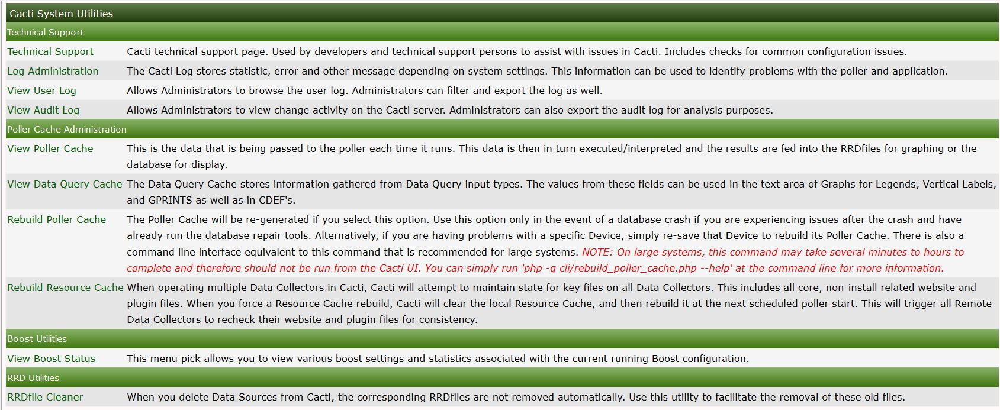

# System Utilities

This section will describe **System Utilities** in Cacti.

The system utilities page in cacti contains tools used for administering
cacti from this page you can do the following

- Rebuild poller cache.

- View technical support information.

- Adjust log settings.

- View the user log for audits.

.

Some of the most important tools are listed below

### Rebuild poller cache

The Poller Cache will be re-generated if you select this option. Use this
option only in the event of a database crash if you are experiencing issues
after the crash and have already run the database repair tools. Alternatively,
if you are having problems with a specific Device, simply re-save that Device
to rebuild its Poller Cache. There is also a command line interface equivalent
to this command that is recommended for large systems. NOTE: On large systems,
this command may take several minutes to hours to complete and therefore
should not be run from the Cacti UI. You can simply run
'php -q cli/rebuild_poller_cache.php --help' at the command line for more
information.

### Technical support

Cacti technical support page. Used by developers and technical support persons
to assist with issues in Cacti. Includes checks for common configuration issues.

### RRD cleaner

When you delete Data Sources from Cacti, the corresponding RRDfiles are not
removed automatically. Use this utility to facilitate the removal of
these old files.

---
Copyright (c) 2004-2020 The Cacti Group
