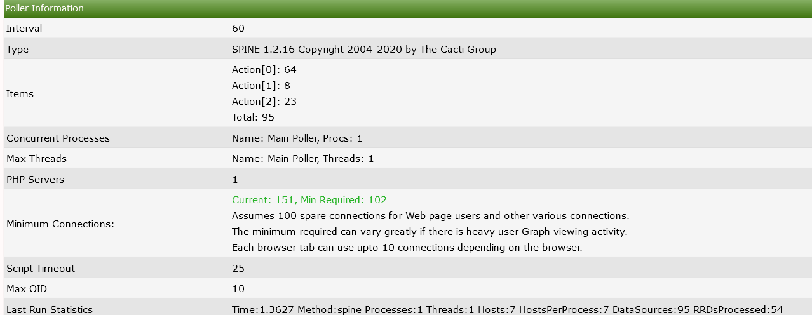
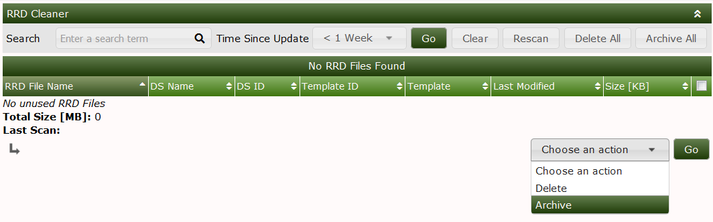
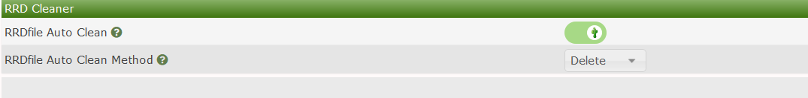
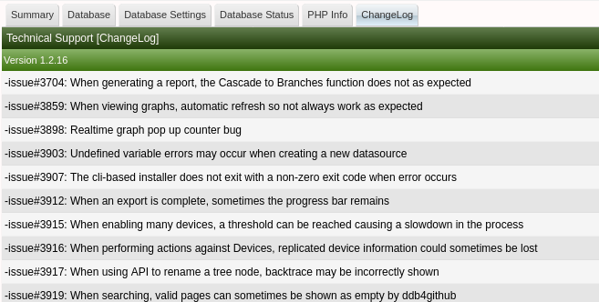
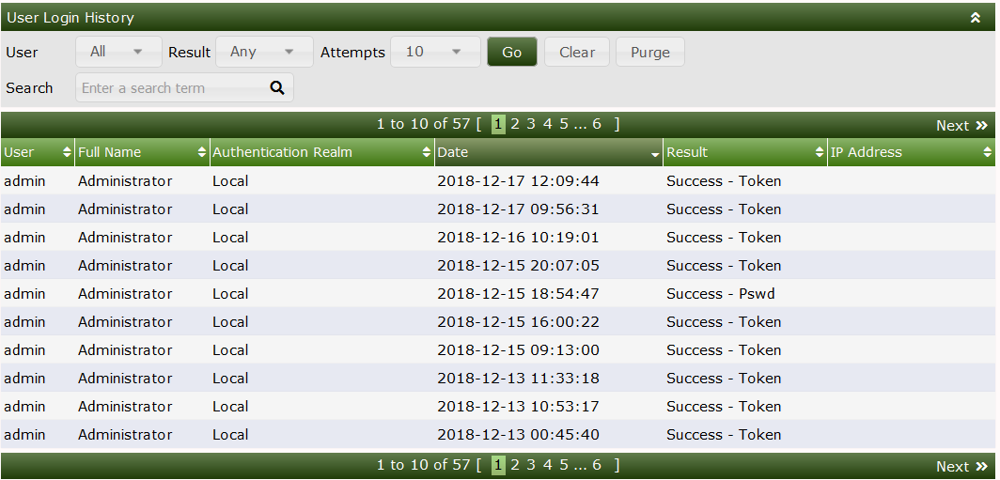
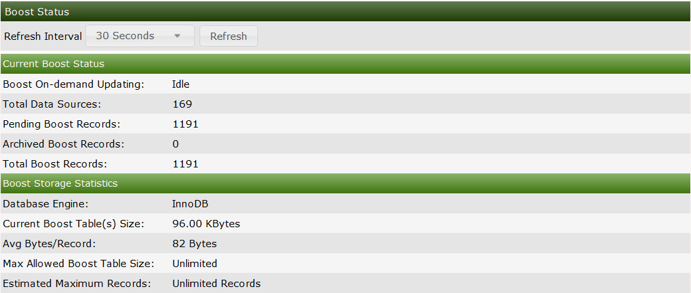
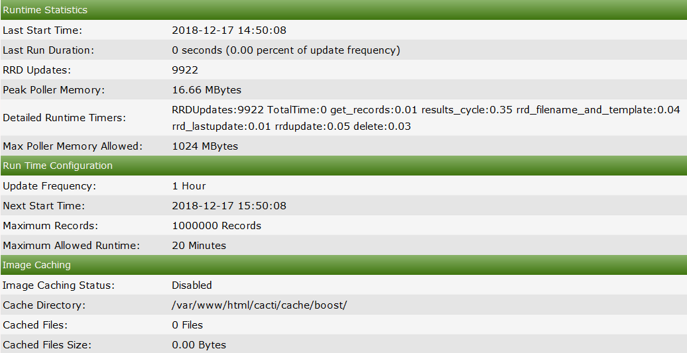
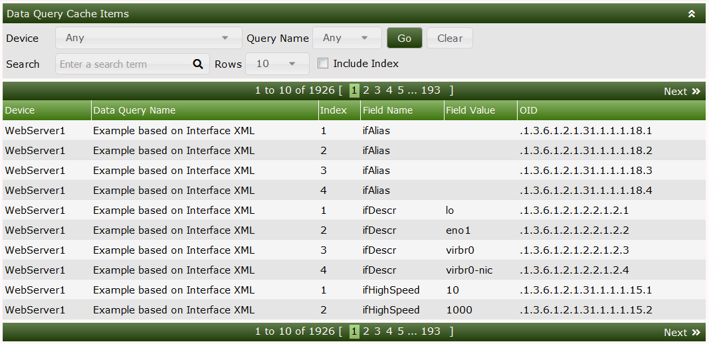
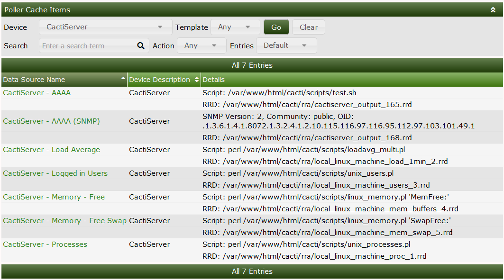
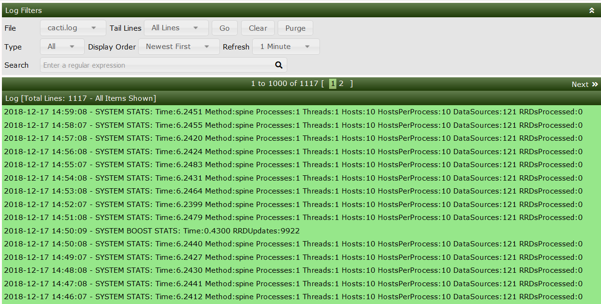

# System Utilities

This section will describe **System Utilities** in Cacti.

The system utilities page in cacti contains tools used for administering
cacti from this page you can do the following

- Rebuild poller cache.

- View technical support information.

- Adjust log settings.

- View the user log for audits.

.

Some of the most important tools are listed below

### Rebuild poller cache

The Poller Cache will be re-generated if you select this option. Use this
option only in the event of a database crash if you are experiencing issues
after the crash and have already run the database repair tools. Alternatively,
if you are having problems with a specific Device, simply re-save that Device
to rebuild its Poller Cache. There is also a command line interface equivalent
to this command that is recommended for large systems. NOTE: On large systems,
this command may take several minutes to hours to complete and therefore
should not be run from the Cacti UI. You can simply run
'php -q cli/rebuild_poller_cache.php --help' at the command line for more
information.

### Technical support

Cacti technical support page.  Used by developers and technical support
persons to assist with issues in Cacti.  Includes checks for common
configuration issues.  There is also built-in checks that help you tune
your Cacti installation.

For example in the technical support section under the summary, you will see a
calculation for how many MySQL connections. You should have (Cacti 1.2.16+)
you will also show poller information such as the last polling time process
count and more detailed info that can be used for a quick view of how the
system is configured.

.

You will also see all of the system variables such as allocated php memory
as well as mysql variables.

Any Variable appearing in red indicates a subpar setting and should be looked.
the recomendations are dynamic in that they change when more system resources are
detected so if you upgrade your server hardware be sure to check back to this page
to get the most out of your new hardware.

### RRD cleaner

`Console > utilities > System Utilities > RRDfile Cleaner`

When you delete Data Sources from Cacti, the corresponding RRDfiles are not
removed automatically. Use this utility to facilitate the removal of
these old files.

In system utilities you can manually start the RRD cleaning procedure 
You can either archive the selected RRD's to have them deleted in the next polling cycle

RRDfiles can also be schedule to automatically be removed this option can
be configured in `Console > Configuration > Settings > Paths` by selecting
the RRDfile autoclean selection.

### Viewing Change log from system utilities

With Cacti 1.2.16+, you are now able to view the CHANGELOG information up to the
version your server is currently running.  This is available via the system
utilities menu which is useful for seeing what fixes and occasional features are
included in your version.

### View user login history

`Console > utilities > System Utilities > View user Log`

In system utilities you are able to view a log of user logins both successful and failures
The Log will also show what Client IP address the login originated from along with info 
if the login was based on password or token based login

### View boost update status and stats

`Console > Utilities > System Utilities > View Boost Status`

In this view you can see statistics on how Boost is running you will be able to see 
Information such as when the last time boost started, How long it ran for, The average boost record size

### Viewing the Data Source Query Cache

`Console > Utilities > System Utilities > View Data Source Query Cache`

The Data Query Cache stores information gathered from Data Query input types. 
The values from these fields can be used in the text area of Graphs for Legends, Vertical Labels, and GPRINTS as well as in CDEF's.

### Viewing the Poller Cache 

`Console > Utilities > System Utilities > View Poller Cache`

This is the data that is being passed to the poller each time it runs.

### Viewing System log via System Utilities

You are able to view the system log via the System utilities page this will show the RAW log
this slightly differs from the view log tab as the device names will show the device ID rather than 
the Device name this is the same view as you reading the log in the OS

---
<copy>Copyright (c) 2004-2021 The Cacti Group</copy>
