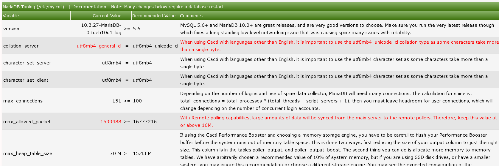

# System Utilities

This section will describe **System Utilities** in Cacti.

The system utilities page in cacti contains tools used for administering
cacti from this page you can do the following

- Rebuild poller cache.

- View technical support information.

- Adjust log settings.

- View the user log for audits.

.

Some of the most important tools are listed below

### Rebuild poller cache

The Poller Cache will be re-generated if you select this option. Use this
option only in the event of a database crash if you are experiencing issues
after the crash and have already run the database repair tools. Alternatively,
if you are having problems with a specific Device, simply re-save that Device
to rebuild its Poller Cache. There is also a command line interface equivalent
to this command that is recommended for large systems. NOTE: On large systems,
this command may take several minutes to hours to complete and therefore
should not be run from the Cacti UI. You can simply run
'php -q cli/rebuild_poller_cache.php --help' at the command line for more
information.

### Technical support

Cacti technical support page.  Used by developers and technical support
persons to assist with issues in Cacti.  Includes checks for common
configuration issues.  There is also built-in checks that help you tune
your Cacti installation.

For example in the technical support section under the summary, you will see a
calculation for how many MySQL connections. You should have (Cacti 1.2.16+)
you will also show poller information such as the last polling time process
count and more detailed info that can be used for a quick view of how the
system is configured.

.

You will also see all of the system variables such as allocated php memory
as well as mysql variables.

Any Variable appearing in red indicates a subpar setting and should be looked.
the recomendations are dynamic in that they change when more system resources are
detected so if you upgrade your server hardware be sure to check back to this page
to get the most out of your new hardware.

### RRD cleaner

When you delete Data Sources from Cacti, the corresponding RRDfiles are not
removed automatically. Use this utility to facilitate the removal of
these old files.

RRDfiles can also be schedule to automatically be removed this option can
be configured in `Console > Configuration > Settings > Paths` by selecting
the RRDfile autoclean selection.

### Viewing Change log from system utilities

Starting from Cacti 1.2.16 you are able to view the change log of the current
version you are using via the system utilities menu this is useful for
seeing what fixes are included in your version as well as new release versions

---
Copyright (c) 2004-2021 The Cacti Group
