# Templates

The real strength of Cacti is unleashed by using templates. There are three different types of templates with the basic Cacti installation: **Data Templates**, **Graph Templates**, **Device Templates**, **Aggregate Templates**, and **Color Templates**. While it is perfectly fine to define all data sources and graphs without using Templates at all, the burden of this approach is high. In most installations, there are lots of devices of the same kind. And there are lots of data of the same kind, e.g. traffic information is needed for almost every device. Therefore, the parameters needed to create a traffic rrd file are defined by a *Data Template*, in this case known as "Interface - Traffic". These definitions are used by all Traffic-related RRDfiles.

The same approach is used for defining **Graph Templates**. This is done only once. And all parameters defined within such a **Graph Template** are copied to all **Graphs** that are created using this Template.

The last type of Templates are the **Device Templates**. They are not related to some RRDtool stuff. The purpose of **Device Templates** is to group all **Graph Templates** and **Data Queries** (these are explained later) for a given device type.  So you will make up a **Device Template** e.g. for a specific type of router, switch, host and the like. By assigning the correct **Device Template** to each new **Device**, you'll never forget to create all needed **Graphs**.

There's no need to create all Templates on your own! Apart from the fact, that many common templates are provided out-of-the-box, there's a very simple machanism to **Import Templates** and to **Export Templates**.

## Data Templates

In Cacti, a **Data Template** provides a skeleton for an actual **Data Source**. If you have many **Data Sources** that share most of their characteristics, using a **Data Template** would probably make sense. No change of a **Data Template** is propagated to already existing RRDfiles. But most of them may be changed by using `rrdtool tune` from command line. Pay attention to not append new *Data Source Items* to already existing RRDfiles. There's no `rrdtool` command to achieve this!

### Creating a Data Template

To create a new **Data Template**, select **Data Templates** under the **Console > Templates** menu heading and click Add.

The first thing you must do is give the template a name. This name has nothing to do with the **Data Source** name, but is what you will use to identify the template throughout Cacti.

Second, you will notice a list of data source/data source item field names with Use Per-Data Source Value checkboxes next to each one. The nice thing about templates in Cacti is that you can choose whether to template each field on a per-field basis. If you leave the checkbox unchecked, every data source attached to the template will inherit its value from the template. If the checkbox is checked, every data source attached to the template will contain its own value for that particular field. When generating a real data source, you will be prompted to fill those non-templated fields.

###### Table 13-1. Data Templates: Field Description of the Data Source Section

Name | Description
--- | ---
Name | The name of the Data Source that will be created by using this Template. You can use the keyword |host_description| in this field, which will be automatically substituted with the current host description.
Data Input Method | Here is where you tell cacti how it is supposed to fetch data for this data source. There are several data input sources that come with cacti, and you can add your own by going to Data Input Methods. If this RRD file is being populated outside of cacti, make sure to leave this field set to "None".
Associated RRAs | You need to associate the data source with at least one RRA so RRDTool knows how often and for how long to keep its data. You will almost always want to select all of these values however so you can render daily, weekly, monthly, and yearly graphs.
Step | This tells RRDTool how many seconds there will be between updates. The default is 300 seconds (5 minutes), and is sufficient for most installations.
Data Source Active | This is a quick and easy to tell Cacti to stop gathering data for this data source. The data source can still be used on graphs, but no data will be fed to it until it is made active again.

> **Note:** For most data templates, you will want to check the Use Per-Graph
> Value checkbox for the name field so each data source using this template
> has its own unique name. It also makes sense to enter an inital value in
> this field that includes the variable `|host_description|` for organizational
> purposes.

When you are finished filling in values for the data template, click Create and
you will be presented with a screen similar to the data source edit screen.

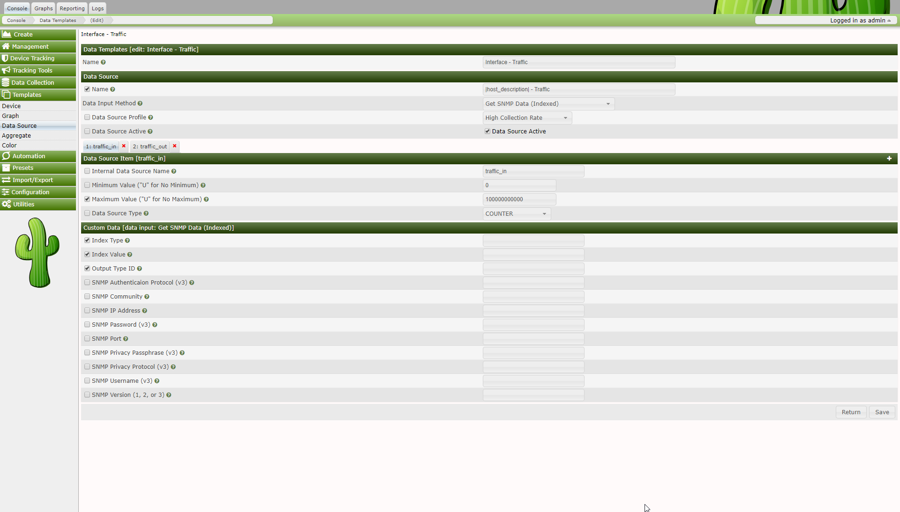

#### Data Source Items

Like a graph, a data source can have more than one items. This is useful in
situations where a script returns more than piece of data at one time. This
also applies to data queries, so you can have a single data template that
contains both inbound and outbound traffic, rather than having to create a
separate data template for each.

###### Table 13-2. Data Templates: Field Description of the Data Source Items Section

Name | Description
--- | ---
Internal Data Source Name | This is the name used by RRDTool to identify this particular data source within the RRD file. RRDTool places a limit of 19 alphanumeric characters (plus '_' and '-') on this field.
Minimum Value | Here is where you specify the minimum value that is expected for this data source in the RRD file. If a value lower than the minimum is given, it will be stored as Unknown (U).
Maximum Value | Here is where you specify the maximum value that is expected for this data source in the RRD file. If a value higher than the maximum is given, it will be stored as Unknown (U). Note: It often makes sense to define a reasonable maximum value here to avoid spikes in case of a COUNTER wrap
Data Source Type | Cacti currently supports four types of data that RRDTool can represent for any given data source: COUNTER: is for continuous incrementing counters like the ifInOctets counter in a router. The COUNTER data source assumes that the counter never decreases, except when a counter overflows. It is always a whole INTEGER, floating point numbers are invalid. The update function takes the overflow into account. The counter is stored as a per-second rate. When the counter overflows, RRDTool checks if the overflow happened at the 32bit or 64bit border and acts accordingly by adding an appropriate value to the result. GAUGE: numbers that are not continuously incrementing, e.g. a temperature reading. Floating point numbers are accepted. ABSOLUTE: counters that are reset upon reading. DERIVE: like COUNTER but without overflow checks
Heartbeat | As defined by RRDTool: "The maximum amount of time that can pass before data is entered as "unknown". This field is usually '600' or 2 data gathering intervals".

#### Custom Data

Assuming you selected a data input source on the previous screen, you should
now be presented with a Custom Data box. It will show a single line for every
single parameter required for that very data input method. This is how the Data
Source glues together with the data input method to provide all run time
parameters.

Each custom data field is per-field templatable as all of the other data source
fields are. Even if you select the Use Per-Data Source Value checkbox, it might
be useful to specify a value that will be used as an "inital value" for any
data source using this data template.

### Applying Data Templates to Data Sources

> **Note:** When changing parameters of a Data Template, existing rrd files
> will never be changed. If this is required, you will have to apply
> `rrdtool tune` commands to any related rrd file manually.

Applying a data template to a data source is a very simple process. The first
thing you must do is select the data source you want to apply the template to
under Data Sources. Under the Data Template Selection box, select the data
template that you want to apply to the data source and click Save.

Once the template is applied to the data source, you will notice that you can
only change values for the fields that you checked Use Per-Data Source Value
for.

> **Note:** Now any time a change is made to the data template, it will be
> automatically propagated to the data sources attached to it.

#### Walkthrough: My First Data Template

For this task, let's stick to SNMP stuff. For you to be able to reproduce this
example, I've chosen the **UDP** information of the IP MIB.

```console
snmpwalk -c <community string> -v1 <device> udp
UDP-MIB::udpInDatagrams.0 = Counter32: 7675
UDP-MIB::udpNoPorts.0 = Counter32: 128
UDP-MIB::udpInErrors.0 = Counter32: 0
UDP-MIB::udpOutDatagrams.0 = Counter32: 8406
```

As cacti does not use the MIBs but pure ASN.1 OIDs, let's search the OID used
as udpInDatagrams:

```console
snmpwalk -c <community string> -v1 -On <device> udp
.1.3.6.1.2.1.7.1.0 = Counter32: 7778
.1.3.6.1.2.1.7.2.0 = Counter32: 129
.1.3.6.1.2.1.7.3.0 = Counter32: 0
.1.3.6.1.2.1.7.4.0 = Counter32: 8514
```

The needed OID is .1.3.6.1.2.1.7.1.0. Now learn how to enter this into a new
Cacti Data Template: Please proceed to Data Templates and filter for SNMP.
Check the SNMP - Generic OID Template

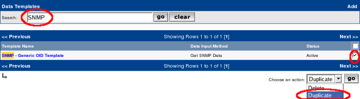

After clicking Go, you're prompted with a new page to enter the name for the
new Data Template:

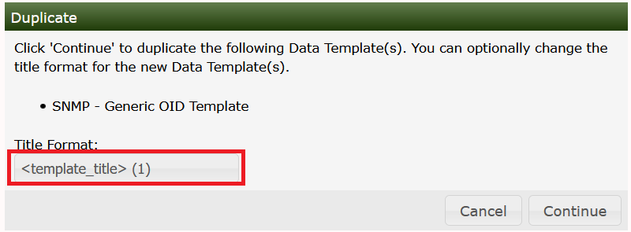

Due to the filter defined above, you won't see the new Template at once, so
please enter udp as a new filter to find:

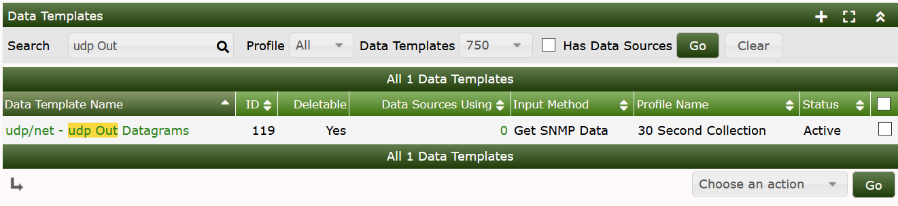

Now select this entry to change some definitions according to the following
images:

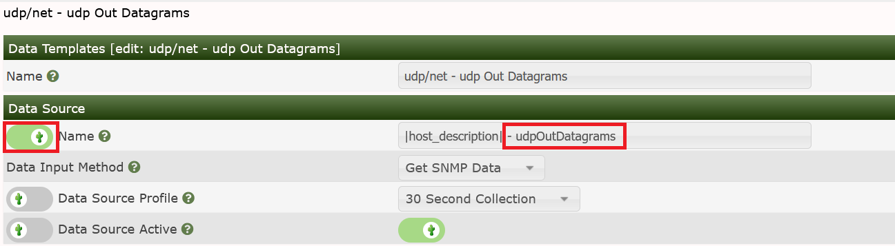

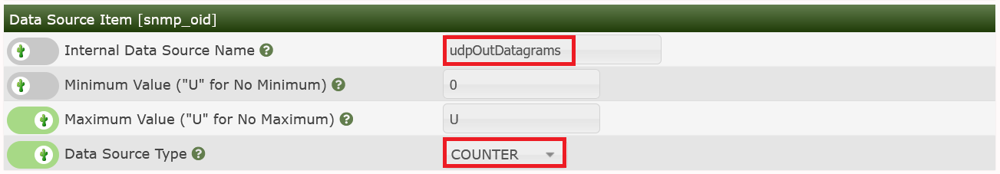

for the lower one. Please pay attention to change the MAXIMUM value to 0 to
prevent data suppression for values exceeding 100. And you saw the OID
`.1.3.6.1.2.1.7.1.0` from above, didn't you? Please copy another one for OID
`.1.3.6.1.2.1.7.4.0`, using the description **udpOutDatagrams**

## Graph Templates

In Cacti, a graph template provides a skeleton for an actual graph. If you have
many graphs that share most of their characteristics, using a graph template
would probably make sense. After a graph is attached to a particular graph
template, all changes made to the graph template will propagate out to all of
its graphs, unless Use Per-Graph Value has been checked.

### Creating a Graph Template

To create a new graph template, select Graph Templates under the Templates
heading and click Add.

The first thing you must do is give the template a name. This name has nothing
to do with the graph title, but is what you will use to identify the template
throughout Cacti. Second, you will notice a list of graph field names with Use
Per-Graph Value checkboxes next to each one. The nice thing about templates in
Cacti is that you can choose whether to template each field on a per-field
basis. If you leave the checkbox uncheked, every graph attached to the template
will inherit its value from the template. If the checkbox is checked, every
graph attached to the template will contain its own value for that particular
field.

###### Table 13-3. Field Description: Graph Templates

Name | Description
--- | ---
Title | The title of the graph within Cacti and the title that will be printed on the actual graph itself. Note: You can use the keyword |host_description| in this field, which will be automatically substituted with the current host description.
Image Format | Choose whether you would prefer to output your graph images in PNG or SVG. GIF is supported only with rrdtool 1.0.x and has been deleted from rrdtool 1.2.x and later
Height | The height of the graph area in pixels
Width | The width of the graph area in pixels
Slope Mode | RRDtool graphs are composed of stair case curves by default. This is in line with the way RRDtool calculates its data. Some people favor a more "organic" look for their graphs. RRDTool version 1.2 and above support smoothing of graphs, know as slope mode.
Auto Scale | Enable auto scale for the graph. This option must be check to use the next two options. Upper/Lower limit values are ignored when using autoscale since these boundaries are determined automatically.
Auto Scale Options | Choose whether you would like to use --alt-autoscale (ignoring given limits), --alt-autoscale-max (accepting a lower limit), --alt-autoscale-min (accepting an upper limit, requires rrdtool 1.2.x) or --alt-autoscale (accepting both limits, rrdtool default) on the graph. The RRDTool graph manual says: Limits [-u|--upper-limit value] [-l|--lower-limit value] [-r|--rigid] By default the graph will be autoscaling so that it will adjust the y-axis to the range of the data. You can change this behaviour by explicitly setting the limits. The displayed y-axis will then range at least from lower-limit to upper-limit. Autoscaling will still permit those boundaries to be stretched unless the rigid option is set. [-A|--alt-autoscale] Sometimes the default algorithm for selecting the y-axis scale is not satisfactory. Normally the scale is selected from a predefined set of ranges and this fails miserably when you need to graph something like "260 + 0.001 * sin(x)". This option calculates the minimum and maximum y-axis from the actual minimum and maximum data values. Our example would display slightly less than "260-0.001" to slightly more than "260+0.001" (this feature was contributed by Sasha Mikheev). [-J|--alt-autoscale-min] Where "--alt-autoscale" will modify both the absolute maximum AND minimum values, this option will only affect the minimum value. The maximum value, if not defined on the command line, will be 0. This option can be useful when graphing router traffic when the WAN line uses compression, and thus the throughput may be higher than the WAN line speed. [-M|--alt-autoscale-max] Where "--alt-autoscale" will modify both the absolute maximum AND minimum values, this option will only affect the maximum value. The minimum value, if not defined on the command line, will be 0. This option can be useful when graphing router traffic when the WAN line uses compression, and thus the throughput may be higher than the WAN line speed.
Logarithmic Scaling | Choose if you want logarithmic y-axis scaling.
Scientific Units for Logarithmic Scaling | This option is not available for rrdtool-1.0.x. For linear graphs, scientific units (in magnitudes of k=kilo, M=mega, ...) is default. But for logarithmic graphs, exponential notation is default. Choose if you want logarithmic y-axis scaling and scientific units.
Rigid Boundaries Mode | From the RRDTool manual "Normally rrdgraph will automatically expand the lower and upper limit if the graph contains a value outside the valid range. With this option you can disable this behavior".
Auto Padding | If you have ever created RRDTool-based graphs manually, you may have realized how annoying it can be to get text to line up properly. With this option Cacti will do its best to make the columns on your graph legend line up. This option works best when your graph legend has a consistent number of columns.
Allow Graph Export | If you choose to use Cacti's static HTML/image export, you can choose whether you want each individual graph to be exported.
Upper Limit | The maximum value that will be displayed on the y-axis. This value is ignored is auto-scaling is turned on.
Lower Limit | The minimum value that will be displayed on the y-axis. This value is ignored is auto-scaling is turned on.
Base Value | Whether you want to base the y-axis labels on 1000 or 1024. This field will typically be set to 1024 for memory and 1000 for traffic measurements.
Unit Grid Value | Sets the unit value for the y-axis (--y-grid). You should probably keep the unit short as to keep it readable.
Unit Exponent Value | Sets the 10^e scaling of the y-axis. Valid values for this field are between -18 and 18. For example, you could use 3 to display everything in 'k' (kilo) or -6 to display everything in 'u' (micro).
Vertical Label | The text to print on the left edge of the graph. Usually is the units the data on the graph is measured in.

> *Note:* For most graph templates, you will want to check the Use Per-Graph
> Value checkbox for the title field so each graph using this template has its
> own unique title. It also makes sense to enter an initial value in this field
> that includes the variable |host_description| for organizational purposes.

When you are finished filling in values for the graph template, click Create
and you will be presented with a page similar to the graph edit page.

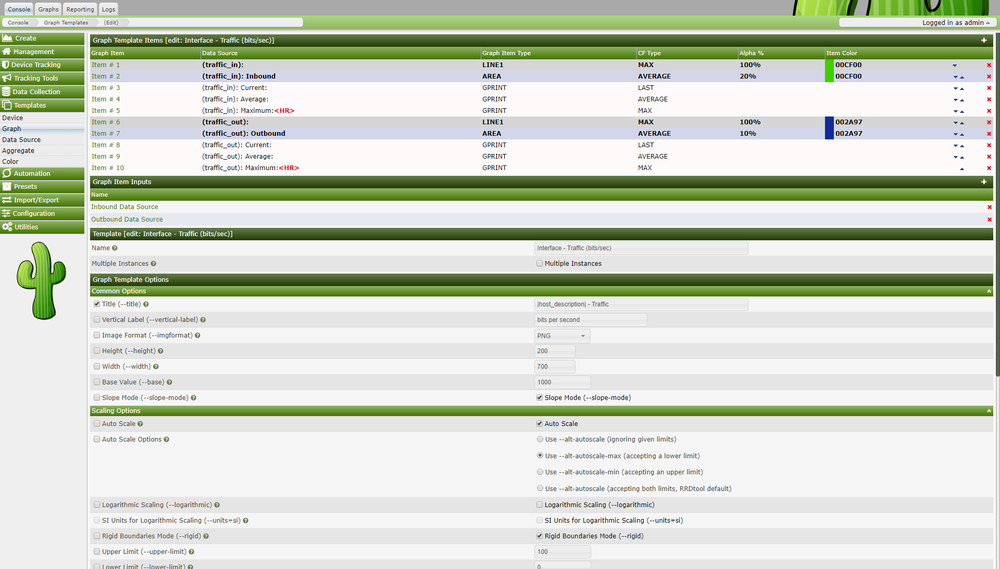

#### Graph Items

The first thing you should do is create graph items for this graph template,
just like for a regular graph. One difference you will notice is that the Data
Sources dropdown will contain a list of data template items rather than data
source items. It is important that Cacti can make this association here, so
that Cacti doesn't have to make unnecessary assumptions later.

###### Table 13-4. Field Description: Graph Template Items

Name | Description
--- | ---
Data Source | If this graph item is to represent some sort of data, you must select a your data source here. Keep in mind that not all graph items have a data source. Graph item types such as COMMENT, VRULE, and HRULE typically do not.
Color | Depending on the graph item type, you can select a color for the graph item. This field only applies to the graph item types AREA, STACK, LINE1, LINE2, and LINE3.
Opacity/Alpha Channel | For a colored graph item, you may optionally select an opacity (alpha channel). This option is not available with rrdtool-1.0.x.
Graph Item Type | This field is important because it defines what kind of graph item this is. Types such as AREA, STACK, LINE1, LINE2, and LINE3 are used to represent data on the graph, while COMMENT and GPRINT are used put on the legend. The LEGEND type is specific to Cacti only and can be used if you want to Cacti to automatically create a GPRINT-LAST/GPRINT-AVERAGE/GPRINT-MAXIMUM graph item for you. Note: You must always put an AREA item before using STACK or your graph will not render.
Consolidation Function | This tells RRDTool which consolidation function to use when representing this data on the graph. You will typically use AVERAGE for most things on the graph area, and LAST/MAXIMUM as well for GPRINT items.
CDEF Function | If you want to apply a CDEF function to the graph item, select one here. Check out the CDEF section of the manual for more information.
Value | This field is only used with the HRULE/VRULE graph item types. Type any valid integer to draw the line at for HRULE or the time of the day HH:MM for VRULE.
GPRINT Type | If this item is a GPRINT, you can choose how you want the number to be formatted. You can add your own in the GPRINT Presets section of Cacti.
Text Format | You can enter text to be displayed on the legend here. This field is applicable for all graph item types except for the virtual LEGEND type.
Hard Return | Check this box to force graph items onto the next line.

#### Graph Item Inputs

After creating graph items for your template, you will need to create some
graph item inputs. Graph item inputs are unique to graph templates because of
the large number of items they sometimes contain. Graph item inputs enable you
to take one graph item field, and associate it with multiple graph items.

To create a new graph item input, click Add on the right of the Graph Item
Inputs box. There are various fields that must be filled in for every graph
item input:

###### Table 13-5. Field Description: Graph Template Items

Name | Description
--- | ---
Name | This will be the name used to identify the graph item input on both the graph template and graph edit pages.
Description | (Optional) This description will be displayed on the graph edit page of any graph using this template if specified.
Field Type | You must choose the field that you are going to associate with one or more graph items.
Associated Graph Items | Choose one or more graph items to associate with the field selected for "Field Type". When the user specifies a value for the field, it will be applied to all of the items you select here.

### Applying Graph Templates to Graphs

Applying a graph template to a graph is a very simple process. The first thing
you must do is select the graph you want to apply the template to under Graph
Management. Under the Graph Template Selection box, select the graph template
that you want to apply to the graph and click Save. If this is a new graph or
the graph and graph template contains an equal number of graph items, the graph
template will be automatically applied. If number of graph items varies from
the graph to the target graph template, you will be propmted with a warning
that your graph will be changed.

Once the template is applied to the graph, you will notice that you can only
change values for the fields that you checked Use Per-Graph Value for. You will
also notice a new box, called Graph Item Inputs. This is where you can specify
values for the graph items inputs that you defined in the graph template. The
values specified here will be applied to each graph item tied to the graph item
input.

> **Note:** Any time a change is made to the graph template, it will be
> automatically propagated to the graphs attached to it.

#### Walkthrough: My First Graph Template

Now let's generate the **Graph Template** for those already generated Data
Templates. Please goto **Graph Templates** and **Add** a new one:


Now you have to fill in some global parameters:

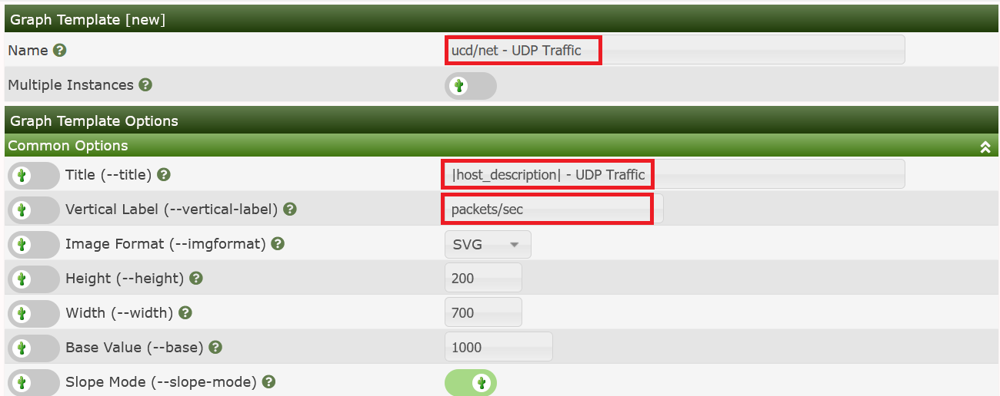

on the lower part of the page, please fill in:

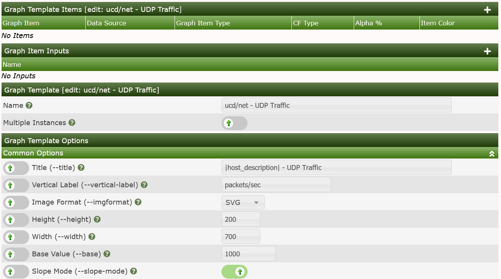

and **Create** to see:

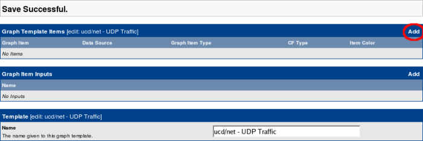

Now let's add some Graph Template Items. They will specify, which Data Sources
defined by some Data Template should be displayed on the Graph. Please click
Add as shown on the last image:

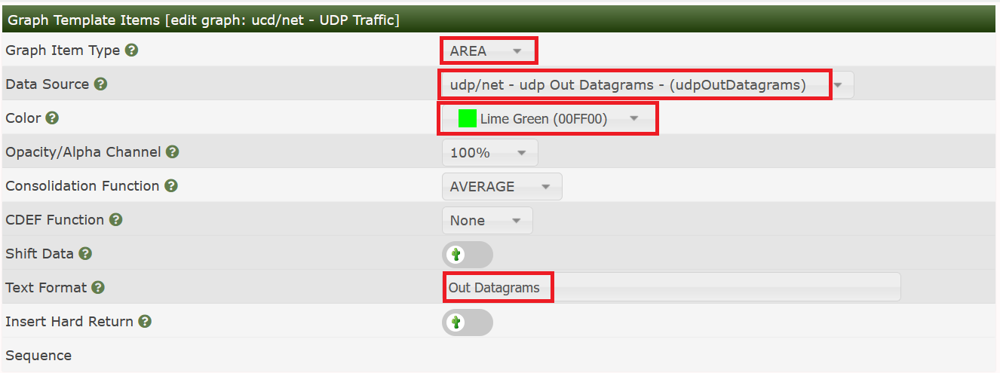

Now click Save to see:


I always appreciate some nice legends to see the numbers for e.g. maximum,
average and last value. There's a shortcut for this:

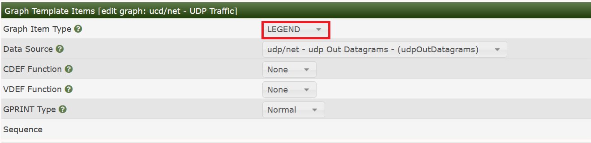

Press Save to see three legend items created in one step!

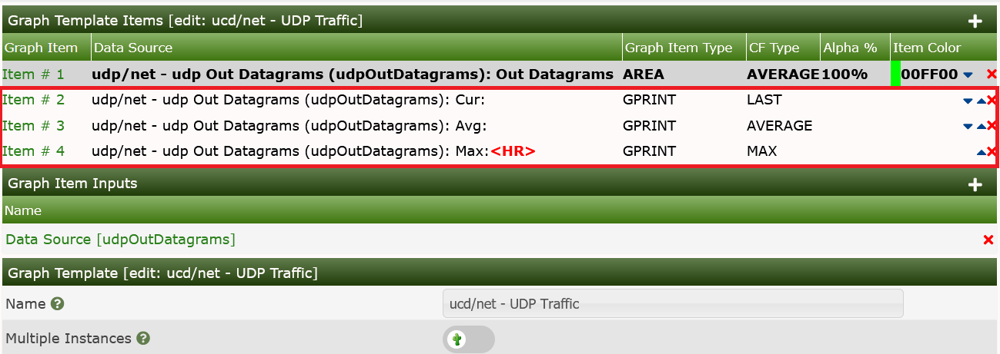

Now let's turn to the second data source. This works very much the same way. So
see all four images in sequence:

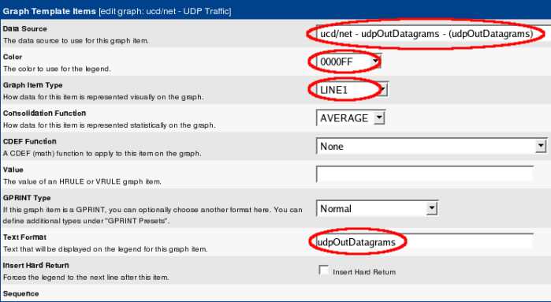

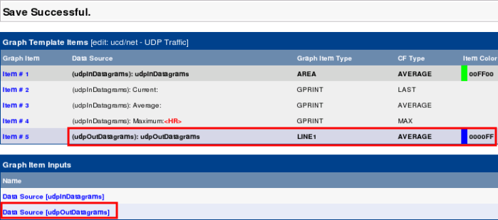

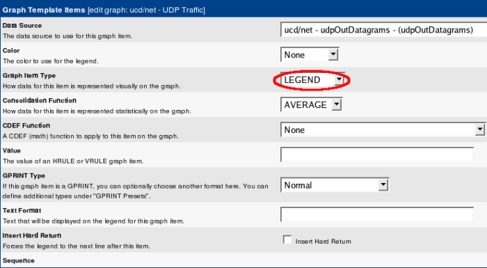

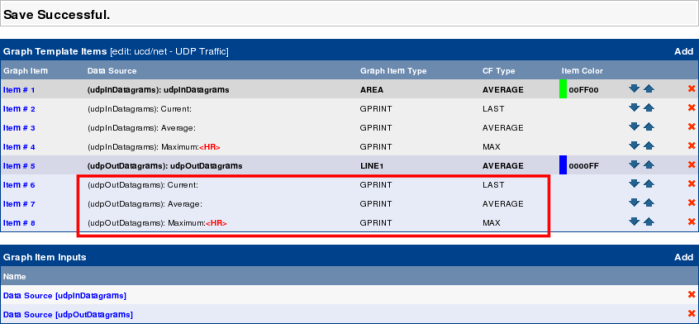

 Please scroll down to the bottom of the page and Save your whole work.

Now, you may add this new Graph Template to any hosts that responds to those
udp OIDs. But in this case, please wait a moment. Let's first proceed to the
Host Templates and use this new Graph template for our first own Host Template.

## Host Templates

Host templates in Cacti serve a different purpose then data and graph
templates. Instead of abstracting the fields of a host, a host template allows
you to associate graph templates and data queries with a given host type. This
way when you assign a host template to a host, all of the relevant graphs to
that host type are only one click away from the user.

### Adding a Host Template

To create a new host template in Cacti, select the Host Templates option under
the Templates heading. Once on that screen, click Add on the right. Type a
unique name for the host template and click the Create button. You will be
redirected back to the edit page with the Associated Graph Templates and
Associated Data Queries boxes. These two boxes allow you to associate certain
graph templates or data queries with the host template. Simply select something
from the dropdown menu and click Add to associate it with your host template.

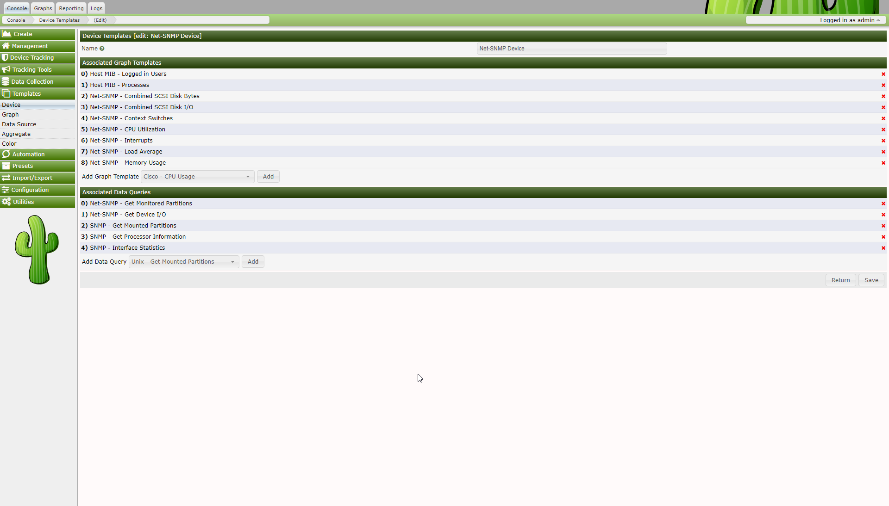

### Walkthrough: My First Host Template

The next task is creating a new **Host Template**. Switch over to **Host
Templates** and **Add**:

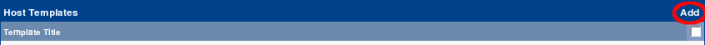

and fill in the name of this new Template:

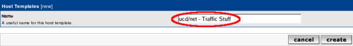

Now you'll find two sections added. First, let's deal with **Associated Graph
Templates**. The Add **Graph template** select box holds all defined Graph
Templates. Select the one we've just created

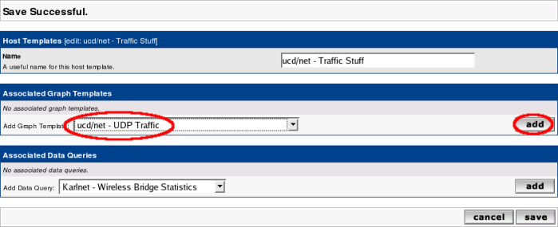

and Add it:

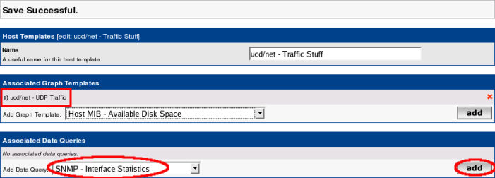

Next, let's add the Data Query already selected above:

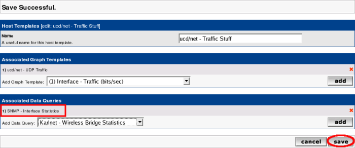

## Import Templates

Assume, you're searching for a specific set of templates to monitor a special type of device. Apart from designing templates from scratch, there's a good chance to find a solution in the [Scripts and Templates Forum](http://forums.cacti.net/forum-12.html).  The set of templates is usually provided as a single XML file holding all required definitions for a data template and a graph template. Depending on the goal of the original author, he/she may have provided a **Device Template** as well as part of this XML file.  Note that after you **Import Templates**, you may also have to copy a Resource XML file to the appropriate &lt;path_cacti&gt;/resource directory, and a script to the &lt;path_cacti&gt;/scripts directory.  However, also note that in the current version of Cacti, **Packages** are now importable as well.  When you import a **Package** all of the required additional file changes will also be accomodated.  We will discuss **Packages** later in the docuemntation.

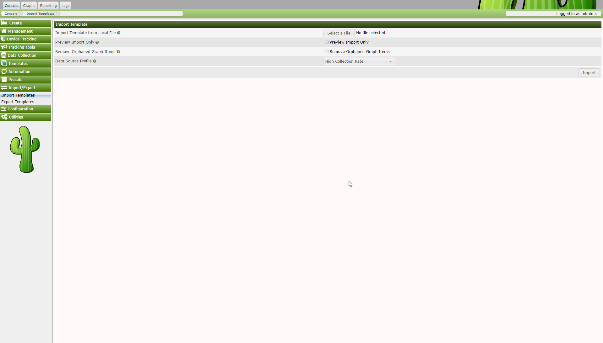

If the XML file was downloaded, simply select that file from the Downloads location on your local system.  Cacti no longer supports pasting the XML into the browser window.

Please pay attention the the `Data Source Profile` field. By default, cacti will attempt to use your default **Data Source Profile**.  However, you can change that at import time to use an alternate **Data Source Profile** or even the one from the **Template** itself, if it includes one.

Also, not that if you have made local modification to an earlier version of a **Graph Template**, and wish to fully migrate to the new **Graph Template** for all your existing **Graphs**, please select `Remove Orphaned Graph Items`.  Otherwise, your **Graphs** will look awkward in the end.  This should not be a problem for new Imports.

It's also important to `Preview` the **Template** imports to access the impact that the import will have on existing database object.  In earlier versions of Cacti, you were unable to determine what would actually change.  However, in the current and future versions of Cacti, you will be able to see all local modifications when performing a `Preview` prior to `Importing`.

As mentioned previously, for a single OID based template, **Importing** the **Template** is all that will be required. However, for a script based template, the author will provide the script that has to be downloaded to the Cacti `./scripts` directory and for a **Data Query** based **Template**, a second XML file holding the Data Query definitions will have to be downloaded to the appropriate directory under `./resources`.

When importing templates, Cacti will perform a version check. All XML templates hold the version of the Cacti system that generated this XML set. Cacti will import only, if your current Cacti version equals or is higher than the exporting one.

## Export Templates

Now that you know how to import, you may want to know in which way to export as well. Selecting the Export Templates gives

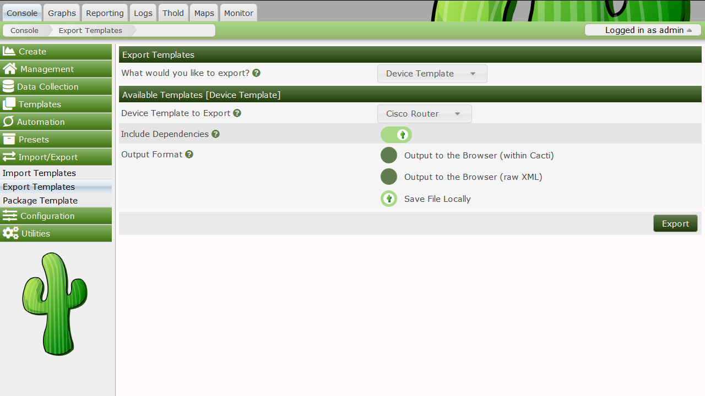

You may select to export a graph template, a data template, a **Device Template** or a **Data Query**. When selecting `Include Dependencies`, e.g. a **Device Template** will include all referred templates (**Graph Template**, **Data Template**, if defined, **Data Query**). Output may be written to the browser or to a file for uploading.

---
Copyright (c) 2018 Cacti Group
