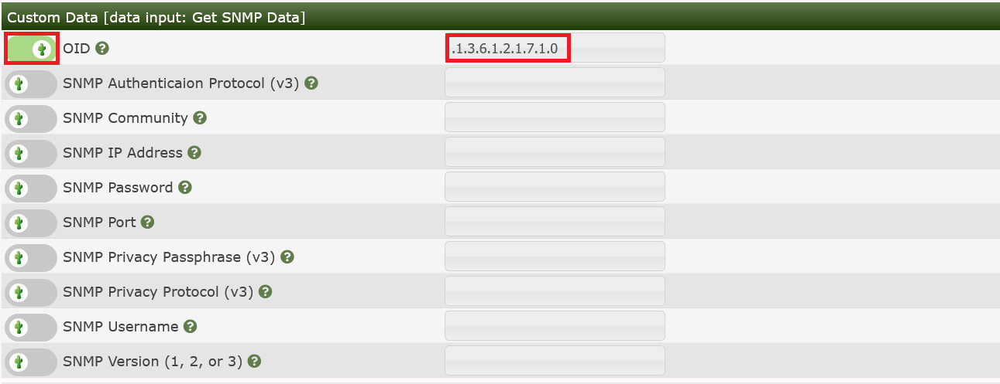
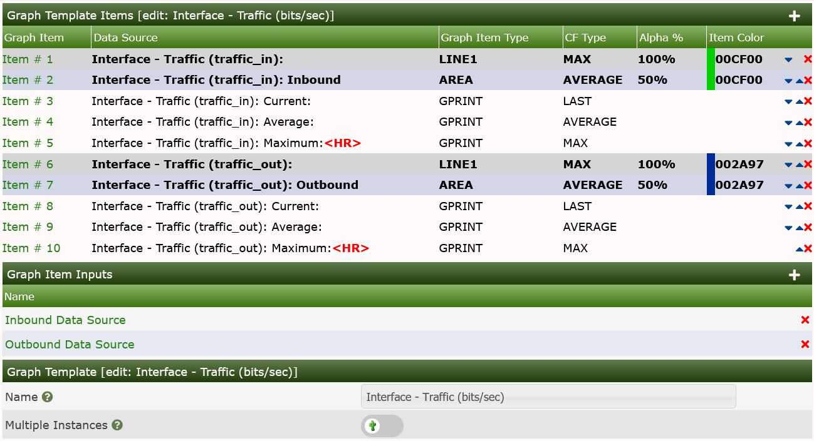
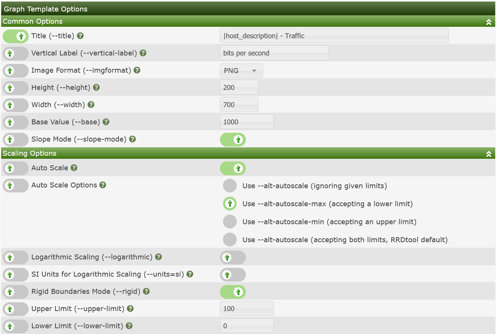
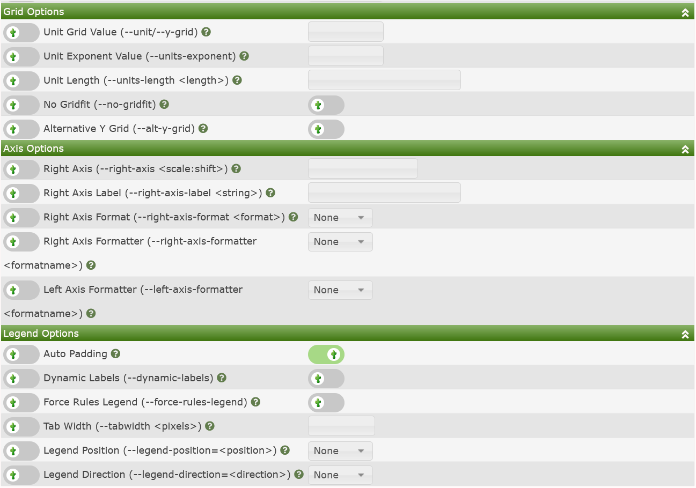
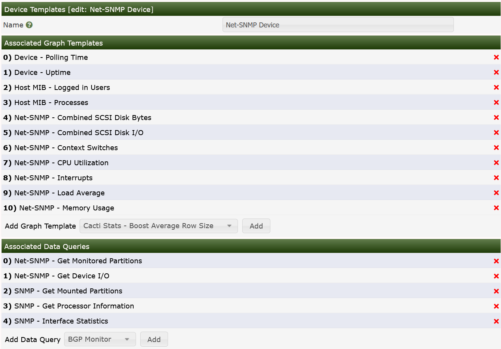
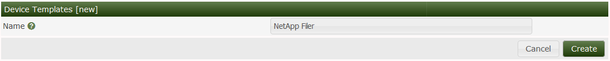
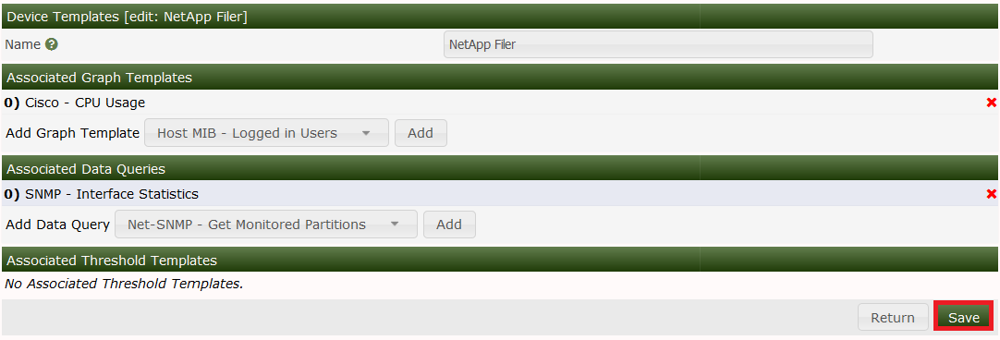
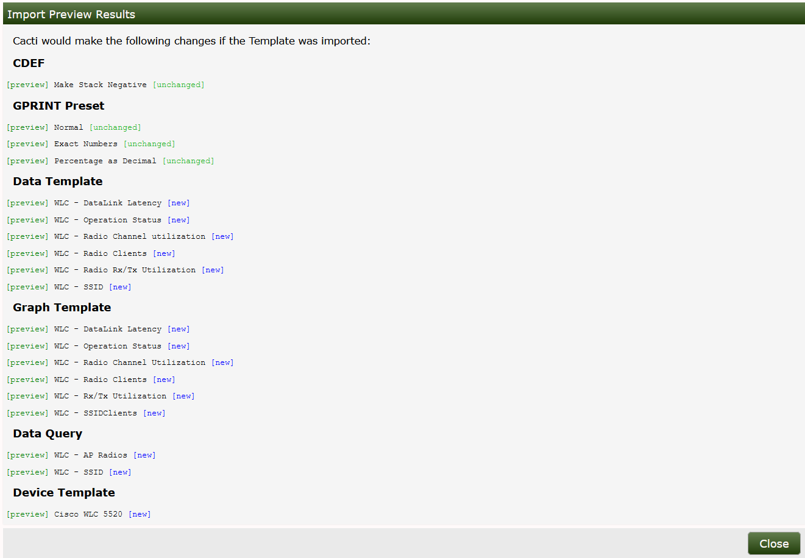

# Templates

The real strength of Cacti is unleashed by using templates. There are five
different types of templates with the basic Cacti installation:

- **Device Templates** - Define a Collection of **Graph Templates** and
  **Data Queries** that belong to a class of **Devices**
- **Graph Templates** - Define how to paint the Graph, it size, legend,
  left and right Axis and it Canvas
- **Data Templates** - Define how data is to be stored in the RRDfile and
  how often to collect that data
- **Aggregate Templates** - A special class of **Graph Template** that
  allows you to combine elements from multiple **Graph** of a
  common Template into one **Graph**
- **Color Templates** - A collection of color rotations to use for
  **Aggregate Graphs**

While it is perfectly fine to define all **Data Sources** and **Graphs**
without using Templates at all, the burden of this approach is high.

In most installations, there are hundreds if not thousands of **Devices**
of the same kind. And there are many similar **Graph Templates**, that span
multiple **Device Templates**.  For example: Network Traffic information
is needed for almost every **Device**. Therefore, the parameters needed
to create a traffic RRDfile are defined by the **Data Template**,
in this case known as "Interface - Traffic". These
definitions are used by all Traffic-related RRDfiles.

The same approach is used for defining **Graph Templates**. This is done only
once. And all parameters defined within such a **Graph Template** are copied to
all **Graphs** that are created using this Template.

The last type of classic Templates are the **Device Templates**.  The purpose
of **Device Templates** is to group all **Graph Templates** and
**Data Queries** for a given **Device Type**.  Example **Device Types**
that you might find a **Device Template** for include:

- Cisco Router
- Net-SNMP Device
- F5 Load Balancer
- Windows Device
- Local Linux Device
- ...

So you will make up a **Device Template** e.g. for a specific type of
router, switch, host and the like. By assigning the correct **Device Template**
to each new **Device**, you'll never forget to create all needed **Graphs**.

There's no need to create all Templates on your own! Apart from the fact, that
many common templates are provided out-of-the-box, there's a very simple
mechanism to **Import Templates** and to **Export Templates** and more recently
to **Import Packages**.

More recent additions to the Cacti family of Templates are the **Aggregate Template**
and **Color Template**.  The **Aggregate Template** allows you to define
a **Graph Template** that can aggregate data from many **Graphs** sharing
that Template.

The **Color Template** defines a list of colors that are used in a Round Robin
fashion to change the colors seen on the resulting **Aggregate Graphs**
to better assist the user in interpreting the resulting **Graph**.

In order to best follow the natural course of Template creation, the remainder
of this chapter will explain Templating starting with **Data Templates**,
then we will go from there to **Graph Templates**, and from there go to a
walk-through of creating both a **Data Template** and **Graph Template**.

From there, we will explain how to create a **Graph** using that newly created set
of Templates.

## Data Templates

In Cacti, a **Data Template** provides a skeleton for an actual **Data Source**.
If you have many **Data Sources** that share most of their characteristics,
using a **Data Template** would probably make sense. No change of a **Data
Template** is propagated to already existing RRDfiles. But most of them may be
changed by using `rrdtool tune` from command line. Pay attention to not append
new *Data Source Items* to already existing RRDfiles. There's no `rrdtool`
command to achieve this!

### Creating a Data Template

To create a new **Data Template**, select **Data Source** under
`Console > Templates` menu selection and then click Add, which in most cases
will be the plus sign in the upper right area of the page.

The first thing you must do is give the template a name. This name has nothing
to do with the **Data Source** name, but is what you will use to identify the
template throughout Cacti.

Second, you will notice a list of **Data Source** / **Data Source Item**
field names with Use Per-Data Source Value check-boxes next to each one.
The nice thing about Templates in Cacti is that you can choose whether
to template each field on a per-field basis. If you leave the check-box
unchecked, every **Data Source** attached to the **Data Template**
will inherit its value from the Template. If the check-box is
checked, every **Data Source** attached to the **Data Template* will
contain its own value for that particular field. When generating a
real **Data Source**, you will be prompted to fill those non-templated
fields.

Not however that if you are using Cacti's **Automation** feature, there is
presently no way for you to override these values.  So, plan accordingly
when engineering your Cacti deployment.

###### Table 13-1. Data Templates: Field Description of the Data Source Section

Name | Description
--- | ---
Name | The name of the **Data Source** that will be created by using this Template.  You can use the keyword  `host_description` enclosed by vertical bars in this field, which will be automatically substituted with the current host description of the **Device**.  There are several replacement values available to you when using a Template.
Data Input Method | Here is where you tell Cacti how it is supposed to fetch data for this **Data Source**. There are several **Data Input Methods** that come with Cacti, and you can add your own by going to `Console > Data Collection > Data Input Methods`. If this RRDfile is being populated outside of Cacti, make sure to leave this field set to "None".
Data Source Profile | The **Data Source Profile** will define how often to collect data for the resulting **Data Source**, and how long to keep that data in the RRDfile.
Data Source Active | This is a quick and easy to tell Cacti to stop gathering data for this **Data Template**. The resulting **Data Source** can still be used on **Graphs**, but no data will be fed to it until it is made active again.

> **NOTE:** For most **Data Templates**, you will should not have to to check
> the Use Per-Graph Value check-box for the name field.  The Templating should handle
> this just fine.  However, the Generic SNMP OID **Data Template** has this
> value checked to allow you to create Graphs and Data Sources on a piecemeal basis.

When you are finished filling in values for the **Data Template**, click Create and
you will be presented with a screen similar to the image below.


#### Data Source Items

Just like a **Graph**, a **Data Source** can have more than one item. This is
useful in situations where a script returns more than piece of data at one time
and both need to appear on the same **Graph**. This also applies to **Data Queries**,
so you can have a single **Data Template** that contains both Inbound and
Outbound Traffic, rather than having to create a separate **Data Template** for each.

###### Table 13-2. Data Templates: Field Description of the Data Source Items Section

Name | Description
--- | ---
Internal Data Source Name | This is the name used by RRDtool to identify this particular data source within the RRDfile. RRDtool places a limit of 19 alphanumeric characters (plus '_' and '-') on this field.
Minimum Value | Here is where you specify the minimum value that is expected for this data source in the RRDfile. If a value lower than the minimum is given, it will be stored as Unknown (U).
Maximum Value | Here is where you specify the maximum value that is expected for this data source in the RRDfile. If a value higher than the maximum is given, it will be stored as Unknown (U). Note: It often makes sense to define a reasonable maximum value here to avoid spikes in case of a COUNTER wrap
Data Source Type | Cacti currently supports seven types of data that RRDtool can represent for any given data source: COUNTER: is for continuous incrementing counters like the ifInOctets counter in a router. The COUNTER data source assumes that the counter never decreases, except when a counter overflows. It is always a whole INTEGER, floating point numbers are invalid. The update function takes the overflow into account. The counter is stored as a per-second rate. When the counter overflows, RRDtool checks if the overflow happened at the 32-bit or 64-bit border and acts accordingly by adding an appropriate value to the result. GAUGE: numbers that are not continuously incrementing, e.g. a temperature reading. Floating point numbers are accepted. ABSOLUTE: counters that are reset upon reading. DERIVE: like COUNTER but without overflow checks
Heartbeat | As defined by RRDtool: "The maximum amount of time that can pass before data is entered as "unknown". This field is usually '600' or 2 data gathering intervals".

#### Custom Data

Assuming you selected a **Data Input Method** on the previous screen, you should
now be presented with a **Custom Data** form. It will show a single line for
every single parameter required for that very **Data Input Method**. This is
how the **Data Source** connects to the **Data Input Method**
to provide all run time parameters.

Each **Custom Data** field is per-field Templatable as all of the other **Data Source**
fields are. Even if you select the Use Per-Data Source Value check-box, it might
be useful to specify a value that will be used as an "initial value" for any **Data
Source** using the **Data template**.

### Applying Data Templates to Data Sources

> **NOTE:** When changing parameters of a **Data Template**, existing RRDfiles will
> not be changed automatically. If this is required, you will have to apply
> `rrdtool tune` command to any related RRDfile manually.

Applying a **Data Template** to a **Data Source** is a very simple process.
The first thing you must do is select the **Data Source** you want to apply
the template to under **Data Sources**. Under the **Data Template** Actions drop-down,
select the **Data Template** that you want to apply to the **Data Source**
and click Save.  Though this should be very rare in modern Cacti instances,
it was fairly common before Cacti's Templating system matured.

Once a Template is applied to a Data Source, you will notice that you can
only change values for the fields that you checked Use Per-Data Source Value
for.

> **NOTE:** Now any time a change is made to the **Data Template**, it will be
> automatically propagated to the **Data Sources** attached to it.  However,
> as previously stated, changes to a **Data Template** that involve changes
> to the **Data Source Items**, will not be automatically applied to those same
> **Data Sources**.

#### Walk-through: My First Data Template

For this task, let's stick to SNMP stuff. For you to be able to reproduce this
example, I've chosen the **UDP** information of the IP MIB.

```console
snmpwalk -c <community string> -v1 <device> udp
UDP-MIB::udpInDatagrams.0 = Counter32: 7675
UDP-MIB::udpNoPorts.0 = Counter32: 128
UDP-MIB::udpInErrors.0 = Counter32: 0
UDP-MIB::udpOutDatagrams.0 = Counter32: 8406
```

As cacti does not use the MIBs but pure ASN.1 OIDs, let's search the OID used as
`udpInDatagrams`:

```console
snmpwalk -c <community string> -v1 -On <device> udp
.1.3.6.1.2.1.7.1.0 = Counter32: 7778
.1.3.6.1.2.1.7.2.0 = Counter32: 129
.1.3.6.1.2.1.7.3.0 = Counter32: 0
.1.3.6.1.2.1.7.4.0 = Counter32: 8514
```

The needed OID is .1.3.6.1.2.1.7.1.0. Now learn how to enter this into a new
Cacti Data Template: Please proceed to Data Templates and filter for SNMP. Check
the SNMP - Generic OID Template


After clicking Go, you're prompted with a new page to enter `udp/net - udp Out Datagrams` as the `Title Format` for the new **Data Template**:


Due to the filter defined above, you won't see the new Template at once, so
please enter `udp Out` as a new filter to find:


Now select this entry to change some definitions according to the following
images:




for the lower one. Please pay attention to change the MAXIMUM value to 0 to
prevent data suppression for values exceeding 100. And you saw the OID
`.1.3.6.1.2.1.7.1.0` from above, didn't you? Please copy another one for OID
`.1.3.6.1.2.1.7.4.0`, using the description **udpOutDatagrams**

## Graph Templates

In Cacti, a **Graph Template** provides a skeleton for an actual **Graph**.
If you have many **Graphs** that share most of their characteristics,
using a **Graph Template** makes perfect sense. After a **Graph** is attached
to a particular **Graph Template**, all changes made to the **Graph Template**
will propagate out to all of its **Graphs**, unless Use Per-Graph Value has
been checked.

### Creating a Graph Template

To create a new **Graph Template**, select **Graph** unser `Console > Templates`
menu selection, then click Add normally the plus sign in the upper right
corner of the **Graph Template** interface.

The first thing you must do is give the **Graph Template** a name. This
name has nothing to do with the graph title, but is what you will use to
identify the **Graph Template** throughout Cacti. Second, you will notice
a list of graph field names with Use Per-Graph Value check-boxes next to
each one. The nice thing about Templates in Cacti is that you can choose
whether to template each field on a per-field basis. If you leave the
check-box unchecked, every **Graph** owned by the **Graph Template**
will inherit its value from the Template. If the check-box is checked,
every **Graph** owned by **Graph Template** will have its own value
for that particular field.

###### Table 13-3. Field Description: Graph Templates

Name | Description
--- | ---
Title | The title of the **Graph** within Cacti and the title that will be printed on the actual **Graph** itself. **NOTE**: You can use the keyword `host_description` enclosed by vertical bars in this field, which will be automatically substituted with the current host description.
Image Format | Choose whether you would prefer to output your graph images in PNG or SVG.
Height | The height of the Graph Canvas in pixels.  This is not the height of the overall Graph, just the Graph Canvas.
Width | The width of the Graph Canvas in pixels
Base Value | Should be set to 1024 for memory values and 1000 for traffic measurements.
Slope Mode | RRDtool graphs are composed of stair case curves by default. This is in line with the way RRDtool calculates its data. Some people favor a more "organic" look for their graphs.
Auto Scale | Enable auto scale for the graph. This option must be check to use the next two options. Upper/Lower limit values are ignored when using auto-scale since these boundaries are determined automatically.
Auto Scale Options | Choose whether you would like to use --alt-autoscale (ignoring given limits), --alt-autoscale-max (accepting a lower limit), --alt-autoscale-min (accepting an upper limit.
Logarithmic Scaling | Choose if you want logarithmic y-axis scaling.
Scientific Units for Logarithmic Scaling | For linear graphs, scientific units (in magnitudes of k=kilo, M=mega, ...) is default. But for logarithmic graphs, exponential notation is default. Choose if you want logarithmic y-axis scaling and scientific units.
Rigid Boundaries Mode | From the RRDtool manual "Normally rrdgraph will automatically expand the lower and upper limit if the graph contains a value outside the valid range. With this option you can disable this behavior".
Auto Padding | If you have ever created RRDtool based graphs manually, you may have realized how annoying it can be to get text to line up properly. With this option Cacti will do its best to make the columns on your graph legend line up. This option works best when your graph legend has a consistent number of columns.
Allow Graph Export | If you choose to use Cacti's static HTML/image export, you can choose whether you want each individual graph to be exported.
Upper Limit | The maximum value that will be displayed on the y-axis. This value is ignored is auto-scaling is turned on.
Lower Limit | The minimum value that will be displayed on the y-axis. This value is ignored is auto-scaling is turned on.
Base Value | Whether you want to base the y-axis labels on 1000 or 1024. This field will typically be set to 1024 for memory and 1000 for traffic measurements.
Unit Grid Value | Sets the unit value for the y-axis (--y-grid). You should probably keep the unit short as to keep it readable.
Unit Exponent Value | Sets the 10^e scaling of the y-axis. Valid values for this field are between -18 and 18. For example, you could use 3 to display everything in 'k' (kilo) or -6 to display everything in 'u' (micro).
Vertical Label | The text to print on the left edge of the graph. Usually is the units the data on the graph is measured in.

### Auto-scaling Options Explained

Relative to Auto-scale Options, the RRDtool graph manual says:

- Limits [-u|--upper-limit value] [-l|--lower-limit value] [-r|--rigid]
  By default the graph will be auto-scaling so that it will adjust the y-axis
  to the range of the data. You can change this behavior by explicitly
  setting the limits. The displayed y-axis will then range at least from
  lower-limit to upper-limit. Auto-scaling will still permit those boundaries
  to be stretched unless the rigid option is set.
- [-A|--alt-autoscale] Sometimes the default algorithm for selecting the
  y-axis scale is not satisfactory. Normally the scale is selected from a
  predefined set of ranges and this fails miserably when you need to graph
  something like "260 + 0.001 * sin(x)". This option calculates the minimum
  and maximum y-axis from the actual minimum and maximum data values.
  Our example would display slightly less than "260-0.001" to slightly more
  than "260+0.001".
- [-J|--alt-autoscale-min] Where "--alt-autoscale" will modify both the
  absolute maximum AND minimum values, this option will only affect the
  minimum value. The maximum value, if not defined on the command line,
  will be 0. This option can be useful when graphing router traffic when
  the WAN line uses compression, and thus the throughput may be higher than
  the WAN line speed.
- [-M|--alt-autoscale-max] Where "--alt-autoscale"
  will modify both the absolute maximum AND minimum values, this option
  will only affect the maximum value. The minimum value, if not defined on
  the command line, will be 0. This option can be useful when graphing
  router traffic when the WAN line uses compression, and thus the
  throughput may be higher than the WAN line speed.

When you are finished filling in values for the **Graph Template**, click
Create and you will be presented with a page similar to the image below.
The example below is from a completed Traffic Graph Template.

In this first image, you can see what elements will be painted on the
**Graph** Canvas.  They are represented by **LINEX**, **AREA**
and **STACK** elements.  The **Graph Items** listed as **GPRINT** and
**COMMENT** appear in the Legend Area of the **Graph**.

The **Graph Input Items** are the Cacti names for the Data Sources that
appear on the **Graph** as well as other items that can be substituted
during **Graph** Creation.

The `Multiple Instances` field is a parameter to let Cacti know that it
should allow you to create more than one **Graph** per **Device** using the
**Graph Template**.



The **Common Options** are options that most every **Graph Template** included.
The **Scaling Options** are also very common, but related to **Graph**
scaling only.



The **Grid Options**, **Axis Options**, and **Legend Options** are must less
common but are available in Cacti should you choose to use them.



#### Graph Items

The first thing you should do is create **Graph Items** for a **Graph Template**,
just like for a stand alone **Graph**. One difference you will notice is that
the **Data Sources** drop-down will contain a list of **Data Template**
items rather than **Data Source Items**. It is important that Cacti can make
this association here, so that Cacti doesn't have to make unnecessary
assumptions later.

###### Table 13-4. Field Description: Graph Template Items

Name | Description
--- | ---
Data Source | If this graph item is to represent some sort of data, you must select a your data source here. Keep in mind that not all graph items have a data source. Graph item types such as COMMENT, VRULE, and HRULE typically do not.
Color | Depending on the graph item type, you can select a color for the graph item. This field only applies to the graph item types AREA, STACK, LINE1, LINE2, and LINE3.
Opacity/Alpha Channel | For a colored graph item, you may optionally select an opacity (alpha channel). This option is not available with RRDTool-1.0.x.
Graph Item Type | This field is important because it defines what kind of graph item this is. Types such as AREA, STACK, LINE1, LINE2, and LINE3 are used to represent data on the graph, while COMMENT and GPRINT are used put on the legend. The LEGEND type is specific to Cacti only and can be used if you want to Cacti to automatically create a GPRINT-LAST/GPRINT-AVERAGE/GPRINT-MAXIMUM graph item for you. Note: You must always put an AREA item before using STACK or your graph will not render.
Consolidation Function | This tells RRDtool which consolidation function to use when representing this data on the graph. You will typically use AVERAGE for most things on the graph area, and LAST/MAXIMUM as well for GPRINT items.
CDEF Function | If you want to apply a CDEF function to the graph item, select one here. Check out the CDEF section of the manual for more information.
Value | This field is only used with the HRULE/VRULE graph item types. Type any valid integer to draw the line at for HRULE or the time of the day HH:MM for VRULE.
GPRINT Type | If this item is a GPRINT, you can choose how you want the number to be formatted. You can add your own in the GPRINT Presets section of Cacti.
Text Format | You can enter text to be displayed on the legend here. This field is applicable for all graph item types except for the virtual LEGEND type.
Hard Return | Check this box to force graph items onto the next line.

#### Graph Item Inputs

After creating **Graph Items** for your **Graph Template**, you will need to create
some **Graph Item Inputs**. **Graph Item Inputs** are unique to **Graph Templates**
because of the large number of items they sometimes contain. **Graph Item Inputs**
enable you to take one **Graph Item** field, and associate it with multiple
**Graph Items**.  **Graph Item Input** fields are generally created automatically
as you add **Graph Items** associated with a **Data Source**, like a LINE or AREA or GPRINT.

To create a new **Graph Item Input** manually, click Add on the right of the
**Graph Item Inputs** form. There are various fields that must be filled in for
every graph item input:

###### Table 13-5. Field Description: Graph Template Items

Name | Description
--- | ---
Name | This will be the name used to identify the **Graph Item Input** on both the **Graph Template** and **Graph** edit pages.
Description | (Optional) This description will be displayed on the **Graph** edit page of any **Graph** using this **Graph Template** if specified.
Field Type | You must choose the field that you are going to associate with one or more **Graph Item**.
Associated Graph Items | Choose one or more **Graph Items** to associate with the field selected for "Field Type". When the user specifies a value for the field, it will be applied to all of the items you select here.

### Applying Graph Templates to Graphs

Applying a **Graph Template** to an existing **Graph** is a very simple process,
though very uncommon in a modern Cacti install. The first thing you must do
is select the **Graph** you want to apply the template to under **Graph Management**.
Under the **Graph Template** Action drop-down, select the **Graph Template**
that you want to apply to the **Graph** and click Save. If this is a new **Graph**
or the **Graph** and **Graph Template** contain an equal number of **Graph Items**,
the **Graph Template" will be automatically applied. If number of **Graph Items**
varies from the **Graph** to the target **Graph Template**, you will be prompted
with a warning that your **Graph** will be changed, and not always for the better.

Once the **Graph Template** is applied to the existing **Graph**, you will notice
that you can only change values for the fields that you checked Use Per-Graph
Value for. You will also notice a new box, called **Graph Item Inputs**.
This is where you can specify values for the **Graph Item Inputs** that you
defined in the **Graph Template**. The values specified here will be applied to
each **Graph Item** tied to the **Graph Item Input**.

> **NOTE:** Any time a change is made to the **Graph Template**, it will be
> automatically propagated to the **Graphs** associated to it.

#### Walk-through: My First Graph Template

Now let's generate the **Graph Template** for those already generated Data
Templates. Please go to **Graph Templates** and **Add** a new one:


Now you have to fill in some global parameters:


and **Create** to see:


Now let's add some **Graph Template** **Graph Items**. They will specify, 
which **Data Sources** defined by some **Data Template** should be displayed 
on the **Graph**. Please click Add as shown on the last image:


Now click Save to see the resulting image below.  Not that both the 
**Graph Item** and the **Graph Item Input** have been created.


Next, we have to add a Legend in order for people viewing the **Graph** in the
future to obtain numeric data about the **Graph** contents.  We will create
a very simple one, though Graph Legends can be a very complex subject.

To add the Graph Legend, simply press the Add button again and fill out
the **Graph Item** as shown in the image below.  You should note that
for this second **Graph Item**, it remembered the previous **Data Source**.


Press Save to see three legend items created in one step!


Now we could have continued to add the UDP Datagrams In by adding a second
RRDfile Data Source to our **Data Template**, but we will skip that for this
exercise and continue now that our **Graph Template** is reasonably completed.

At this point, since we only added **Graph Items** to the **Graph Template**
there is no need to resave it at this point.  We can simply continue to the
next step.

Now, you may add this new **Graph Template** to any **Devices** that 
responds to the udp OID we specified in the **Data Template**. But in this
case, please wait a moment. Let's first proceed to the **Device Template**
and use this new **Graph Gemplate** for our first own **Device Template**.

## Device Templates

**Device Templates** in Cacti, often times referred to as Host Templates 
serve as a way to group a set of common **Graph Templates** and **Data Queries**
to **Devices** of a certain class, say a Cisco Router or Linux host using
Net-SNMP.  It really accelerates the deployment of a Cacti system across
and enterprise of Devices.

### Adding a Device Template

To create a new **Device Template** in Cacti, select the **Device* option under
the `Console > Templates` menu selection. Once on that page, click Add on the 
right. Type a unique name for the **Device Template* and click the Create 
button. You will be redirected back to the edit page with the 
`Associated Graph Templates` and `Associated Data Queries` forms empty. 
These two forms allow you to associate **Graph Templates** and/or 
**Data Queries** with the **Device Template**. Simply select something
from the drop-down menu and click Add to associate it with your
**Device Template**.

In the case below, we show the Net-SNMP **Device Template**.  Note the variety
of Graph Templates and Data Queries available for this Class of **Devices**.



### Walk-through: My First Device Template

The next task is to create a new **Device Template**. So, select **Device**
under `Console > Templates` and press the Add button as in previous 
examples.  When you do that, you will be presented with an page that
resembles the one below.


and fill in the name of this new Template:



Now you'll find two sections added. First, let's deal with 
**Associated Graph Templates**. The Add **Graph template** select drop-down 
contains all existing **Graph Templates**. In the images, you will see that
we are creating a **Device Template** for a NetApp Filer and adding some
common Graph Templates and Data Queries from the Cacti built-in collection.


and Add it:



Next, let's add the Data Query already selected above:


## Import Templates

Assume, you're searching for a specific set of templates to monitor a special
type of device. Apart from designing templates from scratch, there's a good
chance to find a solution in the [Scripts and Templates
Forum](http://forums.cacti.net/forum-12.html).  The set of templates is usually
provided as a single XML file holding all required definitions for a data
template and a graph template. Depending on the goal of the original author,
he/she may have provided a **Device Template** as well as part of this XML file.
Note that after you **Import Templates**, you may also have to copy a Resource
XML file to the appropriate &lt;path_cacti&gt;/resource directory, and a script
to the &lt;path_cacti&gt;/scripts directory.  However, also note that in the
current version of Cacti, **Packages** are now importable as well.  When you
import a **Package** all of the required additional file changes will also be
accommodated.  We will discuss **Packages** later in the documentation.


If the XML file was downloaded, simply select that file from the Downloads
location on your local system.  Cacti no longer supports pasting the XML into
the browser window.

Please pay attention the the `Data Source Profile` field. By default, cacti will
attempt to use your default **Data Source Profile**.  However, you can change
that at import time to use an alternate **Data Source Profile** or even the one
from the **Template** itself, if it includes one.

Also, not that if you have made local modification to an earlier version of a
**Graph Template**, and wish to fully migrate to the new **Graph Template** for
all your existing **Graphs**, please select `Remove Orphaned Graph Items`.
Otherwise, your **Graphs** will look awkward in the end.  This should not be a
problem for new Imports.

It's also important to `Preview` the **Template** imports to access the impact
that the import will have on existing database object.  In earlier versions of
Cacti, you were unable to determine what would actually change.  However, in the
current and future versions of Cacti, you will be able to see all local
modifications when performing a `Preview` prior to `Importing`.

In the image below, you can see the output of a `Preview` of the Cisco WLC 5520
**Device Template**.  When Previewing, no changes are actually made ot your
Cacti system.



As mentioned previously, for a single OID based template, **Importing** the
**Template** is all that will be required. However, for a script based template,
the author will provide the script that has to be downloaded to the Cacti
`./scripts` directory and for a **Data Query** based **Template**, a second XML
file holding the Data Query definitions will have to be downloaded to the
appropriate directory under the `./resource` directory.

When importing templates, Cacti will perform a version check. All XML templates
hold the version of the Cacti system that generated this XML set. Cacti will
import only, if your current Cacti version equals or is higher than the
exported one.

## Export Templates

Now that you know how to import, you may want to know in which way to export as
well. Selecting the Export Templates gives


You may select to export a graph template, a data template, a **Device
Template** or a **Data Query**. When selecting `Include Dependencies`, e.g. a
**Device Template** will include all referred templates (**Graph Template**,
**Data Template**, if defined, **Data Query**). Output may be written to the
browser or to a file for uploading.

---
Copyright (c) 2004-2021 The Cacti Group
