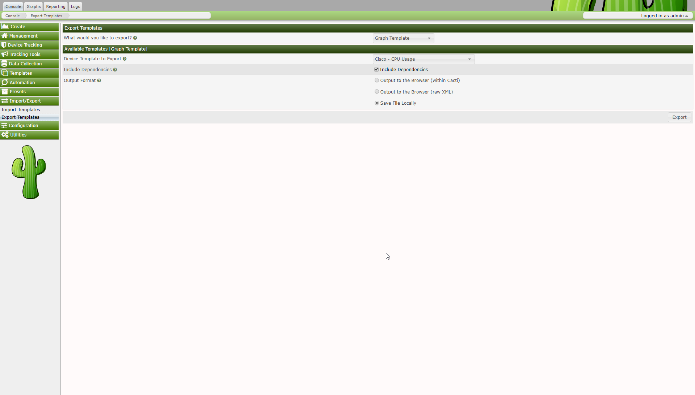

# Templates

The real strength of Cacti is unleashed by using templates. There are three
different types of templates with the basic Cacti installation: *Data
Templates*, *Graph Templates* and *Host Templates*. While it is perfectly fine
to define all data sources and graphs without using Templates at all, the
burden of this approach is high. In most installations, there are lots of
devices of the same kind. And there are lots of data of the same kind, e.g.
traffic information is needed for almost every device. Therefor, the parameters
needed to create a traffic rrd file are defined by a *Data Template*, in this
case known as "Interface - Traffic". These definitions are used by all
Traffic-related rrd files.

The same approach is used for defining *Graph Templates*. This is done only
once. And all parameters defined within such a *Graph Template* are copied to
all Graphs that are created using this Template.

The last type of Templates are the *Host Templates*. They are not related to
some rrdtool stuff. The purpose of *Host Templates* is to group all Graph
Templates and Data Queries (these are explained later) for a given device type.
So you will make up a *Host Template* e.g. for a specific type of router,
switch, host and the like. By assigning the correct *Host Template* to each new
Device, you'll never forget to create all needed Graphs.

There's no need to create all Templates on your own! Apart from the fact, that
many common templates are provided out-of-the-box, there's a very simple
machnism to Import Templates and to Export Templates.

## Data Templates

In Cacti, a data template provides a skeleton for an actual data source. If you
have many data sources that share most of their characteristics, using a data
template would probably make sense. No change of a Data Template is propagated
to already existing rrd files. But most of them may be changed by using
`rrdtool tune` from command line. Pay attention to not append new Data Source
Items to already existing rrd files. There's no `rrdtool` command to achieve
this!

### Creating a Data Template

To create a new data template, select Data Templates under the Templates
heading and click Add.

The first thing you must do is give the template a name. This name has nothing
to do with the data source name, but is what you will use to identify the
template throughout Cacti.

Second, you will notice a list of data source/data source item field names with
Use Per-Data Source Value checkboxes next to each one. The nice thing about
templates in Cacti is that you can choose whether to template each field on a
per-field basis. If you leave the checkbox unchecked, every data source
attached to the template will inherit its value from the template. If the
checkbox is checked, every data source attached to the template will contain
its own value for that particular field. When generating a real data source,
you will be prompted to fill those non-templated fields.

> **Note:** For most data templates, you will want to check the Use Per-Graph
> Value checkbox for the name field so each data source using this template
> has its own unique name. It also makes sense to enter an inital value in
> this field that includes the variable `|host_description|` for organizational
> purposes.

When you are finished filling in values for the data template, click Create and
you will be presented with a screen similar to the data source edit screen.

#### Data Source Items

Like a graph, a data source can have more than one items. This is useful in
situations where a script returns more than piece of data at one time. This
also applies to data queries, so you can have a single data template that
contains both inbound and outbound traffic, rather than having to create a
separate data template for each.

#### Custom Data

Assuming you selected a data input source on the previous screen, you should
now be presented with a Custom Data box. It will show a single line for every
single parameter required for that very data input method. This is how the Data
Source glues together with the data input method to provide all run time
parameters.

Each custom data field is per-field templatable as all of the other data source
fields are. Even if you select the Use Per-Data Source Value checkbox, it might
be useful to specify a value that will be used as an "inital value" for any
data source using this data template.

### Applying Data Templates to Data Sources

> **Note:** When changing parameters of a Data Template, existing rrd files
> will never be changed. If this is required, you will have to apply
> `rrdtool tune` commands to any related rrd file manually.

Applying a data template to a data source is a very simple process. The first
thing you must do is select the data source you want to apply the template to
under Data Sources. Under the Data Template Selection box, select the data
template that you want to apply to the data source and click Save.

Once the template is applied to the data source, you will notice that you can
only change values for the fields that you checked Use Per-Data Source Value
for.

> **Note:** Now any time a change is made to the data template, it will be
> automatically propagated to the data sources attached to it.

## Graph Templates

In Cacti, a graph template provides a skeleton for an actual graph. If you have
many graphs that share most of their characteristics, using a graph template
would probably make sense. After a graph is attached to a particular graph
template, all changes made to the graph template will propagate out to all of
its graphs, unless Use Per-Graph Value has been checked.

### Creating a Graph Template

To create a new graph template, select Graph Templates under the Templates
heading and click Add.

The first thing you must do is give the template a name. This name has nothing
to do with the graph title, but is what you will use to identify the template
throughout Cacti. Second, you will notice a list of graph field names with Use
Per-Graph Value checkboxes next to each one. The nice thing about templates in
Cacti is that you can choose whether to template each field on a per-field
basis. If you leave the checkbox uncheked, every graph attached to the template
will inherit its value from the template. If the checkbox is checked, every
graph attached to the template will contain its own value for that particular
field.

> *Note:* For most graph templates, you will want to check the Use Per-Graph
> Value checkbox for the title field so each graph using this template has its
> own unique title. It also makes sense to enter an initial value in this field
> that includes the variable |host_description| for organizational purposes.

When you are finished filling in values for the graph template, click Create
and you will be presented with a page similar to the graph edit page.

#### Graph Items

The first thing you should do is create graph items for this graph template,
just like for a regular graph. One difference you will notice is that the Data
Sources dropdown will contain a list of data template items rather than data
source items. It is important that Cacti can make this association here, so
that Cacti doesn't have to make unnecessary assumptions later.

#### Graph Item Inputs

After creating graph items for your template, you will need to create some
graph item inputs. Graph item inputs are unique to graph templates because of
the large number of items they sometimes contain. Graph item inputs enable you
to take one graph item field, and associate it with multiple graph items.

To create a new graph item input, click Add on the right of the Graph Item
Inputs box. There are various fields that must be filled in for every graph
item input:

### Applying Graph Templates to Graphs

Applying a graph template to a graph is a very simple process. The first thing
you must do is select the graph you want to apply the template to under Graph
Management. Under the Graph Template Selection box, select the graph template
that you want to apply to the graph and click Save. If this is a new graph or
the graph and graph template contains an equal number of graph items, the graph
template will be automatically applied. If number of graph items varies from
the graph to the target graph template, you will be propmted with a warning
that your graph will be changed.

Once the template is applied to the graph, you will notice that you can only
change values for the fields that you checked Use Per-Graph Value for. You will
also notice a new box, called Graph Item Inputs. This is where you can specify
values for the graph items inputs that you defined in the graph template. The
values specified here will be applied to each graph item tied to the graph item
input.

> **Note:** Any time a change is made to the graph template, it will be
> automatically propagated to the graphs attached to it.

## Host Templates

Host templates in Cacti serve a different purpose then data and graph
templates. Instead of abstracting the fields of a host, a host template allows
you to associate graph templates and data queries with a given host type. This
way when you assign a host template to a host, all of the relevant graphs to
that host type are only one click away from the user.

### Adding a Host Template

To create a new host template in Cacti, select the Host Templates option under
the Templates heading. Once on that screen, click Add on the right. Type a
unique name for the host template and click the Create button. You will be
redirected back to the edit page with the Associated Graph Templates and
Associated Data Queries boxes. These two boxes allow you to associate certain
graph templates or data queries with the host template. Simply select something
from the dropdown menu and click Add to associate it with your host template.

## Import Templates

Assume, you're searching for a specific set of templates to monitor a special
type of device. Apart from designing templates from scratch, there's a good
chance to find a solution in the [Scripts and Templates Forum](http://forums.cacti.net/forum-12.html).
The set of templates is usually provided as a single XML file holding all
required definitions for a data template and a graph template. Depending
on the goal of the original author, he/she may have provided a host template
as well as part of this XML file.

If the XML file was downloaded, you may import it from the filesystem via the
search button. As an alternative, you may want to cut and paste the XML into
the textbox.

Please pay attention the the *Import RRA Settings*. By default, current RRA
settings will be preserved, even if the imported XML file specifies different
settings. This is recommended to avoid accidentally overwriting these global
RRA definitions. If you are sure, you may override this default.

For a single OID based template, this will be all. For a script based template,
the author will provide the script that has to be downloaded to the Cacti
`./scripts` directory. For a SNMP/SCRIPT Data Query, a second XML file holding
the Data Query definitions will have to be downloaded to the appropriate
directory under `./resources`.

When importing templates, Cacti will perform a version check. All XML templates
hold the version of the Cacti system that generated this XML set. Cacti will
import only, if your current Cacti version equals or is higher than the
exporting one.

## Export Templates

Now that you know how to import, you may want to know in which way to export as
well. Selecting the Export Templates gives

You may select to export a graph template, a data template, a host template or
a data query. When selecting `Include Dependencies`, e.g. a host template will
include all referred templates (graph template, data template and, if defined,
data query). Output may be written to the browser or to a file for uploading.

---
Copyright (c) 2018 Cacti Group
