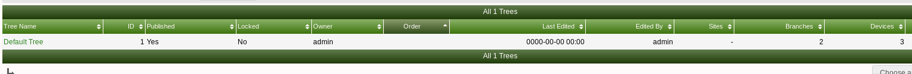
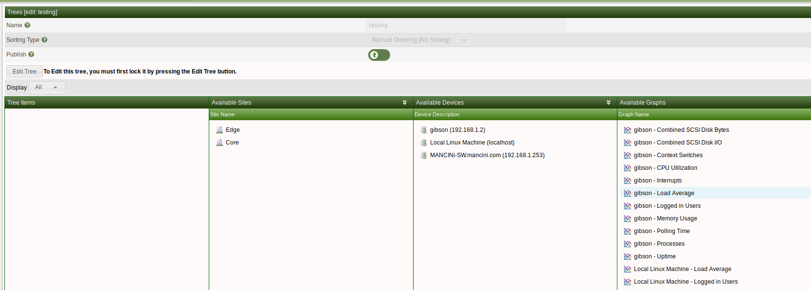

# Tree Management

This section will describe **Tree** management in Cacti.

Trees in cacti are used to place graphs and devices on trees are 
orginized by name

Below we can see the current trees we have setup on our cacti 
server to get to this screen click console >> managment >> trees
From this page you can add or remove trees as you need

Below is how a tree is displayed in graph view we can see the device that 
is being monitored clicking on this device will result in seeing all 
of the graph data generated for the device.

to create a new tree simply click the + on the top right hand corner and
enter a name for your tree after the tree has been created you will 
see the below page where you are able to add devices to the tree are 
importantly publish the tree which will allow it to be visible from the 
main console page

To add devices to the new tree simply drag and avaliable device to the 
tree and it will be added to the tree

---
Copyright (c) 2004-2019 The Cacti Group
