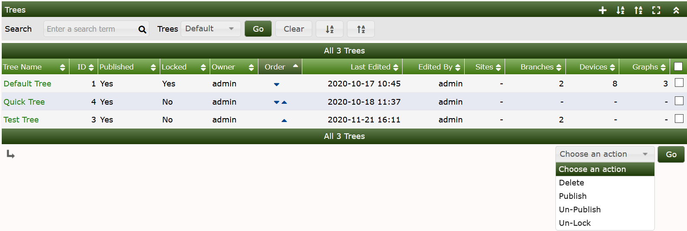
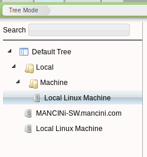
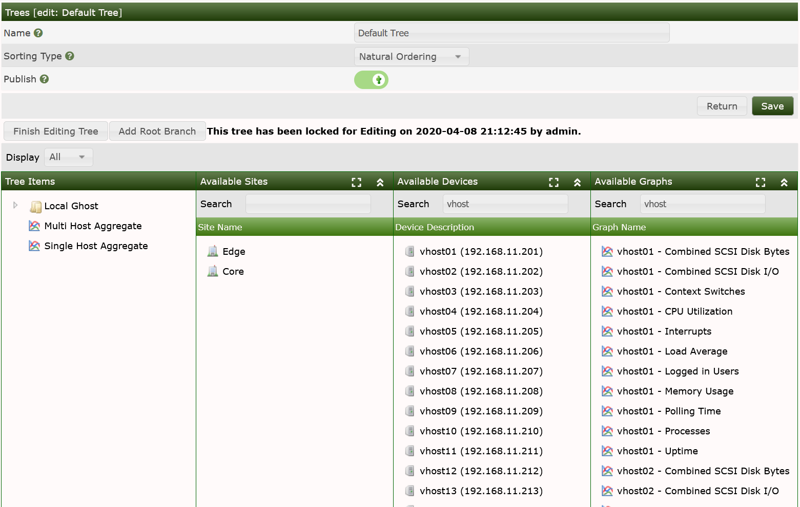
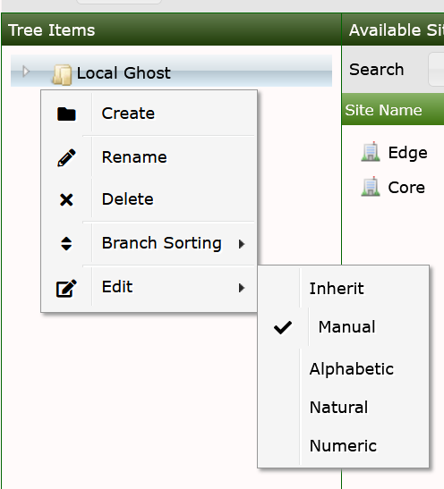

# Cacti Trees

## Trees

A **Tree** can be thought of as a hierarchical way of organizing your graphs.
Each **Tree** consists of zero or more branchs that contain
leaf nodes such as **Graphs**, **Devices** and **Sites**. It's a very powerful
way of organizing your **Graphs**.

Below we can see the current **Trees** we have setup on our Cacti
server. To get to this screen click `Console > Managment > Trees`.

From this page you can add or remove **Trees** as required.

Below is how a **Tree** is displayed in **Graph View**.  We can see the **Device**
that is being monitored - clicking on this **Device** will result in seeing all
of the **Graph** data generated for the **Device**.

## Creating a Tree

To create a new tree simply click the Add button (+) on the top right hand
corner and enter a name for your **Tree**. After the tree has been created you will
see the below page where you are able to add **Devices** to the **Tree**.

To add devices to the new tree simply drag an avaliable device to the
tree and it will be added to the tree.  Cacti currently supports four
`Sort Types`, which can be either inherited, of left to the author to define
inheritance and at what level.  See the image below for a visual representation
of how Tree Sorting is accomplished.

###### Table 8-1. Tree Sporting Type Definitions

Field | Value | Description
--- | --- | ---
Name | Name of the tree entry. | The sort order of all trees themselves is always alphabetical
Sorting Type | Manual Ordering (No Sorting) | You may chance the sequence at your will
Alphabetical Ordering |  1, Ab, ab | All sub-trees are ordered alphabetically, unless specifies otherwise (you may chance sort options at sub-tree label)
Natural Ordering | ab1, ab2, ab7, ab10, ab20 | N/A
Numeric Ordering | 01, 02, 4, 04 | Leading zeroes are not taken into account when ordering numerically

End users will not be able to view the **Tree** or it's Graphs until you
publish it.  To edit a **Tree**, you will be required to lock it for your use.
The locking is designed to prevent multiple users from editing a **Tree**
simultaneously.

When a Tree is locked, you can drag & drop the **Sites**, **Devices** and
**Graphs** over to the Tree menu.  To add a 'Root Branch', simply press the
button to do so, once you have Root Branches, you may right click on the to
create sub-branches on the Tree.

When you single click on a **Site**, the **Devices**, and **Graphs** associated with
that **Site** should appear in their respective sections.  You can also type into
the Search fields above the various sections to drill into them.  You can also shift-click
and control-click on the objects within a section to drag & drop multiple objects
at one time.

Don't forget to unlock your **Tree** before finishing your editing session.

---
<copy>Copyright (c) 2004-2022 The Cacti Group</copy>
