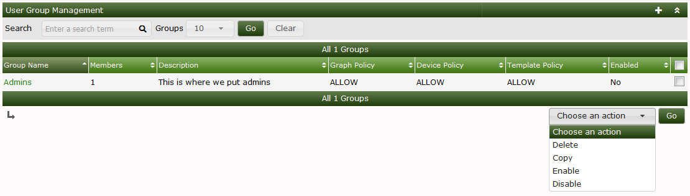
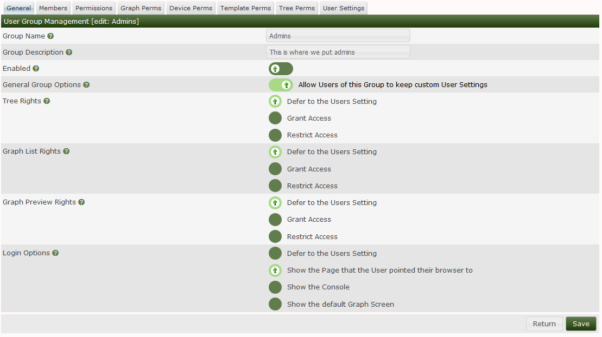
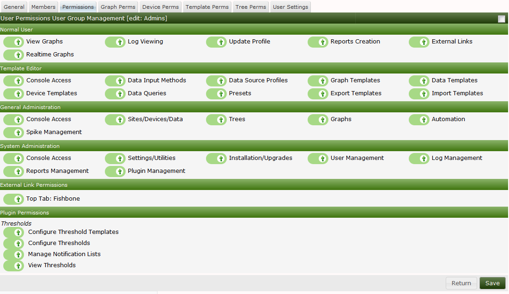
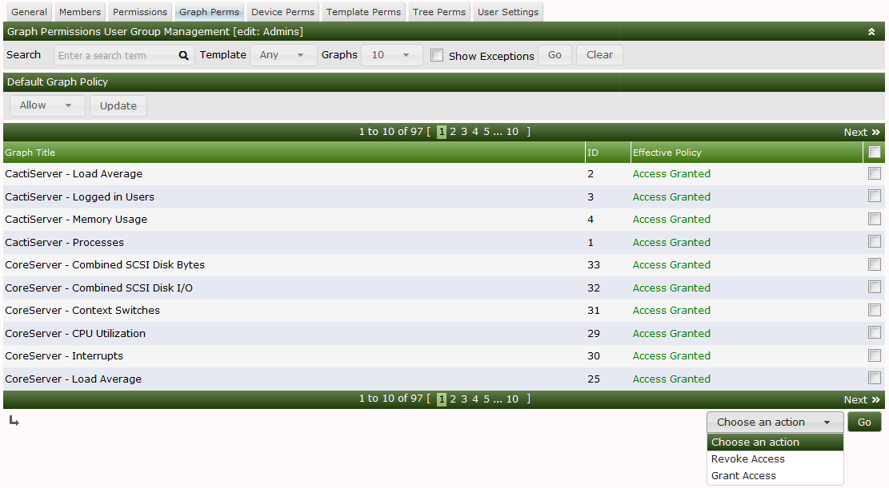

# User Group Management

Cacti supports from one to many static User Groups in the current design.
User Groups closely mimic the normal user.  You see things like **Graph**
permissions, Roles and Realms, Default pages, and settings, it's all there.

The way that a Cacti User Group works is that it's combined with the Users
permission, and then the resulting permission is the most permissive.
So, if a User does not have a permission, but the User Group that they
belong to does, the user then gains the permission.

There are other types of settings that the User Group can own the
permission as well.  There are only a few of these permissions however.

In the next series of images, we will walk through the User Group interface.
In this first images, we can see the main User Group interface.
From here, you can see all of the Groups defined on the system and
the number of Users in the Group, if the User Group is enabled or
disabled.  Lastly, in the Action drop-down, you can see the actions
that you can take with a User Group.

In this next image, you can see the User Group Edit page.  The
Edit page has multiple Sub-tabs.  They include:

- **General** - General settings about the User Group
- **Members** - A list of User Group members
- **Permissions** - Roles and Realms that provide group member access to Cacti components
- **Graph Perms** - Effective Graph Permissions, rolling up Device and Template permissions
- **Device Perms** - User Group Device Permissions
- **Template Perms** - Graph Template Permissions
- **Tree Perms** - Tree Permissions
- **User Settings** - Settings for the User of the Group if they can not manage settings on their own

The first form elements are pretty self explanitory.  The Tree,
Graph List, and Preview rights speak to Cacti three Graph Viewing modes
which are explained in the Viewing Graphs section of the Document.

Lastly Login options, are how the user should be re-directed after logging.
This is again, pretty self explanitory.

The next image shows the Member list.  This one is pretty self explanitory.
You can see all the users defined on the system and whether or not they
below to the User Group, and the ability to add or remove them enmass.

The next image shows Cacti's Roles and Realms within those Roles.  Cacti
organizes it's Authorization Realms into Pre-defined Roles.  Plugin
Developers can create their own Roles as well.  So, when you Extend
Cacti using Plugins, you may find additional Roles.

In this last image on the page, you can see every **Graph** in the Cacti
system and wether or not the User Group has permission to view it.  This
permission can granted by giving the Group permission to a **Device**
or the **Graph Template** in the **Permissive** permission mode,
or in the **Restrictive** permission mode, they have to have both **Device**
and **Graph Template** permissions to gain access to the **Graph**.  Finally,
the Cacti Administrator can grant access to **Graphs** one at a time if they
choose.

You can find the **Permission** and **Restrictive** permission setting on Cactis
configuration page at `Console > Configuration > Settings > General`.  We have
not covered the **Device**, **Template**, **Tree** or **Settings** sub-tabs
here.  If you would like more information on them, see the User documentation.

---
Copyright (c) 2004-2021 The Cacti Group
