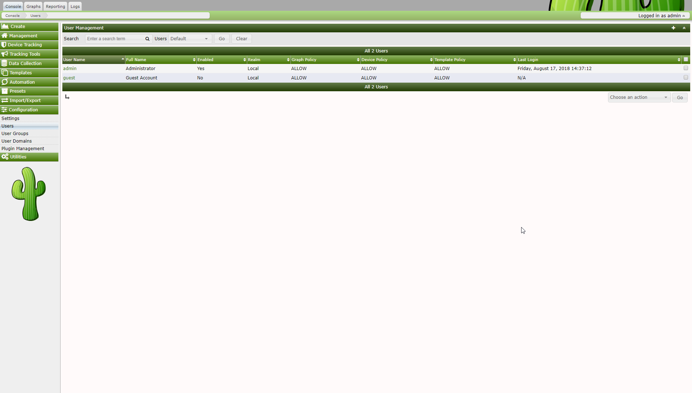
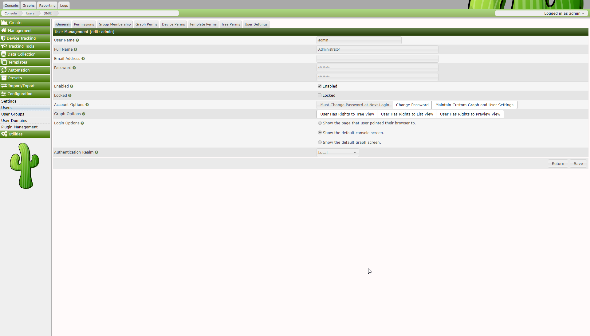
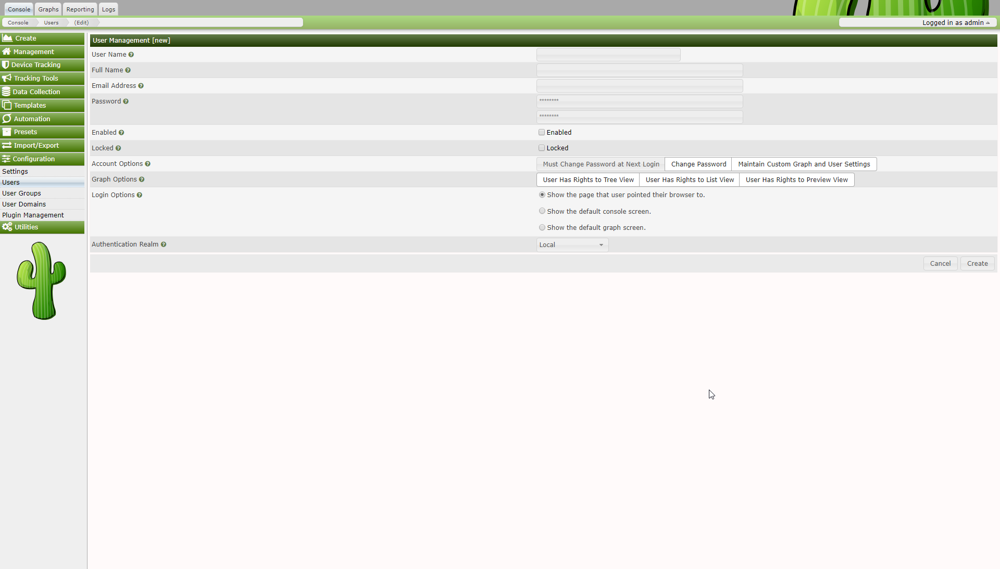
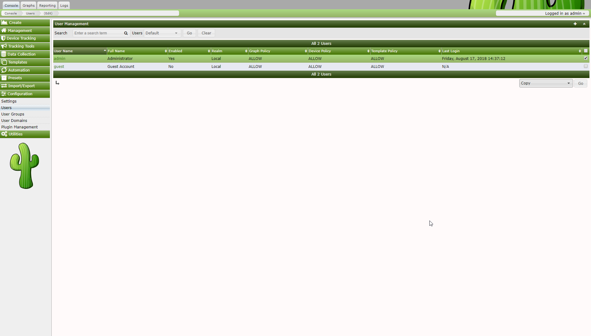
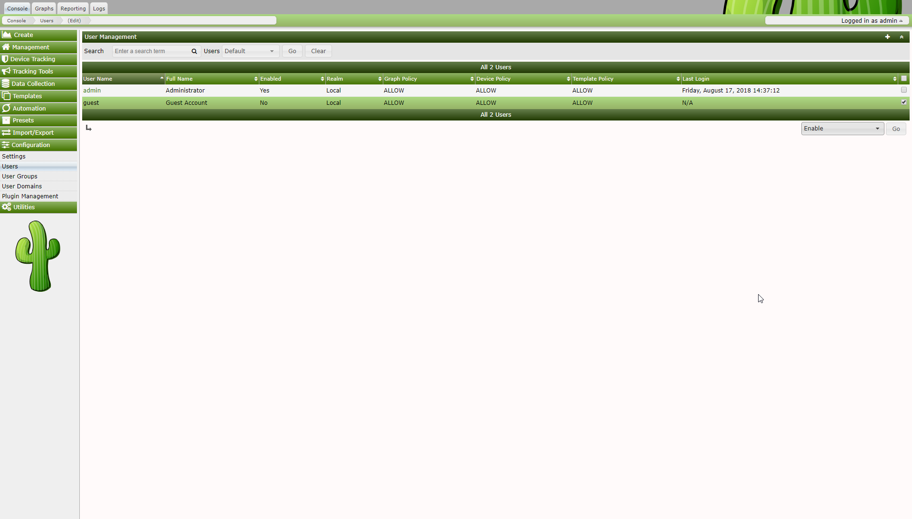
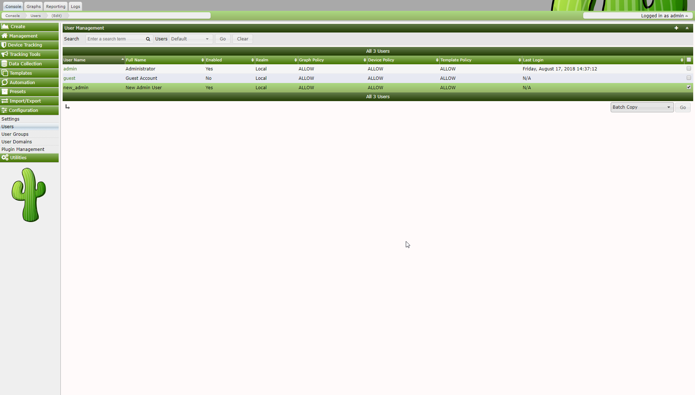
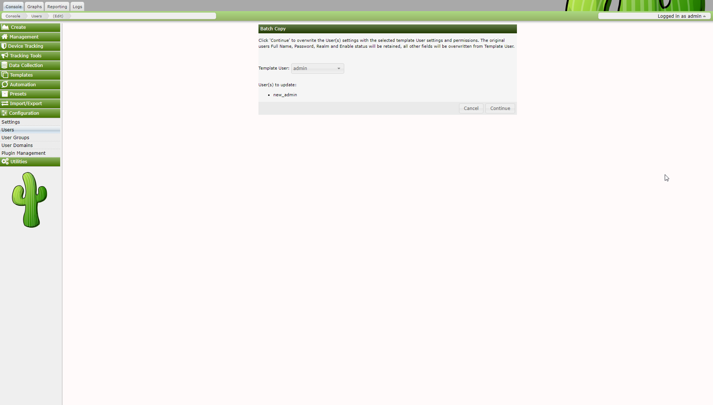
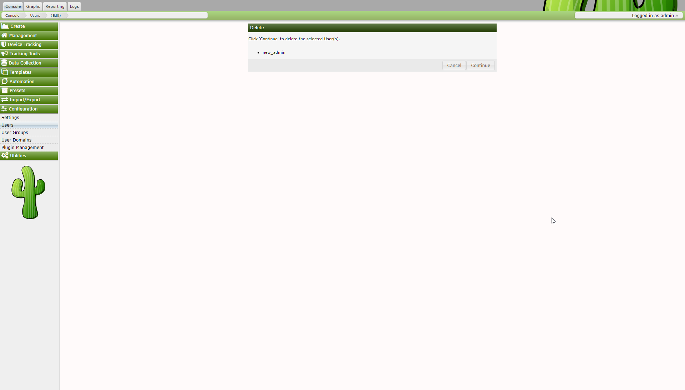

# User Management

In addition to giving you the tools to create sophisticated graphs, Cacti
enables you to create users that are tailored specifically to their
requirements. Each user has certain settings such as login actions, as well as
graph viewing settings. There are also two levels of permissions control, realm
permissions and graph permissions which enable you to control what the user can
see and change.

Out of the box, there are two users that come with every Cacti installation.
The "admin" user, is the main user that by default has access to see and change
everything in Cacti. This is the user that you first login with in Cacti, and
is probably a good idea to keep around unless you know otherwise. The second
user is the "guest" user, which controls which areas/graphs are allowed for
unauthenticated users. By default this user only has rights to view, but not
change all graphs. This enables any unauthenticated user to visit
'graph_view.php' and view your graphs. This behavior can be changed by either
changing the realm permissions for the "guest" user, or disabling the guest
user altogether under Cacti Settings. By default in 0.8.7 and later, the
"guest" user is not set in the setting, effectively disabling "guest"
(Unauthenticated) access to Cacti.

## Editing an existing User

To edit an existing user, select the User Management item under the Utilities
heading on the Cacti menu. Once at the user management screen, click username
of the user you wish to edit. You will see a screen that looks similar to the
image below.

At minimum, you must specify a User Name and a Password for each user. Each
user field is described in more detail below. In addition to these fields, each
user can have their own realm permissions", graph permissions, and graph
settings. Each of these items are described in this section of the manual.

## Realm Permissions

Realm permissions control which areas of Cacti a user can access. You can edit
a user's realm permissions by selecting User Management and choosing the user
you want to edit the permissions for. The Realm Permissions box will be
displayed in the lower part of the screen. Each "realm" is a grouping that
represents common tasks in Cacti, making it easier to fine tune each user's
access.

If you want to create a user that can only view graphs, you should select the
View Graphs realm and leave everything else unchecked. See the Graph
Permissions section for more information about how to fine tune this even more
on a per-graph basis. Conversely, if the user needs to access the console, they
will need Console Access and any additional realms that you see fit.

## Graph Permissions

Graph permissions control which graphs a user is allowed to view, it does not
apply to editing graphs. You can edit a user's graph permissions by selecting
User Management and choosing the user you want to edit the permissions for. Now
select the Graph Permissions tab to view this user's graph permissions. There
are three different ways that you can apply graph permissions, by graph, by
host, or by graph template. This works by allowing or denying the user to all
graphs associated with the particular group. So you can deny a user to a single
graph, all graphs associated with a particular host, or all graphs associated
with a particular graph template. Combining these three types of assigning
graph permissions results in a very powerful graph policy editor.

Each assignment type contains a Default Policy dropdown which can be used to
control whether the user should be allowed to view everything or be denied from
everything by default in the particular group. It is very important to remember
that these policies are evaluated in the order: graph, host, graph template.
Therefore, if you set graph's default policy to Deny, but kept host and graph
template at Allow, the user's effective policy would be Deny since the graph
assignment type is evaluated first. You typically either want to set all
default policies to Deny for a restrictive user, or Allow for a non-restrictive
user. If you thoroughly understand Cacti's graph permissions system, these
default policies can be combined to provide very complex results.

## Graph Settings

Cacti stores certain graph viewing settings for each user, which enables each
user to view graphs in an optimal way. These preferences controls things such
as the preview graph size or the default graph viewing mode to use. In addition
to managing these settings here under user management, each user can change
their own settings by clicking on the Graphs tab and selecting the Settings tab
on the following page. If you want to prevent a user from being able to keep
their own graph preferences, uncheck the Allow this User to Keep Custom Graph
Settings checkbox in user management. The user will be presented with an
"Access Denied" error message if they attempt to click the Settings tab when
this box is checked.

## Creating a New User

To create a new user, select the User Management item under the Utilities
heading on the Cacti menu. Once at the user management screen, click Add.

At minimum, you must specify a User Name and a Password for each user. Each
user field is described in more detail in the Editing an existing User section
previous to this one. In addition to these fields, each user can have their own
realm permissions", graph permissions, and graph settings. Each of these items
are described in editing existing users section of the manual.

## Copying a user

To copy a user to a new user, select the User Management item under the
Utilities heading on the Cacti menu. Once at the user management screen, select
the user you would like to copy from and select copy from the Action selection
box, click Go to continue. If you select multiple users, only the first
selected user will be used as the source user.

Specify the New Username, New Full Name and New Realm of the new user. Click
Yes to copy the selected template user to the the designated new user. An error
will be returned if you attempt to copy over an existing user. If you would
like to copy over an existing user, use Batch Copy.

## Enable/Disable Users

To enable or disable a set of or a single user, select the User Management item
under the Utilities heading on the Cacti menu. Once at the user management
screen, select the user(s) you would like to enable or disable and select
enable or disable from the Action selection box, click Go to continue.

Confirm that you want to disable or enable the listed users. Click Yes to
perform the action. Disabling your own account is possible and not recommended,
as once you logoff you will not be able to return.

## Batch Copy Users

Batch Copy is a helpful utility that helps Cacti Administrators maintain users.
Because Cacti does not yet support groups, it is important that there is some
way to mass update users. This what Batch Copy does for you.

To Batch Copy a set of or a single user, select the User Management item under
the Utilities heading on the Cacti menu. Once at the user management screen,
select the user(s) you would like to batch copy information to and select
"Batch Copy" from the Action selection box, click Go to continue.

Select the Template User and confirm that you want to Batch Copy the listed
users. Click Yes to perform the action.

It is important to note that when using Batch Copy the original user(s) Full
Name, Password, Realm and Enable status will be retained, all other fields will
be overwritten with values from the selected template user.

## Delete Users

To delete a set of or a single user, select the User Management item under the
Utilities heading on the Cacti menu. Once at the user management screen, select
the user(s) you would like to delete and select delete from the Action
selection box, click Go to continue.

Confirm that you want to delete the listed users. Click Yes to perform the
action. Deleting your own account is possible and not recommended.

## Guest (Anonymous) Access

By default in 0.8.7 and later of Cacti, Guest or Anonymous access is disabled.
This is shift from previous release that came with the "Guest" user enabled and
set.

Enabling "Guest" access is easy. But, you must understand that you should only
allow the designated "Guest" user access to what you authorized. It is not
sugguested that you give the designated "Guest" user more than just access to
graphs. To enable guest access, first, need a designated "Guest" user. Cacti by
default comes with one already created that has access to only graphs. It is
important to note that the default guest user has access to all graphs on the
system. Once you have created the "Guest" user, you need to tell Cacti what the
"Guest" user is. This is done by updating the Authenication Settings and
selecting the "Guest" user you have designated. The "Guest" user must be
enabled and be set as the guest user for anonymous access to work.

Copyright (c) 2018 Cacti Group
