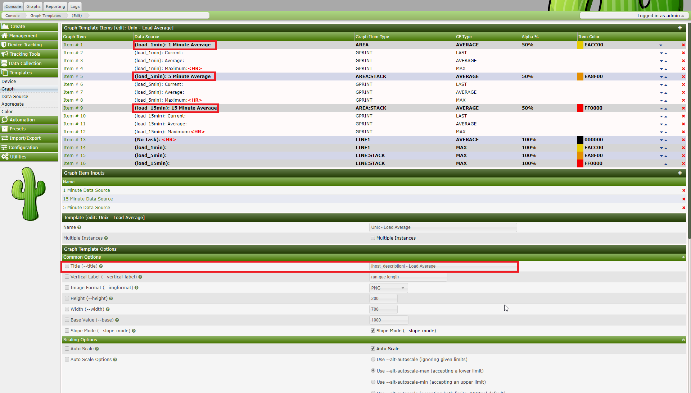
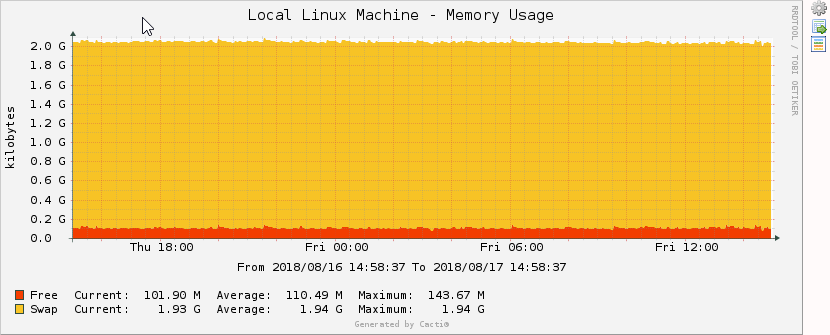
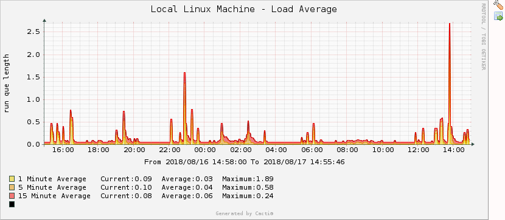

# Variables

## Graph Variables

The following variables can be used in the Text Format and Value graph item
fields. Below is a description of each of these variables.

## Date/Time

```regex
|date_time|
```

This variable will place the date and time of the last poller run on the graph.
It can be used to replicate MRTG's "graph last updated" feature.

## Data Source Title

```regex
|data_source_title|
```

This variable, `|data_source_title|`, gets replaced with the name of the data
source associated with a particular graph item in a graph template. This change
allows the creation of generic graph templates (2-variable line graph,
3-variable stack, etc.) which can be reused with large numbers of data sources.
See attached examples to understand usage.







## Data Query Fields

```regex
|query_field_name|
````

You can place the value of any data query field on the by including this
variable. Make sure to substitute "field_name" with the actual data query field
name.

```regex
|query_ifIP|
```

```regex
|query_dskPath|
```

## Nth Percentile

```regex
|[0-9]:(bits|bytes):[0-9]:(current|total|max|total_peak|all_max_current|all_max_peak|aggregate_max|aggregate_sum|aggregate_current|aggregate):[0-9]|
```

Nth percentile is often used by hosting providers to bill customers based on
their peak traffic usage while ignoring their top (100 - Nth) percent. This way
if a customer has a fairly consistent traffic pattern and decides to download a
huge file one day, the large spike will be ignored. Common Nth percentile is
95, which would cut off the top 5% of the traffic.

In Cacti, Nth percentile works just like any other graph variable. To use this
variable you must give it five arguments:

###### Table 15-1. Nth Percentile Argument Description

Name | Description
--- | ---
[0-9] | The first argument is a number between 1 and 99. This number represents the Nth percentile that you would like to calculate.
(bits \| bytes) | Choose whether you want to represent your Nth percentile in bits or bytes. The only valid values for this field are 'bits' and 'bytes'.
[0-9] | This field determines the power of 10 divisor that will be applied to your Nth percentile number. Enter '0' to leave the number alone, '3' for kilo or '6' for mega, etc.
( current \| total \| max \| total_peak \| all_max_current \| all_max_peak \| aggregate_max \| aggregate_sum \| aggregate ) | Nth Percentile Type - Refer to Nth Types below
[0-9] | Enter the number of digits to use for floating point precision when printing out the final number. The default value for this field is two decimal places.

###### Table 15-2. Nth Percentile Types

Type | Description
--- | ---
current | Calculates the Nth percentile based off the selected data source on the graph item wich the variable is used. This type requires a selected Data Source Item in the graph item in which it is defined.
total | Calculates the Nth percentile based off the selected data source on the graph item wich the variable is used. But unlike current, this function totals the Nth percentile results of all same named data source names on the graph. Example, all traffic_in would have their Nth percentile calculated and then totaled. This type requires a selected Data Source Item in the graph item in which it is defined.
max | Calculates the Nth percentile based off the selected data source on the graph item which the variable is used, but it is important to note that it selects the higher of the values for each row in data source and then uses the resulting set to calculate the Nth percentile. Example, you have selected a interface data source for traffic_in, this will evaluate traffic_out and traffic_in for that selected data source (rrdtool file) and select the higher of the two values for each row of data. The resulting max values are used to calculate the Nth percentile value. This type requires a selected Data Source Item in the graph item in which it is defined.
total_peak | Calculates the Nth percentile based on the max for each data source defined on the graph. Example, the max is taken for each data source defined on the graph, but it\'s the max of traffic_in or traffic_out for that data source (rrdtool file). The resulting max values are summed and returned.
all_max_current | Calculates the Nth percentile based off the selected data source on the graph item which the variable is used, but it only selects the highest (max) value of all the data source items on the graph. Example, there are 3 data sources defined on the graph, the selected data source is traffic_in, all data sources for traffic_in will be compared against each other and the highest Nth value of all graph items will be selected as the result. This type requires a selected Data Source Item in the graph item in which it is defined.
all_max_peak | Calculates the Nth percentile by selecting the highest (max) calculated max Nth percentile value for each data source (rrdtool file) selected on the graph. Example, 3 data sources are defined on the graph, for each data source, the max Nth percentile is calculated, and out of the resulting set of values, the highest value is selected and returned.
aggregate_max | Calculates the Nth percentile by selecting the highest value for each summed value of like data sources and selecting the maximum value of that set to calculate the Nth percentile value. Example, you have a graph with 5 traffic_in and 18 traffic_out data sources. The traffic_in rows are summed together, then the traffic_out rows are summed together, then for each row, the higher of the 2 values is selected. The Nth percentile is calculated from the resulting maximum values.
aggregate_sum | Calculates the Nth percentile by summing all data sources on the graph row for row and calculates the Nth value on the resulting summed data. Example, you have a graph with 4 traffic_in and 3 traffic_out data sources defined. All the defined traffic_in and traffic_out are summed together and then the Nth percentile value is calculated from that set.
aggregate | Calculates the Nth percentile by summing like data source names row for row from each data source defined on the graph and then returning the highest Nth percent value calculated for like data source names. Example, you have a graph with 3 traffic_out and 5 traffic_in data sources defined. The traffic_in and traffic_out are summed then the Nth value is calculated and the higher of the 2 values is returned as the variable.

> **Note**
>
> All data sources used in a graph MUST have the same rra definitions. If the
> number of rows do not match when calculations are attempted, the results may
> produce errors and invalid results. Please also be aware the aggregate
> functions take more memory and processor power when used. Recommended minimum
> of 64 megs memory limit for php when querying large ranges or graphs with a
> large ammount of aggregated data sources.

###### Example 15-3. Output in the following format, for 95th percentile: 42.58 mbit

```regex
|95:bits:6:max:2|
```

## Bandwidth Summation

```regex
|sum:([0-9]|auto):(current|total):([0-9]):([0-9]+|auto)|
```

Bandwidth summation is useful for summing up all values in an RRD file for a
given time range. This is typically useful on traffic graphs where you can see
a total of all traffic that has gone through an interface in a given time
period.

In Cacti, bandwidth summation works just like any other graph variable. To use
this variable you must give it three arguments:

###### Table 15-3. Bandwidth Summation Argument Description

Name | Description
--- | ---
([0-9] \| auto) | This field determines the power of 10 divisor that will be applied to your number. Enter '0' to leave the number alone, '3' for kilo or '6' for mega, etc. You can also enter 'auto' for this field to have Cacti automatically scale the number and insert the appropriate label.
(current \| total) | You can choose to calculate the summation based on the current data source or a total of all data sources used on the graph. The only valid values for this field are 'current' and 'total'.
[0-9] | Enter the number of digits to use for floating point precision when printing out the final number. The default value for this field is two decimal places.
([0-9]+ \| auto) | Enter the number of seconds in the past to perform the summation calculation for. For instance '86400' for 24 hours, '172800' for 48 hours, etc. You can also enter 'auto' for this field to have Cacti use the graph timespan.

###### Example 15-4. Output in the following format: 36.47 GB

```regex
|sum:auto:current:2:auto|
```

## Host Variables

Host variables represent host data and can be placed in graph or data source
titles. The following table describes which host variables can be used and
which host fields the correspond to.

###### Table 15-4. Host Variables

Variable Name | Description
:--- | :---
\|host_availability\| | Availability of host
\|host_avg_time\| | Average time for host
\|host_cur_time\| | Current time for host
\|host_description\| | Description
\|host_external_id\| | ID associated with external system
\|host_hostname\| | Hostname
\|host_id\| | Numerical ID of the Host as it is maintained in the MySQL Tables
\|host_location\| | Location
\|host_max_oids\| | SNMP Max OIDs for snmpbulkwalk
\|host_notes\| | Administrative Notes
\|host_ping_retries\| | Ping Retries (Downed Host Detection)
\|host_polling_time\| | Last polling time
\|host_snmp_auth_protocol\| | SNMP Authentication Protocol (v3)
\|host_snmp_community\| | SNMP Community
\|host_snmp_context\| | SNMP Context (v3)
\|host_snmp_engine_id\| | SNMP Engine Id (v3)
\|host_snmp_password\| | SNMP Password (v3)
\|host_snmp_port\| | SNMP Port
\|host_snmp_priv_passphrase\| | SNMP Privacy Passphrase (v3)
\|host_snmp_priv_protocol\| | SNMP Privacy Protocol (v3)
\|host_snmp_sysContact\| | SNMP Contact
\|host_snmp_sysDescr\| | SNMP Description
\|host_snmp_sysLocation\| | SNMP Location
\|host_snmp_sysName\| | SNMP System Name
\|host_snmp_sysObjectID\| | SNMP ObjectID
\|host_snmp_sysUpTimeInstance\| | SNMP Up Time
\|host_snmp_timeout\| | SNMP Timeout
\|host_snmp_username\| | SNMP Username (v3)
\|host_snmp_version\| | SNMP Version

Copyright (c) 2018 Cacti Group
