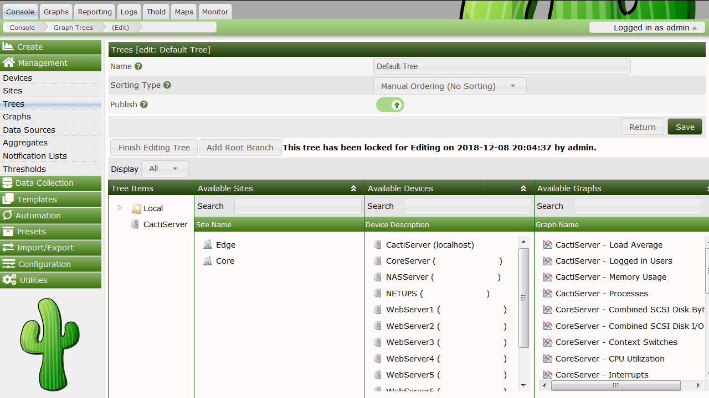

# Viewing Graphs

## Graph Trees

A graph tree can be thought of as a hierarchical way of organizing your graphs.
Each graph tree consists of zero or more headers or branch nodes that contain
leaf nodes such as graphs or trees. Multiple graph trees or branches within a
single tree can be combined to form a very powerful way of organizing your
graphs.

## Creating a Graph Tree

To create a new graph tree, select the Graph Trees menu item under the
Management header. Select Add on this page to create a new tree. The following
page will prompt you for a tree name, which will be used to identify the graph
tree throughout Cacti. Along with the Name, you may select one of four
currently supported Sorting Types

###### Table 8-1. Tree Sporting Type Definitions

Field | Value | Description
--- | --- | ---
Name | Name of the tree entry. | The sort order of all trees themselves is always alphabetical
Sorting Type | Manual Ordering (No Sorting) | You may chance the sequence at your will
Alphabetical Ordering |  1, Ab, ab | All subtrees are ordered alphabetically, unless specifies otherwise (you may chance sort options at subtree lebel)
Natural Ordering | ab1, ab2, ab7, ab10, ab20 | N/A
Numeric Ordering | 01, 02, 4, 04 | Leading zeroes are not taken into account when ordering numerically

Once you type a name, click the Create button to continue.
You will be redirected to a page similar to the one below,
but without all of the items.

To start adding items to your tree, click add in the Tree Items box. There are
currently three different types of tree items you can choose from: header,
graph, or host. Simply choose the type you want, fill in the value for that
type, and click Create to make your new graph tree item. Clicking the Add link
to the right of any branch will add the new item below that branch, you can
change the branch that any item belongs to by changing its Parent Item field.

Please note the "++" and the "--" buttons. They will help you managing large
trees. Pressing the "--" will collapse all tree levels while "++" expands all
of them. You may expand each single subtree of a collapsed tree to reorder, add
or delete entries without much scrolling.

---
Copyright (c) 2018 Cacti Group
