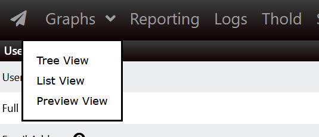
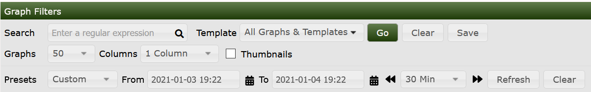
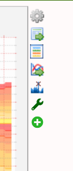
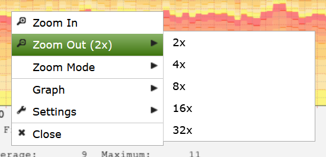

# Viewing Graphs

## Background

Cacti, when it was first invented in 2001 by Ian Berry, his vision was to make it
the fastest and easiest way to view and render Network Monitoring **Graphs** for
people in the Network, Site, and Data Center Operations Space.  As such, it's focus
from the very beginning was on render just one thing, **Graphs**.  So, as such,
the second **Top Tab** on a Cacti system is the **Graphs** tab.

## The Graphs Top Tab

The **Graphs** **Top Tab** has a few personalities.  They include:

- **Tree View**

  Allows Cacti Users to view **Graphs** in the form of hierarchical **Trees**.
  These **Trees** are generally constructed by the Cacti Administrator and are
  controlled either at the **User** or **User Group** level.

- **Preview View**

  The **Preview View** provides a view of all **Graphs** that a Cacti User has
  access to.  **Table Filters** are provided to constrain the list of **Graphs**
  returned to the page.

- **List View**

  The **List View** allows the Cacti user to Create their own **Preview Page**
  by allowing them to select graphs from various pages, and then finally view
  those pages from the **Preview View**.

The way these various personalities appear in Cacti is somewhat different
depending on your Theme.  Review the two images below, for how you navigate to
the various **Graph View** modes.

In this first image, we see the way the **Graph View** options are displayed to
the end user.  This is the layout of the Classic, Modern and Dark themes.

In this second image, you can see the way the **Graph View** page will appear for
users of the Paw, Paper-Plane, and Sunrise themes.

## Graph Manipulation and Options

Once you can view the **Graphs**, there will be a Filter Panel that will provide
you multiple options to limit your view of them.  Below, you can see an image of
that Filter Panel.

From this sub-panel, you can do the following:

- Search by regular expression
- Select one to many, or all **Graph Templates** to view
- Specify the number of Graphs per Page
- Specify the number of columns to Display
- View either Legendless Thumbnails or full Graphs with their legends
- Set various Preset Time-spans, or select a Time Range
- Shift the Time either forward or backward by the Shift Time-span

Once you have the Filter where you like it from a Columns, Thumbnails, and Graphs
per Page setting, you can press the `Save` button, if you have the correct
permissions and save those defaults for your next login.

Depending again on permissions, to the right of the **Graphs**, you will find a
number of action icons that allow you to operate on the **Graphs**

The image below shows what that might look like if you have the **Thold** and
**QuickTree** **Plugins** installed.

From top to bottom, the Graph Action Icons do the following.

Name | Description
--- | ---
Graph Details | Allow you to perform precision zooming, view RRDtool debug information and perform CSV exports of your Graph Data.
CSV Export | Allows you to directly CSV Export your Graph Data
Realtime View | Allows you to view your Graphs at down to a 1 second granularity either in place, or in a pop-up Window
Spike Kill | Allow you to clear up Spikes and Gaps in your Graph
Create Threshold | Create a Threshold for the Graph
Add to QuickTree | Allow you to select Graphs to add to Trees by simply tooling around the Graphs page.

## Graph Zooming

Cacti also has a powerful Graph Zoom interface built in.  You can discover
what it allows you to do by simply right clicking in the Graph area.  When
zooming, you will zoom all the **Graphs** on a page.  It's quite powerful.

There are many options for the Zoom menu.  Instead of explaining them here
try them out for yourself.

---
<copy>Copyright (c) 2004-2022 The Cacti Group</copy>
