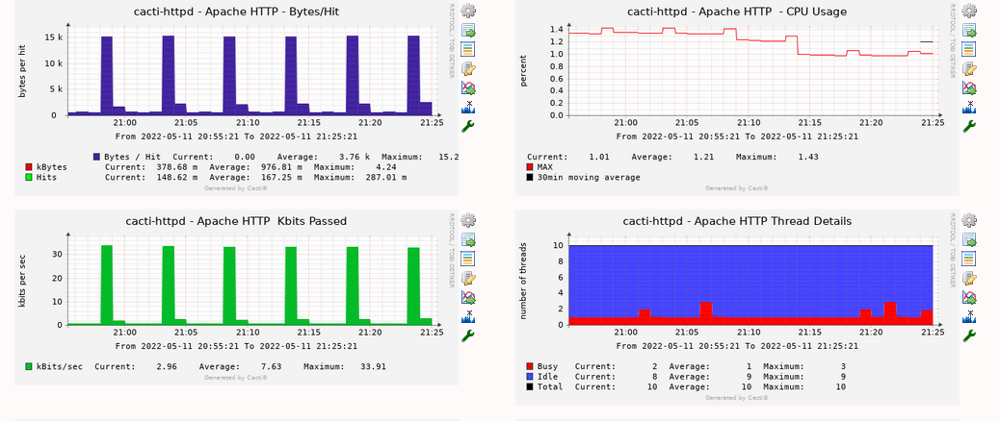

The Apache http webserver template allows you to monitor your local Cacti server's Apache server for performance KPI's

This template leverages the mod_status module in apache in order to pull the kpi data to feed into the script



For Centos/Redhat implementations the config will look as follows

Place the below config in  /etc/httpd/conf/httpd.conf

```console

LoadModule status_module modules/mod_status.so
ExtendedStatus On

<Location /server-status>
    SetHandler server-status
    Require local
</Location>
```

#### restart httpd ( systemctl restart httpd) for the config to take effect

For Debian

```shell
a2enmod status
```
Place the below config in /etc/apache2/sites-enabled

```console

LoadModule status_module modules/mod_status.so
ExtendedStatus On

<Location /server-status>
    SetHandler server-status
    Require local
</Location
```
#### restart apache ( systemctl restart apache2) for the config to take effect


#### The require local directive will restrict access to the server-status page to only local
