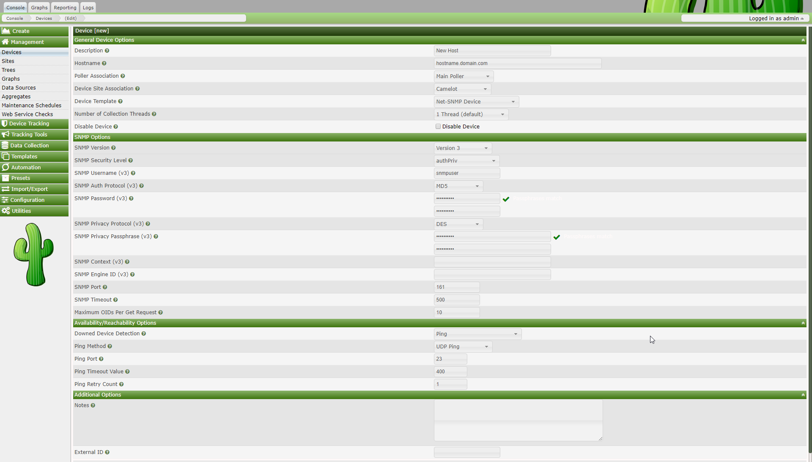
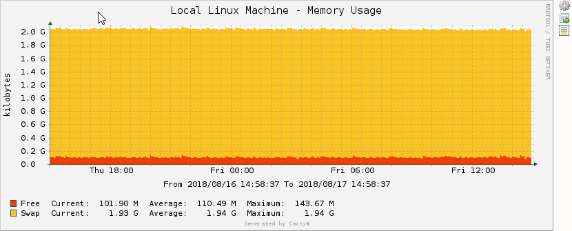

Requirements
============

Cacti requires that the following software is installed on your system.

-   RRDTool 1.3 or greater, 1.5+ recommended
-   MySQL 5.x or MariaDB 5.5 or greater
-   PHP 5.4 or greater, 5.5+ recommended
-   Web Server that supports PHP e.g. Apache, Nginx, or IIS
-   Build environment when using spine (gcc, automake, autoconf, libtool, help2man)

General Installing Instructions
===============================

Please make sure, the following packages are installed according to your operating systems requirements. Verify, that httpd/apache and mysqld/mariadb are started at system startup.

Required Packages for Most Operating Systems
--------------------------------------------------------------------

Depending on your operating system and php version, certain packages are required for Cacti.  The largest variability in these requirements come with regard to php and MySQL/MariaDB.  

Installation requirements include the packages below.  The installation of these packages will vary by operating system. 

#### Base OS:
-   apache, IIS, or nginx
-   net-snmp, net-snmp-utils
-   rrdtool
-   help2man` (for spine)
-   dos2unix (for spine)
-   development packages (gcc, automake, autoconf, libtool, help2man) (for spine)

#### Database:
MySQL versions to 5.7 are supported.  MariaDB to 10.2 is also supported.

-   mysql
-   mysql-server
-   libmysqlclient

or

-	mariadb
-	mariadb-server
-	libmariadbclient

#### PHP Modules:
The installation of these modules vary by OS.  Use the 'php -m' command to verify that they are installed.

-   posix
-   session
-   sockets
-   PDO
-   pdo_mysql
-   xml
-   ldap
-   mbstring
-   pcre
-   json
-   openssl
-   gd
-   zlib

#### PHP Optional Modules
The following modules are optional, but preferred to be installed.

-	snmp
-	gmp (for plugin support)
-	com or dotnet (windows only)

Ports for FreeBSD
-----------------
When installing on FreeBSD and variants, you must consider these packages.

-   `www/apache2`
-   `net/rrdtool`
-   `net/net-snmp`
-   `www/php-cgi`
-   `lang/php` (With MySQL and SNMP Support)
-   `databases/mysql-server`

Configure PHP
-------------

Please verify, that the modules are installed and configured correctly. There are several ways to do so, please consult [PHP configuration instructions](http://www.php.net/manual/en/configuration.php) for a complete description.

It is imperative that you set the `date.timezone` in your `/etc/php.ini`, or `/etc/phpX/apache/php.ini` and `/etc/phpX/cli/php.ini` files.  Failure to do so will result in errors after the install is complete.

Most other PHP configuration is done automatically by the base OS, so there is not need to discuss here.

Configure the Webserver (Apache)
--------------------------------

Most Linux/UNIX OS' automatically configure the Web Server to allow PHP content.  So, there should be no need to provide additional configuration.  However, the following section is included below for reference in the case that you are running a UNIX version that does not properly configure the Webserver properly.  The documentation below is written specifically for RHEL and variants.  So, the instructions may vary.

Please find the file `/etc/httpd/conf/httpd.conf` or equivalent and make the following changes to it:

    # Load config files from the config directory "/etc/httpd/conf.d".
    Include conf.d/*.conf

Now, please locate the PHP configuration file at `/etc/httpd/conf.d/php.conf`

    # PHP is an HTML-embedded scripting language which attempts to make it
    # easy for developers to write dynamically generated webpages.
    LoadModule php_module modules/libphp.so
    #
    # Cause the PHP interpreter to handle files with a .php extension.
    AddHandler php-script .php
    AddType text/html .php
    #
    # Add index.php to the list of files that will be served as directory
    # indexes.
    DirectoryIndex index.php

Configure MySQL/MariaDB
-----------------------

Set a password for the root user.  Please record this password.  If you loose control of this password, you may have to re-install your database server in the case of any system disaster or recovering from a crash.

    shell> mysqladmin --user=root password somepassword
    shell> mysqladmin --user=root --password reload

You must also load timezone information into the database.  This is required for various plugin use.  Later, you will be required to grant access to the `time_zone_name` table during the final installation steps.

	shell> mysql_tzinfo_to_sql /usr/share/zoneinfo | mysql -u root mysql

Since Cacti 1.x is supporting internationalization (i18n), it is important that the default character set for MySQL or MariaDB be i18n compatible.  The Cacti installer will make specific recommendations on MySQL/MariaDB settings.  Please follow those as applicable for your OS.

Galera clustering: There are several tables which are set to use the MEMORY storage engine which do not get replicated among nodes which can cause problems. If you configure Cacti to only connect to one node of your cluster and are not load balancing this does not apply to you.

If you are running multiple nodes in a load-balanced environment where you connect to a VIP you should remove all but one node from rotation during Cacti installation or update. After the installation/update login to your MySQL server and execute the following commands to update those tables to use the InnoDB engine:

    MariaDB [(none)]> use cacti;
    MariaDB [cacti]>> ALTER TABLE `automation_ips` ENGINE=InnoDB;
    MariaDB [cacti]>> ALTER TABLE `automation_processes` ENGINE=InnoDB;
    MariaDB [cacti]>> ALTER TABLE `data_source_stats_hourly_cache` ENGINE=InnoDB;
    MariaDB [cacti]>> ALTER TABLE `data_source_stats_hourly_last` ENGINE=InnoDB;
    MariaDB [cacti]>> ALTER TABLE `poller_output` ENGINE=InnoDB;
    MariaDB [cacti]>> ALTER TABLE `poller_output_boost_processes` ENGINE=InnoDB;
                            
These changes should replicate to the other nodes in your cluster. Allow Cacti to run at least two or three full polling cycles before placing the other nodes back into rotation.

Install and Configure Cacti
---------------------------

1.  Extract the distribution tarball.

        shell> tar xzvf cacti-version.tar.gz

2.  Create the MySQL database:

        shell> mysqladmin --user=root create cacti

3.  Import the default cacti database:

        shell> mysql cacti < cacti.sql

4.  Optional: Create a MySQL username and password for Cacti.

        shell> mysql --user=root mysql
        mysql> GRANT ALL ON cacti.* TO cactiuser@localhost IDENTIFIED BY 'somepassword';
		mysql> GRANT SELECT ON mysql.time_zone_name TO cactiuser@localhost IDENTIFIED BY 'somepassword';
        mysql> flush privileges;

5.  Edit `include/config.php` and specify the database type, name, host, user and password for your Cacti configuration.

        $database_type = "mysql";
        $database_default = "cacti";
        $database_hostname = "localhost";
        $database_username = "cactiuser";
        $database_password = "cacti";

6.  Set the appropriate permissions on Cacti's directories for graph/log generation. You should execute these commands from inside Cacti's directory to change the permissions.

        shell> chown -R cactiuser rra/ log/ cache/

    (Enter a valid username for *cactiuser*, this user will also be used in the next step for data gathering.)

7.  Create a new file `/etc/cron.d/cacti` and add to it:

        */5 * * * * cactiuser php <path_cacti>/poller.php > /dev/null 2>&1

    Replace *cactiuser* with the valid user specified in the previous step.

    Replace `<path_cacti>` with your full Cacti path.

8.	During install, you will need to provide write access to the following files and directories:

		shell> chown -R resource scripts include/config.php

	Once the installation is complete, you may change the permissions to more restrictive settings.

9.  Point your web browser to:

    	http://your-server/cacti/

    Log in the with a username/password of *admin*. You will be required to change this password immediately. Make sure to fill in all of the path variables carefully and correctly on the following screen.

(Optional) Install and Configure Spine
--------------------------------------

Spine is a very fast data collection engine, written in C. It is an optional replacement for cmd.php. If you decide to use it, you will have to install it explicitly. It does not come with cacti itself.

The easiest way is to install Spine using rpm or ports. You will find packages for Spine at the main cacti site or from your distribution.

To compile Spine, please download it to any location of your liking. Then, please issue from the downloaded directory following commands

	shell>./bootstrap    

If the `boostrap` script is successful, you then will follow the instructions it provides to compile and install.

Assuming, you've managed to install spine correctly, you will have to configure it. The configuration file may be placed in the same directory as spine itself or at /etc/spine.conf.

    DB_Host  127.0.0.1 or hostname (not localhost)
    DB_Database cacti
    DB_User     cactiuser
    DB_Password cacti
    DB_Port     3306

Installing Under Windows
========================

BSOD2600, one of the long term users of Cacti, provides an Installer on Windows.  We recommend you use that installer for Cacti.  You can obtain that installer under the Windows section of the Cacti forums.  However, if you wish to install Cacti yourself, please follow the instructions below.

1.  (Optional) Apache\> - This software is optional if running Windows Internet Information Server.

2.  Cacti - Install from the zip distribution and install in the web root or your choice. Many choose to install into a "Cacti" sub folder.

3.  Spine - Install from the zip distribution into the `c:\cacti` directory. Make sure your `spine.conf.dist` is located in that directory as well.

4.  RRDTool - Install from the Cacti website. Install it into the `c:\cacti` directory.

5.  PHP X - Install into the `c:\php` folder. If you choose to install into `c:\Program Files\php`, you will have to use 8.3 filenames to reference it's binaries in Cacti.

6.  MySQL 5.x - Install into the default location. This is typically `c:\Program Files\MySQL\MySQL Server X.XX`.

7.  (Optional) Cygwin - Download and execute `setup.exe` from the Cygwin website. Keep the `setup.exe` file for later use.  You will need Cygwin and it's development packages for building RRDtool and spine.

8.  (Optional) Net-SNMP - Install to the `c:\net-snmp` directory. If you choose to use `c:\Program Files\net-snmp` you will have tu use 8.3 filenames to reference it's binaries in Cacti.

Common OS Changes
-----------------
The following changes will be required regardless of your selected Webserver.

1.  Add the following directory to the existing Windows System `PATH` environment variable: `c:\php`. The Windows path can be accessed via the Control Panel at: System | Advanced | Environment Variables | System Variables.

2.  Add the following directory to a new Windows System environment variable called `PHPRC`: `c:\php`.

3.  Add a new Windows System environment variable called `MIBDIRS` set it to `c:\php\extras\mibs`

4.  Rename the file `c:\php\php.ini.dist` to `php.ini`, and make the following changes to it:

    Uncomment the following lines.

        extension_dir = c:\php\ext
        extension=php_mysql.dll
        extension=php_snmp.dll
        extension=php_sockets.dll
        cgi.force_redirect = 0

5.  In earlier installation guides to PHP, they recommended moving certain DLL's to the `
                        c:\winnt\system32` directory. If so, you will have to remove those files. Please review the PHP installation documentation for instructions on removing those files.

6.  If you want to allow template importing, uncomment the following line:

        file_uploads = On

7.  Give the user who will be running the scheduled task, modify rights to the `.index` file in the location pointed to by the `MIBDIRS` Windows System environment variable.

Web Server Configuration
------------------------

1.  Make sure you have stopped any IIS web servers before you proceed with Apache installation, or make sure Apache is configured on an alternate port.

2.  If using Apache 2.x and PHP 5, then add the following lines.

        LoadModule php5_module c:\php\php5apache2.dll
        AddType application/x-httpd-php .php
        DirectoryIndex index.html index.htm index.php

IIS Specific Steps
------------------

1.  Start the Internet Information Services (IIS) Manager, right click on the Default Web Site (in most cases) and select Properties.

2.  Under the Home Directory tab, select Configuration and click Add. Browse to the path of `php4isapi.dll` or `php5isapi.dll`, and type in .php as the extension. Note: if using IIS6, Enable All Verbs and Script Engine.

3.  Under the ISAPI Filters tab, click Add and browse to the `php4isapi.dll` or `php5isapi.dll` file. Name the filter "php" and click OK.

4.  Under the Documents tab, add `index.php` to the list.

5.  If using IIS6, goto Web Service Extensions and add a new Web Service Extension. Name the extension "php", and click Add and browse to the `php4isapi.dll` or `php5isapi.dll` file, enable Set Extension status to Enable, and click OK.

6.  Give the IUSR\_XXXX and IIS\_WPG users read & execute permissions to the file `%windir%\system32\cmd.exe`. They will also need read permissions on `cacti_web_root/cacti` and it's subfolders.

7.  If using IIS6, give the IIS\_WPG user modify permissions to the folders `cacti_web_root/cacti/log` and `cacti_web_root/cacti/rrd`.

8.  Completely stop and start the IIS service using the following commands:

        net stop iisadmin
        net start w3svc

Cygwin Installation Steps for spine and rrdtool
-----------------------------------------------

1.  Installing a single instance of Cygwin, and using it for all applications that require it is recommended so you do not have different versions of the Cygwin dlls laying around on your system, which can cause conflicts.

2.  Run `setup.exe` or `setup-x64.exe` you previously download.

3.  Once you reach the portion of setup entitled Select Packages, install the following:

        Base (include all items)
        Libs
			libcairo2
			libcrypt0
			libfontconfig-common
			libfontconfig1
			libfreetype6
			libgcrypt20
			libgd3
			libglib2.0_0
			libmysqlclient-devel
			libmysqlclient18
			libopenssl100
			libpango1.0_0
			libpng16
			libreadline7
			zlib-devel
			zlib0
		Devel
			autoconf
			automake
			binutils
			clang
			cygwin-devel
			gcc-core
			gcc-g++
			help2man
			libargp
			libltdl7
			libtool
			net-snmp-devel
			textinfo
			w32api-headers
			w32api-runtime
			windows-default-manifest
        Utils
            patch
        Web
            wget

4.  Add `c:\cygwin\bin` to your Windows System PATH environment variable.

5.  Move `setup.exe` or `setup-x64.exe` to `c:\cygwin` for future use.  This binary is updated from time to time, so it's recommended that you update it periodically.

RRDtool Download and Installation Instructions
----------------------------------------------

1.  TBD

MySQL Download and Installation Instructions
--------------------------------------------

1.  Extract the MySQL zip file to a temp directory and run `setup.exe`.

2.  Install MySQL to the default directory, or for the purposes of this manual to the `c:\mysql` directory.

3.  If running an older version of MySQL, start it by running `c:\mysql\bin\winmysqladmin.exe`. In more recent versions, this is not required.

4.  Set a password for the root user

        shell> cd mysql\bin
        shell> mysqladmin --user=root password somepassword
        shell> mysqladmin --user=root --password reload

5.  Create the MySQL database:

        shell> mysqladmin --user=root --password create cacti

6.  Import the default Cacti database:

        shell> mysql --user=root --password cacti < c:\apache2\htdocs\cacti\cacti.sql

7.  Create a MySQL username and password for Cacti.

        shell> mysql --user=root --password mysql
        mysql> GRANT ALL ON cacti.* TO cactiuser@localhost IDENTIFIED BY 'somepassword';
        mysql> GRANT SELECT ON mysql.time_zone_name TO cactiuser@localhost IDENTIFIED BY 'somepassword';
        mysql> flush privileges;

Net-SNMP Installation
---------------------

1.  If you plan to use any hosts with SNMP v2c support, and are using early versions of PHP, you must download and install the Net-SNMP libraries. Net-SNMP provides installers to install their product. However, caution must be taken if you choose to use long file names as Cacti does not them as long file names. You will have to user 8.3 notation. For example `c:\Program Files\Net-SNMP\bin` becomes `c:\progra~1\net-snmp\bin`.

Cacti spine Installation
------------------------

1.  Extract the Spine zip file to `c:\cacti` and modify the `spine.conf.dist` file to include the following statements.

        DB_Host  127.0.0.1 or hostname (not localhost)
        DB_Database cacti
        DB_User     cactiuser
        DB_Password cacti
        DB_Port     3306

    All other pre 0.8.6 settings are obsolete.

2.  Spine now comes with a binary distribution. However, we strongly suggest that you install Cygwin and then remove all the DLL files and `sh.exe` from the `c:\cacti` directory.

Finishing your Setup
--------------------

1.  Edit `cacti_web_root/cacti/include/config.php` and specify the MySQL user, password, database, and database port for your Cacti configuration.

        $database_default = "cacti";
        $database_hostname = "localhost";
        $database_username = "cactiuser";
        $database_password = "cacti";
        $database_port = "3306";

2.  Point your web browser to:

        http://your-server/cacti/

    Log in using the username and password of admin/admin. You will be required to change this password immediately.

3.  From Cacti, go to Settings-\>Paths and verify/udate your paths to point to the correct locations. Recommended examples are posted below. If you plan on using Spine, then it is very important that all paths include forward slashes instead of backslashes.

    *PHP Binary Path:*

        c:/php/php.exe

    *RRDTool Binary Path:*

        c:/cacti/rrdtool.exe

    *SNMPGET, SNMPWALK, SNMPBULKWALK, SNMPGETNEXT Paths:*

        c:/progra~1/net-snmp/bin/snmpget.exe
        c:/progra~1/net-snmp/bin/snmpwalk.exe
        c:/progra~1/net-snmp/bin/snmpbulkwalk.exe
        c:/progra~1/net-snmp/bin/snmpgetnext.exe

    *Cacti Logfile Path:*

        c:/mycacti/website/cacti/log/cacti.log

    *Spine Path:*

        c:/cacti/spine.exe

4.  Click on Devices. Delete the Localhost devices as it intended for Linux environments In the upper right corner, click Add. Fill in the following information and then click Add.

        Description: My Windows localhost
        Hostname: localhost
        Host Template: Windows 2000/XP

5.  You should now be looking at the localhost device screen. Right under it's name, there should be some SNMP information listed, if not you should double check the SNMP settings on the server and firewall settings. In the upper right-hand corner, click on Create Graphs for this Host. On the following screen, select a disk partition and network interface. At the bottom of the page, click on Create.

6.  Log into the user account you'll be using for the scheduled task and verify starting a Cacti polling cycle works. Do this by running the following from the command prompt:

        php c:/cacti_web_root/cacti/poller.php

    The output should look something like the following:

        C:\>php c:\inetpub\wwwroot\cacti\poller.php
        OK u:0.00 s:0.06 r:1.32
        OK u:0.00 s:0.06 r:1.32
        OK u:0.00 s:0.16 r:2.59
        OK u:0.00 s:0.17 r:2.62
        10/28/2005 04:57:12 PM - SYSTEM STATS: Time:4.7272 Method:cmd.php Processes:1 Threads:N/A Hosts:1 HostsPerProcess:2 DataSources:4 RRDsProcessed:2

    After this has ran once, you should have `cacti.log` in `/cacti/log/` and rrd files in /cacti/rra/.

7.  You are going to need to schedule a task while logged on as an Administrator. This task is required to you can run `poller.php` every 5 minutes. Make sure the Task Scheduler service is started and follow the steps below to begin.

    *Note:* The following instructions are based on Windows XP and Windows Server 2003. You should be able to follow these instructions close enough for Windows 2000 as well.

    1.  Select Start --\> Settings --\> Control Panel and double click on Scheduled Tasks.

    2.  Double click on Add Scheduled Task.

    3.  Click Next and Browse on the following screen. Find `c:\php` and select `php.exe`. Choose Daily on and click Next.

    4.  Click Next again without changing the time or date settings.

    5.  When entering a username and password make sure the user has read and write access to the following directories:

            cacti_web_root/cacti/rra
            cacti_web_root/log

        Make sure the user has read, write, and execute access to the following directories:

            c:\php
            c:\php\sapi

    6.  Click Next and Finish to close the wizard.

    7.  Right click on the task you just created, and select Properties.

    8.  Select the Schedule tab.

    9.  Make sure Daily is selected and click the Advanced button.

    10. Check the Repeat checkbox, set it for 5 minutes and set the duration for 24 hours.

    11. Click Ok

    12. In the Run textbox enter the following text making sure to use the appropriate paths.

            c:\php\php.exe c:\mycacti\website\cacti\poller.php

        The start in box should say `c:\mycacti\website\cacti`.

Upgrading Cacti
===============

1.  Backup the old Cacti database.

        shell> mysqldump -l --add-drop-table cacti > mysql.cacti

    Note: You will probably have to specify the -u and -p flags for the MySQL username and password. This user must have permission to read from Cacti's database or you will end up with an empty backup.

2.  Backup the old Cacti directory.

        shell> mv cacti cacti_old

3.  Extract the distribution tarball.

        shell> tar xzvf cacti-version.tar.gz

4.  Rename the new Cacti directory to match the old one.

        shell> mv cacti-version cacti

5.  Edit `include/config.php` and specify the MySQL user, password and database for your Cacti configuration.

        $database_type = "mysql";
        $database_default = "cacti";
        $database_hostname = "localhost";
        $database_username = "cactiuser";
        $database_password = "cacti";

6.  Copy the \*.rrd files from the old Cacti directory.

        shell> cp cacti_old/rra/* cacti/rra/

7.  Copy any relevant custom scripts from the old Cacti directory. Some script are updated between versions. Therefore, make sure you only over write if the scripts either don't exist or are newer than the distribution's.

        shell> cp -u cacti_old/scripts/* cacti/scripts/

8.  Copy any relevant custom resource XML files from the old Cacti directory. Some resource XML files are updated between versions. Therefore, make sure you only over write if the XML files either don't exist or are newer than the distribution's.

        shell> cp -u -R cacti_old/resource/* cacti/resource/

9.  Set the appropriate permissions on Cacti's directories for graph/log generation. You should execute these commands from inside Cacti's directory to change the permissions.

        shell> chown -R cactiuser rra/ log/

    (Enter a valid username for cactiuser, this user will also be used in the next step for data gathering.)

10. Point your web browser to:

    > http://your-server/cacti/

    Follow the on-screen instructions so your database can be updated to the new version.

Principles of Operation
=======================

Cacti operation may be divided into three different tasks:

Data Retrieval
--------------

First task is to retrieve data. Cacti will do so using its Poller. The Poller is executed from the operating system's scheduler, e.g. crontab for Unix flavored OSes.

In current IT installations, you're dealing with lots of devices of different kind, e.g. servers, network equipment, appliances and the like. To retrieve data from remote targets/hosts, cacti will mainly use the Simple Network Management Protocol SNMP. Thus, all devices capable of using SNMP will be eligible to be monitored by cacti.

Later on, we demonstrate how to extend cacti's capabilities of retrieving data to scripts, script queries and more.

Data Storage
------------

There are lots of different approaches for this task. Some may use an (SQL) database, others flat files. Cacti uses [RRDTool](http://www.rrdtool.org/) to store data.

RRD is the acronym for Round Robin Database. RRD is a system to store and display time-series data (i.e. network bandwidth, machine-room temperature, server load average). It stores the data in a very compact way that will not expand over time, and it can create beautiful graphs. This keeps storage requirements at bay.

Likewise, rrdtool will perform some specific tasks. It performs consolidation to combine raw data (a primary data point in rrdtool lingo) to consolidated data (a consolidated data point). This way, historical data is compressed to save space. rrdtool knows different consolidation functions: AVERAGE, MAXIMUM, MINIMUM and LAST.

Data Presentation
-----------------

One of the most appreciated features of [RRDTool](http://www.rrdtool.org/) is the built-in graphing function. This comes in useful when combining this with some commonly used webserver. Such, it is possible to access the graphs from merely any browser on any plattform.

Graphing can be done in very different ways. It is possible, to graph one or many items in one graph. Autoscaling is supported and logarithmic y-axis as well. You may stack items onto another and print pretty legends denoting characteristics such as minimum, average, maximum and lots more.

Graph Overview
==============

Almost everything in Cacti is somehow related to a graph. At any time, you can list all available graphs by clicking on the Graph Management menu item. While it is possible to manually create graphs through this screen, new users should follow the instructions provided in the next chapter for creating new graphs in Cacti.

For users that are familiar with [RRDTool](http://www.rrdtool.org/), you will immediately recognize that a graph in Cacti is closely modeled after RRDTool's graphs. This makes sense since Cacti provides a user friendly interface to RRDTool without requiring users to understand how RRDTool works. With this in mind, every graph in Cacti has certain settings and at least one graph item associated with it. While graph settings define the overall properties of a graph, the graph items define the data that is to be represented on the graph. So the graph items define which data to display and how it should displayed, and also define what should be displayed on the legend.

Each graph and graph item has a set of parameters which control various aspects of the graph. Fortunately through the use of graph templates, it is not necessary to understand the function of each field to create graphs for your network. When you are ready to take on the task of creating your own graph templates, extensive field descriptions for both graphs and graph items are provided in that section of the manual.

How to Graph Your Network
=========================

At this point, you probably realize that graphing is Cacti's greatest strength. Cacti has many powerful features that provide complex graphing and data acquisition, some which have a slight learning curve. Do not let that stop you however, because graphing your network is incredibly simple.

The next two sections will outline the two basic steps which are typically required to create graphs for most devices.

Creating a Device
-----------------

The first step to creating graphs for your network is adding a device for each network device that you want to create graphs for. A device specifies important details such as the network hostname, SNMP parameters, and host type.

To manage devices within Cacti, click on the Devices menu item. Clicking Add will bring up a new device form. The first two fields, Description and Hostname are the only two fields that require your input beyond the defaults. If your host type is defined under the host template dropdown, be sure to select it here. You can always choose "Generic SNMP-enabled Host" if you are just graphing traffic or "None" if you are unsure. It is important to remember that the host template you choose will not lock you into any particular configuration, it will just provide more intelligent defaults for that type of host.

The field definitions are as follows

||

After saving your new device, you should be redirected back to the same edit form with some additional information. If you configured SNMP for this host by providing a valid community string, you should see various statistics listed at the top of the page. If you see "SNMP error" instead, this indicates an SNMP problem between Cacti and your device.

Towards the bottom of the page there will be two addition boxes, Associated Data Queries, and Associated Graph Templates. If you selected a host template on the previous page, there will probably be a few items in each box. If there is nothing listed in either box, you will need to associate at least one data query or graph template with your new device or you will not be able to create graphs in the next step. If no available graph template or data query applies to your device, you can check the Cacti templates repository or create your own if nothing currently exists.

### A Word About SNMP

The SNMP version that you choose can have a great effect on how SNMP works for you in Cacti. Version 1 should be used for everything unless you have reason to choose otherwise. If you plan on utilizing (and your device supports) high-speed (64-bit) counters, you must select version 2. Starting with Cacti 0.8.7, version 3 is fully implemented.

The way in which Cacti retrieves SNMP information from a host has an effect on which SNMP-related options are supported. Currently there are three types of SNMP retrieval methods in Cacti and are outlined below.

||

### SNMP V3 Options Explained

SNMP supports authentication and encryption features when using SNMP protocol version 3 known as *View-Based Access Control Model (VACM)*. This requires, that the target device in question supports and is configured for SNMP V3 use. In general, configuration of V3 options is target type dependant. The following is cited from `man snmpd.conf` concerning user definitions

       SNMPv3 Users
           createUser [-e ENGINEID] username (MD5|SHA) authpassphrase [DES|AES] [privpassphrase]

                  MD5 and SHA are the authentication types to use.  DES and AES are the privacy
                  protocols  to  use. If  the  privacy  passphrase  is not specified, it is assumed
                  to be the same as the authentication passphrase.  Note that the users created will
                  be useless unless they are also added  to  the  VACM access control tables
                  described above.

                  SHA  authentication  and DES/AES privacy require OpenSSL to be installed and the
                  agent to be built with OpenSSL support.  MD5 authentication may be used without
                  OpenSSL.

                  Warning: the minimum pass phrase length is 8 characters.

VACM directives are explained from `man snmpd.conf` as follows

       VACM Configuration
           The full flexibility of the VACM is available using four configuration directives -
           com2sec, group,  view and access.  These provide direct configuration of the underlying
           VACM tables.

           com2sec  [-Cn CONTEXT] SECNAME SOURCE COMMUNITY
                  map  an  SNMPv1 or SNMPv2c community string to a security name - either from a
                  particular range of source addresses, or globally ("default").  A restricted
                  source can either be a specific  hostname (or  address),  or  a  subnet -
                  represented as IP/MASK (e.g. 10.10.10.0/255.255.255.0), or IP/BITS
                  (e.g. 10.10.10.0/24), or the IPv6 equivalents.

                  The same community string can be specified in several separate directives
                  (presumably with different  source  tokens), and the first source/community
                  combination that matches the incoming request will be selected.  Various
                  source/community combinations can also map to the same security name.

                  If a CONTEXT is specified (using -Cn), the community string will be mapped
                  to a security  name  in the named SNMPv3 context. Otherwise the default
                  context ("") will be used.

           group GROUP {v1|v2c|usm} SECNAME
                  maps  a  security name (in the specified security model) into a named group.
                  Several group directives can specify the same group name, allowing a single
                  access setting to apply to several  users and/or community strings.

                  Note  that  groups must be set up for the two community-based models separately -
                  a single com2sec (or equivalent) directive will typically be accompanied by two
                  group directives.

           view VNAME TYPE OID [MASK]
                  defines a named "view" - a subset of the overall OID tree. This is most commonly
                  a single subtree, but  several view directives can be given with the same view
                  name, to build up a more complex collection of OIDs.  TYPE is either included
                  or excluded, which can again define a more complex view (e.g by excluding certain
                  sensitive objects from an otherwise accessible subtree).

                  MASK is a list of hex octets (separated by . or :)
                  with the set bits indicating which subidentifiers in the view OID to match against.
                  This can be used to define a view covering a particular row  (or  rows) in a table.
                  If not specified, this defaults to matching the OID exactly (all bits set), thus
                  defining a simple OID subtree.

           access GROUP CONTEXT {any|v1|v2c|usm} LEVEL PREFX READ WRITE NOTIFY
                  maps from a group of users/communities (with a particular security model
                  and  minimum  security level, and in a specific context) to one of three views,
                  depending on the request being processed.

                  LEVEL is one of noauth, auth, or priv.  PREFX specifies how CONTEXT should be
                  matched against  the context  of  the  incoming  request, either exact or prefix.
                  READ, WRITE and NOTIFY specifies the view to be used for GET*, SET and
                  TRAP/INFORM requests (althought the NOTIFY view is not currently used).  For
                  v1 or v2c access, LEVEL will need to be noauth.

As an example, following definitions in the snmpd configuration create a set of definitions for use with SNMP V3

    # sample configuration for SNMP V3

    # create an SNMP V3 user with an authpassphrase and a privacy passphrase
    ##         username   authProto  authpassphrase  privProto  privpassphrase
    ##         --------   ---------  --------------  ---------  --------------
    createUser gandalf    MD5        myauthpass      DES        myprivpass

    # Second, map the security name into a group name:
    ##    groupName    securityModel  securityName
    ##    ---------    -------------  ------------
    group groupv3      usm            gandalf

    # Third, create a view for us to let the group have rights to:
    ##          incl/excl  subtree   mask
    ##          ---------  -------   ----
    view    all included   .iso      80

    # Fourth, create the access for that group without context
    ##                context sec.model sec.level prefix read   write  notif
    ##                ------- --------- --------- ------ ----   -----  -----
    access groupv3    ""      any       auth      exact  all    all    all

When adding this stuff to your snmp configuration, please remember to restart the agent. Verify this setting using

    shell>snmpwalk -v 3 -a MD5 -A myauthpass -x DES \
    -X myprivpass -u gandalf -l authpriv localhost interface
    IF-MIB::ifNumber.0 = INTEGER: 3
    IF-MIB::ifIndex.1 = INTEGER: 1
    IF-MIB::ifIndex.2 = INTEGER: 2
    IF-MIB::ifIndex.3 = INTEGER: 3
    IF-MIB::ifDescr.1 = STRING: lo
    IF-MIB::ifDescr.2 = STRING: irda0
    IF-MIB::ifDescr.3 = STRING: eth0
    IF-MIB::ifType.1 = INTEGER: softwareLoopback(24)
    IF-MIB::ifType.2 = INTEGER: other(1)
    IF-MIB::ifType.3 = INTEGER: ethernetCsmacd(6)
    ...

Creating the Graphs
-------------------

Now that you have created some devices, it is time to create graphs for these devices. To do this, select the New Graphs menu option under the Create heading. If you're still at the device edit screen, select Create Graphs for this Host to see a screen similar to the image pictured below.

The dropdown menu that contains each device should be used to select the host that you want to create new graphs for. The basic concept to this page is simple, place a check in each row that you want to create a graph for and click Create.

If you are creating graphs from inside a "Data Query" box, there are a few additional things to keep in mind. First is that you may encounter the situation as pictured above with the "SNMP - Interface Statistics" data query. If this occurs you may want to consult the section on debugging data queries to see why your data query is not returning any results. Also, you may see a "Select a graph type" dropdown box under some data query boxes. Changing the value of this dropdown box affects which type of graph Cacti will make after clicking the Create button. Cacti only displays this dropdown box when there is more than one type to choose from, so it may not be displayed in all cases.

Once you have selected the graphs that you want to create, simply click the Create button at the bottom of the page. You will be taken to a new page that allows you to specify additional information about the graphs you are about to create. You only see the fields here that are not part of each template, otherwise the value automatically comes from the template. When all of the values on this page look correct, click the Create button one last time to actually create your graphs.

If you would like to edit or delete your graphs after they have been created, use the Graph Management item on the menu. Likewise, the Data Source menu item allows you to manage your data sources in Cacti.

Viewing Graphs
==============

Graph Trees
-----------

A graph tree can be thought of as a hierarchical way of organizing your graphs. Each graph tree consists of zero or more headers or branch nodes that contain leaf nodes such as graphs or trees. Multiple graph trees or branches within a single tree can be combined to form a very powerful way of organizing your graphs.

### Creating a Graph Tree

To create a new graph tree, select the Graph Trees menu item under the Management header. Select Add on this page to create a new tree. The following page will prompt you for a tree name, which will be used to identify the graph tree throughout Cacti. Along with the Name, you may select one of four currently supported Sorting Types

||

Once you type a name, click the Create button to continue. You will be redirected to a page similar to the one below, but without all of the items.

To start adding items to your tree, click add in the Tree Items box. There are currently three different types of tree items you can choose from: header, graph, or host. Simply choose the type you want, fill in the value for that type, and click Create to make your new graph tree item. Clicking the Add link to the right of any branch will add the new item below that branch, you can change the branch that any item belongs to by changing its Parent Item field.

Please note the "++" and the "--" buttons. They will help you managing large trees. Pressing the "--" will collapse all tree levels while "++" expands all of them. You may expand each single subtree of a collapsed tree to reorder, add or delete entries without much scrolling.

User Management
===============

In addition to giving you the tools to create sophisticated graphs, Cacti enables you to create users that are tailored specifically to their requirements. Each user has certain settings such as login actions, as well as graph viewing settings. There are also two levels of permissions control, realm permissions and graph permissions which enable you to control what the user can see and change.

Out of the box, there are two users that come with every Cacti installation. The "admin" user, is the main user that by default has access to see and change everything in Cacti. This is the user that you first login with in Cacti, and is probably a good idea to keep around unless you know otherwise. The second user is the "guest" user, which controls which areas/graphs are allowed for unauthenticated users. By default this user only has rights to view, but not change all graphs. This enables any unauthenticated user to visit 'graph\_view.php' and view your graphs. This behavior can be changed by either changing the realm permissions for the "guest" user, or disabling the guest user altogether under Cacti Settings. By default in 0.8.7 and later, the "guest" user is not set in the setting, effectively disabling "guest" (Unauthenticated) access to Cacti.

Editing an existing User
------------------------

To edit an existing user, select the User Management item under the Utilities heading on the Cacti menu. Once at the user management screen, click username of the user you wish to edit. You will see a screen that looks similar to the image below.

At minimum, you must specify a User Name and a Password for each user. Each user field is described in more detail below. In addition to these fields, each user can have their own realm permissions", graph permissions, and graph settings. Each of these items are described in this section of the manual.

||

### Realm Permissions

Realm permissions control which areas of Cacti a user can access. You can edit a user's realm permissions by selecting User Management and choosing the user you want to edit the permissions for. The Realm Permissions box will be displayed in the lower part of the screen. Each "realm" is a grouping that represents common tasks in Cacti, making it easier to fine tune each user's access.

If you want to create a user that can only view graphs, you should select the View Graphs realm and leave everything else unchecked. See the Graph Permissions section for more information about how to fine tune this even more on a per-graph basis. Conversely, if the user needs to access the console, they will need Console Access and any additional realms that you see fit.

### Graph Permissions

Graph permissions control which graphs a user is allowed to view, it does not apply to editing graphs. You can edit a user's graph permissions by selecting User Management and choosing the user you want to edit the permissions for. Now select the Graph Permissions tab to view this user's graph permissions. There are three different ways that you can apply graph permissions, by graph, by host, or by graph template. This works by allowing or denying the user to all graphs associated with the particular group. So you can deny a user to a single graph, all graphs associated with a particular host, or all graphs associated with a particular graph template. Combining these three types of assigning graph permissions results in a very powerful graph policy editor.

Each assignment type contains a Default Policy dropdown which can be used to control whether the user should be allowed to view everything or be denied from everything by default in the particular group. It is very important to remember that these policies are evaluated in the order: graph, host, graph template. Therefore, if you set graph's default policy to Deny, but kept host and graph template at Allow, the user's effective policy would be Deny since the graph assignment type is evaluated first. You typically either want to set all default policies to Deny for a restrictive user, or Allow for a non-restrictive user. If you thoroughly understand Cacti's graph permissions system, these default policies can be combined to provide very complex results.

### Graph Settings

Cacti stores certain graph viewing settings for each user, which enables each user to view graphs in an optimal way. These preferences controls things such as the preview graph size or the default graph viewing mode to use. In addition to managing these settings here under user management, each user can change their own settings by clicking on the Graphs tab and selecting the Settings tab on the following page. If you want to prevent a user from being able to keep their own graph preferences, uncheck the Allow this User to Keep Custom Graph Settings checkbox in user management. The user will be presented with an "Access Denied" error message if they attempt to click the Settings tab when this box is checked.

Creating a New User
-------------------

To create a new user, select the User Management item under the Utilities heading on the Cacti menu. Once at the user management screen, click Add.

At minimum, you must specify a User Name and a Password for each user. Each user field is described in more detail in the Editing an existing User section previous to this one. In addition to these fields, each user can have their own realm permissions", graph permissions, and graph settings. Each of these items are described in editing existing users section of the manual.

Copying a user
--------------

To copy a user to a new user, select the User Management item under the Utilities heading on the Cacti menu. Once at the user management screen, select the user you would like to copy from and select copy from the Action selection box, click Go to continue. If you select multiple users, only the first selected user will be used as the source user.

Specify the New Username, New Full Name and New Realm of the new user. Click Yes to copy the selected template user to the the designated new user. An error will be returned if you attempt to copy over an existing user. If you would like to copy over an existing user, use Batch Copy.

Enable/Disable Users
--------------------

To enable or disable a set of or a single user, select the User Management item under the Utilities heading on the Cacti menu. Once at the user management screen, select the user(s) you would like to enable or disable and select enable or disable from the Action selection box, click Go to continue.

Confirm that you want to disable or enable the listed users. Click Yes to perform the action. Disabling your own account is possible and not recommended, as once you logoff you will not be able to return.

Batch Copy Users
----------------

Batch Copy is a helpful utility that helps Cacti Administrators maintain users. Because Cacti does not yet support groups, it is important that there is some way to mass update users. This what Batch Copy does for you.

To Batch Copy a set of or a single user, select the User Management item under the Utilities heading on the Cacti menu. Once at the user management screen, select the user(s) you would like to batch copy information to and select "Batch Copy" from the Action selection box, click Go to continue.

Select the Template User and confirm that you want to Batch Copy the listed users. Click Yes to perform the action.

It is important to note that when using Batch Copy the original user(s) Full Name, Password, Realm and Enable status will be retained, all other fields will be overwritten with values from the selected template user.

Delete Users
------------

To delete a set of or a single user, select the User Management item under the Utilities heading on the Cacti menu. Once at the user management screen, select the user(s) you would like to delete and select delete from the Action selection box, click Go to continue.

Confirm that you want to delete the listed users. Click Yes to perform the action. Deleting your own account is possible and not recommended.

Guest (Anonymous) Access
------------------------

By default in 0.8.7 and later of Cacti, Guest or Anonymous access is disabled. This is shift from previous release that came with the "Guest" user enabled and set.

Enabling "Guest" access is easy. But, you must understand that you should only allow the designated "Guest" user access to what you authorized. It is not sugguested that you give the designated "Guest" user more than just access to graphs. To enable guest access, first, need a designated "Guest" user. Cacti by default comes with one already created that has access to only graphs. It is important to note that the default guest user has access to all graphs on the system. Once you have created the "Guest" user, you need to tell Cacti what the "Guest" user is. This is done by updating the Authenication Settings and selecting the "Guest" user you have designated. The "Guest" user must be enabled and be set as the guest user for anonymous access to work.

Graph a Single SNMP OID
=======================

When dealing with SNMP-enabled devices, there are often times when you want to graph the value of a single OID. This tutorial explains how to do this in Cacti. It also assumes that you have the "SNMP - Generic OID Template" graph template, which is now included in Cacti as of version 0.8.5. If you do not see this template listed under Graph Templates, download the template from the Cacti website in XML form and import it using the Import Templates menu item.

To start the process of creating a new graph for your OID, click the New Graphs menu item and select the host that contains the target OID from the dropdown. Under the Graph Templates box, you will see a dropdown on the last line that reads (Select a graph type to create). From this dropdown, choose "SNMP - Generic OID Template" and click the Create button at the bottom of the page.

You will be presented with several fields that will require input before the new graph can be created. They are described in more detail below.

||

When finished filling in values for these fields, click the Create button. Your new graph can now be accessed through the Graph Management page or the Graphs tab inside of Cacti.

Data Input Methods
==================

Data input methods allow Cacti to retrieve data to insert into data sources and ultimately put on a graph. There are different ways for Cacti to retrieve data, the most popular being through an external script or from SNMP.

Creating a Data Input Method
----------------------------

To create a new data input method, select the Data Input Methods option under the Management heading. Once on that screen, click Add on the right. You will be presented with a few fields to populate on the following screen.

||

When you are finished filling in all necessary fields, click the Create button to continue. You will be redirected back to the same page, but this time with two new boxes, Input Fields and Output Fields. The Input Fields box is used to define any fields that require information from the user. Any input fields referenced to in the input string must be defined here. The Output Fields box is used to define each field that you expect back from the script. *All data input methods must have at least one output field defined*, but may have more for a script.

### Data Input Fields

To define a new field, click Add next to the input or output field boxes. You will be presented with some or all of the fields below depending on whether you are adding an input or output field.

||

When you are finished filling in all necessary fields, click the Create button to continue. You will be redirected back to the data input method edit page. From here you can continue to add additional fields, or click Save on this screen when finished.

Making Your Scripts Work With Cacti
-----------------------------------

The simplest way to extend Cacti's data gathering functionality is through external scripts. Cacti comes with a number of scripts out of the box which are located in the `scripts/` directory. These scripts are used by the data input methods that are present in a new installation of Cacti.

To have Cacti call an external script to gather data you must create a new data input method, making sure to specify Script/Command for the Input Type field. See the previous section, [Creating a Data Input Method](data_input_methods.html) for more information about how to create a data input method. To gather data using your data input method, Cacti simply executes the shell command specified in the Input String field. Because of this, you can have Cacti run any shell command or call any script which can be written in almost any language.

What Cacti is concerned with is the output of the script. When you define your data input method, you are required to define one or more output fields. The number of output fields that you define here is important to your script's output. For a data input method with only one output field, your script should output its value in the following format:

    <value_1>

So if I wrote a script that outputs the number of running processes, its output might look like the following:

`67`

Data input methods with more than one output field are handled a bit differently when writing scripts. Scripts that output more than one value should be formatted like the following:

    <fieldname_1>:<value_1> <fieldname_2>:<value_2> ... <fieldname_n>:<value_n>

Lets say that I write a script that outputs the 1, 5, and 10 minute load average of a Unix machine. In Cacti, I name the output fields '1min', '5min', and '10min', respectively. Based on these two things, the output of the script should look like the following:

`1min:0.40 5min:0.32 10min:0.01`

One last thing to keep in mind when writing scripts for Cacti is that they will be executed as the user the data gatherer runs as. Sometimes a script may work correctly when executed as root, but fails due to permissions problems when executed as a less privileged user.

Data Queries
============

Data queries are not a replacement for data input methods in Cacti. Instead they provide an easy way to query, or list data based upon an index, making the data easier to graph. The most common use of a data query within Cacti is to retrieve a list of network interfaces via SNMP. If you want to graph the traffic of a network interface, first Cacti must retrieve a list of interfaces on the host. Second, Cacti can use that information to create the necessary graphs and data sources. Data queries are only concerned with the first step of the process, that is obtaining a list of network interfaces and not creating the graphs/data sources for them. While listing network interfaces is a common use for data queries, they also have other uses such as listing partitions, processors, or even cards in a router.

One requirement for any data query in Cacti, is that it has some unique value that defines each row in the list. This concept follows that of a 'primary key' in SQL, and makes sure that each row in the list can be uniquely referenced. Examples of these index values are 'ifIndex' for SNMP network interfaces or the device name for partitions.

There are two types of data queries that you will see referred to throughout Cacti. They are script queries and SNMP queries. Script and SNMP queries are virtually identical in their functionality and only differ in how they obtain their information. A script query will call an external command or script and an SNMP query will make an SNMP call to retrieve a list of data.

All data queries have two parts, the XML file and the definition within Cacti. An XML file must be created for each query, that defines where each piece of information is and how to retrieve it. This could be thought of as the actual query. The second part is a definition within Cacti, which tells Cacti where to find the XML file and associates the data query with one or more graph templates.

Creating a Data Query
---------------------

Once you have created the XML file that defines your data query, you must add the data query within Cacti. To do this you must click on Data Queries under the Data Gathering heading, and select Add. You will be prompted for some basic information about the data query, described in more detail below.

||

When you are finished filling in all necessary fields, click the Create button to continue. You will be redirected back to the same page, but this time with some additional information to fill in. If you receive a red warning that says 'XML File Does Not Exist', correct the value specified in the 'XML Path' field.

### Associated Graph Templates

Every data query must have at least one graph template associated with it, and possibly more depending on the number of output fields specified in the XML file. This is where you get to choose what kind of graphs to generate from this query. For instance, the interface data query has multiple graph template associations, used to graph traffic, errors, or packets. To add a new graph template association, simply click Add at the right of the Associated Graph Templates box. You will be presented with a few fields to fill in:

||

When you are finished filling in these fields, click the Create button. You will be redirected back to the same page with some additional information to fill in. Cacti will make a list of each data template referenced to in your selected graph template and display them under the Associated Data Templates box. For each data source item listed, you must selected the data query output field that corresponds with it. *Do not forget to check the checkbox to the right of each selection, or your settings will not be saved.*

The Suggested Values box gives you a way to control field values of data sources and graphs created using this data query. If you specify multiple suggested values for the same field, Cacti will evaluate them in order which you can control using the up or down arrow icons. For more information about valid field names and variables, read the section on suggested values.

When you are finished filling in all necessary fields on this form, click the Save button to return to the data queries edit screen. Repeat the steps under this heading as many times as necessary to represent all data in your XML file. When you are finished with this, you should be ready to start adding your data query to hosts.

SNMP Query XML Syntax
---------------------

    <query>
       <name>Get SNMP Interfaces</name>
       <description>Queries a host for a list of monitorable interfaces</description>
       <oid_uptime>.1.3.x.x.x</oid_uptime>
       <oid_index>.1.3.6.1.2.1.2.2.1.1</oid_index>
       <oid_index_parse>OID/REGEXP:.*\.([0-9]{1,3}\.[0-9]{1,3})$</oid_index_parse>
       <oid_num_indexes>.1.3.6.1.2.1.2.1.0</oid_num_indexes>
       <index_order>ifDescr:ifName:ifIndex</index_order>
       <index_order_type>numeric</index_order_type>
       <index_title_format>|chosen_order_field|</index_title_format>

       <fields>
          <ifIndex>
             <name>Index</name>
             <method>walk</method>
             <source>value</source>
             <direction>input</direction>
             <oid>.1.3.6.1.2.1.2.2.1.1</oid>
          </ifIndex>
       </fields>
    </query>

||

Script Query XML Syntax
-----------------------

    <query>
       <name>Get Unix Mounted Partitions</name>
       <description>Queries a list of mounted partitions on a unix-based host with the 'df' command.</description>
       <script_path>perl |path_cacti|/scripts/query_unix_partitions.pl</script_path>
       <arg_index>index</arg_index>
       <arg_query>query</arg_query>
       <arg_get>get</arg_get>
       <arg_num_indexes>num_indexes</arg_num_indexes>
       <output_delimeter>:</output_delimeter>
       <index_order>dskDevice:dskMount</index_order>
       <index_order_type>alphabetic</index_order_type>
       <index_title_format>|chosen_order_field|</index_title_format>

       <fields>
          <dskDevice>
             <name>Device Name</name>
             <direction>input</direction>
             <query_name>device</query_name>
          </dskDevice>
       </fields>
    </query>

||

Templates
=========

The real strength of Cacti is unleashed by using templates. There are three different types of templates with the basic Cacti installation: *Data Templates*, *Graph Templates* and *Host Templates*. While it is perfectly fine to define all data sources and graphs without using Templates at all, the burden of this approach is high. In most installations, there are lots of devices of the same kind. And there are lots of data of the same kind, e.g. traffic information is needed for almost every device. Therefor, the parameters needed to create a traffic rrd file are defined by a *Data Template*, in this case known as "Interface - Traffic". These definitions are used by all Traffic-related rrd files.

The same approach is used for defining *Graph Templates*. This is done only once. And all parameters defined within such a *Graph Template* are copied to all Graphs that are created using this Template.

The last type of Templates are the *Host Templates*. They are not related to some rrdtool stuff. The purpose of *Host Templates* is to group all Graph Templates and Data Queries (these are explained later) for a given device type. So you will make up a *Host Template* e.g. for a specific type of router, switch, host and the like. By assigning the correct *Host Template* to each new Device, you'll never forget to create all needed Graphs.

There's no need to create all Templates on your own! Apart from the fact, that many common templates are provided out-of-the-box, there's a very simple machnism to Import Templates and to Export Templates.

Data Templates
--------------

In Cacti, a data template provides a skeleton for an actual data source. If you have many data sources that share most of their characteristics, using a data template would probably make sense. No change of a Data Template is propagated to already existing rrd files. But most of them may be changed by using `rrdtool tune` from command line. Pay attention to not append new Data Source Items to already existing rrd files. There's no `rrdtool` command to achieve this!

### Creating a Data Template

To create a new data template, select Data Templates under the Templates heading and click Add.

The first thing you must do is give the template a name. This name has nothing to do with the data source name, but is what you will use to identify the template throughout Cacti.

Second, you will notice a list of data source/data source item field names with Use Per-Data Source Value checkboxes next to each one. The nice thing about templates in Cacti is that you can choose whether to template each field on a per-field basis. If you leave the checkbox unchecked, every data source attached to the template will inherit its value from the template. If the checkbox is checked, every data source attached to the template will contain its own value for that particular field. When generating a real data source, you will be prompted to fill those non-templated fields.

||

*Note:* For most data templates, you will want to check the Use Per-Graph Value checkbox for the name field so each data source using this template has its own unique name. It also makes sense to enter an inital value in this field that includes the variable |host\_description| for organizational purposes.

When you are finished filling in values for the data template, click Create and you will be presented with a screen similar to the data source edit screen.

#### Data Source Items

Like a graph, a data source can have more than one items. This is useful in situations where a script returns more than piece of data at one time. This also applies to data queries, so you can have a single data template that contains both inbound and outbound traffic, rather than having to create a separate data template for each.

||

#### Custom Data

Assuming you selected a data input source on the previous screen, you should now be presented with a Custom Data box. It will show a single line for every single parameter required for that very data input method. This is how the Data Source glues together with the data input method to provide all run time parameters.

Each custom data field is per-field templatable as all of the other data source fields are. Even if you select the Use Per-Data Source Value checkbox, it might be useful to specify a value that will be used as an "inital value" for any data source using this data template.

### Applying Data Templates to Data Sources

Applying a data template to a data source is a very simple process. The first thing you must do is select the data source you want to apply the template to under Data Sources. Under the Data Template Selection box, select the data template that you want to apply to the data source and click Save.

Once the template is applied to the data source, you will notice that you can only change values for the fields that you checked Use Per-Data Source Value for.

*Now any time a change is made to the data template, it will be automatically propagated to the data sources attached to it.*

> **Caution**
>
> When changing parameters of a Data Template, existing rrd files will never be changed. If this is required, you will have to apply `rrdtool tune` commands to any related rrd file manually.

Graph Templates
---------------

In Cacti, a graph template provides a skeleton for an actual graph. If you have many graphs that share most of their characteristics, using a graph template would probably make sense. After a graph is attached to a particular graph template, all changes made to the graph template will propagate out to all of its graphs, unless Use Per-Graph Value has been checked.

### Creating a Graph Template

To create a new graph template, select Graph Templates under the Templates heading and click Add.

The first thing you must do is give the template a name. This name has nothing to do with the graph title, but is what you will use to identify the template throughout Cacti. Second, you will notice a list of graph field names with Use Per-Graph Value checkboxes next to each one. The nice thing about templates in Cacti is that you can choose whether to template each field on a per-field basis. If you leave the checkbox uncheked, every graph attached to the template will inherit its value from the template. If the checkbox is checked, every graph attached to the template will contain its own value for that particular field.

||

*Note:* For most graph templates, you will want to check the Use Per-Graph Value checkbox for the title field so each graph using this template has its own unique title. It also makes sense to enter an initial value in this field that includes the variable |host\_description| for organizational purposes.

When you are finished filling in values for the graph template, click Create and you will be presented with a page similar to the graph edit page.

#### Graph Items

The first thing you should do is create graph items for this graph template, just like for a regular graph. One difference you will notice is that the Data Sources dropdown will contain a list of data template items rather than data source items. It is important that Cacti can make this association here, so that Cacti doesn't have to make unnecessary assumptions later.

||

#### Graph Item Inputs

After creating graph items for your template, you will need to create some graph item inputs. Graph item inputs are unique to graph templates because of the large number of items they sometimes contain. Graph item inputs enable you to take one graph item field, and associate it with multiple graph items.

To create a new graph item input, click Add on the right of the Graph Item Inputs box. There are various fields that must be filled in for every graph item input:

||

### Applying Graph Templates to Graphs

Applying a graph template to a graph is a very simple process. The first thing you must do is select the graph you want to apply the template to under Graph Management. Under the Graph Template Selection box, select the graph template that you want to apply to the graph and click Save. If this is a new graph or the graph and graph template contains an equal number of graph items, the graph template will be automatically applied. If number of graph items varies from the graph to the target graph template, you will be propmted with a warning that your graph will be changed.

Once the template is applied to the graph, you will notice that you can only change values for the fields that you checked Use Per-Graph Value for. You will also notice a new box, called Graph Item Inputs. This is where you can specify values for the graph items inputs that you defined in the graph template. The values specified here will be applied to each graph item tied to the graph item input.

*Now any time a change is made to the graph template, it will be automatically propagated to the graphs attached to it.*

Host Templates
--------------

Host templates in Cacti serve a different purpose then data and graph templates. Instead of abstracting the fields of a host, a host template allows you to associate graph templates and data queries with a given host type. This way when you assign a host template to a host, all of the relevant graphs to that host type are only one click away from the user.

### Adding a Host Template

To create a new host template in Cacti, select the Host Templates option under the Templates heading. Once on that screen, click Add on the right. Type a unique name for the host template and click the Create button. You will be redirected back to the edit page with the Associated Graph Templates and Associated Data Queries boxes. These two boxes allow you to associate certain graph templates or data queries with the host template. Simply select something from the dropdown menu and click Add to associate it with your host template.

Import Templates
----------------

Assume, you're searching for a specific set of templates to monitor a special type of device. Apart from designing templates from scratch, there's a good chance to find a solution in the [Scripts and Templates Forum](http://forums.cacti.net/forum-12.html). The set of templates is usually provided as a single XML file holding all required definitions for a data template and a graph template. Depending on the goal of the original author, he/she may have provided a host template as well as part of this XML file.

If the XML file was downloaded, you may import it from the filesystem via the search button. As an alternative, you may want to cut and paste the XML into the textbox.

Please pay attention the the *Import RRA Settings*. By default, current RRA settings will be preserved, even if the imported XML file specifies different settings. This is recommended to avoid accidentally overwriting these global RRA definitions. If you are sure, you may override this default.

For a single OID based template, this will be all. For a script based template, the author will provide the script that has to be downloaded to the Cacti `./scripts` directory. For a SNMP/SCRIPT Data Query, a second XML file holding the Data Query definitions will have to be downloaded to the appropriate directory under `./resources`.

When importing templates, Cacti will perform a version check. All XML templates hold the version of the Cacti system that generated this XML set. Cacti will import only, if your current Cacti version equals or is higher than the exporting one.

Export Templates
----------------

Now that you know how to import, you may want to know in which way to export as well. Selecting the Export Templates gives

You may select to export a graph template, a data template, a host template or a data query. When selecting `Include Dependencies`, e.g. a host template will include all referred templates (graph template, data template and, if defined, data query). Output may be written to the browser or to a file for uploading.

PHP Script Server
=================

The PHP Script Server is a new feature in Cacti 0.8.6. This new feature allows for the rapid execution of PHP based Data Queries in Cacti. The Script Server process is launched by the poller during every polling cycle. It listens for commands from the poller, executes them, and then waits for an quit signal.

The reason that it is so fast is that PHP is started in memory only one time, and for every Data Query called, it's code is interpreted only once. The resulting Data Query binaries are therefore very efficient. Using the Script Server process over the traditional POPEN process nets a 20+ fold speed improvement in Cacti.

Since PHP scripts are so powerful, this new feature in Cacti, makes it an excellent choice for collecting non-SNMP and SNMP based data.

Using the Script Server
-----------------------

Cacti 0.8.6 contains two sample script server routines. They are for the collection of HostMib CPU and Disk Partition information. These two examples are based off the traditional POPEN version of the HostMib functions found in earlier versions of Cacti.

For new installs, the HostMib functions are defaulted to using the PHP Script Server, therefore, you don't need to do anything to use it.

For upgrades, you must make several changes to start using the PHP Script Server for the HostMib CPU and HostMib Partitions Data Queries. To migrate you must follow the step below.

Upgrade Steps for the Example HostMib Data Queries
--------------------------------------------------

If you are using the two built in script queries, "SNMP - Get Mounted Partitions" and "SNMP - Get Processor Information", you can migrate to the PHP Script Server using the steps below:

1.  Verify the existence of New Data Input Method - Go to Data Input Methods, verify that you see the "Get Script Server Data (Indexed)" Data Input Method exists and that it is using the "Script Query - Script Server" method.

2.  Disable the Poller - Goto Settings-\>Poller and uncheck the Poller Enabled checkbox. Press Save.

3.  Update Your Data Queries - Go to Data Queries and Edit the two Data Queries below. Change both their Data Input Method to "Get Script Server Data (Indexed)" and in the XML path replace "script\_query" with "script\_server" as shown below:

    1.  SNMP - Get Mounted Partitions

        `<path_cacti>/resource/script_server/host_disk.xml`

    2.  SNMP - Get Processor Information

        `<path_cacti>/resource/script_server/host_cpu.xml`

4.  Update Your Data Templates - Goto Data Templates, locate the following two data templates and change their data input method to "Get Script Server Data (Indexed)".

    1.  Host MIB - Hard Drive Space

    2.  Host MIB - CPU Utilization

5.  Re Enable the Poller - Go to Settings-\>Poller and check the Poller Enabled checkbox. Press Save.

Following those steps should complete your migration to the new PHP Script Server for the two example HostMIB Data Queries.

Migration of Existing PHP Scripts to Script Server
--------------------------------------------------

If you have other PHP scripts that you wish to migrate, you must follow the steps below to migrate your scripts to the PHP Script Server required format.

### Script File Changes

Each PHP Script file must be changed to the new Script Server format. The changes are not dramatic, but required for the proper operation of the PHP Script Server. Follow the steps below to complete.

1.  Copy you existing script to a new name. The name must begin "ss\_" followed by your script name. The "ss\_" identifies the script as being a script server variety of the a PHP script. For example, if you previously had a script called "get\_mysql\_stats.php", it's new name would be "ss\_get\_mysql\_stats.php".

2.  Edit the new PHP script and add the following required lines to the file, where "ss\_myfunction" is the same as your filename.

        <?php
        $no_http_headers = true;

        /* display No errors */
        error_reporting(E_ERROR);

        include_once(dirname(__FILE__) . "/../include/config.php");
        include_once(dirname(__FILE__) . "/../lib/snmp.php");

        if (!isset($called_by_script_server)) {
            array_shift($_SERVER["argv"]);
            print call_user_func_array("ss_myfunction", $_SERVER["argv"]);
        }

3.  What was originally just mainline code, must be replaced with a function name. For example, if your program previously contained the following three lines of code:

        <?php
        $a = 100;
        $b = $a / 10;
        print $b;
        ?>

    Would become:

        function ss_myfunction() {
            $a = 100;
            $b = $a / 10;
            Print $b;
        }

4.  If you have any additional functions declared within your script file, you must prefix them to make them unique amongst all functions. Our recommendation would be to prefix all functions with the name of the main function. For example if you have a function called "meme" you would rename it to "ss\_myfunction\_meme". This guarantee's correct Script Server functionality.

5.  The last step is to change the function call that could have traditionally returned the value to the Cacti poller using the PRINT function. You must change that line or lines in your code to utilize the RETURN function instead. However, this does not apply to PRINT statements that are not called from the Poller. For a simple script, this results in

        function ss_myfunction() {
            $a = 100;
            $b = $a / 10;
            Return $b;
        }

    Be careful, when writing Script Server Data Queries. Use the RETURN function for returning results of the GET operation. But use PRINT for INDEX and QUERY operations, e.g.

            if (($cmd == "index")) {
                ...
                print $some_index_data . "\n";
                }
            } elseif ($cmd == "query") {
                ...
                print $some_query_data . "\n";
            } elseif ($cmd == "get") {
                ...
                result $some_get_data;
        }
                                

### XML File Changes

If you are using a "Script Query" type function, then you must also change your XML file. Please reference the XML files in the `<path_cacti>/resource/script_server` directory for the specifics related to your required modifications. However, you may also follow the instructions below:

1.  Modify the \<script\_path\> tag. Change it from:

        <script_path>|path_php_binary| -q |path_cacti|/scripts/myfucntion.php</script_path>

    to simply the following:

        <script_path>|path_cacti|/scripts/ss_myfunction.php</script_path>

2.  Add the following two XML tags below the \<script\_path\> tag. Replace *ss\_myfunction* with your function name:

        <script_function>ss_myfunction</script_function>
        <script_server>php</script_server>

3.  Save the XML file.

### Data Query & Data Template Changes

Your Data Queries and Data Templates must be also changed. Although somewhat self explanatory by now, you must make the following changes:

1.  Change it's Input Method to "Get Script Server Data" or "Get Script Server Data (Index)" depending on it's type.

    Change the XML file path to point to the new XML file in the `<path_cacti>/resources/script_server/*.xml` path.

    For all data templates that use the data query you must change their "Data Input Method" accordingly.

Your final step is to go to the System Utilities and Clear Poller Cache to apply the new settings. If you script is operating correctly, you should now be migrated to the script server.

Testing Your Script in the Script Server
----------------------------------------

To test your script in the script server, simply follow the instructions below. When you have finished you testing, simply type "quit" \<cr\< at the Script Server command line to exit the script server.

1.  Start the script server - You can do this by typing the following command:

        shell> php <path_cacti>/script_server.php

    *NOTE*: Due to a bug in Windows implementation of PHP, you must type the full path name to the `script_server.php` file.

2.  Type in your command - Using the example from above, you would type in the following:

        script server> <path_myfunction> my_function argument1 argument2 ...

    In the Windows environment, your example could be the following:

        script server> c:\wwwroot\cacti\scripts\ss_myfunction.php ss_myfunction localhost public 1 get duddle

3.  If your function is operating properly, you should get a result.

4.  To quit the script server, simply type "quit" \<cr\> at the command line.

*NOTE*: If there are errors in your script, you must restart the script server before your retest your code.

Spine
=====

Spine is the fast replacement for cmd.php. It is written in C to ensure ultimate performance for device polling. Expect a decrease in polling time of an order of magnitude. Polling times far less than 60 seconds for about 20,000 data sources are achievable e.g. on a dual XEON system supplied with 4 GB RAM and standard local disks.

When using Spine, don't change crontab settings! Always use poller.php with crontab! To activate Spine instead of cmd.php, please visit Settings and select the Poller tab. Select Spine and save. Now, poller.php will use Spine on all subsequent polling cycles.

While Spine is really fast, choosing the correct setup will ensure, that all processor resources are used. Required settings for Maximum Concurrent Poller Processes are 1-2 times the number of CPU cores available for Spine.

How To
======

Simplest Method of Going from Script to Graph (Walkthrough)
-----------------------------------------------------------

*Written by Kevin der Kinderen, <http://kdeuja.com/~kevin/>*

This HOWTO walks you through the simplest steps of graphing the output of a single value from a script. As a new user of cacti, I had a difficult time understanding how to graph anything that wasn't canned with the original load. After a lot of playing around, I came up with these procedures which can be built upon for more sophisticated collections and graphs.

I do not use templates in this HOWTO. Templates provide a significant advantage if you are graphing the output for multiple instances or creating graphs for multiple hosts. They help to maintain consistency and simplify setup.

The example here is not realistic, but can be used and expanded upon as a model for creating your own graphs.

I've not put a lot of explanations in the procedures. Refer to the Cacti manual for more details.

Have a tested script ready to go. I used the following script located in `/home/cactiuser/bin` called `random2.pl`:

    #!/usr/bin/perl -w

    print int(rand(10));

This script simply prints out a random integer between 0 and 9 every time it's called.

1.  Create a Data Input Method to tell Cacti how to call the script and what to expect from it.

2.  Create a Data Source to tell cacti how and where the data will be stored.

3.  Create a Graph to tell cacti how the data will be presented in graph form.

4.  Add Graph to Graph View so you can view the graph.

5.  View the Graph

<!-- -->

1.  Create Data Input Method

    -   Click the Console tab at the top

    -   Click Data Input Methods under Management

    -   Click Add

    -   Name: Random 2 Input

    -   Input Type: Script/Command

    -   Input String: /home/cactiuser/bin/random2.pl

    -   Click Create

    -   Should see "Save Successful." at the top of the page.

    -   Click Add by Output Fields (there are no input fields for this example)

    -   Field [Output]: random\_number

    -   Friendly Name: Random Number

    -   Update RRD File: checked

    -   Click Create

    -   Should see "Save Successful." and random\_number listed under Output Fields.

    -   Click Save

    -   Should see "Save Successful." and Random Input listed in Data Input Methods.

2.  Create a Data Source

    -   Click Data Sources under Management

    -   Click Add in the top right

    -   The Data Template Section should be None and None, we're not using templates for this example.

    -   Click Create.

    -   Name: random2ds

    -   Data Source Path: blank (Cacti will fill this in)

    -   Data Input Source: Random 2 Input (this is the data input method you created in step 1)

    -   Highlight each of the Associated RRA's using control-click

    -   Step: 300 (300 seconds = 5 minutes)

    -   Data Source Active: checked

    -   Describe the Data Source Item inside the RRA by...

    -   Internal Data Source Name: random\_number

    -   Minimum Value: 0

    -   Maximum Value: 0

    -   Data Source Type: GAUGE

    -   Heartbeat: 600

    -   Click Create

    -   Should see "Save Successful." at the top and the Data Source Path should now have a value (my example \<path\_rra\>/random\_number\_286.rrd)

    -   Click Turn On Data Source Debugging Mode to see the results of this step.

    -   Click Save

    -   Should see "Save Successful" and your new Data Source listed.

3.  Create Graph

    -   Select Graph Management under Management

    -   Click Add

    -   Selected Graph Template: None

    -   Host: None

    -   Click Create

    -   Title: RANDOM NUMBERS

    -   Image Format: PNG

    -   Height: 120

    -   Width: 500

    -   Auto Scale: checked

    -   Auto Scale Options: Use --alt-autoscale-max

    -   Logarithmic Scaling: unchecked

    -   Rigid Boundaries: unchecked

    -   Auto Padding: checked

    -   Allow Graph Export: checked

    -   Upper Limit: 100

    -   Lower Limit: 0

    -   Base Value: 1000

    -   Unit Value: blank

    -   Unit Exponent Value: 0

    -   Vertical Label: Random Number

    -   Click Create

    -   Should see "Save Successful."

    -   If you click "Turn On Graph Debug Mode." now you will see: "Error: can't make a graph without contents." We need to add Graph Items:

    -   Click Add by Graph Items

    -   Data Source: (from list) No Host - random2ds (random\_number)

    -   Color: 0000FF (Blue)

    -   Graph Item Type: LINE2

    -   Consolidation Function: AVERAGE

    -   CDEF Function: None

    -   Value: blank

    -   GPRINT Type: Normal

    -   Text Format: blank

    -   Insert Hard Return: unchecked

    -   Click Create

    -   Should see "Save Successful.", Item \#1 listed and a graph under debug (probably with nothing in it yet)

    -   To add a legend, click Add by Graph Items again

    -   Data Source: No Host - random2ds (random\_number)

    -   Color: None

    -   Graph Item Type: GPRINT

    -   Consolidation Function: LAST

    -   CDEF Function: None

    -   Value: blank

    -   GPRINT Type: Normal

    -   Text Format: Cur:

    -   Insert Hard Return: unchecked

    -   Click Create

    -   Should see "Save Successful." and the graph will have a legend showing the current value. Note: your integer random number has been averaged over the past 5 minutes. At the bottom of the page, click save.

    -   At the bottom of the page, click Save.

    -   Should see "Save Successful." and your graph listed.

4.  Add graph to the graph view

    -   Click Graph Trees under Management

    -   We'll create a tree called "test" to place our graph

    -   Click Add

    -   Name: test

    -   Should see "Save Successful"

    -   Click Add beside Tree Items (to add our graph to this tree)

    -   Under Tree Items [graph]...

    -   Graph: RANDOM NUMBERS (we named this in step 3)

    -   Round Robin Archive: Daily (5 Minute Average)

    -   Click Create

    -   Should see "Save Successful." and RANDOM NUMBERS listed under Tree Items

    -   Click Save

    -   Should see "Save Successful." and test listed under Graph Trees

5.  View Graph

    -   Select Graphs tab

    -   Select tree view (Tree beside settings tab)

    -   Select test tree on left

    -   You may see "Random Graph" but no graph. It takes two or three polls (10 - 15 minutes) to see a graph. I believe poll 1 to create the rrd, poll 2 to get the first data point and poll 3 to have graphable points.

    -   While waiting, you can click the RANDOM NUMBERS graph. You'll see place holders for 4 graphs. Select [source] under Daily (5 Minute Average). You'll see the source for the call to rrdtool graph. Give it a sanity check.

    -   Now be patient. Hit your refresh button every few minutes. After the first poll I got a few empty graphs. A few minutes later data started showing up.

Frequently Asked Questions
==========================

Using Cacti
-----------

**Q:** How do I create traffic graphs?

**A:** Before you can create traffic graphs, Cacti must have working SNMP support. One way to do this is to compile PHP with SNMP support built in, many times you can install the 'php-snmp' package to do this. The second option is to have Cacti call the snmpget and snmpwalk binaries from your ucd-snmp or net-snmp installation. You can use the about page to determine whether to are using "built-in" or "external" SNMP support.

Now that you have working SNMP support, follow these steps.

1.  Click Devices on Cacti's menu.

2.  Click Add to add a new device.

3.  Type a description, hostname, management IP, and SNMP community. Make sure to select "Generic SNMP-enabled Host" under Host Template and click Create.

4.  Click Create Graphs for this Host at the top of the page.

5.  You should see one or more interfaces listed under the Data Query [SNMP - Interface Statistics] box. Place a check next to each interface that you want to graph. Below the box, select type of graph that you want to create (bits, bytes, summation, etc).

6.  Click Create, and Create again on the following screen to create your graphs.

General
-------

**Q:** I get a "Undefined variable: \_SERVER" error message from Cacti.

**A:** Cacti 0.8.6 and above requires that you have at least PHP 4.1 or greater installed.

**Q:** I get a "Call to undefined function: mysql\_connect()" error message from Cacti.

**A:** Your installation of PHP does not have MySQL installed or enabled. On binary-based distributions, make sure you have the 'php-mysql' package installed. Also make sure that 'extension=mysql.so' is uncommented in your php.ini file.

**Q:** I have forgotten my 'admin' password to Cacti, how do I reset it?

**A:** To reset the admin account password back to the default of 'admin', connect to your Cacti database at the command line.

    shell> mysql -u root -p cacti

Now execute the following SQL:

    mysql> update user_auth set password=md5('admin') where username='admin';

Monitoring
----------

**Q:** I am polling thousands of items and poller.php takes more than 5 minutes to run.

**A:** Give Spine, the fast replacement for poller.php a try. Unlike poller.php, Spine is written in c and makes use of pthreads. On a typical installation, it is not uncommon for Spine to poll about 500 items in less then 10 seconds.

**Q:** I changed x, and now some of my graphs are not updating.

**A:** The best thing to do here is to force Cacti to rebuild its poller cache. To do this click Utilities on the Cacti menu, and select Clear Poller Cache.

**Q:** I am using Redhat 8.0 and SNMP is not working.

**A:** Redhat 8.0 comes with a broken php-snmp package. Updating your 'php-snmp' and 'net-snmp' packages to their latest versions should fix this problem.

**Q:** How do I configure net-snmp so it will work with Cacti?

**A:** Run `snmpconf -g basic_setup` and follow the prompts. Also check that the file being used by snmpd is the correct config file. For Redhat Linux, snmpconf creates the `/etc/snmpd.conf`, but snmpd uses `/etc/snmpd/snmpd.conf`.

If this doesn't work a very simple config file is:

    # contact
    syslocation Something
    syscontact "root@someone.com"

    # auth
    rocommunity public

    # disk monitoring
    disk /

Graphs
------

**Q:** I just installed Cacti and all of my graphs appear as broken images.

**A:** For you to actually get graph images, poller.php must run at least once so it can create .rrd files in Cacti's 'rra/' directory. Double check that you configured your `/etc/crontab` file to execute poller.php every five minutes. Also make sure that the user poller.php runs as has permission to create new files in Cacti's 'rra/' directory.

If all of your settings appear correct, try running poller.php manually by cd'ing to Cacti's directory and typing:

    shell> php poller.php

If you have files in your 'rra/' directory, but your graphs still appear as broken images, you should enable graph debug mode see exactly why the graphs are not rendering. To do this go into Cacti, select Graph Management from the menu, select any graph listed, and select Turn On Graph Debug Mode.

**Q:** My graphs render, but they do not contain any data.

**A:** More often than not, this problem's cause is permissions. For instance if you run poller.php manually as root for testing, any .rrd files that it creates will be owned by root. Now when poller.php runs from cron, it will not be able to update these .rrd files because they are owned by root. You can double check the owner of your .rrd files by running the following command in your Cacti directory:

    shell> ls -al rra/

If only some of your graphs are not updating correctly, double check the Maximum Value field for all data sources used by these graphs. If the value being fed to the .rrd file exceeds its Maximum Value, RRDTool will insert an Unknown and you will see no data on the graph.

**Q:** A lot of my graphs contain long ifAlias names, but they are being truncated to 15 characters.

**A:** Cacti does this by default to better control graph title formatting. You can change this limit, by going to Cacti Settings on the Cacti menu, selecting the Visual tab, and changing the value for Data Queries - Maximum Field Length.

**Q:** One of my devices rebooted and now I have a huge spike on my graph!

**A:** This occurs because the reboot causes SNMP's counters to reset, which can cause a rather large spike on the graph when RRDTool tries to determine the change between the new small counter value and the large previous value. One way to combat this issue is to specify realistic maximum values for your data sources. RRDTool will ignore any value that is larger than the maximum value.

If you already have a spike on one or more of your graphs, there is a really [useful Perl script](http://cricket.sourceforge.net/contrib/files/killspike2) that will remove them for you.

**Q:** RRDTool Says: ERROR: unknown option '--slope-mode' or RRDTool Says: ERROR: Garbage ':39:24 To 2005/10/22 16:39:24\\c' after command: COMMENT:From 2005/10/21 16:39:24 To 2005/10/22 16:39:24\\c

**A:** This occurs because the version of RRDTool that you are running does not match the RRDTool version Cacti is configured to use. Double check your Cacti Settings and make sure that the RRDTool version matches what version of RRDTool you are running.

Windows Related
---------------

**Q:** I get a "Fatal error: Cannot redeclare title\_trim()" error message from Cacti.

**A:** Contrary to previous versions of Cacti, you must not put Cacti in your PHP include path. Check your `php.ini` file to make sure there is not something like `include_path = C:/Apache2/htdocs/cacti`.

Variables
=========

Graph Variables
---------------

The following variables can be used in the Text Format and Value graph item fields. Below is a description of each of these variables.

### Date/Time

    |date_time|

This variable will place the date and time of the last poller run on the graph. It can be used to replicate MRTG's "graph last updated" feature.

### Data Source Title

    |data_source_title|

This variable, |data\_source\_title|, gets replaced with the name of the data source associated with a particular graph item in a graph template. This change allows the creation of generic graph templates (2-variable line graph, 3-variable stack, etc.) which can be reused with large numbers of data sources. See attached examples to understand usage.

### Data Query Fields

    |query_field_name|

You can place the value of any data query field on the by including this variable. Make sure to substitute "field\_name" with the actual data query field name.

`|query_ifIP|`

`|query_dskPath|`

### Nth Percentile

    |[0-9]:(bits|bytes):[0-9]:(current|total|max|total_peak|all_max_current|all_max_peak|aggregate_max|aggregate_sum|aggregate_current|aggregate):[0-9]|

Nth percentile is often used by hosting providers to bill customers based on their peak traffic usage while ignoring their top (100 - Nth) percent. This way if a customer has a fairly consistent traffic pattern and decides to download a huge file one day, the large spike will be ignored. Common Nth percentile is 95, which would cut off the top 5% of the traffic.

In Cacti, Nth percentile works just like any other graph variable. To use this variable you must give it five arguments:

> **Note**
>
> All data sources used in a graph MUST have the same rra definitions. If the number of rows do not match when calculations are attempted, the results may produce errors and invalid results. Please also be aware the aggregate functions take more memory and processor power when used. Recommended minimum of 64 megs memory limit for php when querying large ranges or graphs with a large ammount of aggregated data sources.

`|95:bits:6:max:2|`

### Bandwidth Summation

    |sum:([0-9]|auto):(current|total):([0-9]):([0-9]+|auto)|

Bandwidth summation is useful for summing up all values in an RRD file for a given time range. This is typically useful on traffic graphs where you can see a total of all traffic that has gone through an interface in a given time period.

In Cacti, bandwidth summation works just like any other graph variable. To use this variable you must give it three arguments:

||

`|sum:auto:current:2:auto|`

Host Variables
--------------

Host variables represent host data and can be placed in graph or data source titles. The following table describes which host variables can be used and which host fields the correspond to.

RRDTool Specific Features
=========================

GPRINT Presets
--------------

A GPRINT is a graph item type that enables you to print the values of data sources on a graph. They are typically used to represent legend values on the graph. The output format of these numbers are controlled by a printf-like format string. Cacti enables you to keep a global list of these strings that can be applied to any graph item throughout Cacti.

### Creating a GPRINT Preset

To create a new GPRINT preset, select the Graph Management menu item under the Management heading, and select GPRINT Presets. Click Add to the right and you will be presented with an edit page containing two fields. Enter a name for your GPRINT preset, and the actual printf-like string in the GPRINT Text field. When you are finished, click the Create button to create your new GPRINT preset.

CDEFs
-----

CDEFs allow you to apply mathematical functions to graph data to alter output. The concept of a CDEF comes straight from RRDTool, and are written in reverse polish notation (RPN). For more information regarding the syntax of CDEFs, check out the [CDEF tutorial](http://people.ee.ethz.ch/~oetiker/webtools/rrdtool/doc/rrdgraph_data.en.html).

### Creating a CDEF

To create a new CDEF in Cacti, select the Graph Management option under the Management heading, and select CDEFs. Once at this screen, click Add to the right. You will be prompted for a CDEF name, for which you can type anything used to describe your CDEF. Click the Create button so you are redirected back to the edit page, now with an empty CDEF Items box. Construct your CDEF by adding an item for each element in the CDEF string, common types such as operators and functions are enumerated for your convenience. Below is a basic description of each CDEF item type.

### Special Data Source

The Special Data Souce selection introduces some variables not known to plain vanilla rrdtool. Let's spend some few words of them to unleash their power.

While the `All Data Sources/Similar Data Sources` pseudo CDEF variables perform *totaling*, the `Count All Data Sources/Count Similar Data Sources` pseudo CDEF Variables simply *count* the occurences of the related data sources. Thus, it is easy to compute e.g. an average of all similar data sources by creating the CDEF

    CDEF=SIMILAR_DATA_SOURCES_NODUPS,COUNT_SIMILAR_DS_NODUPS,/

### Using Special Data Source

Let's have some examples:

This is the list of graph items defined. Please note, that Item\#17-20 are duplicates of Item\#1-4. Even if it usually does not make sense, for this discussion it is very valuable. Item\#21-24 are related to a *cdef=ALL\_DATA\_SOURCES\_NODUPS*

    Graph Item  Data Source                         Graph Item Type  CF Type
    Item # 1    (traffic_in): 1. Target Traffic In            LINE1  AVERAGE
    Item # 2    (traffic_in): Current:                       GPRINT     LAST
    Item # 3    (traffic_in): Average:                       GPRINT  AVERAGE
    Item # 4    (traffic_in): Maximum:[HR]                   GPRINT      MAX
    Item # 5    (traffic_in): 2. Target Traffic In            LINE1  AVERAGE
    Item # 6    (traffic_in): Current:                       GPRINT     LAST
    Item # 7    (traffic_in): Average:                       GPRINT  AVERAGE
    Item # 8    (traffic_in): Maximum:[HR]                   GPRINT      MAX
    Item # 9    (traffic_out): 1. Target Traffic Out          LINE1  AVERAGE
    Item # 10   (traffic_out): Current:                      GPRINT     LAST
    Item # 11   (traffic_out): Average:                      GPRINT  AVERAGE
    Item # 12   (traffic_out): Maximum:[HR]                  GPRINT      MAX
    Item # 13   (traffic_out): 2. Target Traffic Out          LINE1  AVERAGE
    Item # 14   (traffic_out): Current:                      GPRINT     LAST
    Item # 15   (traffic_out): Average:                      GPRINT  AVERAGE
    Item # 16   (traffic_out): Maximum:[HR]                  GPRINT      MAX
    Item # 17   (traffic_in): 1. Target Again Traffic In      LINE1  AVERAGE
    Item # 18   (traffic_in): Current:                       GPRINT     LAST
    Item # 19   (traffic_in): Average:                       GPRINT  AVERAGE
    Item # 20   (traffic_in): Maximum:[HR]                   GPRINT      MAX
    Item # 21   (No Task): AllDsNoDups                        LINE1  AVERAGE
    Item # 22   (No Task): Current:                          GPRINT     LAST
    Item # 23   (No Task): Average:                          GPRINT  AVERAGE
    Item # 24   (No Task): Maximum:[HR]                      GPRINT      MAX

And this is the rrd graph statement:

    /usr/bin/rrdtool graph - \
    --imgformat=PNG \
    --start=-86400 \
    --end=-300 \
    --title="Traffic AllDsNoDups" \
    --base=1000 \
    --height=120 \
    --width=500 \
    --alt-autoscale-max \
    --lower-limit=0 \
    --vertical-label="" \
    --slope-mode \
    --font TITLE:12: \
    --font AXIS:8: \
    --font LEGEND:8: \
    --font UNIT:8: \
    DEF:a="/var/www/html/cacti/rra/target1_traffic_in_235.rrd":traffic_in:AVERAGE \
    DEF:b="/var/www/html/cacti/rra/target1_traffic_in_235.rrd":traffic_in:MAX \
    DEF:c="/var/www/html/cacti/rra/target2_traffic_in_8.rrd":traffic_in:AVERAGE \
    DEF:d="/var/www/html/cacti/rra/target2_traffic_in_8.rrd":traffic_in:MAX \
    DEF:e="/var/www/html/cacti/rra/target1_traffic_in_235.rrd":traffic_out:AVERAGE \
    DEF:f="/var/www/html/cacti/rra/target1_traffic_in_235.rrd":traffic_out:MAX \
    DEF:g="/var/www/html/cacti/rra/target2_traffic_in_8.rrd":traffic_out:AVERAGE \
    DEF:h="/var/www/html/cacti/rra/target2_traffic_in_8.rrd":traffic_out:MAX \
    CDEF:cdefca=TIME,1202925514,GT,a,a,UN,0,a,IF,IF,TIME,1202925514,GT,c,c,UN,0,c,IF,IF,TIME,1202925514,GT,e,e,UN,0,e,IF,IF,TIME,1202925514,GT,g,g,UN,0,g,IF,IF,+,+,+ \
    LINE1:a#FFFF00FF:"1. Target Traffic In"  \
    GPRINT:a:LAST:"      Current\:%8.2lf%s"  \
    GPRINT:a:AVERAGE:"Average\:%8.2lf%s"  \
    GPRINT:b:MAX:"Maximum\:%8.2lf%s\n"  \
    LINE1:c#FFD660FF:"2. Target Traffic In"  \
    GPRINT:c:LAST:"      Current\:%8.2lf%s"  \
    GPRINT:c:AVERAGE:"Average\:%8.2lf%s"  \
    GPRINT:d:MAX:"Maximum\:%8.2lf%s\n"  \
    LINE1:e#CAF100FF:"1. Target Traffic Out"  \
    GPRINT:e:LAST:"     Current\:%8.2lf%s"  \
    GPRINT:e:AVERAGE:"Average\:%8.2lf%s"  \
    GPRINT:f:MAX:"Maximum\:%8.2lf%s\n"  \
    LINE1:g#CCBB00FF:"2. Target Traffic Out"  \
    GPRINT:g:LAST:"     Current\:%8.2lf%s"  \
    GPRINT:g:AVERAGE:"Average\:%8.2lf%s"  \
    GPRINT:h:MAX:"Maximum\:%8.2lf%s\n"  \
    LINE1:a#FF0000FF:"1. Target Again Traffic In"  \
    GPRINT:a:LAST:"Current\:%8.2lf%s"  \
    GPRINT:a:AVERAGE:"Average\:%8.2lf%s"  \
    GPRINT:b:MAX:"Maximum\:%8.2lf%s\n"  \
    LINE1:cdefca#000000FF:"AllDsNoDups"  \
    GPRINT:cdefca:LAST:"               Current\:%8.2lf%s"  \
    GPRINT:cdefca:AVERAGE:"Average\:%8.2lf%s"  \
    GPRINT:cdefca:MAX:"Maximum\:%8.2lf%s\n"

The data sources are denoted by the letters a to h. cdefca represents the important part. You surely notice, that all data sources using consolidation function AVERAGE are taken into account while MAX is skipped. Please pay attention to the data source denoted by a. Even though the data source appears twice, the cdef shows it only once. This is due to the duplicate suppression.

This is the list of graph items defined. Please note, that Item\#17-20 are duplicates of Item\#1-4. Even if it usually does not make sense, for this discussion it is very valuable. Item\#21-24 are related to a *cdef=ALL\_DATA\_SOURCES\_DUPS*

    Graph Item  Data Source                         Graph Item Type  CF Type
    Item # 1    (traffic_in): 1. Target Traffic In            LINE1  AVERAGE
    Item # 2    (traffic_in): Current:                       GPRINT     LAST
    Item # 3    (traffic_in): Average:                       GPRINT  AVERAGE
    Item # 4    (traffic_in): Maximum:[HR]                   GPRINT      MAX
    Item # 5    (traffic_in): 2. Target Traffic In            LINE1  AVERAGE
    Item # 6    (traffic_in): Current:                       GPRINT     LAST
    Item # 7    (traffic_in): Average:                       GPRINT  AVERAGE
    Item # 8    (traffic_in): Maximum:[HR]                   GPRINT      MAX
    Item # 9    (traffic_out): 1. Target Traffic Out          LINE1  AVERAGE
    Item # 10   (traffic_out): Current:                      GPRINT     LAST
    Item # 11   (traffic_out): Average:                      GPRINT  AVERAGE
    Item # 12   (traffic_out): Maximum:[HR]                  GPRINT      MAX
    Item # 13   (traffic_out): 2. Target Traffic Out          LINE1  AVERAGE
    Item # 14   (traffic_out): Current:                      GPRINT     LAST
    Item # 15   (traffic_out): Average:                      GPRINT  AVERAGE
    Item # 16   (traffic_out): Maximum:[HR]                  GPRINT      MAX
    Item # 17   (traffic_in): 1. Target Again Traffic In      LINE1  AVERAGE
    Item # 18   (traffic_in): Current:                       GPRINT     LAST
    Item # 19   (traffic_in): Average:                       GPRINT  AVERAGE
    Item # 20   (traffic_in): Maximum:[HR]                   GPRINT      MAX
    Item # 21   (No Task): AllDsDups                          LINE1  AVERAGE
    Item # 22   (No Task): Current:                          GPRINT     LAST
    Item # 23   (No Task): Average:                          GPRINT  AVERAGE
    Item # 24   (No Task): Maximum:[HR]                      GPRINT      MAX

And this is the rrd graph statement:

    /usr/bin/rrdtool graph - \
    --imgformat=PNG \
    --start=-86400 \
    --end=-300 \
    --title="Traffic AllDsDups" \
    --base=1000 \
    --height=120 \
    --width=500 \
    --alt-autoscale-max \
    --lower-limit=0 \
    --vertical-label="" \
    --slope-mode \
    --font TITLE:12: \
    --font AXIS:8: \
    --font LEGEND:8: \
    --font UNIT:8: \
    DEF:a="/var/www/html/cacti/rra/target1_traffic_in_235.rrd":traffic_in:AVERAGE \
    DEF:b="/var/www/html/cacti/rra/target1_traffic_in_235.rrd":traffic_in:MAX \
    DEF:c="/var/www/html/cacti/rra/target2_traffic_in_8.rrd":traffic_in:AVERAGE \
    DEF:d="/var/www/html/cacti/rra/target2_traffic_in_8.rrd":traffic_in:MAX \
    DEF:e="/var/www/html/cacti/rra/target1_traffic_in_235.rrd":traffic_out:AVERAGE \
    DEF:f="/var/www/html/cacti/rra/target1_traffic_in_235.rrd":traffic_out:MAX \
    DEF:g="/var/www/html/cacti/rra/target2_traffic_in_8.rrd":traffic_out:AVERAGE \
    DEF:h="/var/www/html/cacti/rra/target2_traffic_in_8.rrd":traffic_out:MAX \
    CDEF:cdefca=TIME,1202925583,GT,a,a,UN,0,a,IF,IF,TIME,1202925583,GT,c,c,UN,0,c,IF,IF,TIME,1202925583,GT,e,e,UN,0,e,IF,IF,TIME,1202925583,GT,g,g,UN,0,g,IF,IF,TIME,1202925583,GT,a,a,UN,0,a,IF,IF,+,+,+,+ \
    LINE1:a#FFFF00FF:"1. Target Traffic In"  \
    GPRINT:a:LAST:"      Current\:%8.2lf%s"  \
    GPRINT:a:AVERAGE:"Average\:%8.2lf%s"  \
    GPRINT:b:MAX:"Maximum\:%8.2lf%s\n"  \
    LINE1:c#FFD660FF:"2. Target Traffic In"  \
    GPRINT:c:LAST:"      Current\:%8.2lf%s"  \
    GPRINT:c:AVERAGE:"Average\:%8.2lf%s"  \
    GPRINT:d:MAX:"Maximum\:%8.2lf%s\n"  \
    LINE1:e#CAF100FF:"1. Target Traffic Out"  \
    GPRINT:e:LAST:"     Current\:%8.2lf%s"  \
    GPRINT:e:AVERAGE:"Average\:%8.2lf%s"  \
    GPRINT:f:MAX:"Maximum\:%8.2lf%s\n"  \
    LINE1:g#CCBB00FF:"2. Target Traffic Out"  \
    GPRINT:g:LAST:"     Current\:%8.2lf%s"  \
    GPRINT:g:AVERAGE:"Average\:%8.2lf%s"  \
    GPRINT:h:MAX:"Maximum\:%8.2lf%s\n"  \
    LINE1:a#FF0000FF:"1. Target Again Traffic In"  \
    GPRINT:a:LAST:"Current\:%8.2lf%s"  \
    GPRINT:a:AVERAGE:"Average\:%8.2lf%s"  \
    GPRINT:b:MAX:"Maximum\:%8.2lf%s\n"  \
    LINE1:cdefca#000000FF:"AllDsDups"  \
    GPRINT:cdefca:LAST:"                 Current\:%8.2lf%s"  \
    GPRINT:cdefca:AVERAGE:"Average\:%8.2lf%s"  \
    GPRINT:cdefca:MAX:"Maximum\:%8.2lf%s\n"

Again, the data sources are denoted by the letters a to h and cdefca represents the important part. Please pay attention to the data source denoted by a appearing twice in this cdef. This is, because it appears twice (Item\#17-20) in the graph item list and duplicate suppression is not in effect.

Everything is very much like the above; again Item\#17-20 are duplicates of Item\#1-4. Item\#21-24 are related to a *cdef=SIMILAR\_DATA\_SOURCES\_NODUPS* and are associated with the data source *traffic\_in* of the 1. target (it does not matter, which target is chosen, as long as you only choose a traffic\_in data source)

    Graph Item  Data Source                         Graph Item Type  CF Type
    Item # 1    (traffic_in): 1. Target Traffic In            LINE1  AVERAGE
    Item # 2    (traffic_in): Current:                       GPRINT     LAST
    Item # 3    (traffic_in): Average:                       GPRINT  AVERAGE
    Item # 4    (traffic_in): Maximum:[HR]                   GPRINT      MAX
    Item # 5    (traffic_in): 2. Target Traffic In            LINE1  AVERAGE
    Item # 6    (traffic_in): Current:                       GPRINT     LAST
    Item # 7    (traffic_in): Average:                       GPRINT  AVERAGE
    Item # 8    (traffic_in): Maximum:[HR]                   GPRINT      MAX
    Item # 9    (traffic_out): 1. Target Traffic Out          LINE1  AVERAGE
    Item # 10   (traffic_out): Current:                      GPRINT     LAST
    Item # 11   (traffic_out): Average:                      GPRINT  AVERAGE
    Item # 12   (traffic_out): Maximum:[HR]                  GPRINT      MAX
    Item # 13   (traffic_out): 2. Target Traffic Out          LINE1  AVERAGE
    Item # 14   (traffic_out): Current:                      GPRINT     LAST
    Item # 15   (traffic_out): Average:                      GPRINT  AVERAGE
    Item # 16   (traffic_out): Maximum:[HR]                  GPRINT      MAX
    Item # 17   (traffic_in): 1. Target Again Traffic In      LINE1  AVERAGE
    Item # 18   (traffic_in): Current:                       GPRINT     LAST
    Item # 19   (traffic_in): Average:                       GPRINT  AVERAGE
    Item # 20   (traffic_in): Maximum:[HR]                   GPRINT      MAX
    Item # 21   (traffic_in): SimilarDsNoDups                 LINE1  AVERAGE
    Item # 22   (traffic_in): Current:                       GPRINT     LAST
    Item # 23   (traffic_in): Average:                       GPRINT  AVERAGE
    Item # 24   (traffic_in): Maximum:[HR]                   GPRINT      MAX

And this is the rrd graph statement:

    /usr/bin/rrdtool graph - \
    --imgformat=PNG \
    --start=-86400 \
    --end=-300 \
    --title="Traffic SimilarDsNoDups" \
    --base=1000 \
    --height=120 \
    --width=500 \
    --alt-autoscale-max \
    --lower-limit=0 \
    --vertical-label="" \
    --slope-mode \
    --font TITLE:12: \
    --font AXIS:8: \
    --font LEGEND:8: \
    --font UNIT:8: \
    DEF:a="/var/www/html/cacti/rra/target1_traffic_in_235.rrd":traffic_in:AVERAGE \
    DEF:b="/var/www/html/cacti/rra/target1_traffic_in_235.rrd":traffic_in:MAX \
    DEF:c="/var/www/html/cacti/rra/target2_traffic_in_8.rrd":traffic_in:AVERAGE \
    DEF:d="/var/www/html/cacti/rra/target2_traffic_in_8.rrd":traffic_in:MAX \
    DEF:e="/var/www/html/cacti/rra/target1_traffic_in_235.rrd":traffic_out:AVERAGE \
    DEF:f="/var/www/html/cacti/rra/target1_traffic_in_235.rrd":traffic_out:MAX \
    DEF:g="/var/www/html/cacti/rra/target2_traffic_in_8.rrd":traffic_out:AVERAGE \
    DEF:h="/var/www/html/cacti/rra/target2_traffic_in_8.rrd":traffic_out:MAX \
    CDEF:cdefca=TIME,1202924474,GT,a,a,UN,0,a,IF,IF,TIME,1202924474,GT,c,c,UN,0,c,IF,IF,+ \
    CDEF:cdefcd=TIME,1202924474,GT,b,b,UN,0,b,IF,IF,TIME,1202924474,GT,d,d,UN,0,d,IF,IF,+ \
    LINE1:a#FFFF00FF:"1. Target Traffic In"  \
    GPRINT:a:LAST:"      Current\:%8.2lf%s"  \
    GPRINT:a:AVERAGE:"Average\:%8.2lf%s"  \
    GPRINT:b:MAX:"Maximum\:%8.2lf%s\n"  \
    LINE1:c#FFD660FF:"2. Target Traffic In"  \
    GPRINT:c:LAST:"      Current\:%8.2lf%s"  \
    GPRINT:c:AVERAGE:"Average\:%8.2lf%s"  \
    GPRINT:d:MAX:"Maximum\:%8.2lf%s\n"  \
    LINE1:e#CAF100FF:"1. Target Traffic Out"  \
    GPRINT:e:LAST:"     Current\:%8.2lf%s"  \
    GPRINT:e:AVERAGE:"Average\:%8.2lf%s"  \
    GPRINT:f:MAX:"Maximum\:%8.2lf%s\n"  \
    LINE1:g#CCBB00FF:"2. Target Traffic Out"  \
    GPRINT:g:LAST:"     Current\:%8.2lf%s"  \
    GPRINT:g:AVERAGE:"Average\:%8.2lf%s"  \
    GPRINT:h:MAX:"Maximum\:%8.2lf%s\n"  \
    LINE1:a#FF0000FF:"1. Target Again Traffic In"  \
    GPRINT:a:LAST:"Current\:%8.2lf%s"  \
    GPRINT:a:AVERAGE:"Average\:%8.2lf%s"  \
    GPRINT:b:MAX:"Maximum\:%8.2lf%s\n"  \
    LINE1:cdefca#000000FF:"SimilarDsNoDups"  \
    GPRINT:cdefca:LAST:"           Current\:%8.2lf%s"  \
    GPRINT:cdefca:AVERAGE:"Average\:%8.2lf%s"  \
    GPRINT:cdefcd:MAX:"Maximum\:%8.2lf%s\n" 

cdefca calculates the SUM of all traffic\_in data sources, but pays attention only to consolidation function AVERAGE. Duplicate suppression makes sure, that the second occurrence of the 1. target is not taken into account. So it's only summing data source a and c. cdefca is used the the LINE1 graph item with exact match for consolidation function AVERAGE as well as for the best matched consolidation functions LAST and MIN.

cdefcd calculates the SUM of all traffic\_in data sources, but pays attention only to consolidation function MAX. Again, duplicate suppression is in effect. So it's only summing data source b and d. cdefcd is used for the graph item with exact match for consolidation function MAX only. This is, because my rra settings only define AVERAGE and MAX, where LAST and MIN are omitted. This may differ for installations defining LAST and MIN as well.

Again, please note, that Item\#17-20 are duplicates of Item\#1-4. Item\#21-24 are related to a *cdef=SIMILAR\_DATA\_SOURCES\_DUPS* and are associated with the data source *traffic\_in* of the 1. target (it does not matter, which target is chosen, as long as you only choose a traffic\_in data source)

    Graph Item  Data Source                         Graph Item Type  CF Type
    Item # 1    (traffic_in): 1. Target Traffic In            LINE1  AVERAGE
    Item # 2    (traffic_in): Current:                       GPRINT     LAST
    Item # 3    (traffic_in): Average:                       GPRINT  AVERAGE
    Item # 4    (traffic_in): Maximum:[HR]                   GPRINT      MAX
    Item # 5    (traffic_in): 2. Target Traffic In            LINE1  AVERAGE
    Item # 6    (traffic_in): Current:                       GPRINT     LAST
    Item # 7    (traffic_in): Average:                       GPRINT  AVERAGE
    Item # 8    (traffic_in): Maximum:[HR]                   GPRINT      MAX
    Item # 9    (traffic_out): 1. Target Traffic Out          LINE1  AVERAGE
    Item # 10   (traffic_out): Current:                      GPRINT     LAST
    Item # 11   (traffic_out): Average:                      GPRINT  AVERAGE
    Item # 12   (traffic_out): Maximum:[HR]                  GPRINT      MAX
    Item # 13   (traffic_out): 2. Target Traffic Out          LINE1  AVERAGE
    Item # 14   (traffic_out): Current:                      GPRINT     LAST
    Item # 15   (traffic_out): Average:                      GPRINT  AVERAGE
    Item # 16   (traffic_out): Maximum:[HR]                  GPRINT      MAX
    Item # 17   (traffic_in): 1. Target Again Traffic In      LINE1  AVERAGE
    Item # 18   (traffic_in): Current:                       GPRINT     LAST
    Item # 19   (traffic_in): Average:                       GPRINT  AVERAGE
    Item # 20   (traffic_in): Maximum:[HR]                   GPRINT      MAX
    Item # 21   (traffic_in): SimilarDsDups                   LINE1  AVERAGE
    Item # 22   (traffic_in): Current:                       GPRINT     LAST
    Item # 23   (traffic_in): Average:                       GPRINT  AVERAGE
    Item # 24   (traffic_in): Maximum:[HR]                   GPRINT      MAX

And this is the rrd graph statement:

    /usr/bin/rrdtool graph - \
    --imgformat=PNG \
    --start=-86400 \
    --end=-300 \
    --title="Traffic SimilarDsDups" \
    --base=1000 \
    --height=120 \
    --width=500 \
    --alt-autoscale-max \
    --lower-limit=0 \
    --vertical-label="" \
    --slope-mode \
    --font TITLE:12: \
    --font AXIS:8: \
    --font LEGEND:8: \
    --font UNIT:8: \
    DEF:a="/var/www/html/cacti/rra/target1_traffic_in_235.rrd":traffic_in:AVERAGE \
    DEF:b="/var/www/html/cacti/rra/target1_traffic_in_235.rrd":traffic_in:MAX \
    DEF:c="/var/www/html/cacti/rra/target2_traffic_in_8.rrd":traffic_in:AVERAGE \
    DEF:d="/var/www/html/cacti/rra/target2_traffic_in_8.rrd":traffic_in:MAX \
    DEF:e="/var/www/html/cacti/rra/target1_traffic_in_235.rrd":traffic_out:AVERAGE \
    DEF:f="/var/www/html/cacti/rra/target1_traffic_in_235.rrd":traffic_out:MAX \
    DEF:g="/var/www/html/cacti/rra/target2_traffic_in_8.rrd":traffic_out:AVERAGE \
    DEF:h="/var/www/html/cacti/rra/target2_traffic_in_8.rrd":traffic_out:MAX \
    CDEF:cdefca=TIME,1202925634,GT,a,a,UN,0,a,IF,IF,TIME,1202925634,GT,c,c,UN,0,c,IF,IF,TIME,1202925634,GT,a,a,UN,0,a,IF,IF,+,+ \
    CDEF:cdefcd=TIME,1202925634,GT,b,b,UN,0,b,IF,IF,TIME,1202925634,GT,d,d,UN,0,d,IF,IF,TIME,1202925634,GT,b,b,UN,0,b,IF,IF,+,+ \
    LINE1:a#FFFF00FF:"1. Target Traffic In"  \
    GPRINT:a:LAST:"      Current\:%8.2lf%s"  \
    GPRINT:a:AVERAGE:"Average\:%8.2lf%s"  \
    GPRINT:b:MAX:"Maximum\:%8.2lf%s\n"  \
    LINE1:c#FFD660FF:"2. Target Traffic In"  \
    GPRINT:c:LAST:"      Current\:%8.2lf%s"  \
    GPRINT:c:AVERAGE:"Average\:%8.2lf%s"  \
    GPRINT:d:MAX:"Maximum\:%8.2lf%s\n"  \
    LINE1:e#CAF100FF:"1. Target Traffic Out"  \
    GPRINT:e:LAST:"     Current\:%8.2lf%s"  \
    GPRINT:e:AVERAGE:"Average\:%8.2lf%s"  \
    GPRINT:f:MAX:"Maximum\:%8.2lf%s\n"  \
    LINE1:g#CCBB00FF:"2. Target Traffic Out"  \
    GPRINT:g:LAST:"     Current\:%8.2lf%s"  \
    GPRINT:g:AVERAGE:"Average\:%8.2lf%s"  \
    GPRINT:h:MAX:"Maximum\:%8.2lf%s\n"  \
    LINE1:a#FF0000FF:"1. Target Again Traffic In"  \
    GPRINT:a:LAST:"Current\:%8.2lf%s"  \
    GPRINT:a:AVERAGE:"Average\:%8.2lf%s"  \
    GPRINT:b:MAX:"Maximum\:%8.2lf%s\n"  \
    LINE1:cdefca#000000FF:"SimilarDsDups"  \
    GPRINT:cdefca:LAST:"             Current\:%8.2lf%s"  \
    GPRINT:cdefca:AVERAGE:"Average\:%8.2lf%s"  \
    GPRINT:cdefcd:MAX:"Maximum\:%8.2lf%s\n" 

cdefca and cdefcd represents the important part. You surely notice, that all data sources using consolidation function AVERAGE are taken into account for calculation cdefca, while MAX is calculated with cdefcd. Please pay attention to the data source denoted by a and b, respectively, appearing twice in those cdefs as expected.

### More CDEF Examples

This example is based on the standard data template *ucd/net - Hard Drive Space*. Cacti ships an associated graph template named *ucd/net - Available Disk Space*. Often, users complain about the fact, tha tthis template prints free and used space as absolute figures only. But instead of knowing, that your data partition has about 10GB used space, you may be interested in the percentage used. So let's create a simple example to show the power of the recently introduced special data sources.

To make it work, we need two new CDEFs. The first one may come in useful for a bunch of different graph templates. It's named *Make Current Data Source 0*. On a first glance, you may wonder why this CDEF is needed. It is used for those data sources, that will be used for calculations but shall not show up themselves. Here's the definition

    cdef=CURRENT_DATA_SOURCE,0,*

Now, the other one, named *Current DS as Percentage of all DS*

    cdef=CURRENT_DATA_SOURCE,ALL_DATA_SOURCES_NODUPS,/,100,*

Here's a short discussion. The first three elements read: Take the current data source and divide it by "The Sum of All Data Sources (Don't include Duplicates)". To form a percentage, you will have to multiply by 100. This is done by adding the elements four and five.

Now, let's build up the new graph

    Graph Item   Data Source         Graph Item Type  CF Type  Item Color
        Item#1   (hdd_used):         LINE1            AVERAGE
        Item#2   (hdd_free):         LINE1            AVERAGE
        Item#3   (hdd_used): % Used  AREA             AVERAGE  FF0000

Item\#1+2 in most cases will exceed the maximum percentage of 100 by magnitudes. So they are associated with the CDEF named *Make Current Data Source 0* to make them zero. This adds the data sources to the graph but avoids them showing up. The pseudo-color of "None" is associated to both of them.

Iten\#3 is associated to the data source *hdd\_used* as we want to print the "% Used" of the partition. The CDEF is *Current DS as Percentage of all DS*, the color is set to "red (FF0000)".

And this is the rrd graph statement:

    /usr/bin/rrdtool graph - \
    --imgformat=PNG \
    --start=-86400 \
    --end=-300 \
    --title="gandalf - Disk Space - / %used" \
    --rigid \
    --base=1024 \
    --height=120 \
    --width=500 \
    --alt-autoscale-max \
    --lower-limit=0 \
    --vertical-label="Percent" \
    --slope-mode \
    --font TITLE:12: \
    --font AXIS:8: \
    --font LEGEND:8: \
    --font UNIT:8: \
    DEF:a="/var/www/html/cacti/rra/target1_hdd_free_236.rrd":hdd_used:AVERAGE \
    DEF:b="/var/www/html/cacti/rra/target1_hdd_free_236.rrd":hdd_free:AVERAGE \
    CDEF:cdefa=a,0,* \
    CDEF:cdefb=b,0,* \
    CDEF:cdefc=a,TIME,1203272123,GT,a,a,UN,0,a,IF,IF,TIME,1203272123,GT,b,b,UN,0,b,IF,IF,+,/,100,* \
    LINE1:cdefa:""  \
    LINE1:cdefb:""  \
    AREA:cdefc#FF0000FF:"% Used"

cdefa and cdefb are used to make the according graph items zero. cdefc performs the percentage calculation.

You may of cource add GPRINT legends as usual. If you do this for the "% Used" entry only, you will get surprising results, if your rrd file holds either MAXIMUM, LAST and/or MINIMUM consolidation function(s). This is left as an exercise to you ;-)

This set of CDEFs is used to colorize the background of a graph with different colors for day, night and weekends. The CDEFs are created as usual, we will show the CDEF definition only. Examples are taken from rrdtool-users mailing list courtesy Erik de Mare. Here are the definitions

*Background for Daytime*

    cdef=LTIME,86400,%,28800,GT,LTIME,86400,%,64800,LT,INF,UNKN,CURRENT_DATA_SOURCE,*,IF,UNKN,CURRENT_DATA_SOURCE,*,IF

*Background for Nighttime*

    cdef=LTIME,86400,%,28800,LT,INF,LTIME,86400,%,64800,GT,INF,UNKN,CURRENT_DATA_SOURCE,*,IF,IF

*Background for Weekend*

    cdef=LTIME,604800,%,172800,GT,LTIME,604800,%,345600,LT,INF,UNKN,CURRENT_DATA_SOURCE,*,IF,UNKN,CURRENT_DATA_SOURCE,*,IF

The value of *86400* represents the number of seconds of a day, whereas *28800* represents 8:00, defined as the start of the day. End of the day, *64800* is assumed at 18:00. Please replace those values if required. For weekends, same logic applies.

Now, let's apply those new CDEFs to a Graph Template. For this example, I've chosen the *Unix - Processes* that applies to localhost only. In turn, please create three new graph items, associate the processes data source, make them AREAs, select a color and opacity. Choose the daytime , nighttime and weekend CDEF in this sequence. As a last step, move those three new graph items to the top. I've chosen opacity of 20% for Item\#1 to 3.

    Graph Item  Data Source                Graph Item Type  CF Type  Item Color
    Item # 1    (proc):                    AREA             AVERAGE  FFFF00
    Item # 2    (proc):                    AREA             AVERAGE  0000FF
    Item # 3    (proc):                    AREA             AVERAGE  2E3127
    Item # 4    (proc): Running Processes  AREA             AVERAGE  F51D30
    Item # 5    (proc): Current:           GPRINT           LAST
    Item # 6    (proc): Average:           GPRINT           AVERAGE
    Item # 7    (proc): Maximum:           GPRINT           MAX

Command Line Scripts
====================

Cacti support a number of command line scripts. Please find them in the `./cli` directory. As of current, following scripts are supported:

    add_device.php
    add_data_query.php
    add_graph_template.php
    add_graphs.php
    add_perms.php
    add_tree.php
    copy_user.php
    poller_graphs_reapply_names.php
    poller_output_empty.php
    poller_reindex_hosts.php
    rebuild_poller_cache.php

> **Caution**
>
> In the following examples, several numbers are shown as output from various scripts. They will vary between different installations. So don't bother, if your numbers will vary

Rebuild Poller Cache
--------------------

The poller cache holds all commands that cacti will issue during the polling process in an internal format. It is possible, to review the currenty contents of the poller cache by visiting `System Utilities`, `View Poller Cache`. It is possible to apply filters to this view; it will show up like

    Localhost - Hard Drive Space    Script Server: /var/www/html/cacti/scripts/ss_host_disk.php ss_host_disk 127.0.0.1 1 1:161:500:somesecret:::::: get total 6
                                RRD: /var/www/html/cacti/rra/localhost_hdd_total_61.rrd
    Localhost - Load Average    Script: /usr/bin/perl /var/www/html/cacti/scripts/loadavg_multi.pl
                                RRD: /var/www/html/cacti/rra/localhost_load_1min_5.rrd
    Localhost - Logged in Users     Script: /usr/bin/perl /var/www/html/cacti/scripts/unix_users.pl
                                RRD: /var/www/html/cacti/rra/localhost_users_6.rrd
    Localhost - Memory - Free   Script: /usr/bin/perl /var/www/html/cacti/scripts/linux_memory.pl MemFree:
                                RRD: /var/www/html/cacti/rra/localhost_mem_buffers_3.rrd
    Localhost - Memory - Free Swap  Script: /usr/bin/perl /var/www/html/cacti/scripts/linux_memory.pl SwapFree:
                                RRD: /var/www/html/cacti/rra/localhost_mem_swap_4.rrd
    Localhost - mtaReceivedMessages SNMP Version: 1, Community: somesecret, OID: .1.3.6.1.2.1.28.1.1.1.1
                                RRD: /var/www/html/cacti/rra/localhost_mtareceivedmessages_47.rrd
    Localhost - mtaReceivedVolume   SNMP Version: 1, Community: somesecret, OID: .1.3.6.1.2.1.28.1.1.4.1
                                RRD: /var/www/html/cacti/rra/localhost_mtareceivedvolume_49.rrd

There are several circumstances, that may result in the poller cache being out of sync. An example would be a change of the name of a script used in a `Data Input Method`. This change is *not* automatically propagated to the poller cache. It is required, to run php -q rebuild poller\_cache.php manually.

Calling the script with the parameter `--help` yields

    shell>php -q rebuild_poller_cache.php --help
    Cacti Rebuild Poller Cache Script 1.0, Copyright 2004-2017 - The Cacti Group

    usage: rebuild_poller_cache.php [-d] [-h] [--help] [-v] [--version]

    -d            - Display verbose output during execution
    -v --version  - Display this help message
    -h --help     - Display this help message

Debug mode lists the data sources items that are worked upon.

    shell>php -q rebuild_poller_cache.php -d
    WARNING: Do not interrupt this script.  Rebuilding the Poller Cache can take quite some time
    DEBUG: There are '38' data source elements to update.
    DEBUG: Data Source Item '1' of '38' updated
    DEBUG: Data Source Item '2' of '38' updated
    DEBUG: Data Source Item '3' of '38' updated
    DEBUG: Data Source Item '4' of '38' updated
    ....

Without any parameter, some dots are shown as progress indicators.

    shell>php -q rebuild_poller_cache.php
    WARNING: Do not interrupt this script.  Rebuilding the Poller Cache can take quite some time
    ......................................
    shell>

> **Caution**
>
> Rebuilding the poller cache interferes with the poller operation. Please make sure, that the poller is not running and will not start during a rebuild operation

Re-Index Hosts
--------------

Re-Indexing is required only for SNMP/Script Data Queries. Remember, that whan applying a Data Query to a Host, a `Re-Index Method` has to be chosen. This reindex method governs the automatic re-indexing based on specific events.

||

If you feel the need for manual re-indexing, you may run it from cli. Calling the script with the parameter `--help` yields

    shell>php -q poller_reindex_hosts.php --help
    Cacti Reindex Host Script 1.2, Copyright 2004-2017 - The Cacti Group

    usage: poller_reindex_hosts.php --id=[host_id|All] [--qid=[ID|All]] [--host-descr=[description]]
                               [-d] [-h] [--help] [-v] [--version]

    --id=host_id             - The host_id to have data queries reindexed or 'All' to reindex all hosts
    --qid=query_id           - Only index on a specific data query id; defaults to 'All'
    --host-descr=description - The host description to filter by (SQL filters acknowledged)
    --debug                  - Display verbose output during execution
    -v --version             - Display this help message
    -h --help                - Display this help message

Running it in debug mode for the host with `id=2` may yield

    shell>php -q poller_reindex_hosts.php -id=2 -d
    WARNING: Do not interrupt this script.  Reindexing can take quite some time
    DEBUG: There are '1' data queries to run
    DEBUG: Data query number '1' host: '2' SNMP Query Id: '1' starting
    DEBUG: Data query number '1' host: '2' SNMP Query Id: '1' ending

A silent run for all devices is issued by

    shell>php -q poller_reindex_hosts.php -id=All
    WARNING: Do not interrupt this script.  Reindexing can take quite some time
    .....shell>

You may run this script against a specific data query id using `--qid=[data query id]` like

    shell>php -q poller_reindex_hosts.php --id=All --qid=1 -d
    WARNING: Do not interrupt this script.  Reindexing can take quite some time
    DEBUG: There are '3' data queries to run
    DEBUG: Data query number '1' host: '1' SNMP Query Id: '1' starting
    DEBUG: Data query number '1' host: '1' SNMP Query Id: '1' ending
    DEBUG: Data query number '2' host: '2' SNMP Query Id: '1' starting
    DEBUG: Data query number '2' host: '2' SNMP Query Id: '1' ending
    DEBUG: Data query number '3' host: '15' SNMP Query Id: '1' starting
    DEBUG: Data query number '3' host: '15' SNMP Query Id: '1' ending

It is possible, to select a host based on its host description using `--host-descr=[host description]`. It is allowed to apply an SQL filter expression for the description like `--qid=some%descr`. Use this parameter in conjunction with either `--id=[host id]` or `--qid=[data query id]` or both:

    shell>php -q poller_reindex_hosts.php --id=All --qid=1 --host-descr=ga%f -d
    WARNING: Do not interrupt this script.  Reindexing can take quite some time
    DEBUG: There are '1' data queries to run
    DEBUG: Data query number '1' host: '2' SNMP Query Id: '1' starting
    DEBUG: Data query number '1' host: '2' SNMP Query Id: '1' ending

> **Caution**
>
> Re-Indexing interferes with the poller operation. Please make sure, that the poller is not running and will not start during a reindex operation

Empty Poller Output Table
-------------------------

During normal poller operation, all retrieved results are intermediately stored in the table named poller\_output After execution of cmd.php or Spine, this table holds all results. The poller.php finally issues all rrdtool update operations. Thus, after polling has completed, the table should be empty.

Conditions may arise, where the table is not (completely) emptied. The most often known issue is lack of php memory. In those cases, the table is bigger than the php memory size, thus not all items are handled correctly. If that issue occurs, you may save all pending updates *after increasing PHP memory appropriately* by running this very script. Calling the script with the parameter `--help` yields

    shell>php -q poller_output_empty.php --help
    Cacti Empty Poller Output Table Script 1.0, Copyright 2004-2017 - The Cacti Group

    usage: poller_output_empty.php [-h] [--help] [-v] [--version]

    -v --version  - Display this help message
    -h --help     - Display this help message

You see, no parameter is required for operating successfully. Under normal circumstances, running this script should yield

    shell>php -q poller_output_empty.php
    There were 0, RRD updates made this pass
    shell>

In case, you hit the poller process or if the table was really not fully processed, you may find

    shell>php -q poller_output_empty.php
    OK u:0.00 s:0.00 r:0.04
    OK u:0.00 s:0.00 r:0.04
    OK u:0.00 s:0.00 r:0.04
    OK u:0.00 s:0.00 r:0.04
    OK u:0.00 s:0.00 r:0.04
    OK u:0.00 s:0.00 r:0.04
    OK u:0.00 s:0.00 r:0.04
    OK u:0.00 s:0.00 r:0.04
    OK u:0.00 s:0.00 r:0.04
    OK u:0.00 s:0.00 r:0.05
    OK u:0.00 s:0.00 r:0.05
    OK u:0.00 s:0.00 r:0.05
    OK u:0.00 s:0.00 r:0.05
    OK u:0.00 s:0.00 r:0.05
    OK u:0.00 s:0.00 r:0.05
    OK u:0.00 s:0.00 r:0.05
    OK u:0.00 s:0.00 r:0.05
    OK u:0.00 s:0.00 r:0.05
    OK u:0.00 s:0.00 r:0.05
    OK u:0.00 s:0.00 r:0.05
    OK u:0.00 s:0.01 r:0.06
    There were 21, RRD updates made this pass
    shell>

If logging level verbosity was switched to `DEBUG` you may find additional debug messages that usually show up in `cacti.log`

Reapply Suggested Names to Graphs
---------------------------------

For a general understanding of suggested names used with data queries, please see ?. Be aware, that changes to the `Suggested Names` section of a data query will not automatically be propagated to all existing graphs. This is, where poller\_graphs\_reapply\_names.php drops in. Calling the script with the parameter `--help` yields

    shell>php -q poller_graphs_reapply_names.php --help
    Cacti Reapply Graph Names Script 1.0, Copyright 2004-2017 - The Cacti Group

    usage: poller_graphs_reapply_names.php -id=[host_id|All][host_id1|host_id2|...] [-s=[search_string] [-d] [-h] [--help] [-v] [--version]

    -id=host_id   - The host_id or 'All' or a pipe delimited list of host_id's
    -s=search_str - A graph template name or graph title to search for
    -d            - Display verbose output during execution
    -v --version  - Display this help message
    -h --help     - Display this help message

Assume a situation, where the suggested names where changed for the standard data query named `SNMP - Get Mounted Partitions`. In this case, you will want to rework all graphs for this data query only. A verbose run will yield

    shell>php -q poller_graphs_reapply_names.php -id=All -d -s="Used space"
    WARNING: Do not interrupt this script.  Interrupting during rename can cause issues
    DEBUG: There are '6' Graphs to rename
    DEBUG: Graph Name 'Localhost - Used Space - Memory Buffers' starting
    DEBUG: Graph Rename Done for Graph 'Localhost - Used Space - Memory Buffers'
    DEBUG: Graph Name 'Localhost - Used Space - Real Memory' starting
    DEBUG: Graph Rename Done for Graph 'Localhost - Used Space - Real Memory'
    DEBUG: Graph Name 'Localhost - Used Space - Swap Space' starting
    DEBUG: Graph Rename Done for Graph 'Localhost - Used Space - Swap Space'
    DEBUG: Graph Name 'Localhost - Used Space - /' starting
    DEBUG: Graph Rename Done for Graph 'Localhost - Used Space - /'
    DEBUG: Graph Name 'Localhost - Used Space - /sys' starting
    DEBUG: Graph Rename Done for Graph 'Localhost - Used Space - /sys'
    DEBUG: Graph Name 'Localhost - Used Space - /boot' starting
    DEBUG: Graph Rename Done for Graph 'Localhost - Used Space - /boot'

Please notice my miss-spelling of the word Space. The `-s=` option is not case sensitive.

Copy Local Cacti Users
----------------------

For use and understanding the limitation of this script, it is of importance to read ?

Calling the script with the parameter `--help` yields

    shell>php -q copy_user.php --help

    It is highly recommended that you use the web interface to copy users as this script will only copy Local Cacti users.

    Syntax:
     php copy_cacti_user.php <template user> <new user>

Now let's create a new user `Harry Potter` as follows

    shell>php -q copy_user.php guest "Harry Potter"

    It is highly recommended that you use the web interface to copy users as this script will only copy Local Cacti users.

    Cacti User Copy Utility
    Template User: guest
    New User: Harry Potter

    Copying User...
    User copied...

Find the results of this program call at User Management

    User Name**     Full Name   Enabled     Realm   Default Graph Policy    Last Login
    admin           Administrator   Yes         Local   ALLOW           Sunday, October 07, 2007 14:59:32
    guest           Guest Account   Yes         Local   ALLOW           N/A
    Harry Potter    Guest Account   Yes         Local   ALLOW           N/A

Add a New Device
----------------

While it is an easy task to add a new device from the panels, this would be a tedious task for creating dozens of hundreds of devices in one turn. This is, where the script `add_device.php` comes in. First, let's have a look at the whole list of features it provides. Calling the script with the parameter `--help` yields

    shell>php -q add_device.php --help

    Add Device Script 1.0, Copyright 2004-2017 - The Cacti Group

    A simple command line utility to add a device in Cacti

    usage: add_device.php --description=[description] --ip=[IP] --template=[ID] [--notes="[]"] [--disable]
        [--avail=[ping]] --ping_method=[icmp] --ping_port=[N/A, 1-65534] --ping_retries=[2]
        [--version=[1|2|3]] [--community=] [--port=161] [--timeout=500]
        [--username= --password=] [--authproto=] [--privpass= --privproto=] [--context=]
        [--quiet]

    Required:
        --description  the name that will be displayed by Cacti in the graphs
        --ip           self explanatory (can also be a FQDN)
    Optional:
        --template     0, is a number (read below to get a list of templates)
        --notes        '', General information about this host.  Must be enclosed using double quotes.
        --disable      0, 1 to add this host but to disable checks and 0 to enable it
        --avail        pingsnmp, [ping][none, snmp, pingsnmp]
        --ping_method  tcp, icmp|tcp|udp
        --ping_port    '', 1-65534
        --ping_retries 2, the number of time to attempt to communicate with a host
        --version      1, 1|2|3, snmp version
        --community    '', snmp community string for snmpv1 and snmpv2.  Leave blank for no community
        --port         161
        --timeout      500
        --username     '', snmp username for snmpv3
        --password     '', snmp password for snmpv3
        --authproto    '', snmp authentication protocol for snmpv3
        --privpass     '', snmp privacy passphrase for snmpv3
        --privproto    '', snmp privacy protocol for snmpv3
        --context      '', snmp context for snmpv3

    List Options:
        --list-host-templates
        --list-communities
        --quiet - batch mode value return

Wow, that's quite a lot of options. To better understand it's use, let's first stick to the listing options

### List all Host Templates

    shell>php -q add_device.php --list-host-templates

    Valid Host Templates: (id, name)
    1       Generic SNMP-enabled Host
    3       ucd/net SNMP Host
    4       Karlnet Wireless Bridge
    5       Cisco Router
    6       Netware 4/5 Server
    7       Windows 2000/XP Host
    8       Local Linux Machine

Why are those `Host Templates` of such importance for this script? Well, when using this script to add a new device, there are 3 required parameters. The `description` and the `device ip address` are of course left to you. But for assigning the correct `Host Template Id`, you should first know the correct id of that very parameter. For the purpose of this chapter we assume to add a device that will be associated to a `ucd/net SNMP Host`, so the id of `3` is required.

If you do not want to associate the host to any `Host Template Id`, known as host template None, please provide the parameter `--template=0` or omit this parameter.

### List all Community Strings

    shell>php -q add_device.php --list-communities

    Known communities are: (community)

    public
    snmp-get

Of course, your list will vary

### Create a New Device

Now, let's set up the most basic command to add a new device. The description shall be `"Device Add Test"`, the ip will be given as a FQDN, `router.mydomain.com`. As a SNMP enabled device, surely a community string has to be provided; in this case given as `public`. In total, this makes the following command

    shell>php -q add_device.php --description="Device Add Test" --ip="router.mydomain.com" --template=3 --community="public"

    Adding Device Add Test (router.mydomain.com) as "ucd/net SNMP Host" using SNMP v1 with community "public"
    Success - new device-id: (11)

Please visit Devices to see the result:

    Description**       Graphs  Data Sources    Status  Hostname        Current (ms)    Average (ms)    Availability
    Device Add Test     0   0       Unknown router.mydomain.com     0       0       100

Please use any other combination of parameters in the same way as via the web browser console. You may want to remember the new device id, `11` in this case, for the next steps.

Associate a Data Query to an existing Host
------------------------------------------

It is recommended to maintain data query associations by maintaining host templates. Each time, a data query is added to a host template, it will automatically associated with all hosts related to that very host template. The data query will be executed as well; this way the snmp cache will be filled with all values related to that query.

Nevertheless, it is sometimes suitable to manually associate a certain data query with a single host only without changing any host template. This is, where the script `add_data_query.php` comes in. First, let's have a look at the whole list of features it provides. Calling the script with the parameter `--help` yields

    shell>php -q add_data_query.php --help

    Add Data Query Script 1.0, Copyright 2004-2017 - The Cacti Group

    A simple command line utility to add a data query to an existing device in Cacti

    usage: add_data_query.php --host-id=[ID] --data-query-id=[dq_id] --reindex-method=[method] [--quiet]

    Required:
        --host-id         the numerical ID of the host
        --data-query-id   the numerical ID of the data_query to be added
        --reindex-method  the reindex method to be used for that data query
                          0|None   = no reindexing
                          1|Uptime = Uptime goes Backwards
                          2|Index  = Index Count Changed
                          3|Fields = Verify all Fields
    List Options:
        --list-hosts
        --list-data-queries
        --quiet - batch mode value return

    If the data query was already associated, it will be reindexed.

Let's first stick to the listing options

### List all Hosts

    shell>php -q add_data_query.php --list-hosts

    Known Hosts: (id, hostname, template, description)
    1       127.0.0.1       8       Localhost
    11      router          3       router.mydomain.com

### List all Data Queries

    shell>php -q add_data_query.php --list-data-queries

    Known SNMP Queries:(id, name)
    1       SNMP - Interface Statistics
    2       ucd/net -  Get Monitored Partitions
    3       Karlnet - Wireless Bridge Statistics
    4       Netware - Get Available Volumes
    6       Unix - Get Mounted Partitions
    7       Netware - Get Processor Information
    8       SNMP - Get Mounted Partitions
    9       SNMP - Get Processor Information

### Add a Data Query

    shell>php -q add_data_query.php --host-id=11 --data-query-id=1 --reindex-method=fields

    Success - Host (11: router.mydomain.com) data query (1: SNMP - Interface Statistics) reindex method (3: Verify All Fields)

This example shows the use of a string `"fields"` for specifying the reindex method. As given by the help text, the use of the numeric value of `"3"` would have given the exact same result. When visiting the device edit panel, you will find non-zero values for the data query status column, e.g. *Success [41 Items, 5 Rows]*.

Associate a Graph Template to an existing Host
----------------------------------------------

It is recommended to maintain graph template associations by maintaining host templates. Each time, a graph template is added to a host template, it will automatically associated with all hosts related to that very host template.

Nevertheless, it is sometimes suitable to manually associate a certain graph template with a single host only without changing any host template. This is, where the script `add_graph_template.php` comes in. First, let's have a look at the whole list of features it provides. Calling the script with the parameter `--help` yields

    shell>php -q add_graph_template.php --help

    Add Graph Template Script 1.0, Copyright 2004-2017 - The Cacti Group

    A simple command line utility to associate a graph template with a host in Cacti

    usage: add_graph_template.php --host-id=[ID] --graph-template-id=[ID]
        [--quiet]

    Required:
        --host-id             the numerical ID of the host
        --graph_template-id   the numerical ID of the graph template to be added

    List Options:
        --list-hosts
        --list-graph-templates
        --quiet - batch mode value return

Let's first stick to the listing options

### List all Hosts

    shell>php -q add_graph_template.php --list-hosts

    Known Hosts: (id, hostname, template, description)
    1       127.0.0.1       8       Localhost
    11      router          3       router.mydomain.com

### List all Graph Template

    shell>php -q add_graph_template.php --list-graph-templates

    Known Graph Templates:(id, name)
    2       Interface - Traffic (bits/sec)
    3       ucd/net - Available Disk Space
    4       ucd/net - CPU Usage
    5       Karlnet - Wireless Levels
    6       Karlnet - Wireless Transmissions
    7       Unix - Ping Latency
    8       Unix - Processes
    9       Unix - Load Average
    10      Unix - Logged in Users
    11      ucd/net - Load Average
    ...

### Add a Graph Template

    shell>php -q add_graph_template.php --host-id=11 --graph-template-id=7

    Success: Graph Template associated for host: (11: router) - graph-template: (7: Unix - Ping Latency)

Add a New Graph
---------------

You won't stop now as you've just created a device from cli. Surely, the task of setting up graphs is the next step. This is done using `add_graphs.php`. Calling the script with the parameter `--help` yields

    shell>php -q add_graphs.php
    Add Graphs Script 1.2, Copyright 2008 - The Cacti Group

    A simple command line utility to add graphs in Cacti

    usage: add_graphs.php --graph-type=[cg|ds] --graph-template-id=[ID]
        --host-id=[ID] [--graph-title=title] [graph options] [--force] [--quiet]

    For cg graphs:
        [--input-fields="[data-template-id:]field-name=value ..."] [--force]

        --input-fields  If your data template allows for custom input data, you may specify that
                        here.  The data template id is optional and applies where two input fields
                        have the same name.
        --force         If you set this flag, then new cg graphs will be created, even though they
                        may already exist

    For ds graphs:
        --snmp-query-id=[ID] --snmp-query-type-id=[ID] --snmp-field=[SNMP Field] --snmp-value=[SNMP Value]

        [--graph-title=]       Defaults to what ever is in the graph template/data-source template.

        [--reindex-method=]    the reindex method to be used for that data query
                               if data query already exists, the reindex method will not be changed
                        0|None   = no reindexing
                        1|Uptime = Uptime goes Backwards (Default)
                        2|Index  = Index Count Changed
                        3|Fields = Verify all Fields
    List Options:
        --list-hosts
        --list-graph-templates [--host_template=[ID]]
        --list-input-fields --graph-template-id=[ID]
        --list-snmp-queries
        --list-query-types  --snmp-query-id [ID]
        --list-snmp-fields  --host-id=[ID] [--snmp-query-id=[ID]]
        --list-snmp-values  --host-id=[ID] [--snmp-query-id=[ID]] --snmp-field=[Field]

    'cg' graphs are for things like CPU temp/fan speed, while
    'ds' graphs are for data-source based graphs (interface stats etc.)

Like the graph creation from the console, this task is split into two different ones:

-   Associated Graph Templates: These are named `cg` graph\_type for this script.

-   Associated Data Queries: These are named `ds` graph\_type for this script. Additional SNMP parameters are required to define those graphs.

> **Caution**
>
> When running this cli script, caution must be taken to avoid typos. Sometimes, list options take an ending s, where the option for graph creation comes without s. Error messages are not issued to indicate this typo; instead you will see the general help screen.

### List Options for Associated Graph Templates

The first list option, `--list-hosts`, is required only if you do not know the `id` of the device you want to add graphs for. It will produce output as follows

    shell>php -q add_graphs.php --list-hosts

    Known Hosts: (id, hostname, template, description)
    ...
    11      router.mydomain.com 3       Device Add Test

You surely recognize the device we've just added?

The next list option, `--list-graph-templates`, is required to identify the number of an `Associated Graph Templates`.

    shell>php -q add_graphs.php --list-graph-templates

    Known Graph Templates:(id, name)
    2       Interface - Traffic (bits/sec)
    3       ucd/net - Available Disk Space
    4       ucd/net - CPU Usage
    5       Karlnet - Wireless Levels
    6       Karlnet - Wireless Transmissions
    7       Unix - Ping Latency
    8       Unix - Processes
    9       Unix - Load Average
    ...

We will need the graph template id of the `ucd/net - CPU Usage` template later. So note the number `4` for it.

It is possible to reduce the listing to the graph templates associated with a specific host template by using `--list-graph-templates --host-template-id=[id]`. For a "ucd/net SNMP Host" this yields

    shell>php -q add_graphs.php --list-graph-templates --host-template-id=3

    Known Graph Templates:(id, name)
    4   ucd/net - CPU Usage
    11  ucd/net - Load Average
    13  ucd/net - Memory Usage...

### List Options for Associated Data Queries

First task is to find all id's for available data queries.

    shell>php -q add_graphs.php --host-id=2 --list-snmp-queries

    Known SNMP Queries:(id, name)
    1       SNMP - Interface Statistics
    2       ucd/net -  Get Monitored Partitions
    3       Karlnet - Wireless Bridge Statistics
    4       Netware - Get Available Volumes
    6       Unix - Get Mounted Partitions
    7       Netware - Get Processor Information
    8       SNMP - Get Mounted Partitions
    9       SNMP - Get Processor Information

For standard interface statistics, we note the id of `1`

Next task is to find the query\_type as done by issuing

    shell>php -q add_graphs.php --snmp-query-id=1 --list-query-types

    Known SNMP Query Types: (id, name)
    2       In/Out Errors/Discarded Packets
    3       In/Out Non-Unicast Packets
    4       In/Out Unicast Packets
    9       In/Out Bytes (64-bit Counters)
    13      In/Out Bits
    14      In/Out Bits (64-bit Counters)
    16      In/Out Bytes
    20      In/Out Bits with 95th Percentile
    21      In/Out Bits with Total Bandwidth
    22      In/Out Bytes with Total Bandwidth
    23      In/Out Bits 1 min
    24      In/Out Bits 1 min (64-bit Counters)

For a standard `In/Out Bits` type, we note the id of `13`

Next issue is to select the `SNMP Field` that shall be used for a new graph.

    shell>php -q add_graphs.php --host-id=11 --list-snmp-fields

    Known SNMP Fields for host-id 11: (name)
    ifAlias
    ifDescr
    ifHwAddr
    ifIndex
    ifIP
    ifName
    ifOperStatus
    ifSpeed
    ifType

For our graph, we will use the field `ifOperStatus` to select the correct interfaces.

In general, you will next determine the values available for the `SNMP Field`, in our case `ifOperStatus`. This is done by

    shell>php -q add_graphs.php --host-id=11 --snmp-field=ifOperStatus --list-snmp-values

    Known values for ifOperStatus for host 11: (name)
    Down
    Up

This is no surprise, of course. Now, all paarmeters required for creating a new graph are determined.

### Add Non-Indexed Graphs

We will create a graph for `ucd/net - CPU Usage`. Above, we've identified the graph template it to be `4`. In total, that makes up for the following command

    shell>php -q add_graphs.php --host-id=11 --graph-type=cg --graph-template-id=4

    Graph Added - graph-id: (39) - data-source-id: (63)

Find the result when visiting Graph Management

    Graph Title**           Template Name       Size
    Device Add Test - CPU Usage     ucd/net - CPU Usage     120x500

If the graph template was not associated with that host before, it is now added to the list of Associated Graph Templates.

### Add Indexed Graphs

First, let's sum up the id's of all resources required for this task:

||

This will make up for the following command

    shell>php -q add_graphs.php --host-id=11 --graph-type=ds --graph-template-id=2 --snmp-query-id=1 --snmp-query-type-id=13 --snmp-field=ifOperStatus --snmp-value=Up

    Graph Added - graph-id: (40) - data-source-id: (65)

Find the result when visiting Graph Management

    Graph Title**               Template Name               Size
    Device Add Test - CPU Usage         ucd/net - CPU Usage             120x500
    Device Add Test - Traffic - lo      Interface - Traffic (bits/sec)      120x500

If the data query was not associated with that host before, it is now added to the list of Associated Graph Templates. In this case, the Re-Index Method of `Uptime Goes Backwards` is defaulted if not given otherwise. You may provide a different Re-Index Method by entering the optional parameter `--reindex-method`.

Add Items to a Tree
-------------------

Now, that we've created some nice graphs, they should be put the graph trees. This is done using `add_tree.php`. As you will notice soon, it is possible to even add header items, hosts and graphs to a tree as well as adding a new tree itself. But let us first see the help output. Calling the script with the parameter `--help` yields

    shell>php -q add_tree.php --help

    Add Tree Script 1.0, Copyright 2004-2017 - The Cacti Group

    A simple command line utility to add objects to a tree in Cacti

    usage: add_tree.php  --type=[tree|node] [type-options] [--quiet]

    Tree options:
        --name=[Tree Name]
        --sort-method=[manual|alpha|natural|numeric]

    Node options:
        --node-type=[header|host|graph]
        --tree-id=[ID]
        [--parent-node=[ID] [Node Type Options]]

    Header node options:
        --name=[Name]

    Host node options:
        --host-id=[ID]
        [--host-group-style=[1|2]]
        (host group styles:
         1 = Graph Template,
         2 = Data Query Index)

    Graph node options:
        --graph-id=[ID]
        [--rra-id=[ID]]

    List Options:
        --list-hosts
        --list-trees
        --list-nodes --tree-id=[ID]
        --list-rras
        --list-graphs --host-id=[ID]

### List Hosts

The first try is dedicated to the list option `--list-hosts`. It goes like

    shell>php -q add_tree.php --list-hosts

    Known Hosts: (id, hostname, template, description)
    1       127.0.0.1           8       Localhost
    2       gandalf         3       gandalf
    ...
    11      router.mydomain.com 3       Device Add Test

### List Trees

Now, let us `--list-trees`. It goes like

    shell>php -q add_tree.php --list-trees

    Known Trees:
    id      sort method                     name
    1       Manual Ordering (No Sorting)    Default Tree

### List Nodes

Listing all existend node of a given tree is done by

    shell>php -q add_tree.php --list-nodes --tree-id=1

    Known Tree Nodes:
    type    id      text
    Host    7       127.0.0.1       Graph Template
    Host    9       gandalf     Graph Template
    Host    12      gandalf     Graph Template

### List RRAs

For special tree add options, you will require the id of the RRA definition to completly specify the add request. That's why the corresponding `--list-rras` option is implemented. It goes this way

    shell>php -q add_tree.php --list-rras

    Known RRAs:
    id      steps   rows    timespan        name
    1       1       600     86400           Daily (5 Minute Average)
    2       6       700     604800          Weekly (30 Minute Average)
    3       24      775     2678400         Monthly (2 Hour Average)
    4       288     797     33053184        Yearly (1 Day Average)

### List Graphs for given Hosts

To be able to add a Graph, the id of that very graph is required. Thus, a `--list-graphs --host-id=[id]` option was implemented

    shell>php -q add_tree.php --list-graphs --host-id=1

    Known Host Graphs: (id, name, template)
    1       Localhost - Memory Usage            Linux - Memory Usage
    2       Localhost - Load Average            Unix - Load Average
    3       Localhost - Logged in Users         Unix - Logged in Users
    4       Localhost - Processes           Unix - Processes
    5       Localhost - Traffic - eth0          Interface - Traffic (bits/sec, 95th Percentile)
    33      Localhost - Used Space - Memory Buffers Host MIB - Available Disk Space
    34      Localhost - Used Space - Real Memory    Host MIB - Available Disk Space
    35      Localhost - Used Space - Swap Space     Host MIB - Available Disk Space
    36      Localhost - Used Space - /          Host MIB - Available Disk Space
    37      Localhost - Used Space - /sys       Host MIB - Available Disk Space
    38      Localhost - Used Space - /boot      Host MIB - Available Disk Space

### Add a new Tree

Cacti comes with a single tree, named Default Tree. Console entry Graph Trees is used to add more trees. With `add_tree.php`, you may now do so from command line as well:

    shell>php -q add_tree.php --type=tree --name="Test Tree Add" --sort-method=manual

    Tree Created - tree-id: (6)

Verify this from console, Graph Trees to find

    Default Tree
    Test Tree Add

as expected.

### Add a new Header Node to a Tree

Now, that a new tree has been created, you may want to add a new header to that very tree. Use

    shell>php -q add_tree.php --type=node --node-type=header --tree-id=6 --name="Header Test"

    Added Node node-id: (21)

You will want to save the id returned if willing to add further nodes to exactly this new Header Node

Please pay attention, that it is currently not possible to add another header with the same options even if this is possible from console

But it is possible to add a subheader to an already defined header. Even in this case, the `name` has to be unique

    shell>php -q add_tree.php --type=node --node-type=header --tree-id=6 --parent-node=21  --name="SubHeader Test"

    Added Node node-id: (22)

### Add a new Host Node to a Tree

We will distinguish several options adding a host to a tree. First, let's add a Host directly to a tree. For this example, we use the tree id returned from adding our own `Test Tree Add` known with `id=6`

    shell>php -q add_tree.php --type=node --node-type=host --tree-id=6 --host-id=1

    Added Node node-id: (23)

As no `--parent-node` was given, this host is directly added to the tree itself. If you wish to add a host to a (sub)header, please specify as follows

    shell>php -q add_tree.php --type=node --node-type=host --tree-id=6 --parent-node=21 --host-id=1

    Added Node node-id: (24)

Both example come without a `--host-group-style` option. For those cases, `Graph Template` host group style is default. Here's an example for providing a host group option of `Data Query Index` instead

    shell>php -q add_tree.php --type=node --node-type=host --tree-id=6 --parent-node=22 --host-id=1 --host-group-style=2

    Added Node node-id: (25)

### Add a new Graph Node to a Tree

Like above, instead of hosts it is possible to add a single graph to a tree or a (sub)header of any tree. Of course, you again will require the `id` of the tree and optionally of the `header`. This results in

    shell>php -q add_tree.php --type=node --node-type=graph --tree-id=6 --graph-id=5

    Added Node node-id: (26)

Like above, this graph now was added directly to the tree itself. To add a graph to a header, proceed as follows

    shell>php -q add_tree.php --type=node --node-type=graph --tree-id=6 --parent-node=21 --graph-id=5

    Added Node node-id: (27)

In both cases, no explicit `--rra-id` was given. This will default to the Daily (5 Minute Average). Specify any other `--rra-id` as given

    shell>php -q add_tree.php --type=node --node-type=graph --tree-id=6 --parent-node=21 --graph-id=1 --rra-id=4

    Added Node node-id: (28)

to provide the `--rra-id` for a rra of Yearly (1 Day Average).

Add Graph Permissions
---------------------

This script is used to specify special graph permissions to users. The list of parameters is displyed as usual when calling the script with the parameter `--help`

    shell>php -q add_perms.php --help

    Add Permissions Script 1.0, Copyright 2004-2017 - The Cacti Group

    A simple command line utility to add permissions to tree items in Cacti

    usage: add_perms.php [ --user-id=[ID] ]
        --item-type=[graph|tree|host|graph_template]
        --item-id [--quiet]

    Where item-id is the id of the object of type item-type
    List Options:
        --list-users
        --list-trees
        --list-graph-templates
        --list-graphs --host-id=[ID]

### List Users

The list of users is retrieved by calling the script with the parameter `--list-users`. It goes like

    shell>php -q add_perms.php --list-users

    Known Users:
    id      username        full_name
    1       admin   Administrator
    3       guest   Guest Account

### List Trees

The list of trees is retrieved by calling the script with the parameter `--list-trees`. It goes like

    shell>php -q add_perms.php --list-trees

    Known Trees:
    id      sort method                     name
    1       Manual Ordering (No Sorting)    Default Tree

### List Graph Templates

The list of available graph templates is retrieved by calling the script with the parameter `--list-graph-templates`. It goes like

    shell>php -q add_perms.php --list-graph-templates

    Known Graph Templates:(id, name)
    2       Interface - Traffic (bits/sec)
    3       ucd/net - Available Disk Space
    4       ucd/net - CPU Usage
    5       Karlnet - Wireless Levels
    6       Karlnet - Wireless Transmissions
    7       Unix - Ping Latency
    8       Unix - Processes
    9       Unix - Load Average
    ...

### List Graphs for given Hosts

To be able to add a permissions to a specific Graph, the id of that very graph is required. Thus, a `--list-graphs --host-id=[id]` option was implemented

    shell>php -q add_perms.php --list-graphs --host-id=1

    Known Host Graphs: (id, name, template)
    1       Localhost - Memory Usage            Linux - Memory Usage
    2       Localhost - Load Average            Unix - Load Average
    3       Localhost - Logged in Users         Unix - Logged in Users
    4       Localhost - Processes           Unix - Processes
    5       Localhost - Traffic - eth0          Interface - Traffic (bits/sec, 95th Percentile)
    33      Localhost - Used Space - Memory Buffers Host MIB - Available Disk Space
    34      Localhost - Used Space - Real Memory    Host MIB - Available Disk Space
    35      Localhost - Used Space - Swap Space     Host MIB - Available Disk Space
    36      Localhost - Used Space - /          Host MIB - Available Disk Space
    37      Localhost - Used Space - /sys       Host MIB - Available Disk Space
    38      Localhost - Used Space - /boot      Host MIB - Available Disk Space

### Add Graph Permissions to specific Users

There are various ways to define graph permissions to specific users. First, we will add graph permissions for a given host. This is done using the parameter `--item-type=host` as follows

    shell>php -q add_perms.php --user-id=4 --item-type=host --item-id=1

`--user-id=4` must specify an existing users. Else, an error message will be printed. As `--item-type=host` is given, `--item-id=1` must specify a valid host. Again, if no host with this specific id exists, an error message will be printed. No output is produced on successful operations.

Next, we will add graph permissions for a given tree. This is done using the parameter `--item-type=tree` as follows

    shell>php -q add_perms.php --user-id=4 --item-type=tree --item-id=1

`--user-id=4` must specify an existing users. Else, an error message will be printed. As `--item-type=tree` is given, `--item-id=1` must specify a valid tree (the Default Tree in this case). Again, if no tree with this specific id exists, an error message will be printed. No output is produced on successful operations.

Adding graph permissions for a given graph template is done using the parameter `--item-type=graph_template` as follows

    shell>php -q add_perms.php --user-id=4 --item-type=graph_template --item-id=25

`--user-id=4` must specify an existing users. Else, an error message will be printed. As `--item-type=graph_template` is given, `--item-id=1` must specify a valid graph\_template (the Interface - Traffic (bytes/sec) in this case). Again, if no graph template with this specific id exists, an error message will be printed. No output is produced on successful operations.

Last but not least we add graph permissions for a given graph by using the parameter `--item-type=graph` as follows

    shell>php -q add_perms.php --user-id=4 --item-type=graph --item-id=8

`--user-id=4` must specify an existing users. Else, an error message will be printed. As `--item-type=graph` is given, `--item-id=1` must specify a valid graph. Again, if no graph template with this specific id exists, an error message will be printed. No output is produced on successful operations.

Debugging
=========

Cacti users sometimes complain about NaN's in their graphs. Unfortunately, there are several reasons for this result. The following is a step-by-step procedure recommended for debugging.

Check Cacti Log File
--------------------

Please have a look at your cacti log file. Usually, you'll find it at `<path_cacti>/log/cacti.log`. Else see `Settings`, `Paths`. Check for this kind of error:

    CACTID: Host[...] DS[....] WARNING: SNMP timeout detected [500 ms], ignoring host '........'

For "reasonable" timeouts, this may be related to a snmpbulkwalk issue. To change this, see `Settings`, `Poller` and lower the value for `The Maximum SNMP OID's Per SNMP Get Request`. Start at a value of 2 and increase it again, if the poller starts working. (1 or less disables snmpbulkwalk) Some agent's don't have the horsepower to deliver that many OID's at a time. Therefore, we can reduce the number for those older/underpowered devices.

Check Basic Data Gathering
--------------------------

For scripts, run them as cactiuser from cli to check basic functionality. E.g. for a perl script named `your-perl-script.pl` with parameters "p1 p2" under \*nix this would look like:

    su - cactiuser
    /full/path/to/perl your-perl-script.pl p1 p2
    ... (check output)

For snmp, snmpget the \_exact\_ OID you're asking for, using same community string and snmp version as defined within cacti. For an OID of `.1.3.6.1.4.something`, community string of `very-secret` and version 2 for target host `target-host` this would look like

    snmpget -c very-secret -v 2c target-host .1.3.6.1.4.something
    .... (check output)

Check cacti's poller
--------------------

First make sure that crontab always shows poller.php. This program will either call cmd.php, the PHP based poller \_or\_ cactid, the fast alternative, written in C. Define the poller you're using at `Settings`, `Poller`. Cactid has to be implemented seperately, it does not come with cacti by default.

Now, clear `./log/cacti.log` (or rename it to get a fresh start)

Then, change `Settings`, `Poller Logging Level` to DEBUG for \_one\_ polling cycle. You may rename this log as well to avoid more stuff added to it with subsequent polling cycles.

Now, find the host/data source in question. The `Host[<id>]` is given numerically, the \<id\> being a specific number for that host. Find this \<id\> from the `Devices` menue when editing the host: The url contains a string like

    id=<id>

Check, whether the output is as expected. If not, check your script (e.g. `/full/path/to/perl`). If ok, proceed to next step

This procedure may be replaced by running the poller manually for the failing host only. To do so, you need the \<id\>, again. If you're using cmd.php, set the DEBUG logging level as defined above and run

    php -q cmd.php <id> <id>

If you're using cactid, you may override logging level when calling the poller:

    ./cactid --verbosity=5 <id> <id>

All output is printed to STDOUT in both cases. This procdure allows for repeated tests without waiting for the next polling interval. And there's no need to manually search for the failing host between hundreds of lines of output.

Check MySQL updating
--------------------

In most cases, this step make be skipped. You may want to return to this step, if the next one fails (e.g. no rrdtool update to be found)

From debug log, please find the MySQL update statement for that host concerning table `poller_output`. On very rare occasions, this will fail. So please copy that sql statement and paste it to a mysql session started from cli. This may as well be done from some tool like phpMyAdmin. Check the sql return code.

Check rrd file updating
-----------------------

Down in the same log, you should find some

    rrdtool update <filename> --template ...

You should find exactly one update statement for each file.

RRD files should be created by the poller. If it does not create them, it will not fill them either. If it does, please check your `Poller Cache` from Utilities and search for your target. Does the query show up here?

Check rrd file ownership
------------------------

If rrd files were created e.g. with root ownership, a poller running as cactiuser will not be able to update those files

    cd /var/www/html/cacti/rra
    ls -l localhost*
    -rw-r--r--  1 root      root      463824 May 31 12:40 localhost_load_1min_5.rrd
    -rw-r--r--  1 cactiuser cactiuser 155584 Jun  1 17:10 localhost_mem_buffers_3.rrd
    -rw-r--r--  1 cactiuser cactiuser 155584 Jun  1 17:10 localhost_mem_swap_4.rrd
    -rw-r--r--  1 cactiuser cactiuser 155584 Jun  1 17:10 localhost_proc_7.rrd
    -rw-r--r--  1 cactiuser cactiuser 155584 Jun  1 17:10 localhost_users_6.rrd

Run the following command to cure this problem

    chown cactiuser:cactiuser *.rrd

Check rrd file numbers
----------------------

You're perhaps wondering about this step, if the former was ok. But due to data sources MINIMUM and MAXIMUM definitions, it is possible, that valid updates for rrd files are suppressed, because MINIMUM was not reached or MAXIMUM was exceeded.

Assuming, you've got some valid `rrdtool update` in step 3, perform a

    rrdtool fetch <rrd file> AVERAGE

and look at the last 10-20 lines. If you find NaN's there, perform

    rrdtool info <rrd file>

and check the `ds[...].min` and `ds[...].max` entries, e.g.

    ds[loss].min = 0.0000000000e+00
    ds[loss].max = 1.0000000000e+02

In this example, MINIMUM = 0 and MAXIMUM = 100. For a `ds.[...].type=GAUGE` verify, that e.g. the number returned by the script does not exceed `ds[...].MAX` (same holds for MINIMUM, respectively).

If you run into this, please do not only update the data source definition within the Data Template, but perform a

    rrdtool tune <rrd file> --maximum <ds-name>:<new ds maximum>

for all existing rrd files belonging to that Data Template.

At this step, it is wise to check `step` and `heartbeat` of the rrd file as well. For standard 300 seconds polling intervals (step=300), it is wise to set `minimal_heartbeat` to 600 seconds. If a single update is missing and the next one occurs in less than 600 seconds from the last one, rrdtool will interpolate the missing update. Thus, gaps are "filled" automatically by interpolation. Be aware of the fact, that this is no "real" data! Again, this must be done in the Data Template itself and by using rrdtool tune for all existing rrd files of this type.

Check rrdtool graph statement
-----------------------------

Last resort would be to check, that the correct data sources are used. Goto `Graph Management` and select your Graph. Enable DEBUG Mode to find the whole `rrdtool graph` statement. You should notice the `DEF` statements. They specify the rrd file and data source to be used. You may check, that all of them are as wanted.

Miscellaneous
-------------

Up to current cacti 0.8.6h, table `poller_output` may increase beyond reasonable size.

This is commonly due to php.ini's memory settings of 8MB default. Change this to at least 64 MB.

To check this, please run following sql from mysql cli (or phpmyadmin or the like)

    select count(*) from poller_output;

If the result is huge, you may get rid of those stuff by

    truncate table poller_output;

As of current SVN code for upcoming cacti 0.9, I saw measures were taken on both issues (memory size, truncating poller\_output).

RPM Installation?
-----------------

Most rpm installations will setup the crontab entry now. If you've followed the installation instructions to the letter (which you should always do ;-) ), you may now have two poller running. That's not a good thing, though. Most rpm installations will setup cron in `/etc/cron.d/cacti`

Now, please check all your crontabs, especially `/etc/crontab` and crontabs of users root and cactiuser. Leave only one poller entry for all of them. Personally, I've chosen `/etc/cron.d/cacti` to avoid problems when updating rpm's. Mosten often, you won't remember this item when updating lots of rpm's, so I felt more secure to put it here. And I've made some slight modifications, see

    shell> vi /etc/cron.d/cacti
    */5 * * * *     cactiuser       /usr/bin/php -q /var/www/html/cacti/poller.php > /var/local/log/poller.log 2>&1

This will produce a file `/var/local/log/poller.log`, which includes some additional informations from each poller's run, such as rrdtool errors. It occupies only some few bytes and will be overwritten each time.

If you're using the crontab of user "cactiuser" instead, this will look like

    shell> crontab -e -u cactiuser
    */5 * * * *     /usr/bin/php -q /var/www/html/cacti/poller.php > /var/local/log/poller.log 2>&1

Not NaN, but 0 (zero) values?
-----------------------------

Pay attention to custom scripts. It is required, that external commands called from there are in the `$PATH` of the cactiuser running the poller. It is therefor recommended to provide `/full/path/to/external/command`

User "criggie" reported an issue with running smartctl. It was complaining "you are not root" so a quick `chmod +s` on the script fixed that problem.

Secondly, the script was taking several seconds to run. So cacti was logging a "U" for unparseable in the debug output, and was recording NAN. So my fix there was to make the script run faster - it has to complete in less than one second, and the age of my box made it difficult to accomplish.
