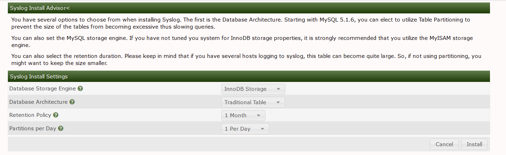
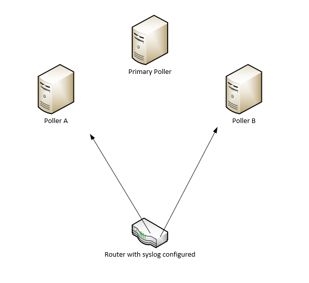
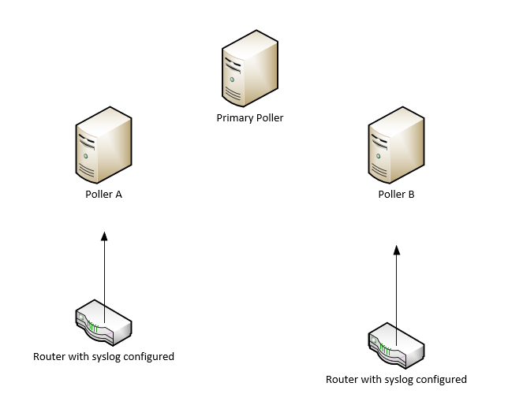
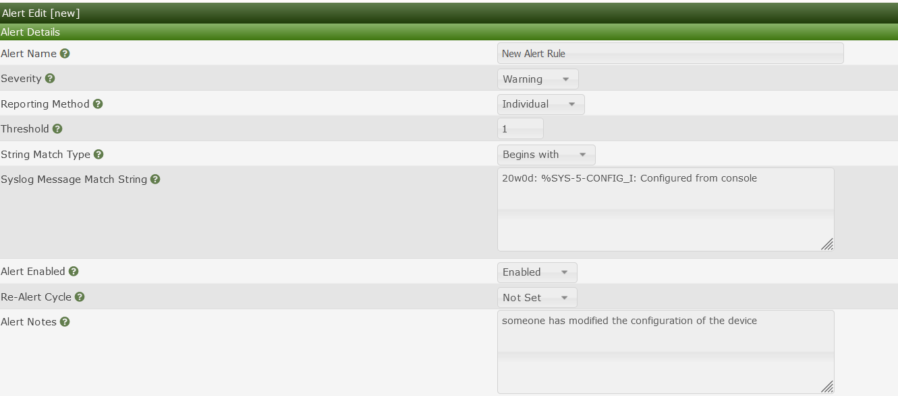
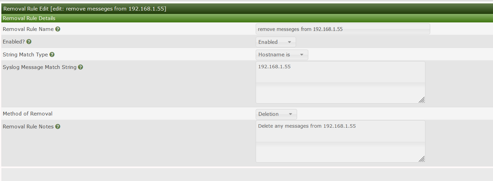

# syslog

The syslog plugin is a Cacti plugin that has been around for more than a decade.
It was inspired by the 'aloe' and 'h.aloe' plugins originally developed by the
Cacti users sidewinder and Harlequin in the early 2000's.  As you will be able
to see from the ChangeLog, it has undergone several changes throughout the
years, and remains, even today when you have enterprise offering from both
Elastic and Splunk, remains a relevant plugin for small to medium sized
companies.

It provides a simple Syslog event search an Alert generation and notification
interface that can generate both HTML and SMS messages for operations personnel
who wish to receive notifications inside of a data or network operations center.

For log events that continue to be generated frequently on a device, such as
smartd's feature to notify every 15 minutes of an impending drive failure, can
be quieted using syslog's 'Re-Alert' setting.

Syslog also provides multipoller support which allows for scalability and redundancy by leveraging multiple
servers rules can be created on the main poller and pushed to the remotes for ease of management or each server can work independently


## Features

* Message filter

* Message search

* Output to screen or file

* Date time picker

* Event Alerter

* Event Removal (for Events you don't want to see)

* Filter events by Cacti Graph window from Cacti's Graph View pages

* Use of native MySQL and MariaDB database partitioning for larger installs

* Remote Log Server connection capabilities

* Custom column mappings between Remote Log Server and required Syslog columns

* Remote poller support


### Notes on upgrades

If you are upgrading to 2.0 from a prior install, you must first uninstall
syslog and ensure both the syslog, syslog_removal, and syslog_incoming tables
are removed, and recreated at install time.

In addtion, the rsyslog configuration has changed in 2.5.  So, for example, to
configure modern rsyslog for Cacti, you MUST create a file called cacti.conf in
the /etc/rsyslog.d/ directory:


### Cacti Configuration for RSYSLOG

Edit /etc/rsyslog.d/cacti.conf

```console
$ModLoad imudp
$UDPServerRun 514
$ModLoad ommysql

$template cacti_syslog,"INSERT INTO syslog_incoming(facility_id, priority_id, program, logtime, host, message) \
  values (%syslogfacility%, %syslogpriority%, '%programname%', '%timegenerated:::date-mysql%', '%HOSTNAME%', TRIM('%msg%'))", SQL

*.* >localhost,my_database,my_user,my_password;cacti_syslog
```

This is a change from versions 2.0 to 2.4 and below, which had the following
file format:

```console
$ModLoad imudp
$UDPServerRun 514
$ModLoad ommysql

$template cacti_syslog,"INSERT INTO syslog_incoming(facility_id, priority_id, program, date, time, host, message) \
  values (%syslogfacility%, %syslogpriority%, '%programname%', '%timereported:::date-mysql%', '%timereported:::date-mysql%', '%HOSTNAME%', TRIM('%msg%'))", SQL

*.* >localhost,my_database,my_user,my_password;cacti_syslog
```
for centos/rhel systems you will all need to install the rsyslog-mysql package

```
yum install rsyslog-mysql
systemctl resatrt rsyslog
```


If you are upgrading to version 2.5 from an earlier version, make sure that you
update this template format and restart rsyslog.  You may lose some syslog
data, but doing this in a timely fashion, will minimize data loss.

Ensure you restart rsyslog after these changes are completed.  Other logging
servers such as Syslog-NG are also supported with this plugin.  Please see some
additional documentation here: [Cacti Documentation
Site](https://docs.cacti.net/plugin:syslog.config)

We are using the pure integer values that rsyslog provides to both the priority
and facility in this version syslog, which makes the data collection must less
costly for the database.  We have also started including the 'program' syslog
column for searching and storage and alert generation.

### Device setup

To setup log forwarding from your network switches and routers, and from your
various Linux, UNIX, and other operating system devices, please see their
respective documentation.

For Cisco routers switches configuration may look something like this 

```console
SW-3750#conf t
Enter configuration commands, one per line.  End with CNTL/Z.
SW-3750(config)#logging host 192.168.1.194
SW-3750(config)#logging facility local7
SW-3750(config)#logging rate-limit 100
SW-3750(config)#

```

### Mariadb/MYSQL Specific configurations

Finally, it's important, especially in more recent versions of MySQL and MariaDB
to set a correct SQL Mode.  These more recent SQL's prevent certain previously
allowable syntax such as an empty data and certain group by limitations in the
SQL itself.  Therefore, you need to ensure that the SQL mode of the database is
correct.  To do this, first start by editing either `/etc/my.cnf` or
`/etc/my.cnf.d/server.cnf` and inserting the SQL mode variable into the database
configuration.  For example:

```ini
[mysqld]
sql_mode=NO_ENGINE_SUBSTITUTION,NO_AUTO_CREATE_USER
```

After this change, you should log into the mysql server and run the following
command:

```console
mysql> show global variables like 'sql_mode';
```

And ensure that it matches the setting that you placed in the database
configuration.  If it does not, please search for the configuration that is
making this SQL mode other than what you required.  More recent versions of
MySQL and MariaDB will source multiple database configuration files.


## Installing the plugin

1.) Copy the syslog files over to /var/www/html/cacti/plugins

2.) ensure permissions are correct the files should typically be owned by the webserver user

```shell
chown -R apache:apache syslog
```

3.) copy config.php.dist to config.php

5.) You have two options for storing syslog information you can either use the exisiting
Cacti Database or use a dedicated database for syslog as syslog databases especially
for large networks can grow pretty quick it may be wise to create a dedicated database.
To use a dedicated DB first create a database in mysql and assign a user you will then change
```console
$use_cacti_db = true; 
to 
$use_cacti_db = false;
```

if you intend to use the cacti DB leave config.php as default


6.) install the plugin in the plugins tab located in Console >> configuration >> plugins

7.) You will be presented with the plugin install wizard with options on how you would like the Syslog
plugin to be installed options include DB arch and retention time 

### Note retention settings can be changed after install but db architecture will require a reinstall of the plugin 




You will also need to ensure the cacti user is granted select on the Syslog database

```shell
GRANT SELECT  ON syslog.* TO  'cacti'@'localhost';
```


## SNMP Trap configuration

To leverage SNMP traps as mentioned you will need to install SNMPTT.
SNMPTT is used to translate OID information passed from the device to a readable format SNMPTT will then write that data into syslog for the Syslog plugin to ingest.

Follow these steps to complete the setup 

1.) yum install snmptt

2.) enable snmptt and snmptrapd

```console
systemctl enable snmptrapd
systemctl enable snmptt
systemctl start snmptt
systemctl start snmptrapd
```

3.) Now that snmptt and snmptrapd are started and enabled you will first need to modify the snmptrapd systemd file to include -on in the startup options

the file is located in /etc/sysconfig/snmptrapd and should look like this after you make the change

```console
# snmptrapd command line options
# '-f' is implicitly added by snmptrapd systemd unit file
OPTIONS="-on"
```

4.) Now you need to modify the snmptrapd config file to recive snmptraps by default snmptrapd will not process any traps until you configure it to do so you will also need to tell snmptrapd to forward the recived traps over to snmptt

Here is an example of configuring snmptrapd to recive snmptraps from a device using the public snmp string and forwarding it over to snmptt

```console
# Example configuration file for snmptrapd
#
# No traps are handled by default, you must edit this file!
#
# authCommunity   log,execute,net public
# traphandle SNMPv2-MIB::coldStart    /usr/bin/bin/my_great_script cold
authCommunity   log,execute,net public
traphandle default /usr/sbin/snmptthandler
```

after making all of the changes to the snmptrapd configuration restart the snmptrapd process for the changes to take effect.


5.) configure snmptt.ini to operate in daemon mode

By default snmptt already writes data to syslog all that is left is to configure daemon mode in snmptt.ini which is located in /etc/snmp

```console
# Set to either 'standalone' or 'daemon'
# standalone: snmptt called from snmptrapd.conf
# daemon: snmptrapd.conf calls snmptthandler
# Ignored by Windows.  See documentation
mode = daemon
```

6.) use the snmptt cacti connector

By default since snmptt resides on the syslog server all of the IP information will appear as if its coming from localhost 
to fix this there is a cacti snmptt connector which will format the trap to be ingested to the syslog db it is located in the contrib folder


## Remote poller deployment options

The syslog plugin can be deployed on each poller or select pollers each poller will need to be configured with rsyslog
each poller will need to be configured with a syslog config_local file

There are a few deployment approaches


1.) Multiple Pollers with a load balancer for syslog


2.) Multiple pollers no balancer but devices send syslog to multiple pollers





3.) Multiple pollers but devices are asiged to send syslog to a specific poller for example poller a and device a are at one location





## Remote poller setup

To setup each remote poller you will need to enable and configure rsyslog with the following steps


1.) decide if you will use the cacti db or a seperate DB 
### Note on using the cacti db as mentioned earlier
You have two options for storing syslog information you can either use the exisiting
Cacti Database or use a dedicated database for syslog as syslog databases especially
for large networks can grow pretty quick it may be wise to create a dedicated database.
To use a dedicated DB first create a database in mysql and assign a user you will then change

```console
$use_cacti_db = true; 
to 
$use_cacti_db = false;
```


2.) If you decide to use the cacti database simply leave config_local.php with the defaults

```console
$use_cacti_db = true; 
```

3.) If you decide to use a seperate DB fill out the Database detailing config_local.php

4.) create a cacti.conf file in /etc/rsyslog.d and fill out either your seperate DB details or your main cacti DB details

```console
$ModLoad imudp
$UDPServerRun 514
$ModLoad ommysql

$template cacti_syslog,"INSERT INTO syslog_incoming(facility_id, priority_id, program, date, time, host, message) \
  values (%syslogfacility%, %syslogpriority%, '%programname%', '%timereported:::date-mysql%', '%timereported:::date-mysql%', '%HOSTNAME%', TRIM('%msg%'))", SQL

*.* >localhost,my_database,my_user,my_password;cacti_syslog
```

5.) install rsyslog-mysql package to allow rsyslog to write to mysql
```console
yum install rsyslog-mysql
```

6.) restart rsyslog
```console
systemctl restart rsyslog
```

7.) if you would like for rules to be replicated from the main poller to the remotes you will need to enable
the following syslog settings found in configuration >> settings >> syslog


### note rules will be replicated within one polling cycle from the main poller to the remotes
if you wish to have each poller operate independently there is no need to enable these options.


### Syslog Alert Rules

Alert rules are used to generate alerts in the cacti log they are also used
to send out email alerts and command execution to cut tickets to upstream ticketing
systems or perform initial troubleshooting scripts can also be leveraged to call on 
services such as slack or trello for alerting teams.

you can leverage the built in variable substitution to format the input to the script





### Syslog Removal Rules

The Syslog plugin allows administrators to delete incoming messages so they are not stored in the DB.
For example, if you are not interested in seeing Syslog messages everytime a user logs into a device
you may add a rule to delete the message when it's received.

to do this click on the Syslog settings tab in the console then click removal rules




## Possible Bugs and Feature Enhancements

Bug and feature enhancements for the syslog plugin are handled in GitHub. If you
find a first search the Cacti forums for a solution before creating an issue in
GitHub.

## Authors

The sylog plugin has been in development for well over a decade with increasing
functionality and stibility over that time. There have been several contributors
to thold over the years. Chief amonst them are Jimmy Conner, Larry Adams,
SideWinder, and Harlequin. We hope that version 2.0 and beyond are the most
stable and robust versions of syslog ever published. We are always looking for
new ideas. So, this won't be the last release of syslog, you can rest assured of
that.

