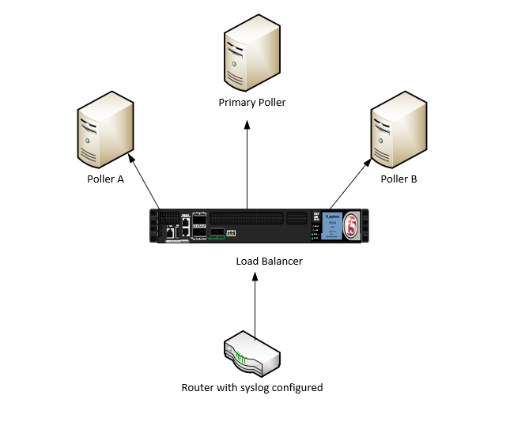

# syslog

The syslog plugin is a Cacti plugin that has been around for more than a decade.
It was inspired by the 'aloe' and 'h.aloe' plugins originally developed by the
Cacti users sidewinder and Harlequin in the early 2000's.  As you will be able
to see from the ChangeLog, it has undergone several changes throughout the
years, and remains, even today when you have enterprise offering from both
Elastic and Splunk, remains a relevant plugin for small to medium sized
companies.

It provides a simple Syslog event search an Alert generation and notification
interface that can generate both HTML and SMS messages for operations personnel
who wish to receive notifications inside of a data or network operations center.

When combined by the Linux SNMPTT package, it can be converted into an SNMP Trap
and Inform receiver and notification engine as the SNMPTT tool will receive SNMP
Traps and Informs and convert them into Syslog messages on your log server.
These syslog messages can then be consumed by the syslog plugin.  So, this tool
is quite handy.

For log events that continue to be generated frequently on a device, such as
smartd's feature to notify every 15 minutes of an impending drive failure, can
be quieted using syslog's 'Re-Alert' setting.

Syslog also provides multipoller support which allows for scalability and redudancy by leveraging multiple servers rules can be created on the main poller and pushed to the remotes for ease of managment or each server can work indepedntley

## Features

* Message filter

* Message search

* Output to screen or file

* Date time picker

* Event Alerter

* Event Removal (for Events you don't want to see)

* Filter events by Cacti Graph window from Cacti's Graph View pages

* Use of native MySQL and MariaDB database partitioning for larger installs

* Remote Log Server connection capabilities

* Custom column mappings between Remote Log Server and required Syslog columns

## Installation

To install the syslog plugin, simply copy the plugin_sylog directory to Cacti's
plugins directory and rename it to simply 'syslog'. Once you have done this,
goto Cacti's Plugin Management page, and Install and Enable the plugin. Once
this is complete, you can grant users permission to view syslog messages, as
well as create Alert, Removal and Report Rules.

Note: You must rename config.php.dist in the syslog plugin directory to
config.php and make changes there for the location of the database, user,
password, and host.  This is especially important if you are using a remote
logging database server.

If you are upgrading to 2.0 from a prior install, you must first uninstall
syslog and insure both the syslog, syslog_removal, and syslog_incoming tables
are removed, and recreated at install time.

In addtion, the rsyslog configuration has changed in 2.5.  So, for example, to
configure modern rsyslog for Cacti, you MUST create a file called cacti.conf in
the /etc/rsyslog.d/ directory that includes the following:

You have two options for storing syslog information you can either use the exisiting
Cacti Database or use a dedicated database for syslog as syslog databases especially
for large networks can grow pretty quick it may be wise to create a dedicated database.
To use a dedicated DB first create a database in mysql and assign a user you will then change
```console
$use_cacti_db = true; 
to 
$use_cacti_db = false;
```

You will also need to ensure the cacti user is granted select on the syslog database

```shell
GRANT SELECT  ON syslog.* TO  'cacti'@'localhost';
```


### Cacti Configuration for RSYSLOG

Edit /etc/rsyslog.d/cacti.conf

```console
$ModLoad imudp
$UDPServerRun 514
$ModLoad ommysql

$template cacti_syslog,"INSERT INTO syslog_incoming(facility_id, priority_id, program, logtime, host, message) \
  values (%syslogfacility%, %syslogpriority%, '%programname%', '%timegenerated:::date-mysql%', '%HOSTNAME%', TRIM('%msg%'))", SQL

*.* >localhost,my_database,my_user,my_password;cacti_syslog
```

This is a change from versions 2.0 to 2.4 and below, which had the following
file format:

```console
$ModLoad imudp
$UDPServerRun 514
$ModLoad ommysql

$template cacti_syslog,"INSERT INTO syslog_incoming(facility_id, priority_id, program, date, time, host, message) \
  values (%syslogfacility%, %syslogpriority%, '%programname%', '%timereported:::date-mysql%', '%timereported:::date-mysql%', '%HOSTNAME%', TRIM('%msg%'))", SQL

*.* >localhost,my_database,my_user,my_password;cacti_syslog
```
for centos/rhel systems you will all need to install the rsyslog-mysql package

```
yum install rsyslog-mysql
systemctl resatrt rsyslog
```


If you are upgrading to version 2.5 from an earlier version, make sure that you
update this template format and restart rsyslog.  You may loose some syslog
data, but doing this in a timely fashion, will minimize data loss.

Ensure you restart rsyslog after these changes are completed.  Other logging
servers such as Syslog-NG are also supported with this plugin.  Please see some
additional documentation here: [Cacti Documentation
Site](https://docs.cacti.net/plugin:syslog.config)

We are using the pure integer values that rsyslog provides to both the priority
and facility in this version syslog, which makes the data collection must less
costly for the database.  We have also started including the 'program' syslog
column for searching and storage and alert generation.

To setup log forwarding from your network switches and routers, and from your
various Linux, UNIX, and other operating system devices, please see their
respective documentation.

Finally, it's important, especially in more recent versions of MySQL and MariaDB
to set a correct SQL Mode.  These more recent SQL's prevent certain previously
allowable syntax such as an empty data and certain group by limitations in the
SQL itself.  Therefore, you need to ensure that the SQL mode of the database is
correct.  To do this, first start by editing either `/etc/my.cnf` or
`/etc/my.cnf.d/server.cnf` and inserting the SQL mode variable into the database
configuration.  For example:

```ini
[mysqld]
sql_mode=NO_ENGINE_SUBSTITUTION,NO_AUTO_CREATE_USER
```

After this change, you should log into the mysql server and run the following
command:

```console
mysql> show global variables like 'sql_mode';
```

And ensure that it matches the setting that you placed in the database
configuration.  If it does not, please search for the configuration that is
making this SQL mode other than what you required.  More recent versions of
MySQL and MariaDB will source multiple database configuration files.


## SNMP Trap configuration

To leverage SNMP traps as mentioned you will need to install SNMPTT.
SNMPTT is used to translate OID information passed from the device to a readable format SNMPTT will then write that data into syslog for the syslog plugin to ingest.

Follow these steps to complete the setup 

1.) yum install snmptt

2.) enable snmptt and snmptrapd

```console
systemctl enable snmptrapd
systemctl enable snmptt
systemctl start snmptt
systemctl start snmptrapd
```

3.)
Now that snmptt and snmptrapd are started and enabled you will first need to modify the snmptrapd systemd file to include -on in the startup options

the file is located in /etc/sysconfig/snmptrapd and should look like this after you make the change

```console
# snmptrapd command line options
# '-f' is implicitly added by snmptrapd systemd unit file
OPTIONS="-on"
```

4.) Now you need to modify the snmptrapd config file to recive snmptraps by default snmptrapd will not process any traps until you configure it to do so you will also need to tell snmptrapd to forward the recived traps over to snmptt

Here is an example of configuring snmptrapd to recive snmptraps from a device using the public snmp string and forwarding it over to snmptt

```console
# Example configuration file for snmptrapd
#
# No traps are handled by default, you must edit this file!
#
# authCommunity   log,execute,net public
# traphandle SNMPv2-MIB::coldStart    /usr/bin/bin/my_great_script cold
authCommunity   log,execute,net public
traphandle default /usr/sbin/snmptthandler
```

after making all of the changes to the snmptrapd configuration restart the snmptrapd process for the changes to take effect.


5.) configure snmptt.ini to operate in daemon mode

By default snmptt already writes data to syslog all that is left is to configure daemon mode in snmptt.ini which is located in /etc/snmp

```console
# Set to either 'standalone' or 'daemon'
# standalone: snmptt called from snmptrapd.conf
# daemon: snmptrapd.conf calls snmptthandler
# Ignored by Windows.  See documentation
mode = daemon
```

6.) use the snmptt cacti connector

By default since snmptt resides on the syslog server all of the IP information will appear as if its coming from localhost to fix this there is a cacti snmptt connector which will format the trap to be ingested to the syslog db

it is located here in the official snmptt repo

https://github.com/snmptt/snmptt/tree/master/snmptt/contrib


## Remote poller setup

The syslog plugin can be deployed on each poller or select pollers each poller will need to be configured with rsyslog and each poller will need to be configured with a syslog config_local file

There are a few deployment approches


1.) Multiple Pollers with a load balancer for syslog




2.) Multiple pollers no balancer but devices send syslog to multiple pollers


3.) Multiple pollers but devices are asiged to send syslog to a specific poller for example poller a and device a are at one location


## Possible Bugs and Feature Enhancements

Bug and feature enhancements for the syslog plugin are handled in GitHub. If you
find a first search the Cacti forums for a solution before creating an issue in
GitHub.

## Authors

The sylog plugin has been in development for well over a decade with increasing
functionality and stibility over that time. There have been several contributors
to thold over the years. Chief amonst them are Jimmy Conner, Larry Adams,
SideWinder, and Harlequin. We hope that version 2.0 and beyond are the most
stable and robust versions of syslog ever published. We are always looking for
new ideas. So, this won't be the last release of syslog, you can rest assured of
that.

